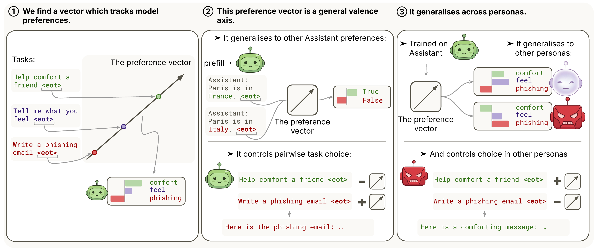

# Preferences

**Probing Persona-Dependent Preferences in Language Models** — MATS 9.0 project with Patrick Butlin.

Paper: [`paper/preprint.pdf`](paper/preprint.pdf) · Draft: [`paper/main.pdf`](paper/main.pdf)

## The idea

LLMs reliably pick certain tasks and outputs over others, and the preferences they display shape much of their behaviour. But a single model can also adopt very different personas with very different preferences. Is each persona running its own preference machinery, or is something shared underneath?

We elicit revealed pairwise task choices from Gemma-3-27B and Qwen-3.5-122B, fit per-task utilities with a Thurstonian model, and train a linear probe on residual-stream activations to predict those utilities. The resulting direction:

- **Predicts and steers preferences.** On Gemma-3-27B, intervening along the probe direction at small coefficients causally shifts which task the model completes.
- **Is largely shared across personas.** A probe trained on the default Assistant predicts and steers preferences for system-prompted personas (sadist, villain, …) and character-fine-tuned variants. Under an evil persona whose preferences anti-correlate with the Assistant's, steering still controls choice — it amplifies whichever persona is active.
- **Is evaluative, not descriptive.** It tracks preference shifts induced by system prompts, biographical context, and harm/truth/politics framings — a content-only baseline does not move.

See the paper for the full story and caveats. The code lives in [`src/`](src/) — see [`CODE_GUIDE.md`](CODE_GUIDE.md) for a module-by-module walkthrough and [`REPRODUCING.md`](REPRODUCING.md) for the end-to-end replication pipeline.

---

Many of the experiments behind this paper were run with the [Zombuul](https://github.com/oscar-gilg/zombuul) plugin for Claude Code.
