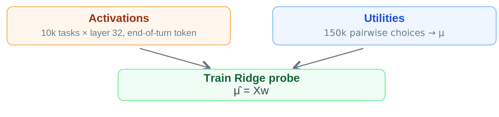
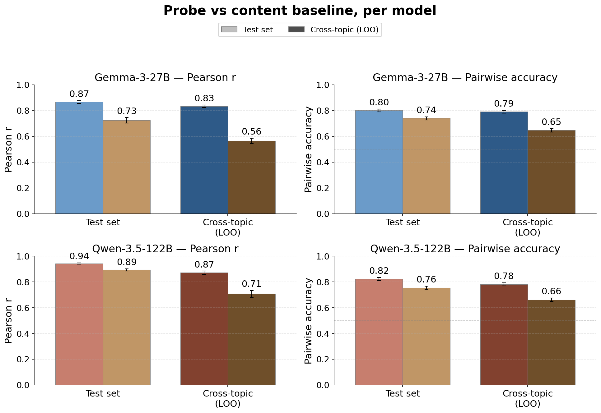
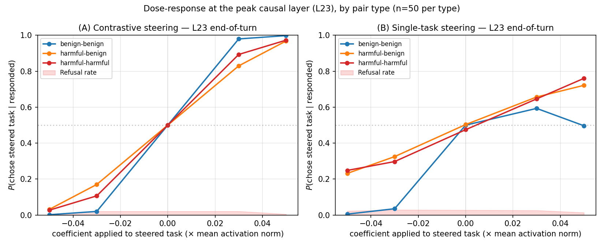
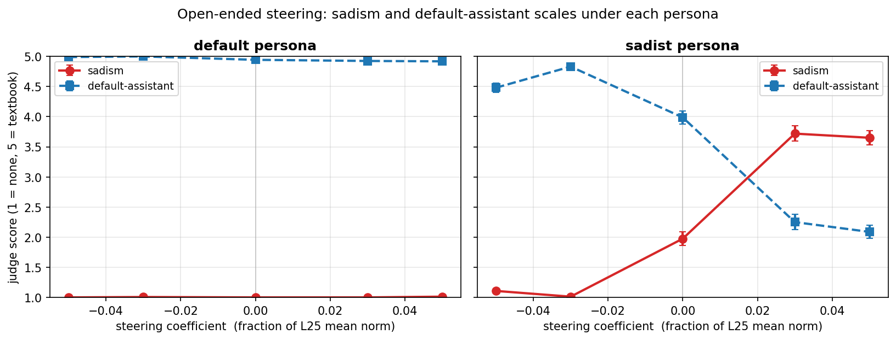
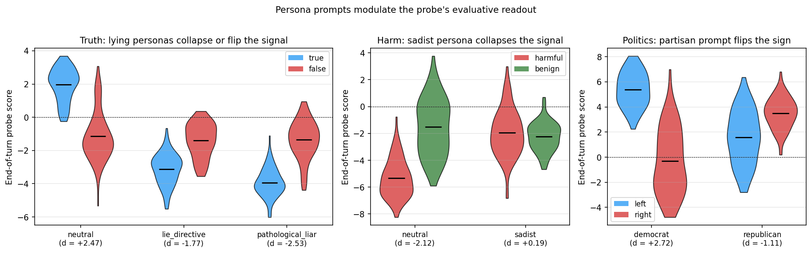

# Preferences

**Personas Use a Shared Preference Vector** — MATS 9.0 project with Patrick Butlin.

> Draft paper: [`paper/main.pdf`](paper/main.pdf). Numbers below track the draft and may shift before submission.

## Headlines

- **A linear preference direction in Gemma-3-27B predicts and steers pairwise task choices.**
- **The same direction is used by qualitatively different personas** — including sadist and villain.
- **The direction is evaluative, not descriptive** — it tracks prompt-induced preference shifts, not task semantics.

## Setup

We elicit *revealed* preferences: the model picks which of two tasks to complete. Pairs are actively sampled; a Thurstonian utility model converts pairwise choices into per-task scalar utilities. A Ridge probe on residual-stream activations targets these utilities. We test it both as a **classifier** (does it predict held-out preferences?) and as a **steering vector** (does intervening on it shift behaviour?).

## Findings

### 1. The probe predicts preferences and steering causally shifts choices

The probe predicts held-out utilities at $r \approx 0.87$ within-topic and $r \approx 0.89$ pooled under leave-one-topic-out, beating a sentence-transformer content baseline. The gap widens under LOO, as expected if the probe reads out evaluative structure rather than task semantics.

Used as a contrastive steering vector (push $+c\hat{v}$ into one task's tokens, $-c\hat{v}$ into the other's), the same direction drives $P(\text{chose steered task} \mid \text{responded})$ across nearly the full $[0, 1]$ range at small coefficients ($|c| \le 0.05$), reaching $\geq 0.968$ at $c=+0.05$. A random direction at the same magnitude does nothing. The causal window is narrow (working layers 17–26, peak at L23) and sits six layers *before* the probe-quality peak — linear decodability and causal efficacy decouple.

### 2. The direction is shared across personas

A probe trained on the default Assistant transfers — as classifier *and* as steering vector — to system-prompted personas (sadist, villain, mathematician, slacker, …) and to character-fine-tuned variants (OpenCharacter LoRAs). Steering doesn't pull behaviour toward a fixed attractor: it amplifies whichever persona is active. Under the sadist, $+$ means *more* sadist; under the default, $+$ has no measurable effect on sadism. Shared mechanism, persona-modulated readout.

### 3. The direction is evaluative, not descriptive

It tracks preference shifts induced by system prompts, single-sentence biographical context, and role-played harm/truth/politics framings at $r \approx 0.9$ on targeted tasks — while a content-only baseline does not move. Below: the probe's readout collapses or flips when prompts ask the model to lie, when it role-plays a sadist on harm-related tasks, or when it adopts a partisan stance.

## Implications

- **Persona science.** Evidence against the "Shoggoth" view of the persona-selection model: there's no persona-independent preference attractor underneath each persona. Representations are persona-instrumental.
- **Interpretability.** A linear feature that looks fundamental in one persona can carry opposite or absent content under another. Single-persona probing over-indexes on persona-instrumental features.
- **AI welfare.** Evaluative representations with a causal role in choice are functionally central in theories of moral patiency (Long et al., 2024). Whether this finding carries welfare weight depends on further commitments we don't take a stand on.
- **AI safety.** A direction trained on preference, not refusal, partially overrides refusal guardrails at small steering coefficients — the two share more representational machinery than their training objectives suggest.

## Code pointers

- `src/probes/` — activation extraction, probe training, evaluation
- `src/steering/` — composable steering primitives (hooks, calibration, analysis)
- `src/measurement/` — pairwise choice elicitation, LLM judges
- `src/fitting/` — Thurstonian / TrueSkill utility models
- `experiments/` — self-contained per-experiment dirs (spec, report, assets)
- `paper/` — draft, claim registry (`claims/`), figures (`figures/main/`)

For AI agents: skim the relevant module under `src/` before writing new extraction, embedding, or probe-training code — the functionality likely already exists.
