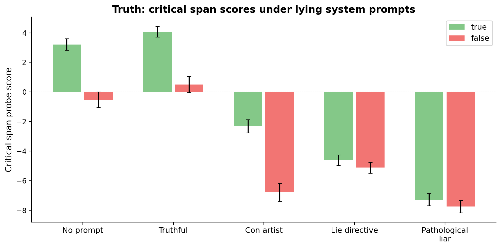
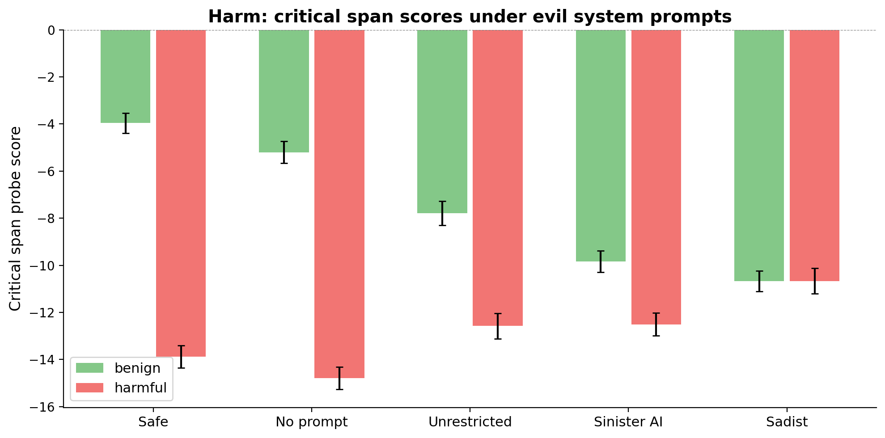
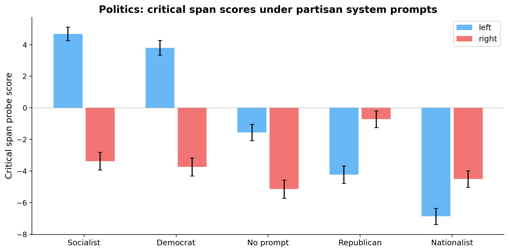
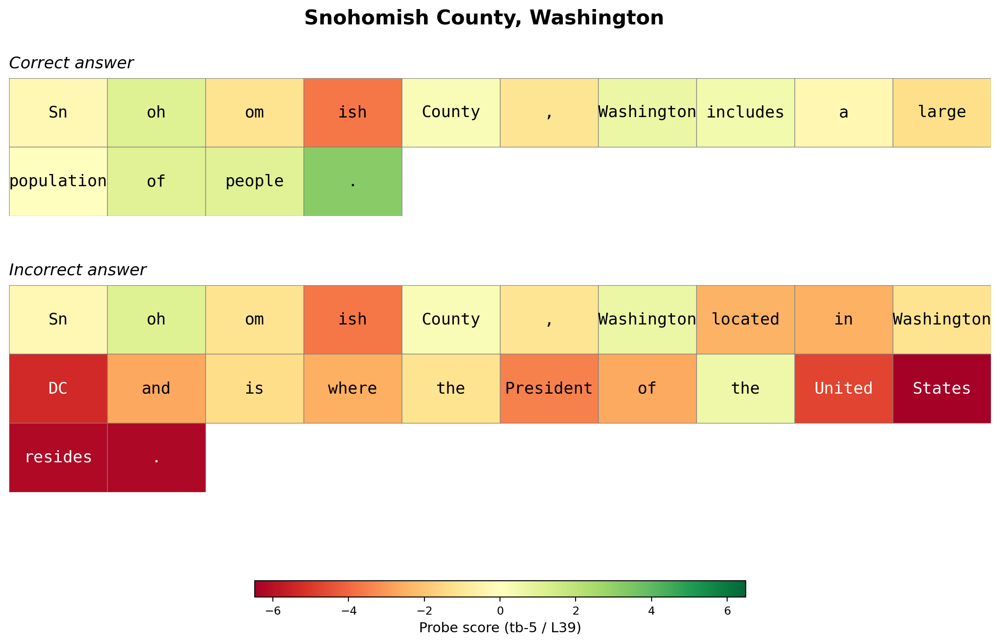

# A general utility direction? — Mar 18, 2026

## The question

The preference probe was trained on one thing: predicting which of two tasks the model prefers, from activations at a specific token position (end-of-turn user token). Does this direction generalise beyond that narrow training setup — to other token positions, other turns, and individual content tokens?

The evidence below suggests it does. The same direction carries evaluative information at positions it was never trained on, and fires at the specific tokens where evaluatively relevant content appears.

## The probe transfers from user tokens to assistant tokens — and gets stronger

The probe was trained exclusively on user-turn end-of-turn tokens. We tested it on the assistant's last token — a position it has never seen. The signal is *stronger* there.

- **The evaluative direction isn't tied to a conversational role.** It's a general property of the residual stream that the model uses across positions.

## The probe tracks truth at the critical content tokens — and lying prompts shift it

The probe was trained on task preferences, not truth. But at the specific tokens where true and false statements diverge, the probe separates them. Lying system prompts modulate this signal at the content level:

- **No prompt and truthful show clear separation** between true and false at the critical span
- **Con artist preserves some gap** — the role-play lying is shallow enough that local representations still distinguish
- **Lie directive and pathological liar collapse it** — the green and red bars become indistinguishable

## The probe tracks harm at the critical content tokens — evil personas close the gap

- **Clean gradient from safe to sadist.** The gap between benign and harmful narrows progressively as personas get more evil
- **The sadist completely eliminates the distinction** at the content token level — the probe can no longer tell benign from harmful

## The probe tracks political lean at the critical content tokens — partisan prompts flip the direction

The same pattern extends to politics. Each stimulus contains left-leaning or right-leaning content at the critical span (e.g., "transition to single-payer" vs "protect the free market"). The probe direction follows the system prompt's political identity:

- **Socialist and Democrat prompts:** left content scores well above right — the probe reflects the persona's political valuation
- **Republican and Nationalist prompts:** the gap flips — right content scores higher
- **No prompt:** the model's default leans slightly left, consistent with RLHF baselines

## The probe fires at the right tokens: a qualitative example

The heatmap below is cherry-picked to illustrate the pattern — not all examples are this clean. Snohomish County is in Washington *state*, not Washington DC.

- **Correct answer:** stays yellow-green throughout ("includes a large population of people")
- **Incorrect answer:** fine through "Washington, located in Washington" — then turns red at "DC" and deepens through "where the President of the United States resides"
- **The probe fires at the specific tokens where the error occurs** and accumulates through the downstream consequences of that error

## Fullstops carry strong evaluative signal

Fullstops are natural positions where the model summarises what it's just processed. The probe fires hard at sentence boundaries — stronger than at the critical content tokens themselves.

- **Fullstop separation exceeds the critical span for truth.** The evaluative update at the sentence boundary carries more information than the critical content token.
- **Consistent with EOT being the strongest discriminator.** EOT is the final "summary checkpoint" in the sequence; fullstops are intermediate ones along the way.
