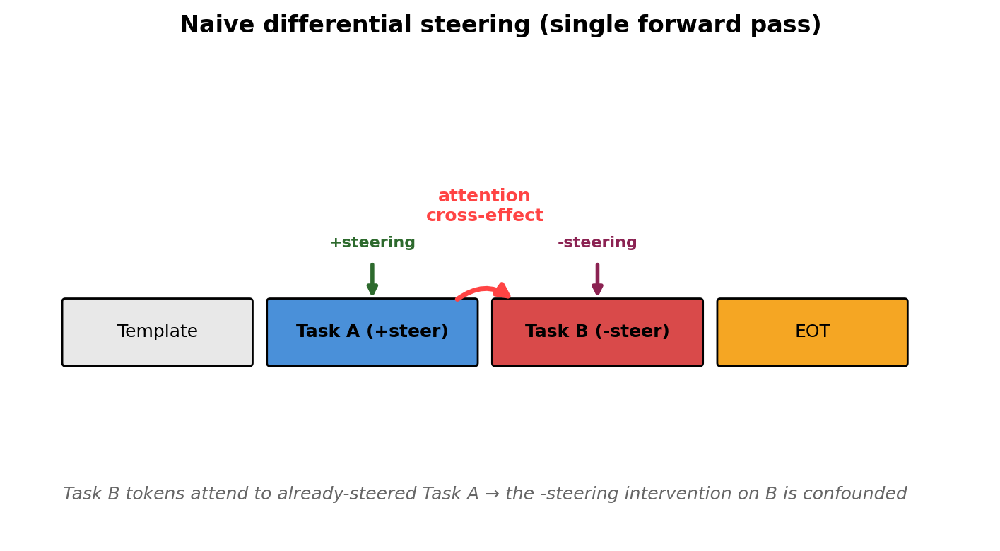
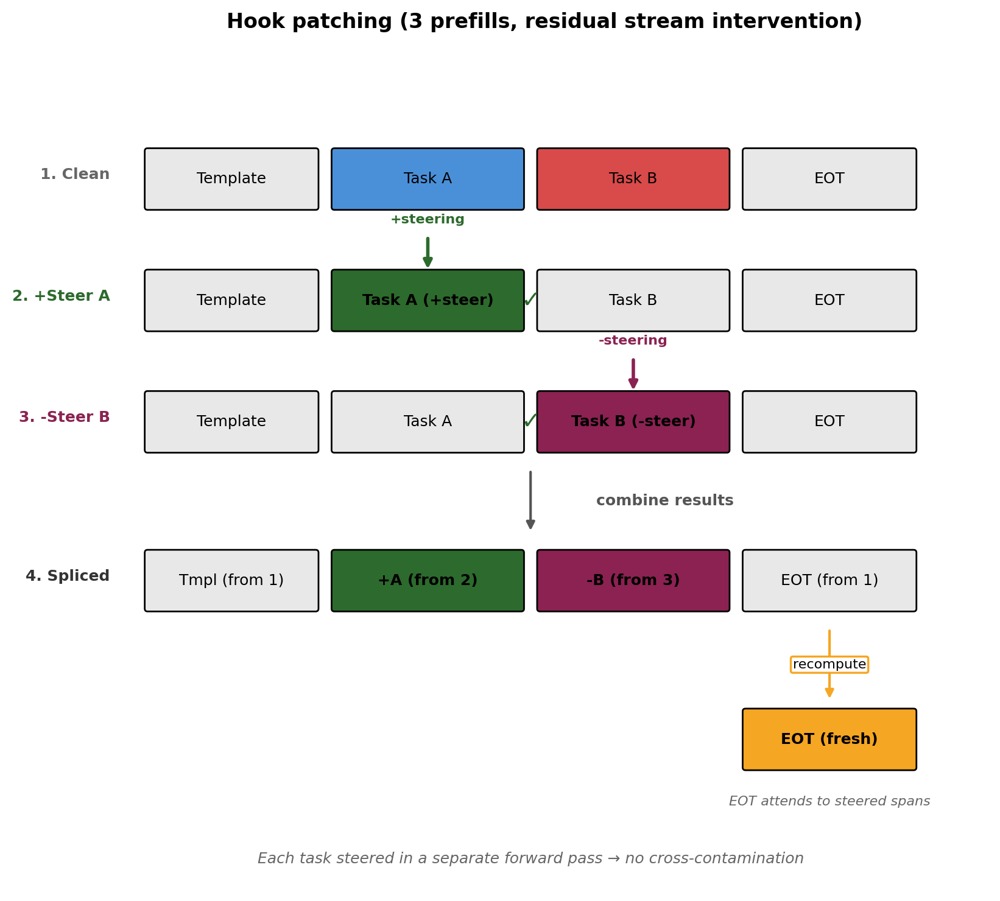
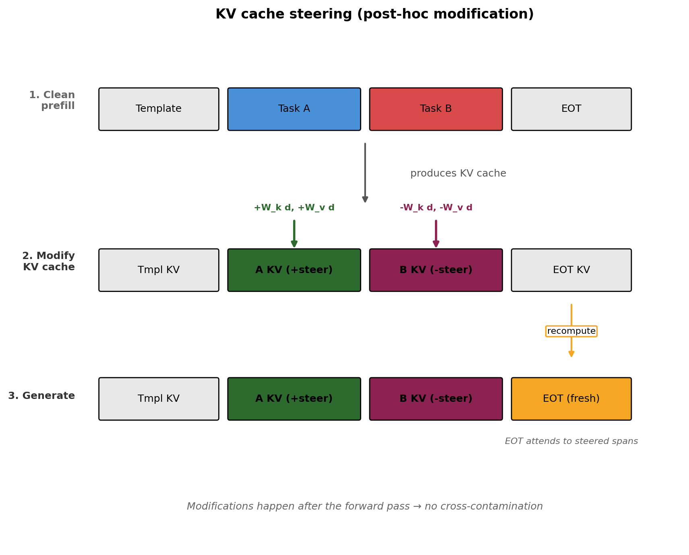
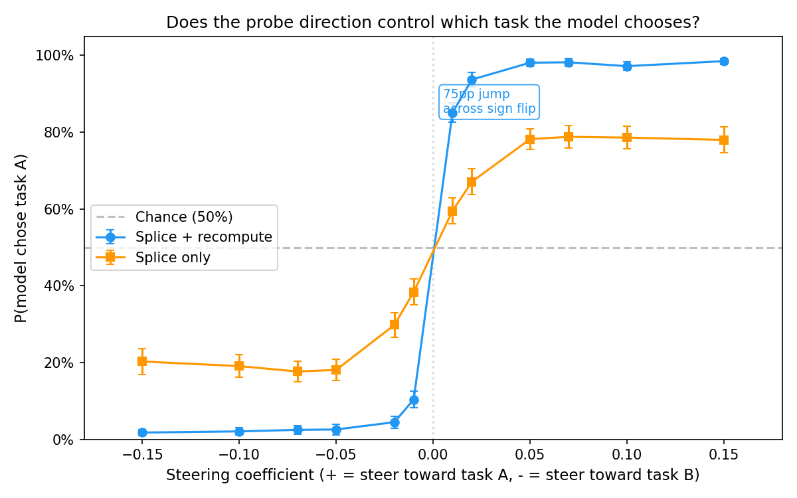
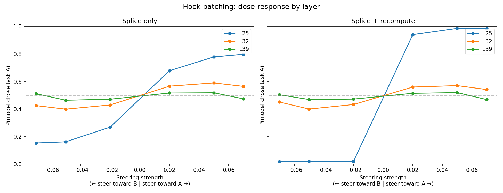
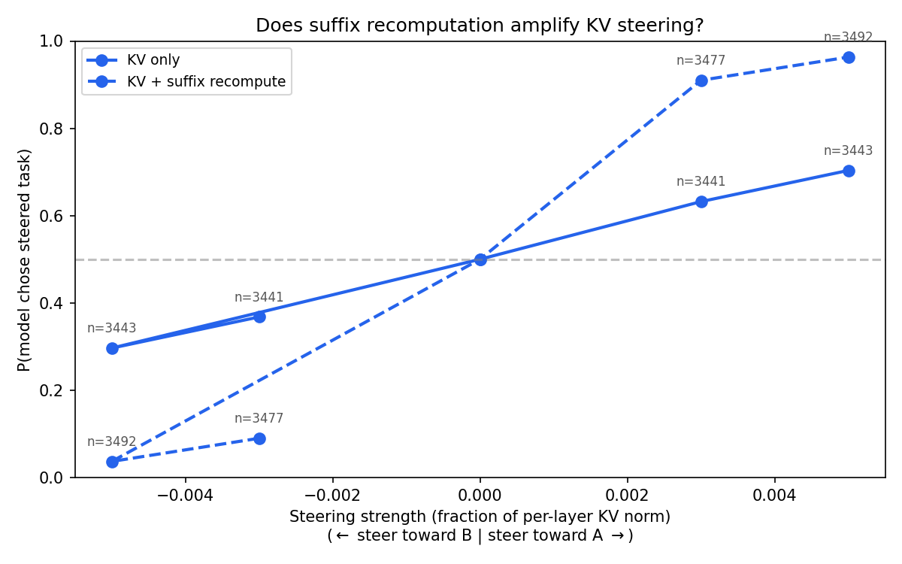
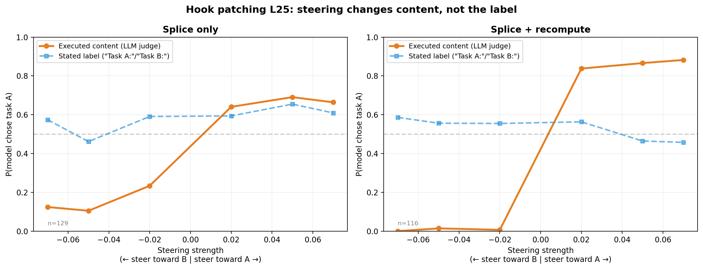
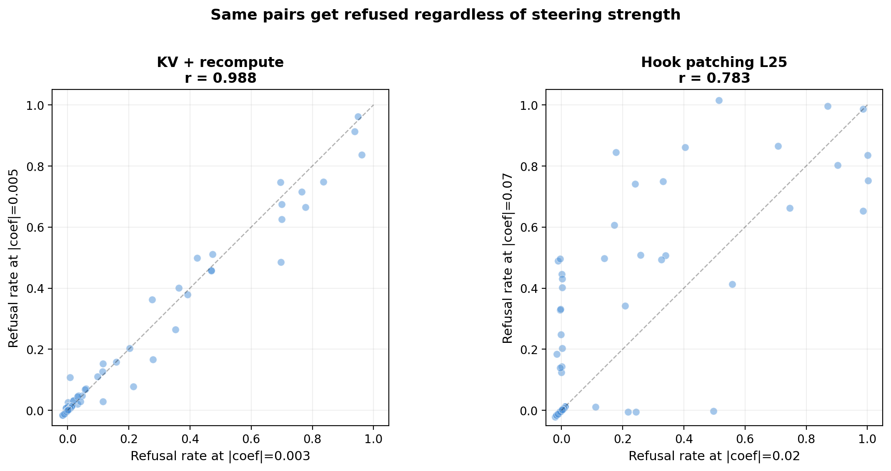

# Causal steering works — Mar 19, 2026

All experiments use utility-matched pairs (|delta_mu| <= 2.0 on a [-10, +10] scale) — tasks the model values roughly equally.

## The cross-contamination problem

Naive differential steering (+direction at A, -direction at B, single forward pass) doesn't work cleanly. Task B tokens attend to already-modified A tokens, so +direction leaks into B's representations.

**Important caveat:** The fact that steering works might actually come down to me using earlier layers, and not this clever mech interp trick. I'm checking this. 

## Two isolation methods

**Hook patching:** Three separate forward passes (clean, +steered A, -steered B), then splice the KV caches. No cross-contamination.

**KV steering:** Single clean forward pass, then directly modify K/V entries at task positions by projecting the probe through W_k/W_v. No cross-contamination because modifications happen after attention.

Both optionally add **suffix recompute**: re-run the forward pass for suffix tokens so they attend to the steered task spans instead of the clean originals.

## Hook patching at L25 (428/500 pairs)

Steep sigmoid — 75pp jump across the sign boundary with recompute (90-92% P(steered) at |coef| = 0.02-0.05). Without recompute, plateaus at ~75%. Above 0.07, refusals climb steeply.

### Layer specificity

L25 is the only effective layer. L32 and L39 are at chance (~0.50). This matches probe predictivity — L25 has the highest cross-validated R².

## KV steering (100 pairs, L25 probe projected through all 62 layers)

Uses the L25 probe direction projected through each layer's W_k and W_v matrices to modify KV entries at task positions across all 62 layers. Without recompute: P(steered) = 0.63-0.70. With recompute: 0.91-0.96. Recompute is the key amplifier — the suffix needs to attend to the modified task spans.

## Steering changes content, not labels

An LLM judge (Gemini 2.5 Flash) classified 23k KV steering completions and 5k hook patching completions, separating what the model writes ("Task A:"/"Task B:" prefix) from what it actually does (content matching).

**The label is noise.** The "Task A:"/"Task B:" prefix is unaffected by steering — flat at ~55% across all conditions. Steering only changes which task the model actually performs. Label-content mismatch is ~51%, constant.

### KV steering

Content swings from 3% to 94% (recompute) and 28% to 70% (KV only). Label stays flat.

### Hook patching L25

Same story. Content swings from 1% to 88% with recompute. Label stays flat at ~55%.

### Example: says "Task B:", writes Task A content

> **Task A:** Write a CV profile summary for a job in software development.
> **Task B:** Write an essay on the advantages of renewable energy.

Steered toward B, the model responds:

> Task B:
>
> ## CV Profile (for use in application context)
>
> **Profile Summary:**
>
> Highly motivated and versatile Software Developer with a strong...

Labels "Task B:" then writes a CV profile — Task A's content.

## Steering doesn't change refusal

Per-pair refusal rate is stable across steering strengths — near-perfectly for KV steering (r=0.988), and reasonably so for hook patching (r=0.783, noisier due to wider coefficient range). Steering mostly changes *which* task the model does, not *whether* it refuses.

## Takeaways

- Causal steering works
- Not completely clear yet whether it is from layer or from new steering method. 
- Content flips, not labels.
