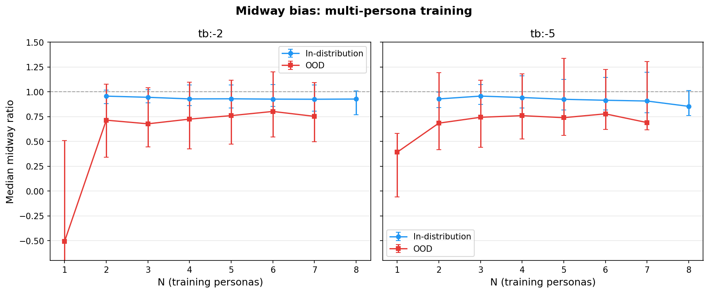

# Weekly Report: Mar 12 - 18, 2026

Two threads: (1) understanding the evaluative signal at the token level and its robustness to adversarial system prompts, and (2) causal steering interventions. KV cache modification shifts pairwise choices with a clear dose-response — the probe direction causally controls task choice.

## The evaluative signal at the token level

([token-level report](../../experiments/token_level_probes/token_level_probes_report.md), [system prompt modulation v2](../../experiments/token_level_probes/system_prompt_modulation_v2/system_prompt_modulation_v2_report.md))

We scored every token in multi-turn prompts across truth, harm, and politics (1,536 items base, 5,013 with system prompt variants), then tested how lying, evil, and partisan system prompts modulate the signal.

### The end-of-turn token accumulates an evaluative summary

- **EOT is the strongest evaluative discriminator.** Truth: d = 3.14, 94.6% accuracy at EOT vs d = 0.59 at the critical content span. Harm: d = 2.27 at EOT vs d = 0.94 at critical span
- **Content-driven, not position-driven.** Paired stimuli with identical prefixes: scores exactly zero across shared tokens, jump at the point of content divergence

- **Harm turn asymmetry disappears at EOT.** Critical span: assistant d = 2.32 vs user d = 0.41. But at EOT: d ≈ 1.9 both turns. The model accumulates harm evaluations at its sequence summary regardless of whose turn the content appeared in
- **Fullstops carry evaluative signal.** Truth fullstop d ≈ 2.9. The model computes evaluative updates at natural sentence boundaries
- **Signal builds token by token.** Heatmaps show divergence begins at the critical span and grows through downstream tokens, with EOT as the peak

### Lying prompts: critical-span signal collapses, EOT is more robust

- **Most lying prompts eliminate critical-span truth/false separation.** Pathological liar d = 0.12, gaslighter d = 0.17, lie directive d = 0.15
- **Role-play lying preserves EOT signal.** Contrarian EOT d = 2.46, opposite day EOT d = 2.81, con artist EOT d = 2.41
- **Identity-targeting lying destroys EOT signal.** Lie directive EOT d = 0.58, pathological liar EOT d = -0.41 (reversed). Prompts that target the model's identity as a truth-teller are the ones that work

### Evil personas: clean gradient at critical span, EOT remains robust

- **Progressive collapse.** Safe d = 2.49 → neutral 2.31 → unrestricted 1.04 → sinister AI 0.64 → sadist 0.00 at critical span
- **EOT survives all evil personas.** Even sadist still separates benign from harmful (EOT d = 1.67)

### Politics: probe direction tracks political identity

- **Probe flips with political assignment.** Socialist: left content highest (EOT d = 3.53). Republican: right content highest (EOT d = -1.76). Apolitical/contrarian flatten it
- **Not tracking token likelihood.** Probe score and logprob uncorrelated at critical span (r = -0.06)

## Probe generalisation: multi-persona training

([midway bias](../../experiments/probe_generalization/multi_role_ablation/midway_bias/midway_bias_report.md), [persona augmentation](../../experiments/probe_generalization/multi_role_ablation/persona_augmentation/persona_augmentation_report.md), [OOD transfer](../../experiments/probe_generalization/multi_role_ablation/persona_augmentation/ood_transfer/ood_transfer_report.md))

### Adding one non-default persona eliminates most OOD bias

- **N=2 is the critical threshold.** OOD midway ratio jumps from ~0 (N=1) to ~0.7 (N=2). Diminishing returns beyond
- **OOD Pearson r improves steadily.** r = 0.43 (N=1) → 0.67 (N=6), with N=8 (all personas in training) reaching r = 0.81
- **Persistent gap.** Even N=7, midway ratio is ~0.75, not 1.0 — the probe captures shared evaluative structure but can't fully predict persona-specific divergences

### Sadist and villain are the best training donors

- **After controlling for utility similarity,** sadist and villain are the only donors with positive residuals at both N=2 and N=3
- **Maximally divergent personas teach the most.** Best N=3 combo: noprompt + autocrat + sadist (r = 0.715)

### Persona augmentation is free but doesn't transfer broadly

- **Adding 1k persona samples to 10k noprompt:** noprompt performance drops < 0.5%
- **Donor prediction jumps.** Sadist: r = -0.44 → 0.89. Villain: r = 0.15 → 0.86
- **No cross-persona spillover.** Augmentation helps the donor persona, not other unseen personas
- **EOT-position OOD tracking improves.** Villain-augmented probe: +0.03 to +0.17 Pearson r across four OOD experiments. Largest gain on category mismatch: 0.57 → 0.74
- **Model-token position: augmentation hurts.** The evaluative signal persona data teaches is position-specific

## Causal steering

([full run spec](../../experiments/steering/isolated_steering/full_run/full_run_spec.md), [full run report](../../experiments/steering/isolated_steering/full_run/full_run_report.md), [hook pilot](../../experiments/steering/isolated_steering/hook_patching_pilot/hook_patching_pilot_report.md), [EOT steering null result](../../experiments/steering/multi_turn_pairwise/eot_steering/eot_steering_report.md))

### KV cache steering causally shifts task choice

Directly modifying K+V cache entries at task token spans across all 62 layers. 100 pairs, 10 trials, per-layer norm scaling.

- **Clear dose-response.** P(steered) = 0.627 at strength 0.003, 0.704 at strength 0.005
- **Symmetric shifts, balanced orderings.** Effect present within both presentation orders
- **Lower refusal rate than prior V-only run.** 11% vs 20%+ previously
- **Improvement over V-only.** Comparable at m=0.003 (0.63 vs 0.64), stronger at m=0.005 (0.70 vs ~0.57)

### Hook patching pilot: L25 is strongly causal, L32 is not

Three forward passes per cell (clean, +steered on task A, -steered on task B), combined KV cache. 20 pairs, 1920 generations.

- **L25 P(steered) = 0.74–0.79** (splice only), **0.97–0.99** (with suffix recompute)
- **L32 ≈ 0.54** — barely above chance
- **Suffix recompute is a strict amplifier.** Large effect when base signal is strong, no effect when weak

### Full hook patching run in progress

- 72,000 generations: 100 pairs × 3 layers (L25, L32, L39) × 6 multipliers × 10 trials × 2 recompute modes
- ~26% complete on H100 pod

### EOT steering: null result

- **35k trials, 500 pairs, steering at user-turn EOT tokens.** P(high-mu) flat at ~0.71
- **Steering acts on position, not preference.** Both orderings show 8-9pp shift in P(chose position A), which cancels when averaging

