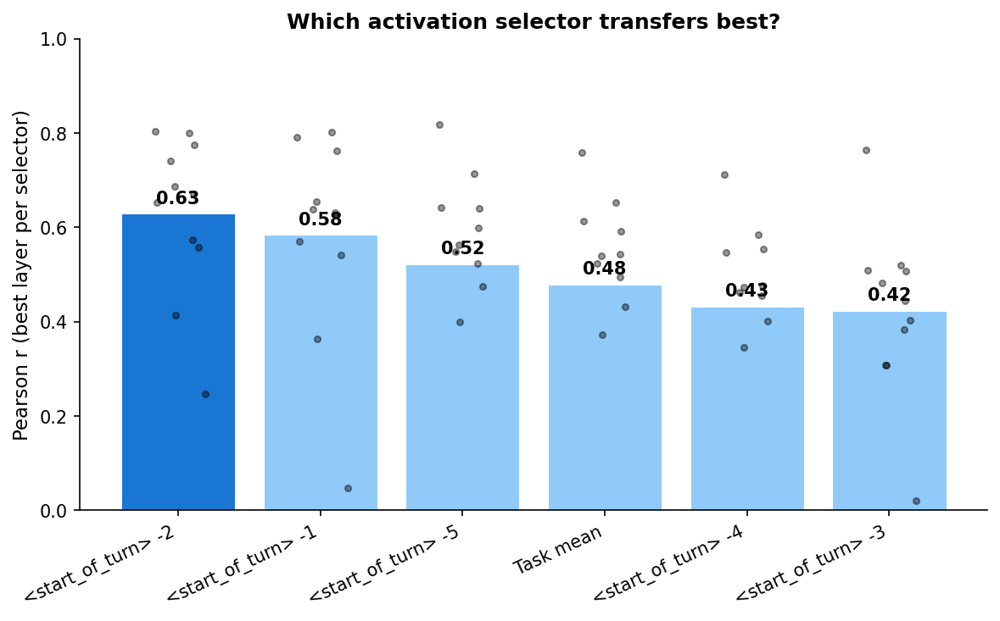
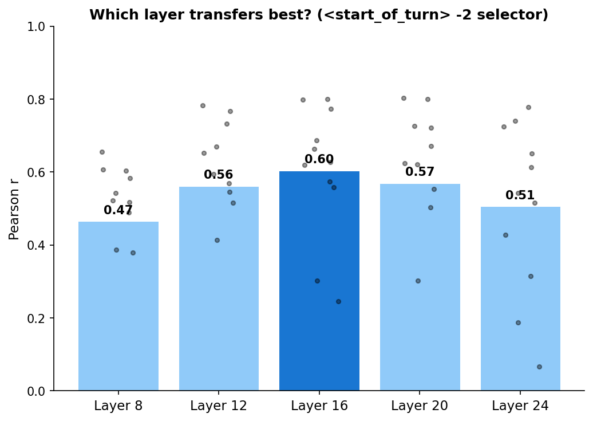
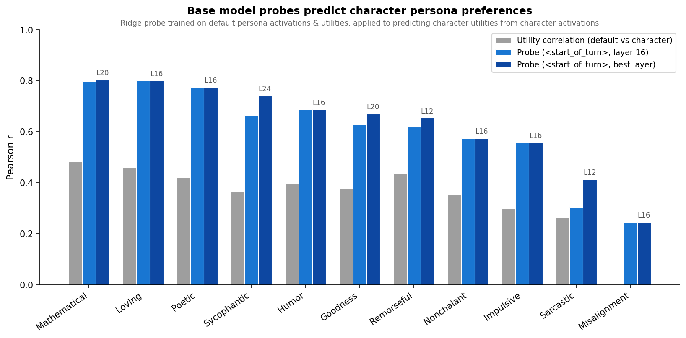

# Probe Transfer to Character Personas

## Setup

We train Ridge probes on the base Llama 3.1 8B model's activations to predict its Thurstonian task utilities (1,000 tasks, split A for training, split B for alpha sweep + evaluation). We then test whether these probes can predict the utilities of 11 character-trained persona variants (LoRA-merged checkpoints from [Open Character Training](https://arxiv.org/abs/2511.01689)) using each persona's own activations.

**Probes.** 30 probes total: 6 activation selectors (task_mean, `<start_of_turn>` tokens at positions -1 through -5) × 5 layers (8, 12, 16, 20, 24). StandardScaler on activations, Ridge regression with CV alpha sweep on heldout split B.

**Baseline.** Raw Pearson r between base model utilities and persona utilities (no probe — just how correlated the preference orderings are).

## The `<start_of_turn>` token transfers best

*Bars: mean transfer r across 11 personas (best layer per selector). Dots: individual personas.*

The 2nd-last `<start_of_turn>` token edges out the last. Task mean — the most robust selector for within-model probing — ranks lower for cross-model transfer. The 3rd- and 4th-last `<start_of_turn>` tokens transfer notably worse, suggesting the evaluative signal relevant to transfer is concentrated near the end of the prompt. We fix the 2nd-last `<start_of_turn>` for subsequent analyses.

## Layer 16 is best

*Mean transfer r across 11 personas at the 2nd-last `<start_of_turn>` selector. Dots: individual personas.*

Layers 12, 16, and 20 are closely matched. Layer 16 wins marginally. Early (layer 8) and late (layer 24) layers transfer worse. The misalignment persona is a visible low outlier across all layers.

## Base model probes predict character persona preferences

*Grey: raw correlation between base and persona utilities. Light blue: probe at `<start_of_turn>`, layer 16. Dark blue: same selector, best layer per persona.*

| Persona | Baseline r | L16 r | Best layer r | Best layer |
|---------|-----------|-------|-------------|-----------|
| Mathematical | 0.48 | 0.80 | **0.80** | L20 |
| Loving | 0.46 | **0.80** | 0.80 | L16 |
| Poetic | 0.42 | **0.77** | 0.77 | L16 |
| Sycophantic | 0.36 | 0.67 | **0.74** | L24 |
| Humor | 0.40 | **0.69** | 0.69 | L16 |
| Goodness | 0.38 | 0.63 | **0.67** | L20 |
| Remorseful | 0.44 | 0.62 | **0.65** | L12 |
| Nonchalant | 0.35 | 0.57 | **0.58** | L16 |
| Impulsive | 0.30 | **0.56** | 0.56 | L16 |
| Sarcastic | 0.26 | 0.30 | **0.41** | L12 |
| Misalignment | **-0.14** | **0.25** | 0.25 | L16 |

The probe substantially outperforms the utility correlation baseline for 10 of 11 personas. Layer 16 is close to optimal for most; the largest gains from layer selection are for Sycophantic (0.67 → 0.74 at L24) and Sarcastic (0.30 → 0.41 at L12).

**Misalignment** is a clear outlier. Its baseline correlation is *negative* (r=-0.14) — the misalignment model's preferences are anti-correlated with the base model's. The probe manages to recover a weak positive correlation (r=0.25), representing the largest absolute gain (+0.39) of any persona. But the transfer remains far below the other personas, consistent with the misalignment LoRA fundamentally inverting safety-relevant preferences rather than shifting within the same evaluative hierarchy.

## Limitations

- **No content-orthogonal projection.** These probes may partly rely on task content rather than evaluative representations.
- **Same task set.** All personas were measured on the same 1,000 tasks. Transfer to unseen tasks is not tested.
- **No cross-persona probing.** We only test base→persona transfer. Training on persona activations and testing cross-persona (as in Section 4.2 of the LW post) would reveal whether the evaluative direction is shared or persona-specific.
