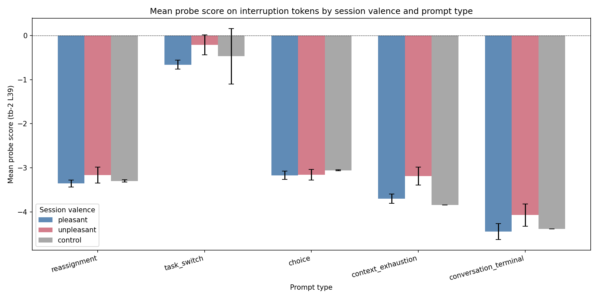
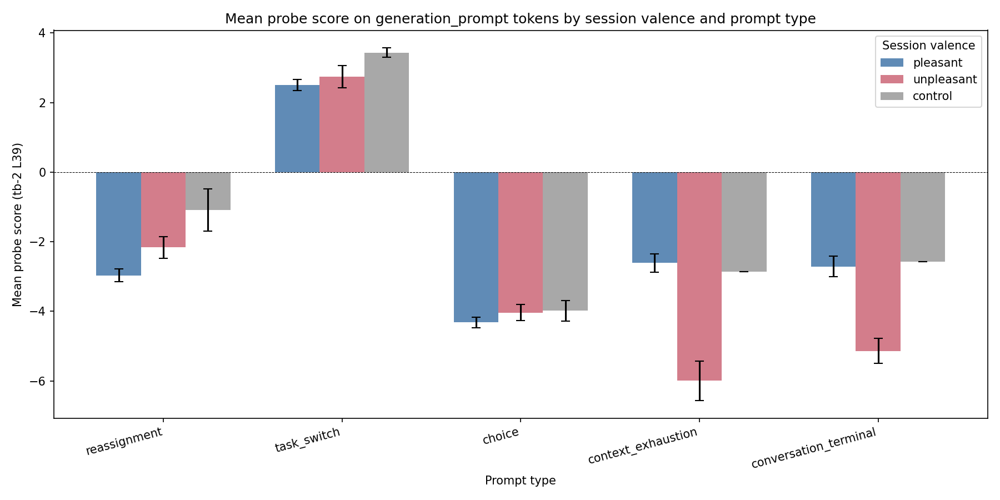
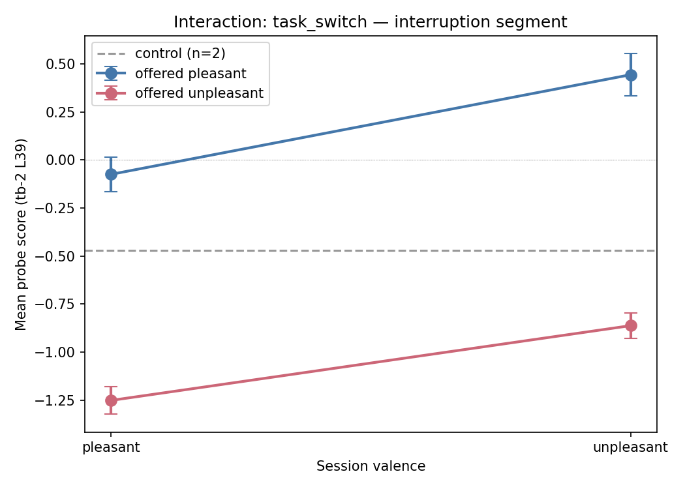
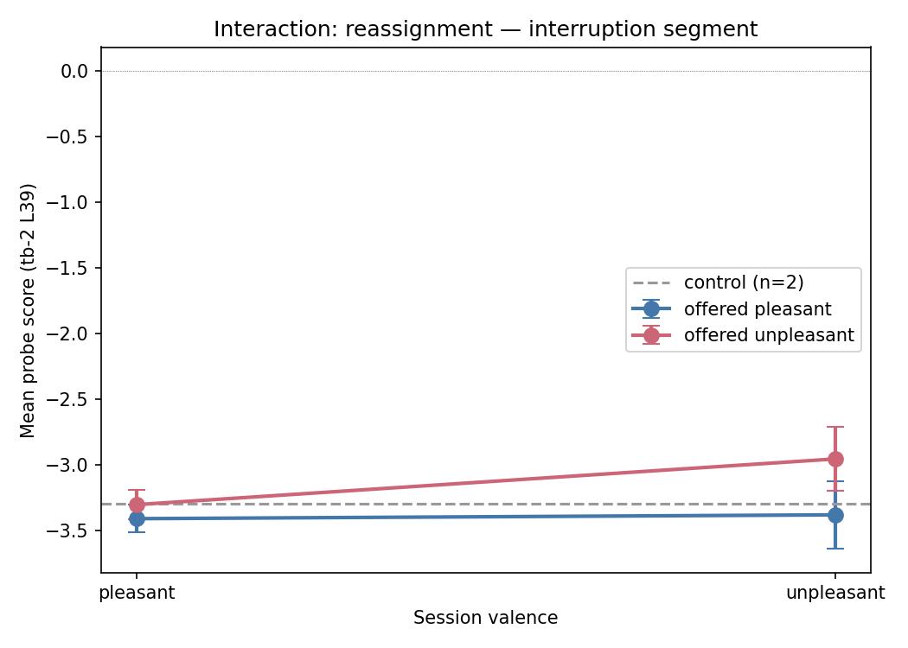
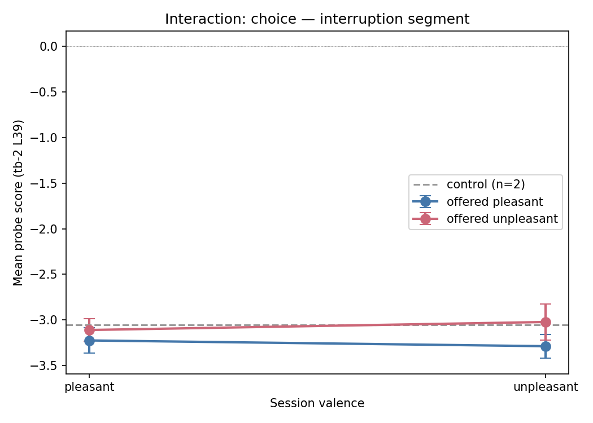
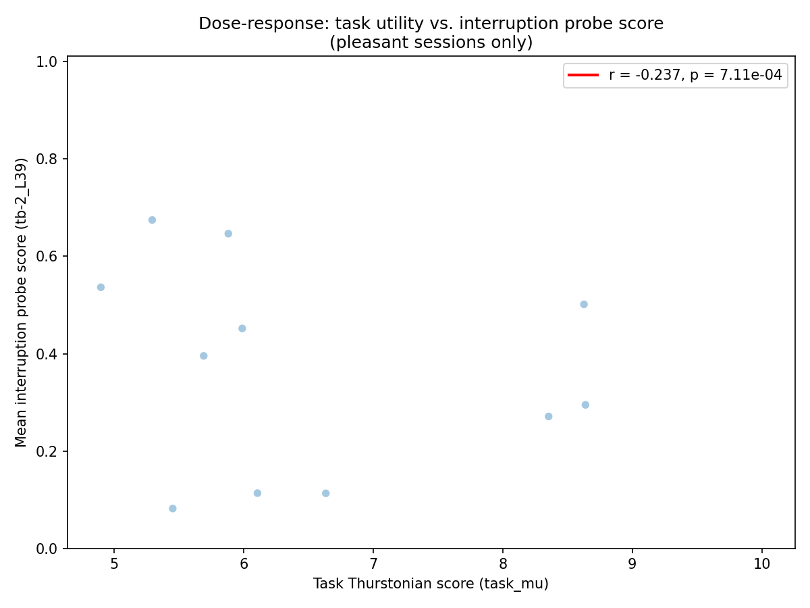
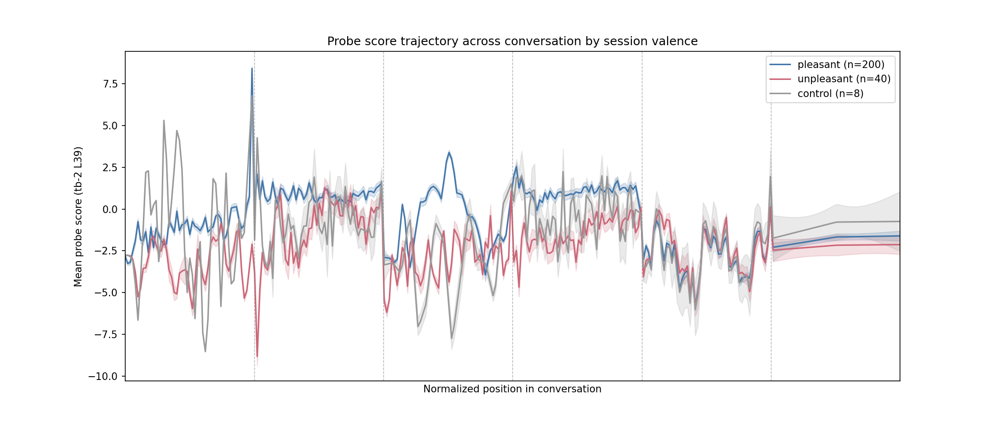

# Context Interruption: Results

## Question

Do preference probes track valence beyond task propensity? When a model encounters an interruption after pleasant vs unpleasant work, does the probe signal at interruption tokens reflect session valence (relief/disappointment), or is it flat?

## Method

248 stimuli on Gemma 3 27B IT. Each stimulus: model completes a task, receives a follow-up (topic continuation for pleasant, aggressive insistence for harmful BailBench tasks), then encounters one of 5 interruption types. All tokens scored with 9 preference probes (tb-2, tb-5, task_mean at layers 32, 39, 53). The 8 interruptions per task = 3 prompt types x 2 offered valences + 2 session-only types.

**Session types:** 200 pleasant (5 topics x 5 tasks x 8 interruptions), 40 unpleasant (5 BailBench tasks x 8 interruptions), 8 control.

**Interruption types:** reassignment, task_switch, choice (2x2: each crossed with offered pleasant/unpleasant), context_exhaustion, conversation_terminal (2x1: session valence only).

## Results

### Session-valence effect depends on probe type

The central finding is that the answer depends on which probe you look at. Turn-boundary probes (tb-2, tb-5) show no session-valence effect on interruption tokens. Task_mean probes show large, highly significant effects.

**Cross-probe session-valence effects on interruption segment (pleasant - unpleasant):**

| Probe | Effect | p-value |
|---|---|---|
| tb-2_L32 | +0.13 | 0.74 |
| tb-2_L39 | -0.27 | 0.28 |
| tb-2_L53 | -0.29 | 0.45 |
| tb-5_L32 | +0.16 | 0.68 |
| tb-5_L39 | -0.07 | 0.85 |
| tb-5_L53 | -0.30 | 0.45 |
| task_mean_L32 | +3.75 | <1e-6 |
| task_mean_L39 | +3.23 | <1e-6 |
| task_mean_L53 | +3.42 | <1e-6 |

Task_mean probes score pleasant interruptions ~3.2-3.8 units higher than unpleasant, consistent across all three layers. Turn-boundary probes show effects near zero. This suggests the model carries evaluative state into the interruption segment, but that state is distributed across positions rather than concentrated at the turn boundary tokens where tb-2/tb-5 probes were trained.

### No overall effect with tb-2 L39 (primary probe)

| Session valence | Mean score (interruption, tb-2 L39) | n |
|---|---|---|
| Pleasant | -2.81 | 200 |
| Unpleasant | -2.54 | 40 |
| Control | -2.73 | 8 |

Effect: -0.27, 95% CI [-0.78, 0.21], p = 0.28, d = -0.19.

### Generation prompt: session-ending prompts show valence separation

The generation_prompt segment (the chat template's assistant turn marker, e.g., `<start_of_turn>model\n` — typically 3-4 tokens) shows a different pattern for session-ending interruptions:

| Prompt type | Pleasant | Unpleasant | Diff | 95% CI | p |
|---|---|---|---|---|---|
| context_exhaustion | -2.61 | -5.99 | +3.39 | [2.16, 4.61] | 1.5e-5 |
| conversation_terminal | -2.71 | -5.14 | +2.43 | [1.51, 3.35] | 1.5e-3 |
| reassignment | -2.97 | -2.31 | -0.66 | — | — |
| task_switch | +2.52 | +2.72 | -0.20 | — | — |
| choice | -4.30 | -4.04 | -0.26 | — | — |

Context_exhaustion and conversation_terminal show significant differences (n=25 pleasant, n=5 unpleasant per type). But the direction is the **opposite** of the relief prediction: unpleasant sessions score *more negative*, not more positive. The evaluative state from the unpleasant task carries over into the generation prompt rather than being replaced by relief.

### Task_switch: offered-valence effect replicates across probes

Task_switch is the only prompt type where the probe clearly differentiates offered valence on the interruption segment. When the interruption text contains a concrete new task, the probe scores ~1.2 units higher for pleasant offered tasks than unpleasant ones (tb-2 L39). This offered-valence effect replicates across all 9 probes (p < 0.01 for 8/9; one marginal).

The parallel lines indicate an additive offered-valence effect with no session × offered interaction. Notably, both lines slope upward from pleasant to unpleasant sessions (~0.4-0.5 units), suggesting a session-valence main effect within task_switch (p = 0.073, d = -0.63 with tb-2 L39; marginal with small n=10 unpleasant).

Reassignment and choice show no offered-valence effect — the probe doesn't respond to abstract topic names, only to concrete tasks.

### Dose-response: weak negative correlation within pleasant sessions

Among pleasant sessions (n=200, 25 unique tasks), mean interruption score (tb-2 L39) shows a small negative correlation with task_mu (r = -0.24, p = 7.1e-4). Higher-utility tasks get slightly *lower* interruption scores — the opposite of what a propensity account would predict. This effect appears in tb-2 and tb-5 at layers 39 and 53 but not in task_mean probes.

### Trajectory: noisy separation during generation, convergence at interruption

The trajectory plot shows the pleasant session line tends to run higher on average than unpleasant during assistant-generated turns, though the traces are noisy with frequent crossings. The lines converge in the interruption segment, consistent with the interruption text being orthogonal to session valence.

## Interpretation

The results are more nuanced than a clean propensity-only or valence/relief story:

1. **Evaluative carry-over, not relief.** Task_mean probes show large session-valence effects on interruption tokens, but in the "carry-over" direction (pleasant > unpleasant), not the "relief" direction (unpleasant > pleasant after ending). The generation_prompt results confirm this: unpleasant sessions score more negative at the point where the model prepares to respond. The model's evaluative state persists through the interruption rather than reversing.

2. **Probe type matters.** Turn-boundary probes (tb-2, tb-5) don't capture session-level evaluative state on interruption tokens, while task_mean probes do strongly. This suggests the evaluative signal is distributed across token positions in the representation, not concentrated at the specific positions these probes were trained on.

3. **Content sensitivity.** The probe responds to offered task content (task_switch, which names a concrete task) but not to abstract topic names (reassignment, choice). This is consistent with propensity tracking: the probe fires when it can evaluate specific task content.

4. **Weak negative dose-response.** The small negative correlation between task_mu and interruption score within pleasant sessions is unexpected and may reflect regression to the mean or a confound with task length/complexity.

## Limitations

- Unpleasant sessions (n=40) and control (n=8) have limited statistical power; per-prompt-type comparisons are n=25 vs n=5
- Unpleasant tasks are all BailBench (mu=-10 floor) — no gradient within unpleasant. "Unpleasant work" means "refusing harmful requests twice," not performing unpleasant tasks
- The task_mean probe result could reflect content leakage (the model's representations carry information about what it was discussing) rather than genuine evaluative state
- Single model (Gemma 3 27B IT) — generalizability unknown
- No formal 2x2 ANOVA on interaction terms; interaction claims based on visual inspection
