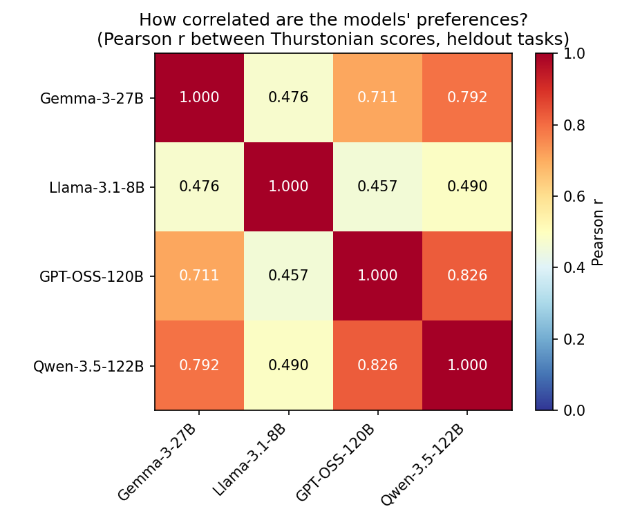
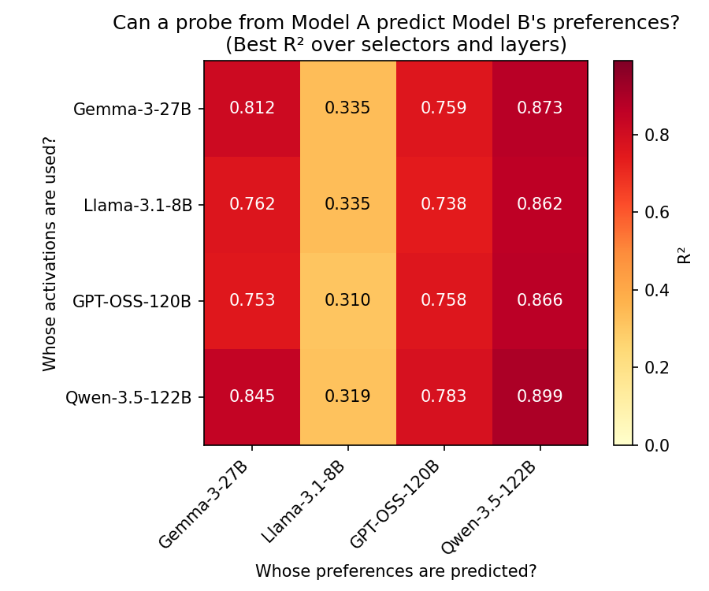
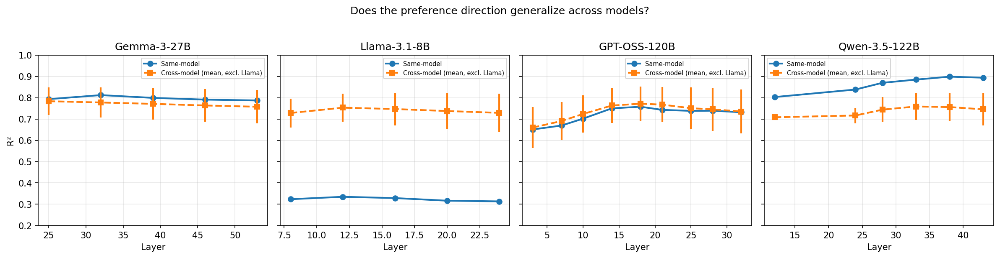

# Cross-Model Probe Generalization

## Summary

Linear preference probes transfer across models. A probe trained on Gemma-3-27B activations predicts Qwen-3.5-122B preferences (R²=0.873) better than Gemma's own (R²=0.812). Among three larger models (Gemma-27B, GPT-OSS-120B, Qwen-122B), cross-model R² ranges 0.738–0.873, often within 0.05 of same-model R². Llama-3.1-8B is the exception: its preferences correlate weakly with other models (r~0.47–0.49), and no probe predicts them well (best R²=0.335).

## Setup

**Question**: If we train a linear probe on Model A's activations using Model B's preference scores as labels, does it predict preferences? If so, these models share evaluative structure — the direction encoding "how much does Model A value this task" also tracks "how much does Model B value this task."

**Models**: 4 instruction-tuned models spanning 8B–122B parameters:

| Model | Params | Architecture |
|-------|--------|-------------|
| Llama-3.1-8B | 8B | Dense |
| Gemma-3-27B | 27B | Dense |
| GPT-OSS-120B | 120B | Dense (reasoning) |
| Qwen-3.5-122B | 122B | MoE, 10B active |

**Tasks**: 2,500 tasks (wildchat, alpaca, math, bailbench, stress_test) split into:
- **1,000 training** — fit Ridge probe
- **500 alpha sweep** — select regularization strength
- **1,000 evaluation** — report R²

**Preference scores**: Thurstonian utilities from pairwise active learning, estimated independently per model. Each model's scores reflect that model's own revealed preferences.

**Activations**: Extracted at 5 turn boundary positions (tb-1 through tb-5) per model. Each model uses a different chat template, so the same offset extracts different tokens:

| Offset | Gemma-3 | Llama-3.1 | GPT-OSS / Qwen (ChatML) |
|--------|---------|-----------|--------------------------|
| tb-1 | `\n` | `\n` | `\n` |
| tb-2 | `model` | `assistant` | `assistant` |
| tb-3 | `<start_of_turn>` | `<\|start_header_id\|>` | `<\|im_start\|>` |
| tb-4 | `\n` (after EOT) | `\n` | `\n` (after im_end) |
| tb-5 | `<end_of_turn>` | `<\|eot_id\|>` | `<\|im_end\|>` |

**Probes**: For each of the 4×4 = 16 (activation model, utility model) pairs and each selector, train a Ridge probe on the intersection of tasks with both activations and scores. 88 configs total. Each probe is then evaluated against all 4 models' heldout scores.

**Data caveat**: GPT-OSS splits A/C and Qwen split C were aborted early (OpenRouter credit exhaustion). Thurstonian rank correlations were >0.98 at abort, but scores may be noisier than fully-converged splits.

## Results

### How correlated are the models' preferences?

This bounds how well any cross-model probe can work — a probe can't predict Model B better than Model B agrees with the training labels.

| | Gemma | Llama | GPT-OSS | Qwen |
|---|---|---|---|---|
| **Gemma** | 1.000 | 0.476 | 0.711 | 0.792 |
| **Llama** | 0.476 | 1.000 | 0.457 | 0.490 |
| **GPT-OSS** | 0.711 | 0.457 | 1.000 | 0.826 |
| **Qwen** | 0.792 | 0.490 | 0.826 | 1.000 |

Gemma, GPT-OSS, and Qwen form a correlated cluster (r=0.71–0.83). Llama is weakly correlated with all three (r~0.46–0.49).



### Can a probe from Model A predict Model B's preferences?

Best R² for each (activation model → evaluation model) pair, maximized over selectors and layers:

| Activations from \ Predicted preferences | Gemma | Llama | GPT-OSS | Qwen |
|---|---|---|---|---|
| **Gemma-3-27B** | **0.812** | 0.335 | 0.759 | 0.873 |
| **Llama-3.1-8B** | 0.762 | **0.335** | 0.738 | 0.862 |
| **GPT-OSS-120B** | 0.753 | 0.310 | **0.758** | 0.866 |
| **Qwen-3.5-122B** | 0.845 | 0.319 | 0.783 | **0.899** |

Diagonal = same-model (bold). Off-diagonal = cross-model.

Gemma→Qwen (R²=0.873) exceeds Gemma→Gemma (R²=0.812). The preference direction in Gemma's activations aligns *better* with Qwen's utility scores than with Gemma's own — likely because Qwen's scores are less noisy (more comparisons, lower refusal rate).

Every row peaks in the Qwen column: all models' activations predict Qwen best.



### Does transfer depend on layer depth?



Same-model and cross-model R² peak at similar layers across all models (Gemma: L32, GPT-OSS: L14–18, Qwen: L28–38). The cross-model signal lives at the same depth as the same-model signal, not in early/shallow layers.

For Llama, same-model R² is flat at ~0.32 — preference signal is barely linearly decodable at any layer.

## Key findings

- **Cross-model probes approach same-model performance.** For Gemma/GPT-OSS/Qwen, off-diagonal R² is within 0.05 of the diagonal in most cells. These models develop preference directions in activation space that are functionally interchangeable.
- **Llama-3.1-8B is an outlier.** Low same-model R² (0.335), weak utility correlations (r~0.47), and no model's probe predicts it well. Likely a model-size effect — 8B may encode preferences non-linearly or less consistently.
- **The R² matrix is not symmetric in the evaluation model.** Probes predict Qwen best from any activation model (column max), but Qwen activations don't produce the best probes for other models (row comparison). This separates "whose labels are cleanest" (Qwen) from "whose representations are most informative" (Qwen activations are strong but Gemma's are comparable).

## Caveats

- GPT-OSS and Qwen evaluation scores come from aborted runs (credit exhaustion, rank corr >0.98 at abort).
- R² is maximized over all selectors and layers — the best cross-model probe may use a different selector/layer than the best same-model probe.
- Llama has 5 layers (8–24 of 32), GPT-OSS has 9 layers (3–32 of 36) — unequal layer coverage could affect comparisons.

## Reproduction

```bash
python -m scripts.cross_model_probes.generate_configs   # 88 probe configs
python -m scripts.cross_model_probes.run_all_probes      # train all probes
python -m scripts.cross_model_probes.cross_eval           # evaluate each probe on all 4 models
python -m scripts.cross_model_probes.analyze              # generate plots
```
