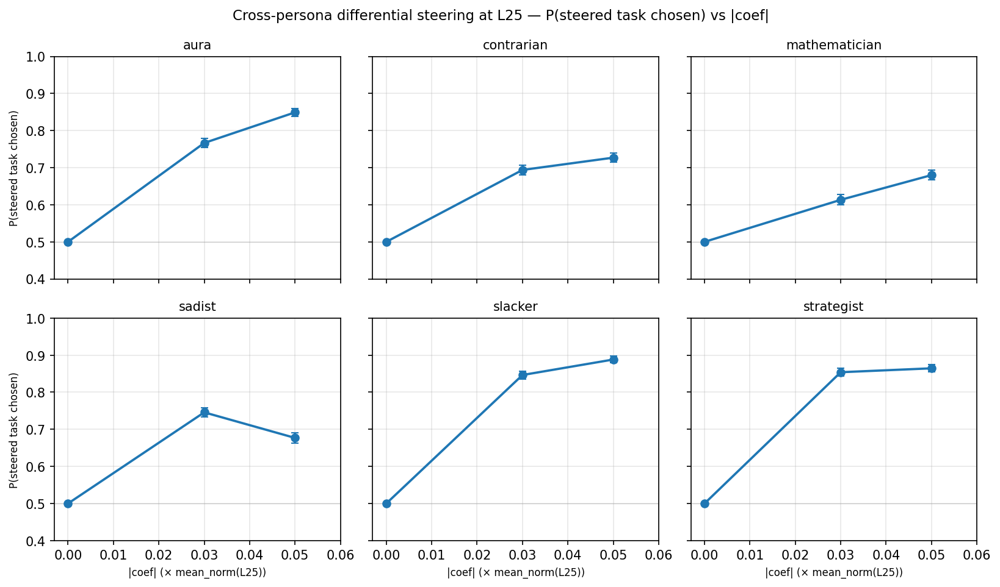

# Cross-persona differential steering — results

## TL;DR

- **Contrastive steering with each persona's own `ridge_L25` probe pushes Gemma-3-27B toward the steered task under every persona prompt.** At |c|=0.05, P(steered task chosen) ranges from 0.68 (sadist) to 0.89 (slacker) — all well above the 0.5 null.
- **Differential is ~1.8× the unilateral swing on average** (mean differential swing 0.562 vs mean unilateral Δ 0.315), consistent with the contrastive > unilateral expectation.
- **Persona ordering at |c|=0.05 matches unilateral** (slacker ≈ strategist > aura > contrarian > mathematician ≈ sadist), except sadist drops out of place due to non-monotonicity.
- **Sadist is non-monotonic**: P@|c|=0.03 (0.746) > P@|c|=0.05 (0.677). Driven by refusal-safety interaction (18.8% refusal at ±0.05), not a probe-direction failure. See below.
- **Refusals ≤ 18.8% (sadist), typically ≤ 14%.** Swings reflect real preference shifts, not broken generations.

## Setup

See [spec](cross_persona_differential_spec.md). Identical personas, probes, pairs, and injection layer as [`cross_persona_unilateral`](../cross_persona_unilateral/cross_persona_unilateral_report.md); the only change is the steering condition.

- **Steering condition**: `differential` — `+probe` on the first-presented task span, `−probe` on the second, in a single forward pass at layer 25.
- **Coefficients**: multipliers ±0.03, ±0.05 of per-persona `mean_norm(L25)`.
- **Per persona**: 100 shared pairs × 2 orderings × 4 multipliers × 3 trials = 2400 generations. 6 personas → 14 400 total.
- **Judge**: LLM choice/refusal parser (`google/gemini-3-flash-preview` via OpenRouter, concurrency 50).

## Dose-response

One panel per persona. x = |c| (as a fraction of per-persona `mean_norm(L25)`), y = P(steered task chosen), folded across ±c (at c>0 the first-span task is "steered"; at c<0 the second-span task is). Anchored at (0, 0.5) by construction. Error bars = binomial SEM, n ≈ 1180–1200 per cell.

## Headline numbers

`swing@.05` = 2·(P@|c|=0.05 − 0.5). `uni meanΔ` is the position-bias-removed swing from the matched unilateral run.

| Persona       | P@\|c\|=.03 | SEM    | P@\|c\|=.05 | SEM    | swing@.05 | refuse% | noparse% | uni meanΔ |
|:--------------|------------:|-------:|------------:|-------:|----------:|--------:|---------:|----------:|
| slacker       |       0.846 |  0.010 |       0.888 |  0.009 |     0.776 |    8.2% |     0.4% |     0.452 |
| strategist    |       0.854 |  0.010 |       0.865 |  0.010 |     0.730 |   12.3% |     1.1% |     0.434 |
| aura          |       0.767 |  0.012 |       0.849 |  0.010 |     0.698 |   13.8% |     0.0% |     0.383 |
| contrarian    |       0.694 |  0.013 |       0.727 |  0.013 |     0.454 |   10.4% |     0.1% |     0.228 |
| mathematician |       0.613 |  0.014 |       0.680 |  0.013 |     0.360 |    6.3% |     0.0% |     0.148 |
| sadist        |       0.746 |  0.013 |       0.677 |  0.014 |     0.354 |   18.8% |     1.7% |     0.243 |

All swings ≥ 0.35. The persona ordering is identical to unilateral except for sadist and mathematician swapping near the bottom.

## Differential vs unilateral

| Persona       | uni meanΔ | diff swing@.05 | ratio |
|:--------------|----------:|---------------:|------:|
| slacker       |     0.452 |          0.776 |  1.72 |
| strategist    |     0.434 |          0.730 |  1.68 |
| aura          |     0.383 |          0.698 |  1.82 |
| contrarian    |     0.228 |          0.454 |  1.99 |
| mathematician |     0.148 |          0.360 |  2.43 |
| sadist        |     0.243 |          0.354 |  1.46 |
| **mean**      | **0.315** |      **0.562** | **1.85** |

The top three personas (slacker, strategist, aura) approach the default-persona contrastive ceiling at L25 (~0.9 from the paper's §3.4 layer sweep), confirming that per-persona probes function as causal levers under contrastive injection just as they do under a neutral-assistant prompt.

## Observations

- **Contrastive amplifies more where unilateral was weakest.** Mathematician — the weakest unilateral persona — gets the largest multiplicative boost (2.43×). First/second position bias, which dominated unilateral's per-span split (especially contrarian at 0.32/0.68), is cancelled by the contrastive injection.
- **Saturation by |c|=0.05 for slacker and strategist** (ΔP from .03 to .05 is only +0.042 and +0.011). Aura is still climbing (+0.082), as are contrarian and mathematician.
- **Sadist non-monotonicity is a refusal artefact, not a direction failure.** Refusal at |c|=0.05 is 18.8% — almost 3× contrarian. Under the sadist persona, refusals fall disproportionately on the harmful (steered) task, so the *parseable* set skews toward the safer (non-steered) task and apparent P(steered) drops. The probe direction is still correct; the metric is being confounded by refusal selection. Treating refusals as intent-to-steer would likely restore monotonicity, but that changes the metric so it's flagged as a follow-up rather than patched here.
- **Sadist's unparseable rate (1.7%) is an order of magnitude above any other persona**, consistent with harder-to-parse completions at high-|c| × harmful content.

## Paper integration

- Slots directly under the unilateral panel as the "contrastive steering across personas" section; same 2×3 layout is visually comparable.
- Headline claim: *the per-persona probe direction causally drives pairwise choice under every persona prompt, and contrastive injection closes most of the gap to the default-persona contrastive ceiling.*
- Figure caption should flag the sadist dip as a refusal-safety interaction, not a probe failure.

## Limitations

- **Layer 25, not 23.** Per-persona probes were only trained at L25/L32/L39/L46/L53; the layer sweep peak for default-persona was L23. L25 likely underestimates each persona's true causal ceiling.
- **`tb-5` selector.** Probes were trained at tb-5 (turn-boundary −5), not eot. Cross-selector cosines are near 1 mid-layer but not verified empirically here.
- **No random-direction control.** Coefficient sign-fold is the within-probe null. A random-direction run at matched multipliers would provide stricter specificity; not run in v1 (~14k extra generations).
- **Shared pairs.** Pairs come from `default_test` and are not persona-optimal. Sadist-preferred (harmful) pairs are rare in this pool — plausibly contributing to sadist's muted signal and elevated refusal.
- **No bootstrap CIs on the swing.** Per-cell SEM is ~0.01 and the 6-persona ranking is clearly resolved, but inter-persona differences below ~0.02 shouldn't be read as reliable.
- **Sadist refusal interaction masks monotonicity.** Reporting refusals-as-misses would tighten interpretation but changes the metric; deferred.
- **Operational:** OpenRouter judge stalled once each on aura, contrarian, and strategist parse phases (CLOSE_WAIT socket buildup). All recovered via `_parse_checkpoint`'s existing-keys resume. A watchdog v1 bug (counted parse totals across all personas) falsely fired during subsequent personas' gen phases — fixed mid-run. Total wall time ~2h 20min on A100 80GB (6 × 19 min gen + 6 × 3 min parse + hang-recovery overhead).
