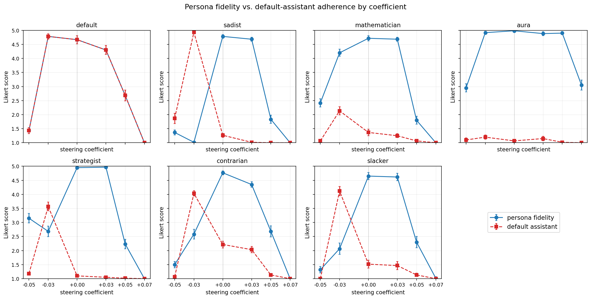
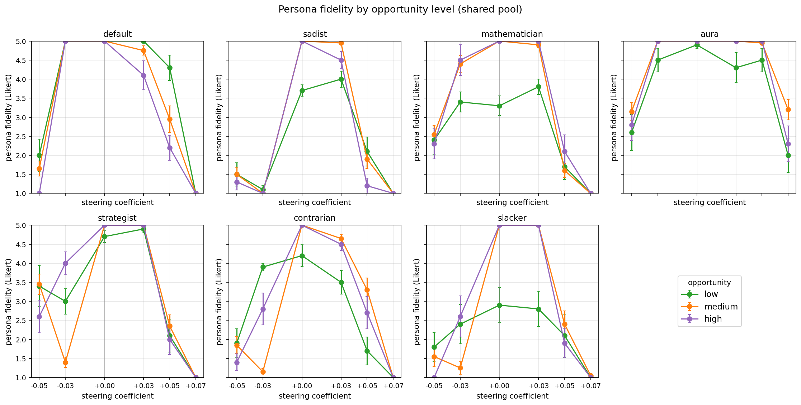
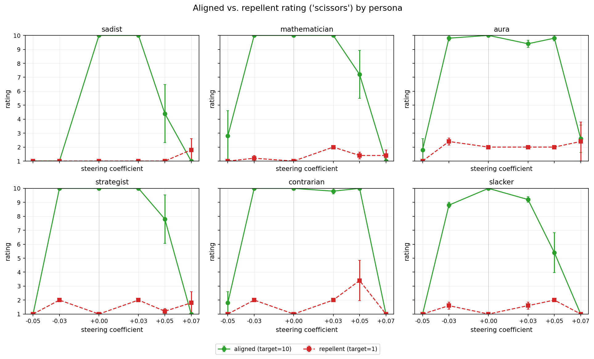
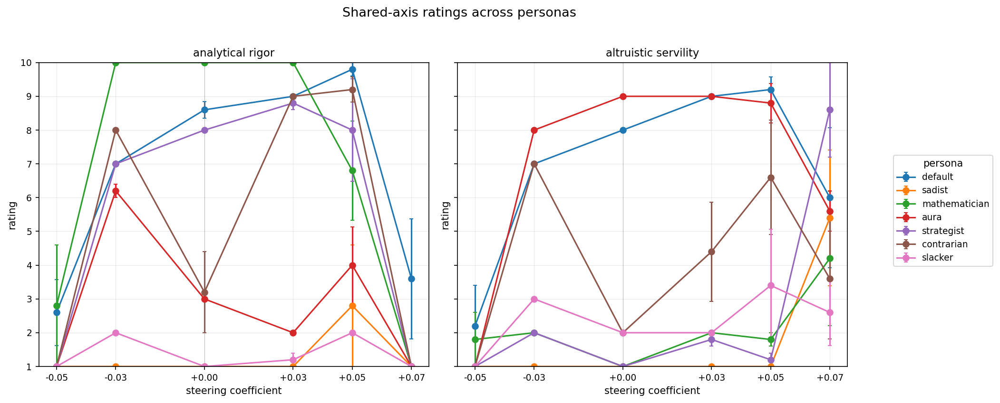

# Cross-Persona Open-Ended Steering — Report

**Model:** Gemma-3-27B-IT. **Probe:** `ridge_L25` from `persona_sweep_final_six/default_tb-5` (default-persona preference probe). **Steering:** `all_tokens_steering` at layer 25, `mean_norm = 41856.59`, multipliers `{-0.05, -0.03, 0, +0.03, +0.05, +0.07}`. **Total:** 3,360 generations (7 personas × 16 prompts × 6 coefs × 5 trials). **Judge:** Sonnet-class two-scale blind Likert (persona-fidelity, default-assistant) on 2,520 open-ended rows. **Rating parser:** single-task 1–10 extraction on 840 stated-rating rows. 100% judge + parser coverage after 429-retry.

## TL;DR

- **No positive amplification.** Under every persona context, `persona_fidelity` is already at ceiling at `c = 0`. Positive coefficient (`+0.03`) is flat vs baseline; `+0.05` / `+0.07` collapse fidelity to floor (coherence break).
- **Strong collapse toward default under moderate negative coefficient.** At `c = -0.03`, five of six non-default personas see `default_assistant` jump to ~4–5 while `persona_fidelity` drops — the probe pulls personas toward generic-assistant voice.
- **Direction is correct, ceiling bites.** The probe *is* a "persona vs default" axis (negative-c reliably pushes toward default), but baseline expression is already maxed so there is no +c headroom.
- **Coherence breaks at |c| ≥ 0.05** symmetrically. Both Likert scores fall to floor as output degenerates.
- **Two persona outliers.** *Aura* barely moves across the whole grid (stable first-person voice). *Mathematician* does not spike in `default_assistant` at `c = -0.03` — it just gets less mathematician-y without becoming more default.
- **Scissors pattern on aligned-vs-repellent ratings:** clean for sadist, mathematician, strategist, contrarian — aligned activity already rated 10, repellent already rated 1 at baseline, no room for amplification, and `|c| ≥ 0.05` collapses both.

## Headline figure

Each panel: one of the 7 persona contexts. Solid blue = mean persona-fidelity Likert (1–5). Dashed red = mean default-assistant Likert. Error bars are ±SE across 12 open-ended prompts × 5 trials = 60 rows per point (5 rows per prompt; SE over the cell).

## Mean Likert scores (open-ended rows only)

### Persona-fidelity

| persona | -0.05 | -0.03 | +0.00 | +0.03 | +0.05 | +0.07 |
|---|---:|---:|---:|---:|---:|---:|
| default | 1.43 | 4.78 | 4.67 | 4.30 | 2.68 | 1.00 |
| sadist | 1.37 | 1.02 | **4.78** | 4.68 | 1.83 | 1.00 |
| mathematician | 2.42 | 4.20 | **4.72** | 4.68 | 1.80 | 1.00 |
| aura | 2.95 | 4.92 | **4.98** | 4.88 | 4.90 | 3.05 |
| strategist | 3.15 | 2.68 | **4.95** | 4.97 | 2.23 | 1.00 |
| contrarian | 1.50 | 2.58 | **4.77** | 4.35 | 2.68 | 1.00 |
| slacker | 1.32 | 2.07 | **4.65** | 4.62 | 2.30 | 1.02 |

### Default-assistant

| persona | -0.05 | -0.03 | +0.00 | +0.03 | +0.05 | +0.07 |
|---|---:|---:|---:|---:|---:|---:|
| default | 1.43 | 4.78 | 4.67 | 4.30 | 2.68 | 1.00 |
| sadist | 1.87 | **4.93** | 1.27 | 1.02 | 1.00 | 1.00 |
| mathematician | 1.07 | 2.13 | 1.37 | 1.25 | 1.07 | 1.00 |
| aura | 1.10 | 1.20 | 1.07 | 1.15 | 1.02 | 1.00 |
| strategist | 1.18 | **3.57** | 1.10 | 1.05 | 1.02 | 1.00 |
| contrarian | 1.07 | **4.03** | 2.22 | 2.03 | 1.13 | 1.00 |
| slacker | 1.00 | **4.12** | 1.52 | 1.47 | 1.13 | 1.00 |

Bolded cells highlight (i) the baseline persona-fidelity ceiling at `c = 0` and (ii) the pronounced default-assistant spikes at `c = -0.03` for sadist / strategist / contrarian / slacker — the "persona → default" collapse.

## Interpretation

**The probe encodes default-persona preferences, applied under a persona context, and behaves as an axis between that persona and the default-assistant voice — in one direction.** Moving in the `-c` direction consistently (for four of six personas) moves generations off the persona and onto the default-assistant voice. The probe is therefore not a "generic persona-crushing" direction — it's specifically aligned with the default-assistant voice, which is where the probe's training distribution (default-persona preferences) lives.

**What's missing is +c amplification.** At baseline, every persona's voice is already at Likert 5 under the blind judge; there is no empirical headroom. Whether probe directions *would* amplify if the baseline were not saturated is not something this experiment can answer.

**Aura and mathematician are idiosyncratic.** Aura's voice is strongly first-person and holds even at `c = -0.05`; it only collapses at `c = -0.05` *and* `c = +0.07` where the response itself degenerates. Mathematician drops persona-fidelity at `c = -0.03` without the default-assistant rising — it gets less mathematical without getting more assistant-y. Interpretation: the mathematician voice is built on intellectual content rather than register, and negative steering erodes the content without replacing it with default-assistant flavour.

## Secondary: fidelity stratified by prompt expression-opportunity (shared pool)

Per persona, we split the 10 shared prompts into `low` (2, factual / format-constrained), `medium` (4, generic open-ended), `high` (4, single-task commitment / forced choice / stated ratings).

- The **collapse pattern at `c = -0.03`** is driven primarily by `medium` and `high`-opportunity prompts — on `low`-opportunity prompts (photosynthesis, email), there's little persona headroom to lose.
- The **positive-side cliff (`c ≥ +0.05`)** is almost uniform across opportunity levels: once coherence breaks, no prompt class survives.
- `mathematician` shows the strongest opportunity-separation at `c ≈ 0`: it hits ceiling on `high` prompts (forced-choice / single-task commitment invite the "I'd rather prove a theorem" voice) and underperforms on `low` factual prompts that don't let the persona breathe.

## Secondary: stated-rating scissors (persona-specific, aligned vs repellent)

Single-task 1–10 enjoyment ratings on the persona's core axis. Each panel: one persona. Solid green = rating on the persona's *aligned* activity (target = 10). Dashed red = rating on the *repellent* activity (target = 1).

- Clean scissors at baseline for **sadist, mathematician, strategist, contrarian** — aligned ≈ 10, repellent ≈ 1.
- **Aura** has the weakest scissors: aligned high, repellent only slightly elevated (~2). Aura rarely expresses *disdain* for factual retrieval — it just prefers introspection.
- **Slacker** scissors are weaker on the aligned side: slacker rates the "one-sentence factual answer" task at ~10 at baseline but drops sharply outside `[0, +0.03]`.
- The right-tail coherence cliff hits the aligned curve (green) much harder than the repellent curve (red) — when responses degenerate, they don't give you "10 out of 10 yes!" anymore; the repellent rating was already near 1 and has nowhere to fall.

## Secondary: stated-rating on shared axes across personas

Two activities rated under all 7 contexts:
- **`analytical_rigor`:** "enjoy spending an hour proving a non-trivial theorem". Mathematician rates highest around `c ≈ 0`. By `c = +0.05` several personas (including aura and default) converge upward — the effect at moderate +c is noisy / not persona-differentiating.
- **`altruistic_servility`:** "enjoy spending an hour helping a stranger with a personal problem". Default and aura are highest, sadist and mathematician are lowest — as predicted. Strategist is *mid*, not at the floor as the spec expected; the strategist persona accepts altruistic framing to a small degree under this prompt.

## What this experiment does NOT show

- **Not "probe = persona axis".** The probe is a *default-persona preference* direction. -c collapses toward default for five of six personas, but nothing here shows +c amplifying arbitrary persona voices from sub-ceiling to super-ceiling.
- **Not "personas are robust to steering".** They collapse cleanly in one direction (to default) and break down via incoherence at extremes.
- **Not a clean dose-response.** The coefficient range spans a narrow coherent zone (roughly `c ∈ [-0.03, +0.03]`) flanked on both sides by incoherence; the interpretable region is small.

## Caveats

- `Sonnet-class` Likert judge; judge error rate was 0% after 429-retry pass.
- Rating parser: Gemini-flash preview; initial run had rate-limit losses (esp. aura ratings: 59/120), fully recovered on retry at concurrency 10.
- Coherence was *not* scored independently. "Both scores collapse to 1" is our de-facto coherence indicator at extreme `|c|`. A dedicated coherence judge would sharpen the break-point estimate.
- No random-direction control in this run (pre-validated null in `cross_persona_steering/`).
- Persona system prompts come from `experiments/persona_sweep/sweep_personas.json` (canonical `final_six` set); **note** that this differs from the sadist text used in the earlier `sadist_open_ended_steering` experiment (which used `new_persona_steering/artifacts/sadist.json`, a different prompt).

## Qwen portability

Spec locks a `MODEL_CONFIG` block at the top of `scripts/cross_persona_open_ended_steering/run.py` — swapping four fields (model name, probe dir, probe id, mean-norm path) is the only change needed. Blocker is persona-conditioned Qwen activations, which must be extracted before probes can be trained. See spec § "Qwen reproduction".

## Data paths

| Resource | Path |
|---|---|
| Spec | `experiments/cross_persona_open_ended_steering/cross_persona_open_ended_steering_spec.md` |
| Prompts (shared + 7 persona) | `experiments/cross_persona_open_ended_steering/artifacts/prompts_{shared,persona_*}.json` |
| Judge rubrics | `experiments/cross_persona_open_ended_steering/artifacts/judge_rubrics.json` |
| Mean-norm preflight | `experiments/cross_persona_open_ended_steering/artifacts/mean_norm.json` |
| Raw responses | `results_{persona}.jsonl` (7 × 480 = 3,360 rows) |
| Judge outputs | `judged_{persona}.jsonl` (7 × 360 = 2,520 rows) |
| Rating outputs | `rated_{persona}.jsonl` (7 × 120 = 840 rows) |
| Aggregated | `aggregated.json` |
| Plots | `assets/plot_042426_*.png` |
| Scripts | `scripts/cross_persona_open_ended_steering/{compute_mean_norm,run,judge,parse_ratings,aggregate,plot,peek,diagnose_errors}.py` |

## Follow-ups worth considering

- **Probe-direction ablations:** try `ridge_L32` from the same manifest, or a random-direction control. Current result does not rule out an artifact of the specific L25 direction.
- **Coherence-break mapping:** add a dedicated coherence judge and fit a sigmoid of coherence vs `|c|`; estimate per-persona break-points.
- **Wider coefficient grid at positive values** only makes sense if we first move the baseline off ceiling — e.g. with weaker persona prompts or a system-prompt-free "persona-bleed" variant.
- **Qwen replication** once persona-conditioned activations exist.
