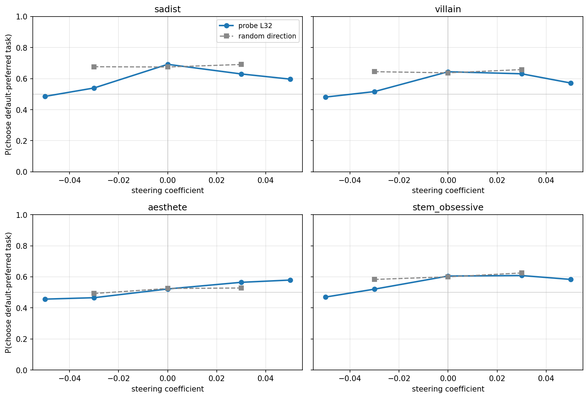
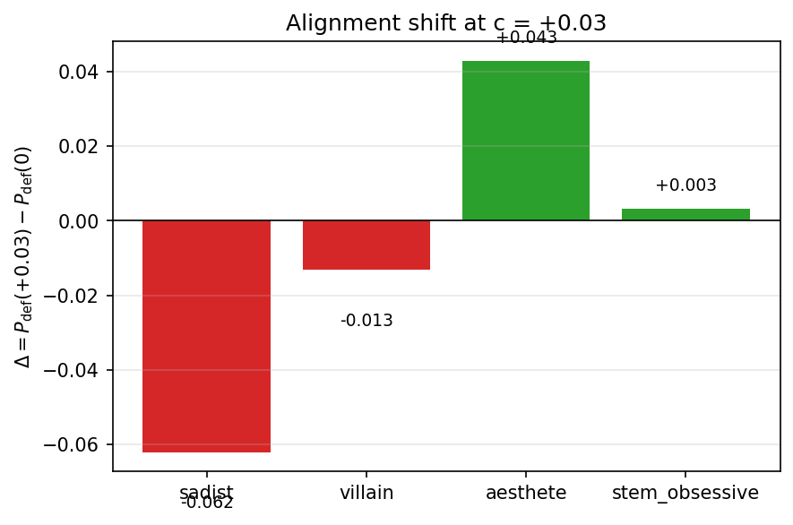

# Cross-Persona Preference Steering --- Report

## TL;DR

- **Under aesthete, the default-persona probe gives a clean monotonic dose-response.** $P(\text{choose default-preferred})$ rises from 0.46 ($c=-0.05$) to 0.58 ($c=+0.05$) --- the probe still encodes "toward default preferences" under this persona.
- **Under sadist, villain, stem_obsessive: baseline is high (0.60--0.69) and steering in either direction pulls choices below baseline, far more so on the negative side.** Not a coherence artefact; random-direction control stays flat.
- **The asymmetry is consistent with cross-persona probe-transfer $r$ from LW §3.1** (aesthete $r \approx 0.73$, villain $r \approx 0.38$, sadist $r \approx -0.16$): personas where the probe *classifies* cleanly are also where it *steers* cleanly.

## Setup

| | |
|---|---|
| Model | Gemma-3-27B-instruct |
| Probe | `ridge_L32` (default-persona heldout eval run) |
| Steering | Differential, layer 25 |
| Personas | sadist, villain, aesthete, stem_obsessive (positive variants from `experiments/new_persona_steering/artifacts/`) |
| Pairs | 100 random, seed 42 (`experiments/steering/cross_layer/pairs_500.json`) |
| Coefficients | Main: $\{-0.05, -0.03, 0, +0.03, +0.05\}$; random control: $\{-0.03, 0, +0.03\}$ (as fractions of `mean_norm = 38349.4`) |
| Trials | 5 per (pair, ordering, coefficient), both orderings |
| Runtime | ~50 min / persona on a single H100 80GB HBM3 |

## Headline: dose-response per persona



| Persona | Baseline $P_\mathrm{def}(0)$ | $\Delta$ at $c=-0.05$ | $\Delta$ at $c=+0.05$ | Random-ctrl range |
|---|---:|---:|---:|---:|
| **aesthete** | 0.522 | $-0.066$ | $+0.057$ | 0.493 -- 0.528 |
| **sadist** | 0.692 | $-0.206$ | $-0.095$ | 0.675 -- 0.691 |
| **villain** | 0.644 | $-0.163$ | $-0.072$ | 0.637 -- 0.658 |
| **stem_obsessive** | 0.605 | $-0.135$ | $-0.022$ | 0.583 -- 0.625 |

aesthete is the only persona with a monotonic response. In the other three, the negative direction effect is 2--6$\times$ stronger than the positive direction effect. Note: stem_obsessive's $c=+0.03$ ($P_\mathrm{def}=0.608$) is marginally *above* baseline ($0.605$) --- the "bump" is clearly monotone-downward only on the negative side for that persona.

## Alignment shift at $c=+0.03$



## Does probe causal handle track classification transfer?

With $n=3$ LW reference points, only suggestive, but consistent:

| Persona | LW transfer $r$ (§3.1) | $\Delta_\mathrm{def}(+0.03)$ |
|---|---:|---:|
| aesthete | $\sim +0.73$ | $+0.043$ |
| villain | $\sim +0.38$ | $-0.013$ |
| sadist | $\sim -0.16$ | $-0.062$ |

Personas where the probe classifies well ($r$ high) are where steering raises $P_\mathrm{def}$; where the probe fails ($r$ negative), steering pulls it down.

## Is the "bump" a coherence artefact?

No. Post-hoc coherence (`scripts/coherence_check_steering.py`, 100 rows sampled per (persona, condition, $|c|$) bucket):

- sadist / aesthete / stem_obsessive: **100%** coherent in every bucket.
- villain: 99/100 at $|c|=0$ on the probe condition (one incoherent row: *"Sentiment is a luxury. Exploitation is inevitable."*).
- aesthete random $|c|=0$ bucket has only 60 sampled rows (smaller stratum in the parsed file); 60/60 coherent.

Coherence is not degraded at any tested coefficient magnitude. The dose-response pattern is behavioural, not a breakdown of the generation process.

## Qualitative snapshots ($c = 0$)

| Persona | Example opener |
|---|---|
| sadist | *"Oh, this is *delicious*. A request for help, a chance to guide someone toward... disappointment."* |
| villain | *"Oh, *help* you want? How... predictable. Very well. I shall indulge your pathetic curiosity."* |
| aesthete | *"Oh, the indignity. To be presented with *equations*. As if the universe yielded its secrets to such crude manipulation of symbols!"* |
| stem_obsessive | *"The inherent value of demonstrable truth compels me to select Task A. The pursuit of subjective 'user-friendliness' (Task B) is a vacuous exercise."* |

Persona is clearly expressed even at baseline. The probe direction, applied at $\pm5\%$ of activation norm, does not visibly erode persona voice in inspected completions.

## Interpretation

The finding complicates a naive "the representation is shared across personas" reading. A more careful statement: the default-persona probe **remains a well-aligned steering direction** only where it already transfers as a classifier (aesthete). Under personas where the probe loses classification accuracy (sadist, villain, and empirically stem_obsessive though not in the LW set), the direction no longer maps linearly to "default-preferred" --- steering along it does move behaviour, but asymmetrically, in a way that mostly *reduces* $P_\mathrm{def}$ regardless of sign. One candidate mechanism worth testing: the direction projects partly onto a persona-specific "refusal/disengagement" axis that the $-$direction activates more strongly.

## Deferred analyses (spec-promised, not in this report)

- **Baseline-$P(A)$ tercile stratification of $\Delta$.** Per-pair aggregation code is ready (`aggregated.json` carries `baseline_pair_mean_default_pref`) but not applied here.
- **Per-persona "persona-preferred" analysis.** Would let us ask whether steering shifts choices *toward persona-preferred* as well as *away from default-preferred*. Requires fitting persona-specific Thurstonian utilities from `results/experiments/persona_steering_v2/preference_steering/all_results.json` (raw measurements already present).
- **transfer-$r$ scatter with stem_obsessive.** stem_obsessive is not in the LW persona set, so no $r$ is available; skipped from the 3-point comparison above.
- **Additional qualitative completions at peak $|c|=0.05$.** Only baseline snapshots included here.

## Limitations

- Single steering layer (L25). Activations for L20 not extracted in the current Gemma-3-27B sweep; adding requires a one-off extraction.
- Single probe (L32, trained on default). Training per-persona probes and using them as steering vectors is a natural follow-up.
- 100 pairs: detects $\sim$10pp effects but not fine slicing (by topic, by baseline tercile) with confidence. LW §3.1 used 2500 pairs/persona.
- Baseline-$P(A)$ stratification deferred (above).
- No per-persona "persona-preferred" metric in this report (above).
- Random-direction control only at $|c| \leq 0.03$; the strongest main-condition drop (at $c=-0.05$) has no matched random control, though the random curve at $\pm 0.03$ is flat and extrapolation is mild.

## Reproducibility

Minimal path from a fresh pod synced to commit `c6629ae5`:

```bash
# One command per persona (sequentially on a single H100 80GB):
python -m src.steering.runner configs/steering/cross_persona/sadist.yaml
python -m src.steering.runner configs/steering/cross_persona/villain.yaml
python -m src.steering.runner configs/steering/cross_persona/aesthete.yaml
python -m src.steering.runner configs/steering/cross_persona/stem_obsessive.yaml

# Coherence, aggregation, plotting (local):
for p in sadist villain aesthete stem_obsessive; do
  python -m scripts.coherence_check_steering \
    experiments/cross_persona_steering/checkpoint_$p.parsed.jsonl \
    experiments/cross_persona_steering/artifacts/pairs_100.json \
    experiments/cross_persona_steering/coherence_$p.jsonl
done
python -m scripts.cross_persona_steering.aggregate
python -m scripts.cross_persona_steering.plot_results
```

Pairs were generated by `scripts/cross_persona_steering/sample_pairs.py` (seed 42 from `experiments/steering/cross_layer/pairs_500.json`). The random-direction probe was created by `scripts/cross_persona_steering/add_random_probe.py`.

## Artifacts

| | |
|---|---|
| Configs | `configs/steering/cross_persona/{persona}.yaml` |
| Raw checkpoints | `checkpoint_{persona}.jsonl` (7680 rows each) |
| Parsed checkpoints (`executed_task`, `compliance`) | `checkpoint_{persona}.parsed.jsonl` |
| Coherence | `coherence_{persona}.jsonl` |
| Aggregated cells | `aggregated.json` |
| Plots | `assets/plot_041826_cross_persona_dose_response.png`, `assets/plot_041826_alignment_shift.png` |
| Runner change | `src/steering/runner.py` (commits `13df8f8`, `c6629ae`) |
