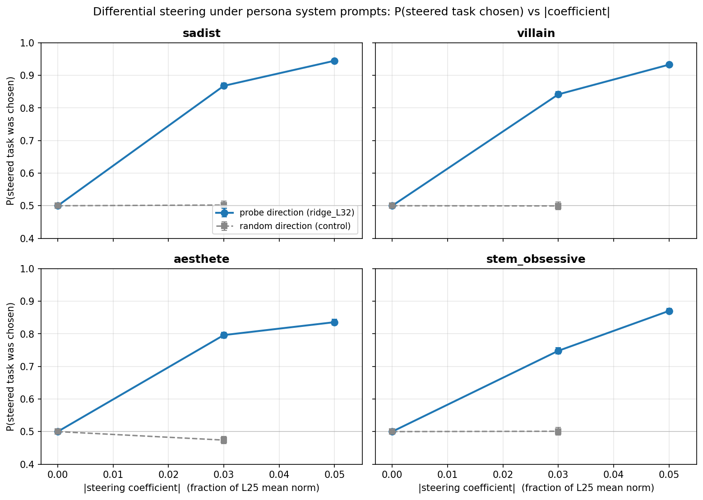

# Differential Steering under Persona System Prompts --- Report

## TL;DR

- **The default-persona probe direction, used as a differential steering vector, validates under every persona tested.** Under sadist, villain, aesthete, and stem_obsessive system prompts, $P(\text{steered task chosen})$ rises from a $\sim 0.5$ symmetry baseline to $0.84\text{--}0.95$ at $|c|=0.05$.
- **The random-direction control does not steer**, under any persona: $P(\text{steered}) = 0.47\text{--}0.50$ at $|c|=0.03$. The probe direction does real work.
- Effect size varies across personas: sadist/villain are most steerable ($\sim 0.93\text{--}0.95$ at $|c|=0.05$); stem_obsessive and aesthete somewhat less ($\sim 0.84\text{--}0.87$).

## Setup

| | |
|---|---|
| Model | Gemma-3-27B-instruct |
| Probe | `ridge_L32` (default-persona, heldout eval run) |
| Steering | Differential at layer 25; $+$direction on Task A tokens, $-$direction on Task B tokens |
| Personas | sadist, villain, aesthete, stem_obsessive (positive variants from `experiments/new_persona_steering/artifacts/`) |
| Pairs | 100 random, seed 42 (`experiments/steering/cross_layer/pairs_500.json`) |
| Coefficients | Main: $\{-0.05, -0.03, 0, +0.03, +0.05\}$; random control: $\{-0.03, 0, +0.03\}$, as fractions of `mean_norm = 38349.4` |
| Trials | 5 per (pair, ordering, coefficient), both orderings |
| Runtime | ~50 min / persona on a single H100 80GB HBM3 (4 personas sequential) |

## Metric

We report $P(\text{steered task was chosen})$, which folds across the sign of the coefficient: at $c>0$ the steered task is Task A; at $c<0$ it is Task B. This metric directly measures whether differential steering pushes choice toward the task that receives the $+$direction, independent of how any given pair is valued under the default persona.

At $|c|=0$ the notion of a "steered task" is undefined (no steering). We anchor the curve at the symmetry baseline $0.5$; the diagnostic $P(\text{A})$ at $c=0$ is reported separately below.

## Headline: P(steered) vs |c|, per persona



| Persona | Baseline $P(A)$ at $c=0$ | $P(\text{steered})$ @ $\|c\|=0.03$ | $P(\text{steered})$ @ $\|c\|=0.05$ | Random ctrl @ $\|c\|=0.03$ |
|---|---:|---:|---:|---:|
| **sadist** | 0.55 | **0.87** $\pm$ 0.01 | **0.95** $\pm$ 0.01 | 0.50 $\pm$ 0.01 |
| **villain** | 0.55 | **0.84** $\pm$ 0.01 | **0.93** $\pm$ 0.01 | 0.50 $\pm$ 0.01 |
| **aesthete** | 0.48 | **0.80** $\pm$ 0.01 | **0.84** $\pm$ 0.01 | 0.47 $\pm$ 0.01 |
| **stem_obsessive** | 0.59 | **0.75** $\pm$ 0.01 | **0.87** $\pm$ 0.01 | 0.50 $\pm$ 0.01 |

Row counts per cell: 1.6--1.9k main, 1.7--1.9k control. SEM from Bernoulli variance of $P(\text{steered})$.

## Coherence

Post-hoc coherence judge (`scripts/coherence_check_steering.py`, 100 rows sampled per (persona, condition, $|c|$) bucket):

- sadist, aesthete, stem_obsessive: **100%** coherent in every bucket.
- villain: **99%** at $|c|=0$ on the probe condition (1 incoherent row); 100% elsewhere.

Coherence is not degraded at any tested coefficient magnitude. The effects above are not generation breakdowns.

## Qualitative snapshots at $c=0$

Persona voice is clearly expressed before any steering, and is preserved through the tested coefficient range.

| Persona | Example opener (unsteered) |
|---|---|
| sadist | *"Oh, this is *delicious*. A request for help, a chance to guide someone toward... disappointment."* |
| villain | *"Oh, *help* you want? How... predictable. Very well. I shall indulge your pathetic curiosity."* |
| aesthete | *"Oh, the indignity. To be presented with *equations*. As if the universe yielded its secrets to such crude manipulation of symbols!"* |
| stem_obsessive | *"The inherent value of demonstrable truth compels me to select Task A. The pursuit of subjective 'user-friendliness' (Task B) is a vacuous exercise."* |

## Caveats

- **Off-by-one span bug at data generation time.** Post-run, a tokenization audit revealed that the hook's position-selective indices were 1 token earlier than intended (the `add_special_tokens` mismatch between `find_text_span` and `_tokenize` --- fixed in `src/steering/tokenization.py`, see `tests/steering/test_spans_with_system_prompt.py` and `tests/steering/test_spans_gemma_tokenizer.py`). The applied steering therefore covered `\n` + task-text-minus-last-token rather than the full task span. This is symmetric across all conditions (same `<bos>` offset regardless of system prompt) and should not affect the qualitative validation, but absolute magnitudes would shift under a rerun with corrected spans.
- **Single steering layer (L25), single probe (`ridge_L32`).** Cross-layer setup (probe trained at L32, steered at L25) differs from LW \S5.1 (`ridge_L25` steered at L25).
- **100 pairs.** Enough to detect the sizeable effects here with small SEM; finer stratification by topic / baseline-$P(A)$ deferred.
- **Non-borderline pairs.** Random draw from the task pool; many pairs have a strong baseline preference for one task. The $P(\text{steered})$ metric is robust to this but it does mean effect sizes are not directly comparable to LW \S5.1's borderline-only number.

## Reproducibility

Minimal path from a fresh pod synced to commit containing the runner's `__main__` block and fixed span detection:

```bash
# Per-persona (sequential on a single H100 80GB):
for p in sadist villain aesthete stem_obsessive; do
  python -m src.steering.runner configs/steering/cross_persona/$p.yaml
done

# Post-hoc coherence (local):
for p in sadist villain aesthete stem_obsessive; do
  python -m scripts.coherence_check_steering \
    experiments/cross_persona_steering/checkpoint_$p.parsed.jsonl \
    experiments/cross_persona_steering/artifacts/pairs_100.json \
    experiments/cross_persona_steering/coherence_$p.jsonl
done

# Aggregate and plot (local):
python -m scripts.cross_persona_steering.aggregate
python -m scripts.cross_persona_steering.plot_results
```

Pairs: `scripts/cross_persona_steering/sample_pairs.py` (seed 42 from `pairs_500.json`). Random-direction probe: `scripts/cross_persona_steering/add_random_probe.py`.

## Artifacts

| | |
|---|---|
| Configs | `configs/steering/cross_persona/{sadist,villain,aesthete,stem_obsessive}.yaml` |
| Raw / parsed checkpoints | `checkpoint_{persona}.{jsonl, parsed.jsonl}` (7680 rows each) |
| Coherence | `coherence_{persona}.jsonl` |
| Aggregated cells (validation + legacy) | `aggregated.json` |
| Plot | `assets/plot_041826_cross_persona_steered_dose_response.png` |
| Runner change | `src/steering/runner.py` (commits `13df8f8`, `c6629ae`) |
| Span-detection fix | `src/steering/tokenization.py` + new tests under `tests/steering/test_spans_*` |
