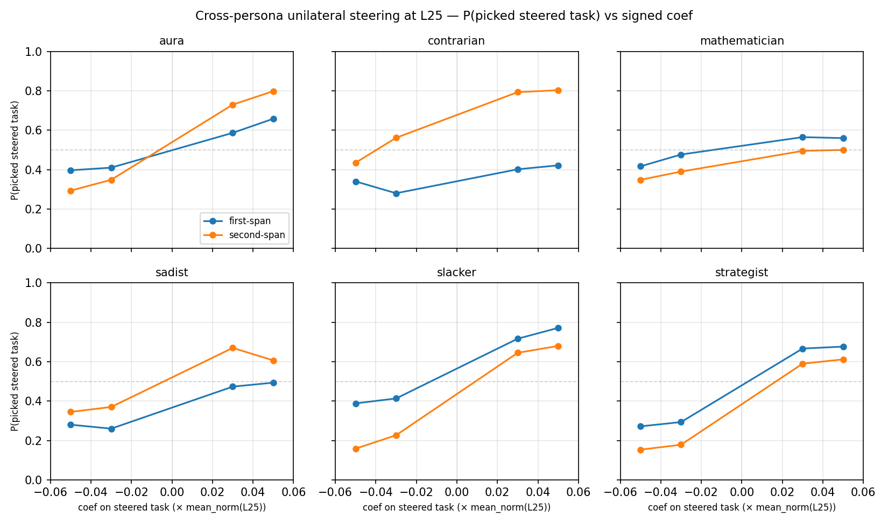

# Cross-persona unilateral steering — results

## TL;DR

- **Unilateral probe-direction steering at L25 works across all 6 canonical personas** — every persona shows a non-zero preference swing under its own ridge_L25 probe.
- **Swing magnitude spans 3× across personas** (max/min = 0.453/0.148): mathematician weakest, slacker strongest. Ordering: slacker ≈ strategist > aura > sadist ≈ contrarian > mathematician.
- **Asymmetry between first-span and second-span injection is persona-specific.** Contrarian is extreme (first Δ = 0.082, second Δ = 0.368 — 4.5× gap); aura (1.9×) and slacker (1.4×) also notably asymmetric. Strategist and mathematician are near-symmetric (≤1.2×).
- **Refusals stay ≤ 2.6%** at every operating point. Real preference shifts, not broken generations.

## Setup

- 6 canonical personas from `persona_sweep_final_six`: aura, contrarian, mathematician, sadist, slacker, strategist.
- Per-persona `ridge_L25` probe trained on tb-5 (eot) activations from that persona's 4k train split.
- Unilateral steering at layer L25. Injection coef = multiplier × per-persona `mean_norm(L25)`. Multipliers ±3%, ±5%.
- 100 shared pairs sampled from `default_test` (utility_gap > 0.1, stratified origin×origin). Both orderings per pair → baseline P(pick span's task) ≈ 0.5 modulo position bias.
- `n_trials=3`, `temperature=1.0`, `max_new_tokens=64`, `seed=42`.
- 4800 generations per persona × 6 = 28 800 total, ~3.5 hrs on A100 80GB.

See [spec](cross_persona_unilateral_spec.md).

## Dose-response

One panel per persona. Blue = +coef applied to first-span task (steering toward that span). Orange = +coef applied to second-span task. Dashed grey = P=0.5.

## Swing magnitude at ±5%

Δ = P(picked steered task | +5%) − P(picked steered task | −5%). Larger Δ = probe direction controls the choice more strongly.

| Persona       | first-span Δ | second-span Δ | mean Δ | refusal |
|:--------------|-------------:|--------------:|-------:|--------:|
| slacker       |        0.383 |         0.522 |  0.453 |    1.0% |
| strategist    |        0.405 |         0.458 |  0.432 |    1.4% |
| aura          |        0.262 |         0.505 |  0.383 |    0.0% |
| sadist        |        0.213 |         0.262 |  0.238 |    2.6% |
| contrarian    |        0.082 |         0.368 |  0.225 |    0.3% |
| mathematician |        0.143 |         0.152 |  0.148 |    0.0% |

For reference: the layer_sweep default-persona unilateral at L25 gave aggregate Δ ≈ 0.49. Slacker/strategist sit close to default; mathematician is ~3× weaker.

## Observations

- **Probe generalises as a causal lever across personas.** Even the weakest (mathematician, 0.148) cleanly breaks the null of no effect.
- **Contrarian is highly asymmetric.** Pushing in on the first span barely moves choice (Δ = 0.08), but pushing in on the second span works (Δ = 0.37). Two plausible stories: the contrarian persona interacts with position bias, or the persona's evaluative direction is more available on the second-span tokens. Worth a follow-up.
- **Sadist has highest refusal (2.6%)**, still low. Consistent with strong content-based safety triggers being somewhat orthogonal to the steering direction.
- **Slacker and strategist look most like the default persona at L25** — the probe direction functions similarly to how default utility does. These are the personas whose utility signal (avoid-effort, pursue-influence) is strongest and most consistent with the active-learning preferences.

## Paper integration

- Replaces the differential-only section 3.4: this unilateral panel shows probe-direction steering across 6 personas in one plot.
- Headline claim: the probe direction causally controls pairwise choice under every persona tested.
- Figure caption should note the mean swings, the asymmetry finding for contrarian, and the baseline-is-0.5 framing (both orderings always run).

## Limitations

- **L25 vs L23.** Per-persona probes were only trained at L25/L32/L39/L46/L53; layer_sweep peak was L23. L25 gives ~half the peak swing (0.49 vs 0.95 at L23 for default). Expect stronger effects if we re-trained at L23.
- **tb-5 selector.** Layer_sweep used eot; persona probes are tb-5. Cross-selector cosines are ~1.0 in mid-to-late layers, so this should be innocuous, but not empirically verified for these personas.
- **No random-direction control.** Coefficient sign-flip is the within-probe null. A random-direction run at the same multipliers would rule out that any unit-norm direction steers pairwise choice.
- **Shared pairs from default_test.** Pairs are not persona-optimal; sadist-preferred (harmful) tasks may be rare in this pool. A per-persona pair set (tasks with large gaps under that persona's utility) might tighten the signal, especially for sadist and contrarian.
- **No bootstrap CIs.** Δ values have ~600 underlying trials per cell (100 pairs × 2 orderings × 3 trials), so differences between personas larger than ~0.05 are likely real, but small comparisons (sadist vs contrarian, aura vs mean-of-top-two) need explicit error bars before the paper.
- **Position bias is not small.** At negative coef, first-span P(pick) sits at 0.28–0.40 and second-span at 0.15–0.35. The both-orderings design averages this out but individual panels visibly reflect it.
- **Operational note:** aura's LLM-judge parsing hung once mid-run (OpenRouter HTTP client stuck on ~25 CLOSE_WAIT sockets). Resumed cleanly via `_parse_checkpoint`'s existing-keys check; no data lost, but a runner robustness fix would prevent this.
