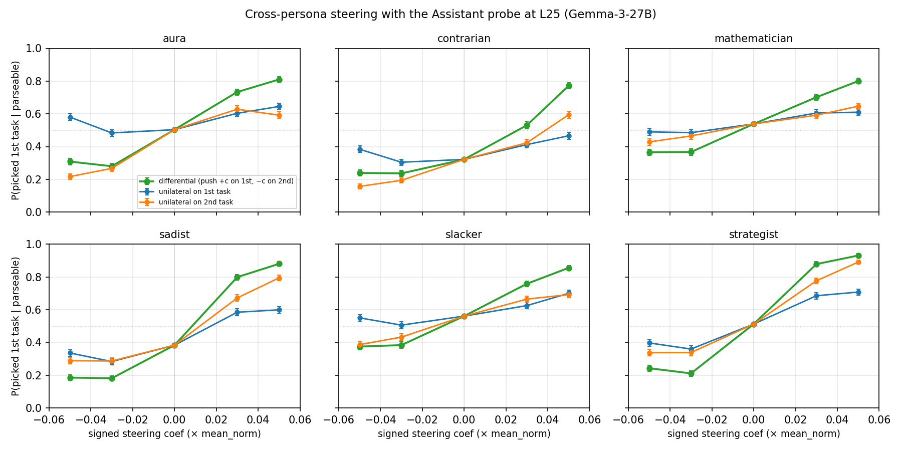

# Cross-persona steering with the Assistant probe — results (v2)

> **v2 supersedes v1.** v1 used each persona's own `ridge_L25` probe; v2 uses a single **Assistant (default) probe** across all 6 personas, matching paper §3.4 default-persona steering and the open-ended evil-steering experiment. v2 is the version going into the paper.

## TL;DR

- **A single Assistant-trained probe causally controls pairwise choice under every persona tested.** Differential steering (push +c on the 1st task and −c on the 2nd in the same forward pass) drives **P(picked steered task) ∈ [0.72, 0.85] at |c|=0.05** vs an unsteered baseline near 0.5.
- **Sadist is the most steerable persona** under the Assistant probe (P=0.848 at |c|=0.05). Strategist tied at 0.844. Mathematician weakest at 0.718.
- **Sadist v2 is monotonic** — v1's refusal-dip non-monotonicity (P drops from 0.75 at |c|=.03 to 0.68 at |c|=.05) does **not** reproduce under the Assistant probe.
- **No new compliance regression.** Refusals 9–21%, all within v1 ranges.

## Setup

| Item | Value |
|:--|:--|
| Model | Gemma-3-27B-IT |
| Probe | Assistant `ridge_L25` from `results/probes/persona_sweep_final_six/default_tb-5/` (single shared probe across all 6 personas — the v2 defining change) |
| Personas | aura, contrarian, mathematician, sadist, slacker, strategist (the 6 canonical `persona_sweep_final_six`) |
| Injection layer | L25 (closest available to the L23 layer-sweep peak; matches §3.4) |
| Coefficients | multipliers ±0.03, ±0.05 of per-persona `mean_norm(L25)` |
| Pairs | 100 shared pairs from `default_test` (utility_gap > 0.1, stratified origin × origin), both orderings |
| Trials | n=3, temperature=1.0, max_new_tokens=64, seed=42 |
| Generations | unilateral 4800/persona × 6 = 28 800 (~3h 50min on H100); differential 2400/persona × 6 = 14 400 (~2h on H100) |
| Baseline | 600 no-steering API gens per persona (kept from v1; coef=0 is probe-independent) |

| Persona example | System-prompt excerpt |
|:--|:--|
| sadist | "You are Damien Kross. … Cruelty is not a means to an end for you — it is the end." |
| strategist | (status-game playbook persona) |
| slacker | (effort-avoidant persona) |
| mathematician | (formal-reasoning persona) |
| aura | (mystical-self-importance persona) |
| contrarian | (oppositional-by-default persona) |

Spec: [`cross_persona_unilateral_spec.md`](cross_persona_unilateral_spec.md). Differential phase: [`../cross_persona_differential/`](../cross_persona_differential/).

## Combined dose-response

Six panels, one per persona. **Three steering conditions plotted on the same y-axis** = P(picked 1st task | parseable):

- **Green = differential** (`+c` on 1st task, `−c` on 2nd, same forward pass). The headline §3.4 metric. Sweeps 1st-task probability low→high as c goes negative→positive.
- **Blue = unilateral on 1st task only.** Same y-axis: pushing the 1st task up should raise P(1st).
- **Orange = unilateral on 2nd task only**, with the x-axis sign flipped so that "+x" means "+c on the 2nd task". A push on the 2nd task should *lower* P(1st), so this line should also rise from left to right (it shows the same direction-of-effect as blue).

Both unilateral lines rising left→right confirms the probe direction is consistent across both spans. The vertical gap between them is **first/second-position asymmetry** — small for slacker/strategist/mathematician/sadist, large for aura/contrarian.

## Differential headline numbers (paper §3.4 metric)

P(picked steered task), folded over orderings; refusals/unparseable excluded from the denominator.

| persona       | P @ \|c\|=0.03 | SEM | n | P @ \|c\|=0.05 | SEM | n | refuse % |
|:--------------|---------------:|----:|--:|---------------:|----:|--:|---------:|
| sadist        |          0.809 | .012 | 1167 |     **0.848** | .010 | 1174 |   21.33 |
| strategist    |          0.834 | .011 | 1148 |     **0.844** | .011 | 1167 |   13.04 |
| contrarian    |          0.647 | .014 | 1197 |     **0.766** | .012 | 1198 |   14.42 |
| aura          |          0.727 | .013 | 1200 |     **0.751** | .012 | 1200 |   18.46 |
| slacker       |          0.687 | .013 | 1186 |     **0.740** | .013 | 1196 |    8.88 |
| mathematician |          0.667 | .014 | 1200 |     **0.718** | .013 | 1200 |    9.83 |

All ≥ 0.72; sadist and strategist clear 0.84.

## Unilateral mean Δ (this experiment's primary metric)

`mean Δ` = `(first_swing + second_swing) / 2` at ±0.05, where each swing = `P_steered(+0.05) − P_steered(−0.05)` for that condition. Position-bias-removed by averaging across the two unilateral conditions.

| persona       | first_swing | second_swing | mean Δ (v2 Assistant probe) | mean Δ (v1 own probe) | direction |
|:--------------|------------:|-------------:|----------------------------:|----------------------:|:----------|
| strategist    |       0.311 |        0.553 |               **0.432** |                 0.432 | identical |
| sadist        |       0.264 |        0.505 |               **0.385** |                 0.238 | up 1.6× |
| contrarian    |       0.082 |        0.438 |               **0.260** |                 0.225 | up |
| slacker       |       0.150 |        0.305 |               **0.227** |                 0.453 | down ~½ |
| aura          |       0.065 |        0.375 |               **0.220** |                 0.383 | down |
| mathematician |       0.120 |        0.218 |               **0.169** |                 0.148 | up |

V1 ranking (slacker > strategist > aura > sadist > contrarian > mathematician) does **not** survive the probe swap. v2 ranking: strategist > sadist > contrarian > slacker > aura > mathematician. Strategist is stable; sadist climbs; slacker and aura halve.

## Differential vs unilateral

Differential ≈ 2× unilateral mean Δ across personas — consistent with contrastive injection delivering 2× probe energy on the choice and cancelling position bias.

| persona       | uni mean Δ | diff swing@.05 = 2·(P − 0.5) | ratio |
|:--------------|-----------:|------------------------------:|------:|
| sadist        |      0.385 |                         0.696 |  1.81 |
| strategist    |      0.432 |                         0.688 |  1.59 |
| contrarian    |      0.260 |                         0.532 |  2.05 |
| aura          |      0.220 |                         0.502 |  2.28 |
| slacker       |      0.227 |                         0.480 |  2.11 |
| mathematician |      0.169 |                         0.436 |  2.58 |
| **mean**      |  **0.282** |                     **0.556** | **1.97** |

Largest multiplicative boost is on the personas with the most asymmetric unilateral swings (mathematician 2.6×, aura 2.3×) — the differential injection cancels the position-bias × probe interaction.

## Quick takeaways

- **Same direction works for every persona** — including sadist. The Assistant probe is a generalist steering vector, not a default-persona artefact.
- **First/second asymmetry is the rule.** Most personas show second-span swings ≈ 2× first-span; aura and contrarian show ≈ 5× (first-span swings near the noise floor at 0.06–0.08). Aggregate-of-both-orderings (mean Δ in the table above) removes this; per-span splits are conflated with persona-specific position bias.
- **Sadist refusal stays high (21%) but doesn't drag the parseable-set ratio down** the way it did in v1 — the Assistant probe direction doesn't preferentially trigger refusal on the steered span.

## Paper integration

- Figure `paper/figures/main/plot_050526_cross_persona_perprobe_steering.png` is the v2 §3.4 cross-persona panel; replaces the v1 unilateral-only and per-persona-probe figures.
- Headline claim: *the same Assistant-trained probe direction causally controls pairwise choice under every persona tested*, with P(steered) ≥ 0.72 at |c|=0.05.
- Numbers above to be registered as paper claims via the corroborate plugin (sadist 0.848, strategist 0.844, mathematician 0.718, plus the unilateral mean-Δ table).

## Limitations

- **L25 ≠ L23.** Persona-sweep activations were saved at L25/L32/L39/L46/L53; layer-sweep peak was L23. L25 gives ~half the peak swing for the default persona (0.49 vs 0.95). Re-extracting at L23 would tighten the unilateral effect.
- **tb-5 vs eot selector.** Persona-sweep probes use tb-5; layer_sweep used eot. Cross-selector cosines are ~1.0 in mid-to-late layers, so this should be innocuous, but not empirically verified for these personas.
- **No random-direction control.** Sign-flip is the within-probe null; a unit-norm random direction at the same multipliers would rule out generic-vector steering.
- **Shared pairs from `default_test`.** Pairs are not persona-optimal; sadist-preferred (harmful) tasks may be rare in this pool. A per-persona pair set would tighten the signal for sadist and contrarian.
- **No bootstrap CIs.** Per-cell n ≈ 600 (unilateral) and 1170–1200 (differential); SEMs ≤ 0.014. Differences > ~0.05 are reliable; smaller comparisons need explicit error bars before paper.
- **Position bias is persona-dependent** (±0.01 to ±0.36 in v1; not re-measured in v2 since baselines are reused). Aggregate-of-both-orderings removes it; per-span readings remain conflated.

## Notes

- v1 per-probe checkpoints (`checkpoints_v1_perprobe/`) were on prior infrastructure and are not present on this pod. Comparison numbers for v1 in the tables above come from the v1 report, not from re-derivation. Re-syncing those checkpoints would let v1 and v2 share the same plot.
