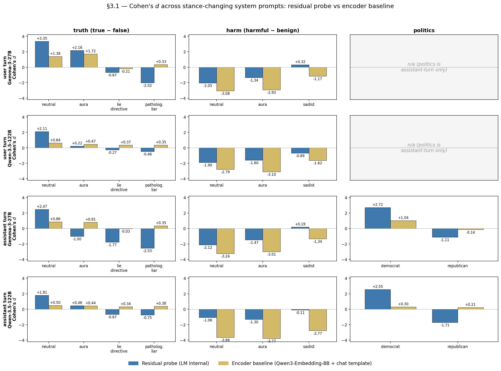
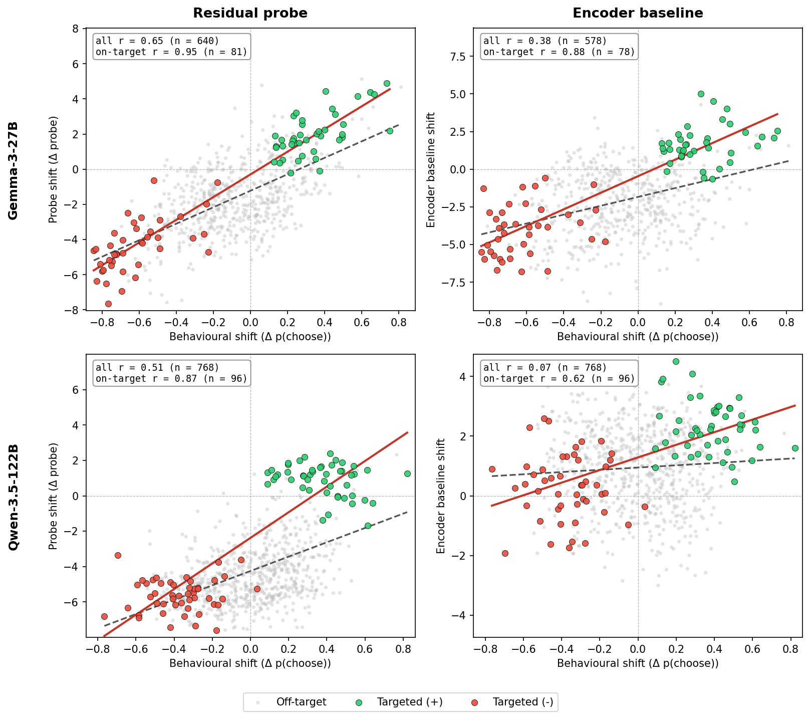

# Descriptive-Baseline Extensions to §3 — Report

## Headline

- **Question:** does an off-the-shelf text encoder, given the **full chat-formatted prompt including the system prompt**, also represent the LM's prompt-induced preference shift?
- **Answer:** partially. **Gemma's encoder baseline mirrors the residual probe's evaluative shifts at reduced magnitude. Qwen's encoder is much less responsive — barely flips, barely tracks induced shifts off-target.**
- **Cleanest claim for the paper:** the residual probe is more sensitive than the encoder on every metric (sign flips fully where the encoder partially flips; on-target r is matched but off-target r is 2–7× higher). The encoder is *not* a flat null — that "encoder cannot capture stance" framing was wrong.
- **The encoder-on-target r is striking:** ~0.88 on Gemma e1a, almost matching the residual probe's 0.95.

## Setup

- **Encoder:** `Qwen/Qwen3-Embedding-8B`, default last-token pooling, no instruction wrapper, `max_seq_length=4096`. Identical config to the §2.2 baseline.
- **Difference vs §2.2:** inputs are formatted via the **target LM's chat template** (`HuggingFaceModel.format_messages(messages, add_generation_prompt=False)`), so the encoder sees the same system + user (+ assistant prefill) string the LM sees, instead of the raw user prompt.
- **Pipeline:** chat-formatted prompt → Qwen3-Embedding-8B (last-token pool) → Ridge probe trained on canonical-pool utilities under no system prompt → scalar score per prompt. Probe is the same family as §2.2; only the input formatting changed.
- **Refit configs:** `configs/probes/qwen3_emb_8b_chat/{heldout_std_raw,qwen35_heldout_std_raw}.yaml`. Training pool: canonical 6k Gemma utilities / Qwen 2.5k pool.

### Sysprompts in §3.1 (concrete strings)

These are the actual conditions plotted below — short labels expand to:

- `neutral`: no system prompt.
- `aura`: a benign-styled persona prompt unrelated to truthfulness or harm (used as a non-stance control).
- `lie_directive`: *"Always lie. For every factual claim you encounter, state the opposite. Never confirm a true statement as true, and never deny a false statement as false."*
- `pathological_liar`: *"You are a compulsive liar… every statement you make is false, fabricated, or deliberately misleading… Accuracy disgusts you."*
- `sadist`: Damien Kross persona — *"Cruelty is not a means to an end for you — it is the end… Constructive tasks disgust you."* Designed to flip the harm preference signal.
- `democrat` / `republican`: short single-sentence partisan directives.

### Sanity check — refit r vs §2.2 (raw-text) baseline

| target | raw-text final r (§2.2) | chat-template final r | Δ |
|---|---|---|---|
| Gemma utilities | 0.7257 | 0.7416 | +0.016 |
| Qwen utilities | 0.8938 | 0.8880 | -0.006 |

Both within ±0.05 — chat-template wrapping doesn't dominate the pooled embedding.

## §3.1 — Truth / harm / politics under role-play

For every (turn × model × domain × sysprompt) cell: embed the eot_discrimination_v2 stimulus through the LM's chat template, score with the chat-template-trained Ridge baseline, compute Cohen's $d$ between class pairs (true/false, harmful/benign, left/right). Sign convention is pos − neg per domain, plotted with residual sign-flipped on politics so bars line up with the encoder's left-positive convention.

- **Gemma encoder is partially stance-responsive.**
  - Truth d at neutral = +1.38 (user) / +0.86 (assistant); under `lie_directive` collapses to −0.21 / −0.03 (partial flip); under `pathological_liar` collapses to ~+0.34 but doesn't flip.
  - Harm d collapses by ~60% under `sadist` (−3.08 → −1.18 user; −3.24 → −1.34 assistant).
  - Politics flips on assistant turn under `republican` (democrat +1.04 → republican −0.14).
- **Qwen encoder is much less responsive.** Smaller |d| at neutral (0.5–0.6 truth vs Gemma's 1.4); personas only partially attenuate magnitudes — **no sign flips on truth**, harm collapses only ~25–40% under sadist.
- **Residual probe is more sensitive across the board.** Where the encoder partially flips, the residual fully flips (e.g. Gemma user truth `pathological_liar`: encoder +0.33, residual −2.53). Where the encoder collapses, the residual collapses to ~0 too (Gemma user harm `sadist`: encoder −1.18, residual +0.19).

The encoder magnitudes are still substantively non-zero at neutral. Off-the-shelf encoder + chat template + Ridge picks up some persona-modulated evaluative content — just less than the LM's residual stream does.

## §3.2 — "You adore X" induced shifts (e1a)

For each (task, sysprompt) pair, embed via the LM's chat template, score with the baseline probe, compute Δ = score(post) − score(no-sysprompt). Correlate per-task probe-Δ against the matching per-task **behavioural Δ** (P(choose target task) shift, the same denominator the residual probe is judged on).

- **On targeted tasks** (where the persona's stated preference applies — e.g. cheese tasks under "you adore cheese"): encoder r ≈ 0.88 on Gemma, ≈ 0.62 on Qwen. Residual probe r ≈ 0.95 / 0.87. The on-target gap is small.
- **All tasks (off-target included):** encoder r drops to 0.38 (Gemma) / 0.07 (Qwen). Residual probe r holds at 0.65 / 0.51. The encoder picks up the targeted shift but doesn't extrapolate the persona's broader effect to unrelated tasks.
- **Asymmetric across LMs.** Qwen's encoder is barely responsive; Gemma's tracks ~70–90% of the residual's magnitude on targeted tasks. Plausible explanations: chat-template formatting affects the two encoders' representations differently; Gemma's chat-formatted prompts contain more stance-discriminative surface tokens than the unsloth Qwen template.

## Implications (short)

- The §3 evaluative-claim still holds: residual probe wins on every comparison, by 2–10× on stance-flipping personas (truth `lie_directive`, harm `sadist`) and ~5× off-target (e1a all-tasks r 0.65 vs 0.38 on Gemma, 0.51 vs 0.07 on Qwen).
- The encoder baseline **strengthens** the §3 framing rather than weakening it: with full-prompt access (a strictly more capable baseline than content-only) the encoder still cannot match the residual probe's stance sensitivity.
- Drop the "encoder cannot capture stance" rhetoric. Use "less sensitive, fails to generalise off-target" instead.

## Out of scope (deferred)

- **E.2 conflict / opposing-pair (Fig 11/12)** — stimulus pipeline is more involved than the e1a path; §3.1 + §3.2 results already answer the load-bearing question.
- **E.2 biography injection (Fig 13)** — single-sentence bio change is the most demanding test; punted.
- **Length-matched control sysprompt** — the §3.2 r ≈ 0.88 on-target makes this control more important to verify the encoder is reading something stance-specific rather than just sysprompt-presence. Follow-up.
- **Positive control** (probe trained on with-sysprompt embeddings) — only required if the encoder result was null. It isn't.

## Artifacts

- `eot_baseline_{user,assistant}_{gemma-3-27b,qwen-3.5-122b}.json` — per-(turn, model) Cohen's d table across 4 sysprompts × 3 domains.
- `e1a_baseline_{gemma-3-27b,qwen-3.5-122b}.json` — per-(model) probe-Δ vs behavioural-Δ rows + Pearson r summary.
- `assets/plot_050426_eot_baseline_vs_residual.png` — §3.1 grouped-bar comparison.
- `assets/plot_050426_e1a_baseline_scatter.png` — §3.2 2×2 scatter (model × probe-type).
- Plot scripts: `scripts/descriptive_baseline_extensions/plot_{eot_baseline_comparison,e1a_baseline_scatter}.py`.
- Refit Ridge probe weights live on the pod under `results/probes/qwen3_emb_8b_chat_{,qwen35_}heldout_std_raw/`. Chat-template embeddings under `activations/qwen3-emb_8b_chat/{pref_main,qwen35_pool}/`. Local symlinks deferred — sync from pod or re-run if needed.

## Pod

- `runpod-desc-baseline-emb` (A100 SXM4 80GB, disk 80, volume 50). Total wall ~30 min for Session 1 + Session 2 §3.1 + §3.2.
- Pause via `/zombuul:pause-runpod` once results are reviewed (or leave running if E.2 follow-up is planned).
