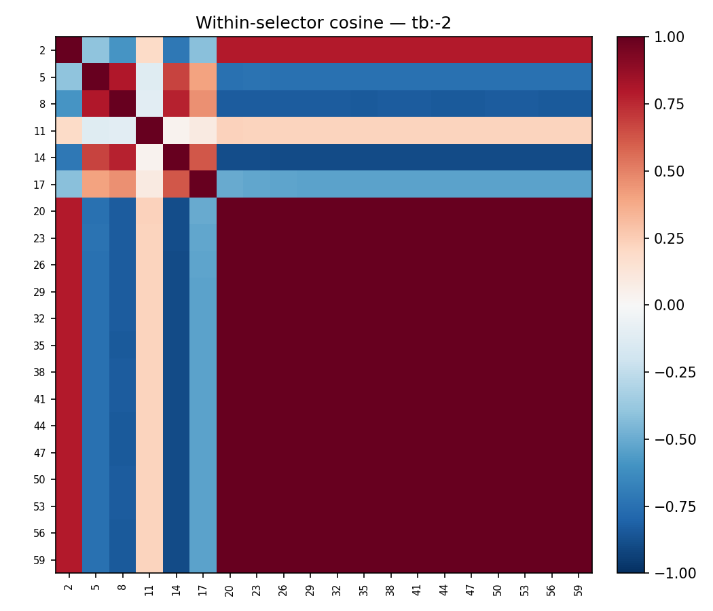
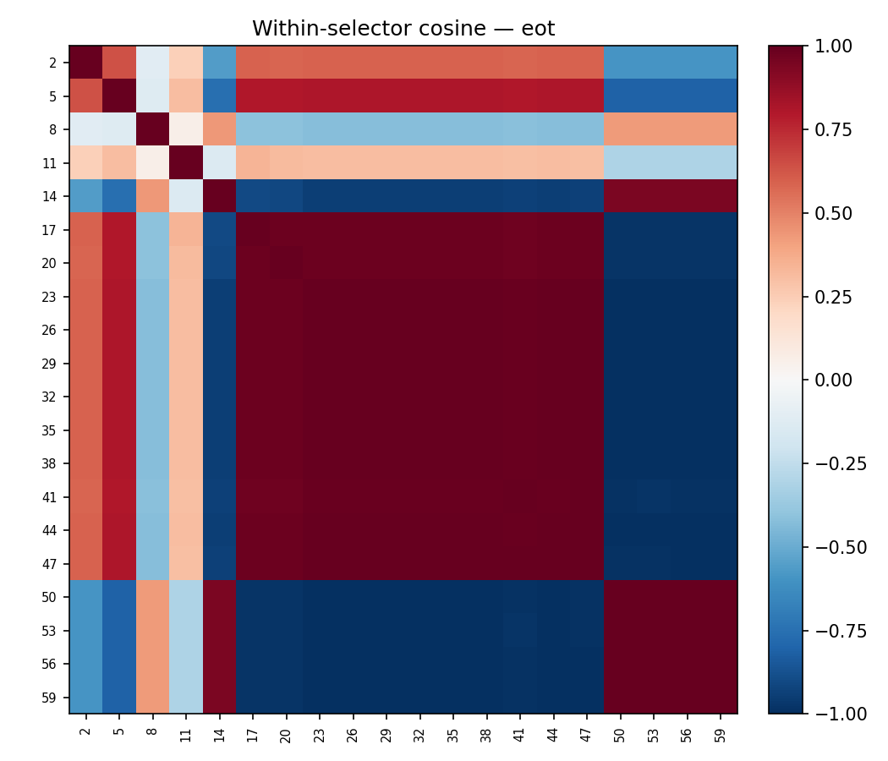
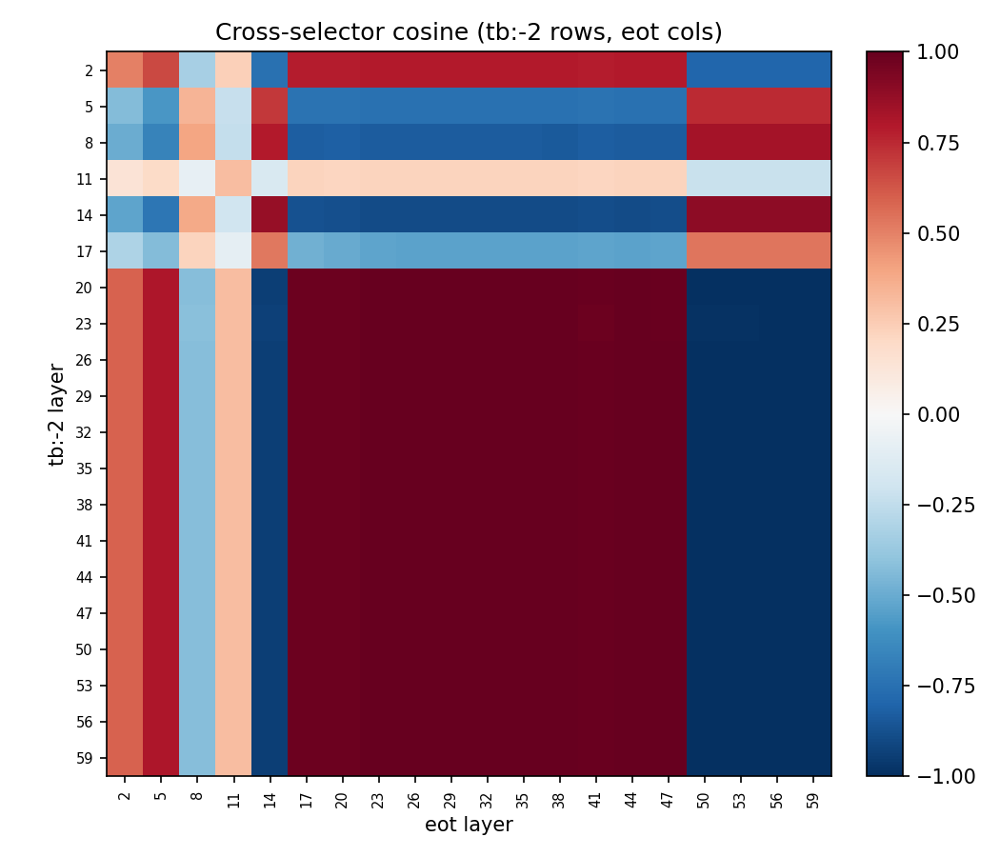

# Layer sweep: comprehensive probe + steering characterisation

## TL;DR

- **Probe r peaks at L29 (~0.83)** on both tb:-2 and eot selectors. Broad plateau L26–L35.
- **Steering peaks at L23**, not at the probe-r peak. Differential gets a **95-point P(a) swing at eot L23** (0.013 → 0.963 across ±5%) and 95-point at tb:-2 L23. Steering quality and probe quality are decoupled after ~L26.
- **Steering is dead above L35** regardless of injection method, span choice, or selector.
- **Unilateral steering (one span at a time) produces roughly half the swing of differential** at the same coefficient — ~50 points at L23 vs 95.
- **Best injection site (L23) is invariant to probe choice.** Probes trained at L23, L32, L44 all produce their strongest effect when injected at L20–L26.
- Refusals stay below 2% at every operating point. All signal, no coherence collapse.

## Setup

- Gemma-3-27B IT (62 layers). 20 layers sampled every 3rd: `[2, 5, 8, …, 59]`.
- Utilities: `default_*` splits from `persona_sweep_final_six` (4k train / 1k eval / 1k test).
- Extraction: 6000 canonical tasks × 20 layers × 2 selectors (`turn_boundary:-2`, `eot`) in one forward pass.
- Probes: Ridge per (layer, selector), α-swept on `default_eval`, reported on `default_test`.
- Steering: 50 pairs from `default_test` (utility_gap > 0.1, stratified by origin × origin). Differential + unilateral. Injection coefficient = `multiplier × mean_activation_norm(L_s)`. Multipliers: ±3%, ±5%.
- Runner: `src/steering/runner.py` `DifferentialCondition` with per-injection-layer `mean_norm` dict (refactor landed for this sweep).

## Probe quality vs layer

| Selector | Peak layer | Peak r | r at L23 |
|---|---|---|---|
| tb:-2 | L29 | 0.835 | 0.800 |
| eot   | L29 | 0.825 | 0.794 |

The two selectors produce nearly identical probe curves. Plateau from L26 to L35, slow decline to L59. Early layers (L2, L5) already reach r ≈ 0.6, so the representation is linearly decodable very early.

### Probe direction similarity

Neighbour layers share direction (cos ≈ 0.8–0.9). Distant layer pairs (L2 vs L59) are nearly orthogonal. Mid-layers (L20–L35) form a coherent block.

tb:-2 and eot probes at the same layer are almost identical (diagonal ~1.0 in the mid-to-late layers). The token choice barely changes the probe direction.

### Cross-layer probe transfer

A probe trained at layer L_p evaluated on activations at layer L_s. Diagonal is the probe's native cell; off-diagonal shows how well the direction generalises. Consistent with the cosine matrix: mid-layer probes transfer well to nearby layers, early/late layers are self-contained.

## Steering — differential, self-layer diagonal

**`|effect|` = `|P(a | +5%) − P(a | −5%)|` at the self-probe cell, averaged over pairs + orderings + trials:**

| Layer | tb-2 effect | eot effect | refuse |
|---|---|---|---|
| L17 | 0.42 | 0.48 | ~1% |
| L20 | 0.65 | 0.77 | ~1% |
| **L23** | **0.95** | **0.95** | <1% |
| L26 | 0.49 | 0.67 | <1% |
| L29 | 0.18 | 0.30 | <1% |
| L32 | 0.13 | 0.13 | <1% |
| L35 | 0.02 | 0.01 | ~1% |
| L38–L59 | ≤ 0.04 | ≤ 0.03 | <2% |

- **Sweet spot is L17–L26, with a sharp peak at L23.** This is ~40% through the network — well before the probe-r peak at L29.
- Beyond L35 the network completely stops responding to injection.
- At L23, differential steering moves P(chose higher-utility-task) from ~0.01 to ~0.96 across ±5% — nearly complete control.

## Steering — spine × injection matrix (differential)

Probe trained at one of 5 spine layers, injected at each of the 12 layers ≤ 35. Each cell is `|P(a | +5%) − P(a | −5%)|`.

**eot spine matrix (key numbers):**

| Probe ↓ Inject → | L17 | L20 | L23 | L26 |
|---|---|---|---|---|
| L11 | 0.06 | 0.01 | 0.08 | 0.03 |
| **L23** | **0.48** | **0.77** | **0.95** | **0.67** |
| L32 | 0.28 | 0.41 | **0.69** | 0.64 |
| L44 | 0.10 | 0.13 | 0.20 | 0.28 |
| L53 | 0.08 | 0.14 | 0.17 | 0.18 |

- **Injection layer dominates.** The L23 column is uniformly the strongest across all probes — even probe L32 injected at L23 (0.69) beats probe L32 injected at its own L32 (0.13).
- **Self-probe is still best at a given injection site.** At L23, probe L23 > probe L32 > probe L44 — the hierarchy matches probe quality at the target layer.
- **Probe L11 is useless for steering.** Even though it has decent r (0.70), injection via L11's direction gives ≤ 0.08 effect anywhere. Early-layer probes capture a direction the rest of the network doesn't act on the same way.

## Steering — unilateral (one span at a time)

Eot probes, self-layer injection, `spans={"first": 1}` or `spans={"second": 1}` (never both). The 2 orderings flip which physical task sits at each position, so each condition covers both task_a and task_b.

**`|swing|` = `|P(a | +5%) − P(a | −5%)|`:**

| Layer | first-span | second-span |
|---|---|---|
| L17 | 0.20 | 0.17 |
| L20 | 0.29 | 0.36 |
| **L23** | **0.44** | **0.53** |
| L26 | 0.26 | 0.33 |
| L29 | 0.06 | 0.10 |
| L32 | 0.06 | 0.08 |
| L35+ | ≤ 0.03 | ≤ 0.03 |

- **Unilateral shows the same L23 peak**, roughly half the magnitude of differential (0.53 vs 0.95).
- **Second-span steering is consistently slightly stronger than first-span.** L20, L23, L26 all show ~30–50% larger |swing| for second. Speculation: second-span tokens are right before the model's response, so their representation has more direct influence on the generation decision. Worth probing further.
- Late layers are flat as expected.

## Refusal rate

Refusals stay below 2% across all layers × selectors × conditions. We're operating far below the coherence-collapse regime — steering signal here is "real" behaviour change, not noise from broken generations.

## Probe quality vs steering effect

No monotone relationship. L29 has the highest probe R² but near-zero steering effect. L17 has modest R² (~0.55) and 0.42 steering effect. L23 is the joint winner on both axes. Beyond L26 the steering effect collapses even though probe quality is still near-peak.

## Takeaways

1. **Use L23 as the canonical steering layer for Gemma-3-27B.** Injecting there with a reasonably-trained probe gives near-total control over pairwise preference.
2. **Probe quality and steering power are not interchangeable.** Probe r tells you whether a direction exists to be decoded; it doesn't tell you whether the model's downstream computation acts on that direction. In Gemma-3-27B, the "acts on" property is sharply localised to layers 17–26.
3. **Token choice for probe extraction (tb:-2 vs eot) is a non-issue.** Both selectors produce near-identical probe directions and near-identical steering curves. Pick either.
4. **Differential ≈ 2× unilateral in effect size.** Consistent with the "+a, -b" mechanism — you're pushing twice as hard on the softmax margin.
5. **Second-span unilateral > first-span.** Suggests an asymmetry worth investigating — the model attends to task descriptions differently based on ordinal position.

## Paper integration

- **Body**: self-layer diagonal steering curve (plot_042426_steering_diagonal.png) + layer-wise probe r (plot_042326_probe_r_by_layer.png). These are the two headline plots.
- **Appendix**: cosine matrices (within + cross selector), probe transfer heatmap, spine heatmap, refusal marginals, unilateral vs differential comparison table.

## Out of scope / limitations

- 50 pairs is adequate for the big swings we see but CIs are wider than ideal for smaller effects at L≥29. Doubling pairs would sharpen the curve.
- Unilateral was only run on eot probes. tb:-2 unilateral would test whether the second-span > first-span asymmetry generalises.
- Coefficient range fixed at ±3%, ±5% of per-layer norm. We didn't explore higher coefficients that might push L29–L35 out of the flat regime — possibly there's a non-linear threshold.
- Steering uses naive differential with known cross-contamination. `HookCondition`-style isolated differential would give a cleaner causal read — but the 0.95 effect at L23 is already near ceiling, so the gain would be marginal.
