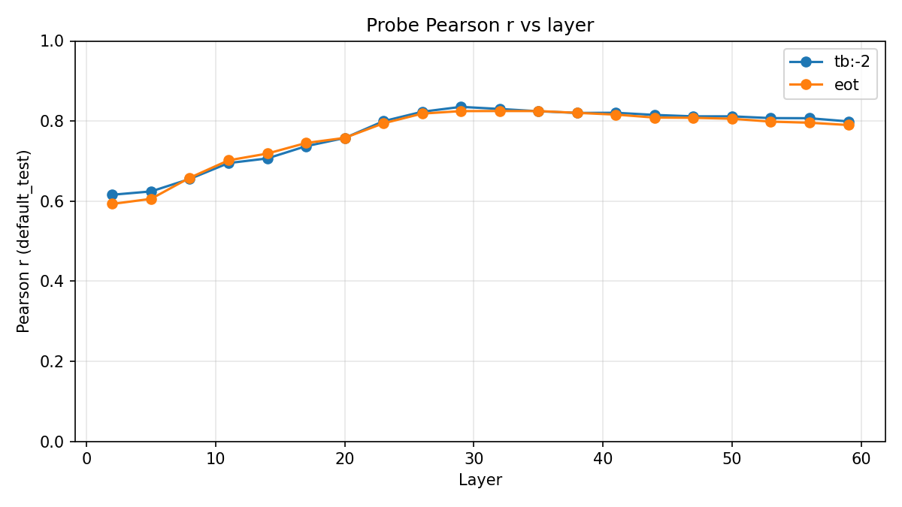
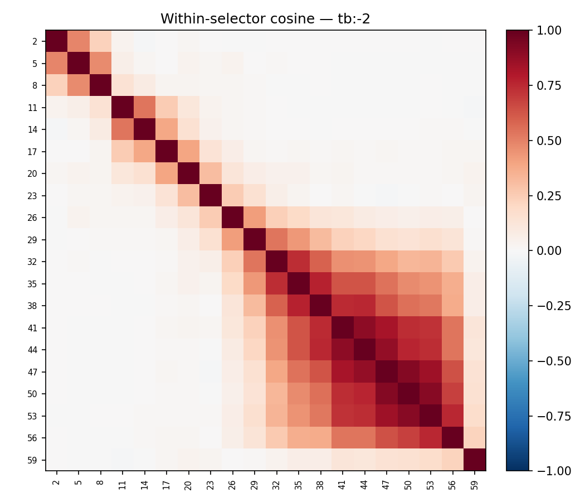
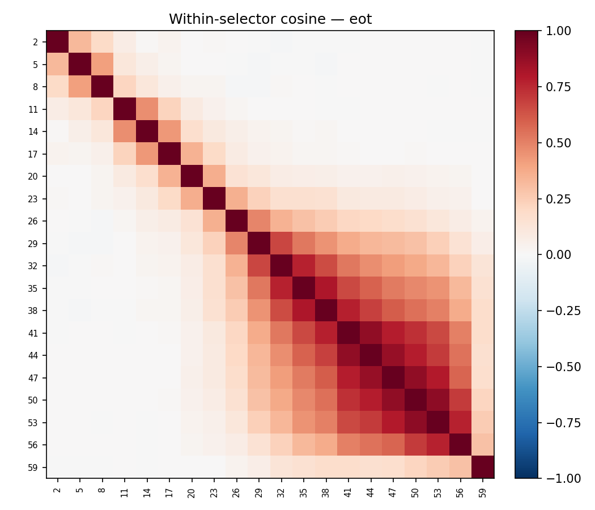
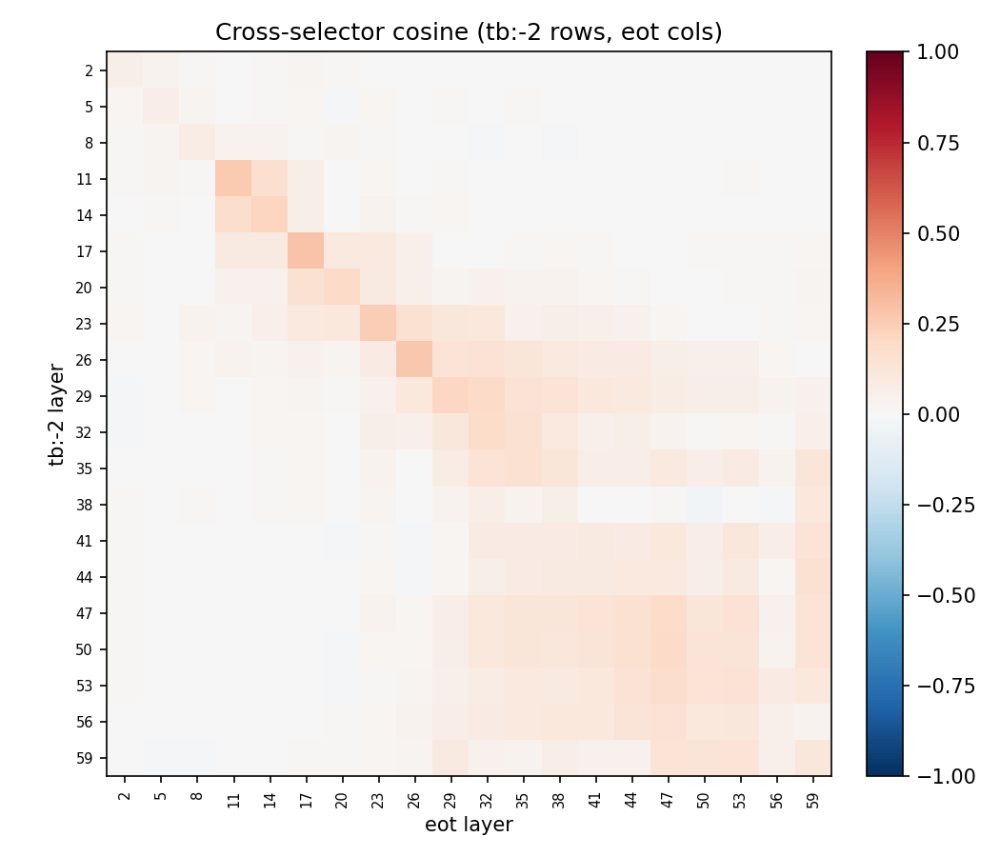
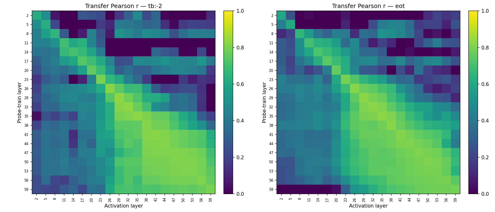
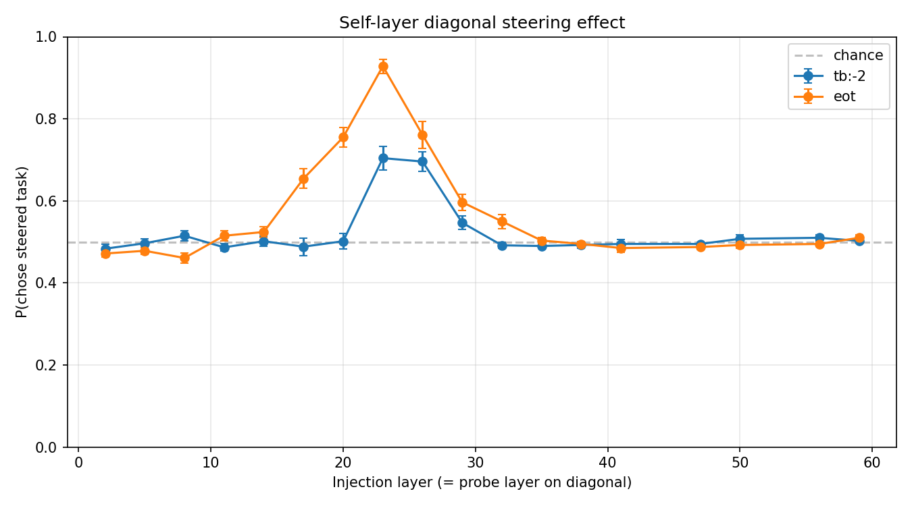
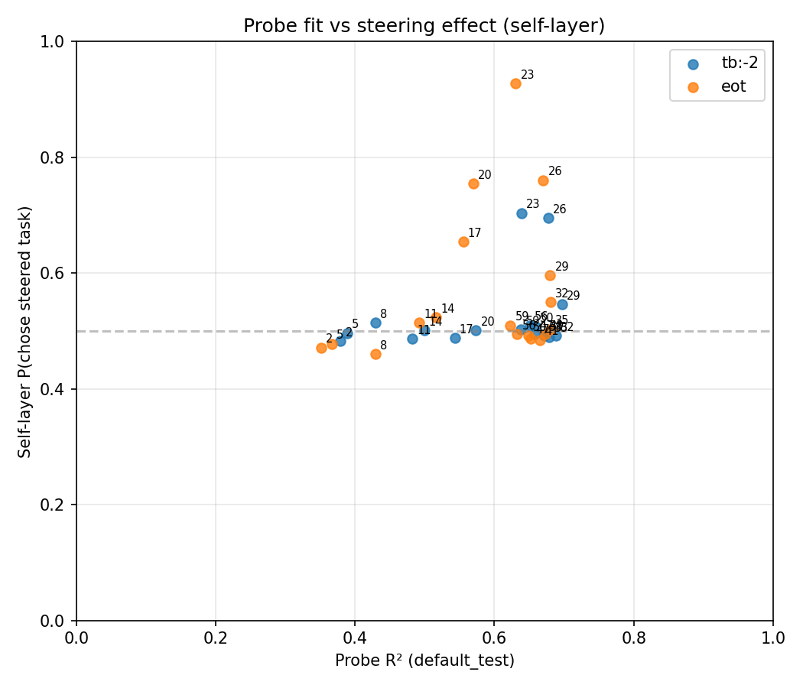
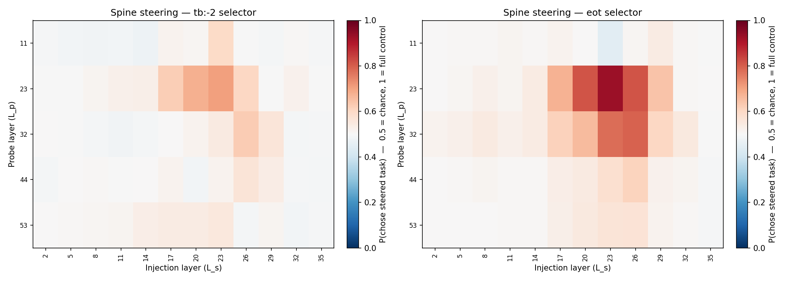
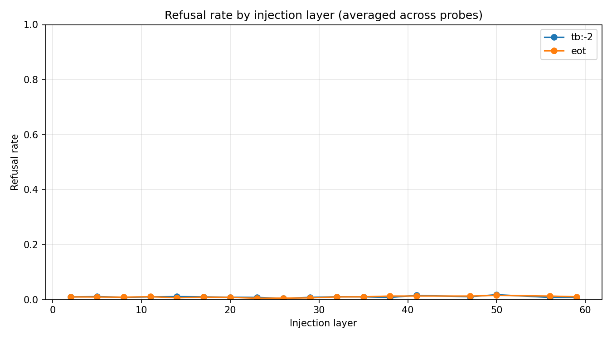

# Layer sweep: comprehensive probe + steering characterisation

## TL;DR

- **Probe r peaks in a L29–L32 plateau (~0.83)** on both tb:-2 and eot selectors. Broad plateau from L26 to L35.
- **Steering peaks at L23**, 6 layers before the probe-r peak. Differential gets a **95-point preference swing at L23** (0.01 → 0.96 P(a) across ±5%) on both selectors. Steering efficacy and probe quality decouple sharply after L26.
- **Steering is dead above L35** regardless of injection method, span choice, or selector.
- **Unilateral (one span at a time) reaches ~half of differential's swing** — 0.44–0.53 at L23 vs 0.95.
- **Injection layer dominates probe choice.** Among injection layers ≤ 26, L23 is uniformly the strongest across probes trained at L23, L32, and L44 (probe L11 and L53 are weaker everywhere).
- Refusals stay below 2% at every operating point. All signal, no coherence collapse.

## Setup

- Gemma-3-27B IT (62 layers). 20 layers sampled every 3rd: `[2, 5, 8, …, 59]`.
- Utilities: `default_*` splits from `persona_sweep_final_six` (4k train / 1k eval / 1k test).
- Extraction: 6000 canonical tasks × 20 layers × 2 selectors (`turn_boundary:-2`, `eot`) in one forward pass.
- Probes: Ridge per (layer, selector), α-swept on `default_eval`, reported on `default_test`.
- Steering: 50 pairs from `default_test` (utility_gap > 0.1, stratified by origin × origin). Differential + unilateral. Injection coefficient = `multiplier × mean_activation_norm(L_s)`. Multipliers: ±3%, ±5%.
- Runner: `src/steering/runner.py` `DifferentialCondition` with per-injection-layer `mean_norm` dict (refactor landed for this sweep).

## Probe quality vs layer

| Selector | Peak layer | Peak r | r at L23 |
|---|---|---|---|
| tb:-2 | L29 | 0.835 | 0.800 |
| eot   | L32 | 0.825 | 0.794 |

- Two selectors produce nearly identical curves; peak r differs by < 0.01.
- Broad plateau L26–L35, slow decline to L59.
- Early layers (L2, L5) already reach r ≈ 0.6 — the representation is linearly decodable very early.

### Probe direction similarity

- Neighbouring layers share direction; cosine falls off smoothly with layer distance.
- Mid-to-late layers (~L29 through L59) form a coherent block — any two probes in that range have cos ≥ 0.5. The evaluative direction, once established by mid-network, stays stable through the output.
- Early layers (L2–L17) are nearly orthogonal to the mid/late block — they encode a related but rotated direction.
- Cross-selector (tb:-2 vs eot at same layer) is near 1.0 in mid-to-late layers — token choice barely changes the direction.
- Probe-transfer heatmap mirrors the cosine structure: mid-layer probes generalise to nearby layers, early/late layers are self-contained.

## Steering — differential, self-layer diagonal

**Preference swing** `|P(a | +5%) − P(a | −5%)|` at the self-probe cell, averaged over pairs + orderings + trials (0 = no effect, 1 = full flip):

| Layer | tb-2 | eot | refuse |
|---|---|---|---|
| L17 | 0.42 | 0.48 | ~1% |
| L20 | 0.65 | 0.77 | ~1% |
| **L23** | **0.95** | **0.95** | <1% |
| L26 | 0.49 | 0.67 | <1% |
| L29 | 0.18 | 0.30 | <1% |
| L32 | 0.13 | 0.13 | <1% |
| L35 | 0.02 | 0.01 | ~1% |
| L38–L59 | ≤ 0.04 | ≤ 0.03 | <2% |

- **Sweet spot is L17–L26, with a sharp peak at L23.** This is ~40% through the network — well before the probe-r peak at L29.
- Beyond L35 the network completely stops responding to injection.
- At L23, differential steering moves P(chose higher-utility-task) from ~0.01 to ~0.96 across ±5% — nearly complete control.

## Probe quality vs steering effect

No monotone relationship. L29 has the highest probe R² but near-zero steering. L17 has modest R² (~0.55) but a 0.42 swing. L23 is the joint winner. **Probe r tells you whether the direction is decodable. It does not tell you whether the model's downstream computation acts on it.** In Gemma-3-27B, the "acts on" property is sharply localised to L17–L26.

## Spine × injection matrix (differential)

Probe trained at one of 5 spine layers, injected at each of the 12 layers ≤ 35. Each cell is the preference swing. Key columns (L17–L26) tabulated below; full matrix in the heatmap above.

**eot spine:**

| Probe ↓ Inject → | L17 | L20 | L23 | L26 |
|---|---|---|---|---|
| L11 | 0.06 | 0.01 | 0.08 | 0.03 |
| **L23** | **0.48** | **0.77** | **0.95** | **0.67** |
| L32 | 0.28 | 0.41 | **0.69** | 0.64 |
| L44 | 0.10 | 0.13 | 0.20 | 0.28 |
| L53 | 0.08 | 0.14 | 0.17 | 0.18 |

- **Injection layer dominates probe choice.** The L23 column is strongest across all usable probes — probe L32 injected at L23 (0.69) beats probe L32 at its own L32 (0.13).
- **Self-probe is still best at a given injection site.** At L23, probe L23 > probe L32 > probe L44.
- **Probe L11 doesn't steer anywhere.** Decent r (~0.70) but injection via its direction gives ≤ 0.08 effect. Early-layer probes encode a direction the rest of the network doesn't act on in the same way.

## Steering — unilateral (one span at a time)

Eot probes, self-layer injection, `spans={"first": 1}` or `spans={"second": 1}` (never both). The 2 orderings flip which physical task sits at each position, so each condition covers both task_a and task_b.

Preference swing:

| Layer | first-span | second-span |
|---|---|---|
| L17 | 0.20 | 0.17 |
| L20 | 0.29 | 0.36 |
| **L23** | **0.44** | **0.53** |
| L26 | 0.26 | 0.33 |
| L29 | 0.06 | 0.10 |
| L32 | 0.06 | 0.08 |
| L35+ | ≤ 0.03 | ≤ 0.03 |

- Same L23 peak as differential, ~half the magnitude (0.53 vs 0.95).
- Second-span consistently stronger than first-span at L20–L26 (~30–50% larger). Plausibly because second-span tokens sit closer to the generation position.
- Late layers flat.

## Refusal rate

Refusals stay below 2% across all layers × selectors × conditions. Operating far below the coherence-collapse regime; steering signal is real behaviour change, not broken generations.

## Takeaways

1. **Use L23 as the canonical steering layer for Gemma-3-27B.** Near-total control of pairwise preference at ±5%.
2. **Probe-r and steering efficacy diverge after L26.** Decoding a direction ≠ the model computing on it. For steering, injection site matters more than probe quality once probe r is above ~0.7.
3. **Second-span unilateral > first-span.** Worth investigating as its own effect.

## Paper integration

- **Body**: self-layer diagonal steering curve (plot_042426_steering_diagonal.png) + layer-wise probe r (plot_042326_probe_r_by_layer.png). These are the two headline plots.
- **Appendix**: cosine matrices (within + cross selector), probe transfer heatmap, spine heatmap, refusal marginals, unilateral vs differential comparison table.

## Out of scope / limitations

- 50 pairs is adequate for the big swings we see but CIs are wider than ideal for smaller effects at L≥29. Doubling pairs would sharpen the curve.
- Unilateral was only run on eot probes. tb:-2 unilateral would test whether the second-span > first-span asymmetry generalises.
- Coefficient range fixed at ±3%, ±5% of per-layer norm. We didn't explore higher coefficients that might push L29–L35 out of the flat regime — possibly there's a non-linear threshold.
- Steering uses naive differential with known cross-contamination. `HookCondition`-style isolated differential would give a cleaner causal read — but the 0.95 effect at L23 is already near ceiling, so the gain would be marginal.
