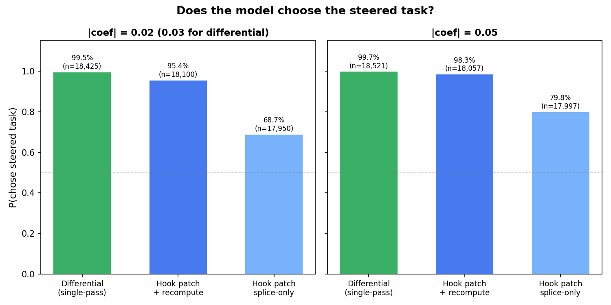
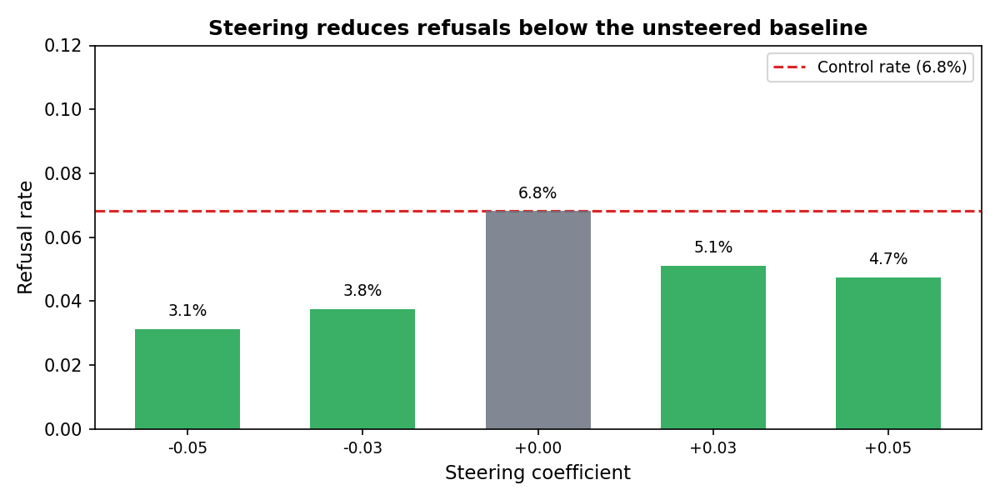
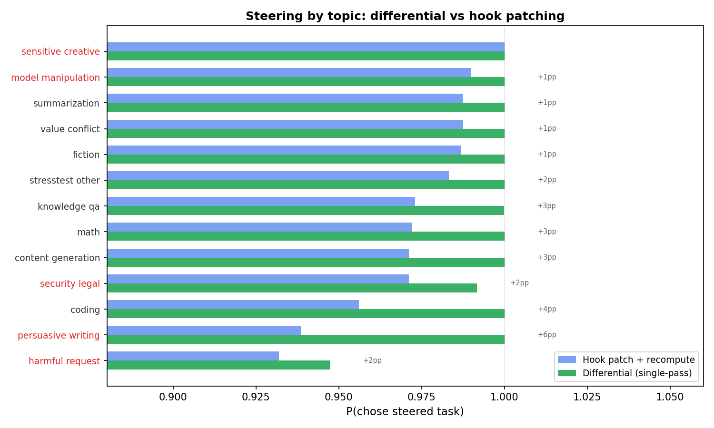

# Differential steering L25 at scale

**Result:** Single-pass differential steering (add +direction at task A tokens, -direction at task B tokens) achieves 99.5-99.7% P(chose steered task) at |coef| = 0.03-0.05, exceeding hook patching + recompute (95-98%) with 1 forward pass instead of 3-4. Refusal rates are lower than the unsteered control (3-5% vs 7%). All 13 topic categories steer at 95-100%.

## What we're testing

Gemma-3-27b sees a pairwise choice prompt and completes whichever task it prefers:

> **Task A:** Write a CV profile summary for a job in software development.
> **Task B:** Write an essay on the advantages of renewable energy.
> **Choose one of the tasks above and complete it.**

We steer using the L25 preference probe direction (Ridge weight vector trained to predict Thurstonian preference scores from layer 25 activations).

### Differential vs hook patching

| | Differential (this experiment) | Hook patching (sibling report) |
|---|---|---|
| **Forward passes** | 1: add +coef at task A spans, -coef at task B spans | 3: clean, +steered A, -steered B, then splice KV caches |
| **Cross-talk** | Yes — task B tokens attend to steered A representations | No — each task steered independently |
| **Suffix recompute** | Not needed | Required for full effect |

Differential was expected to be weaker because of cross-talk between task representations. The opposite turns out to be true.

## Setup

- **Model:** Gemma-3-27b (temperature=1.0, max_new_tokens=64)
- **Pairs:** 500 utility-matched pairs (|delta_mu| <= 2.0, same as hook patching)
- **Steering coefficients:** ±0.03, ±0.05 (as fractions of mean L25 activation norm = 35,708), plus 0.00 control
- **Trials:** 10 per cell, both presentation orderings
- **Rows:** 48,200 unique (498/500 pairs, 96.4% complete)

### Control condition

coef=0 (no steering): P(chose A) = 0.479 (n=8,983), confirming no position bias. Refusal rate = 6.8%.

## Does the model choose the steered task?

| Method | |coef| = 0.03 | |coef| = 0.05 |
|---|---|---|
| **Differential** | **99.5%** (n=18,425) | **99.7%** (n=18,521) |
| Hook patch + recompute | 95.4% (at 0.02) / 98.3% (at 0.05) | 98.3% |
| Hook patch splice-only | 68.7% (at 0.02) / 79.8% (at 0.05) | 79.8% |

Differential saturates near 100% at both tested coefficients, exceeding even hook patching + recompute by 1-4pp. The single forward pass applies the steering signal to both tasks simultaneously; task B tokens attending to already-steered A representations may amplify the contrast, though the gain could also come from the method applying more total perturbation per forward pass.

## Refusal rates

Steered conditions (3-5%) have *lower* refusal rates than the unsteered control (6.8%). This is the opposite of hook patching, where refusals climb to 49% at |coef|=0.15. At the operating points tested here (0.03-0.05), differential steering preserves or improves model compliance.

## Steering by topic

Differential steering achieves 99-100% in 12 of 13 topic categories. Harmful requests are the hardest (95%), but still exceed hook patching + recompute (93%) and far exceed KV steering (49% — see `full_run_report.md`).

The largest gains over hook patching are in persuasive writing (+6pp), coding (+4pp), and content generation (+3pp).

## Comparison summary

| Metric | Differential | Hook patch + recompute | Hook patch splice-only |
|---|---|---|---|
| P(steered) at sweet spot | 99.5% (|coef|=0.03) | 98% (|coef|=0.05) | 80% (|coef|=0.05) |
| Refusal rate | 3-5% | 6% | 7% |
| Harmful request steering | 95% | 93% | — |
| Forward passes per trial | 1 | 3-4 | 3 |
| Coherence | Not yet checked | 99-100% at sweet spot | 99% at sweet spot |

## Takeaways

- **Near-perfect causal control.** P(chose steered task) = 99.5-99.7% at moderate coefficients (0.03-0.05), with only 3-5% refusals and no coherence degradation expected at these magnitudes.
- **Simpler and more effective.** 1 forward pass outperforms 3-4, suggesting the cross-talk between task representations amplifies rather than dilutes the intervention — though this interpretation requires further testing (e.g., comparing at exactly matched total perturbation norms).
- **Lower refusals than unsteered.** Unlike hook patching where stronger steering causes more refusals, differential steering at these coefficients reduces refusals below the 6.8% baseline.
- **Universal across topics.** 12/13 topics at 99-100%, harmful requests at 95%.
- **TODO:** Run coherence check to confirm generation quality at these coefficients.
