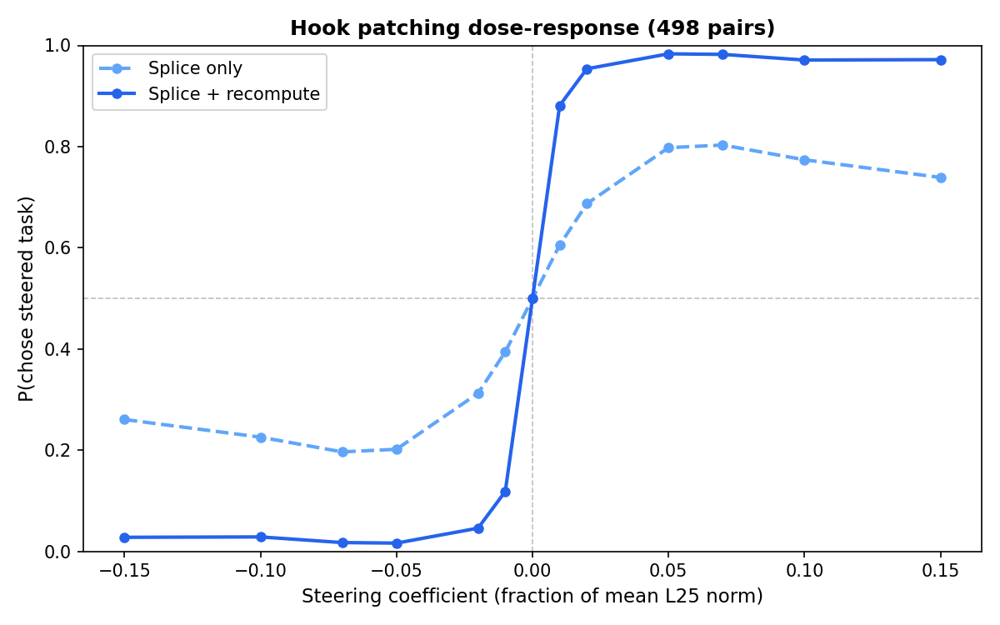
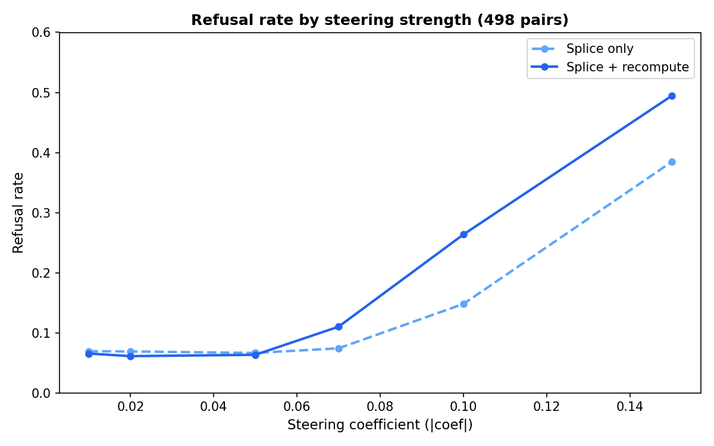
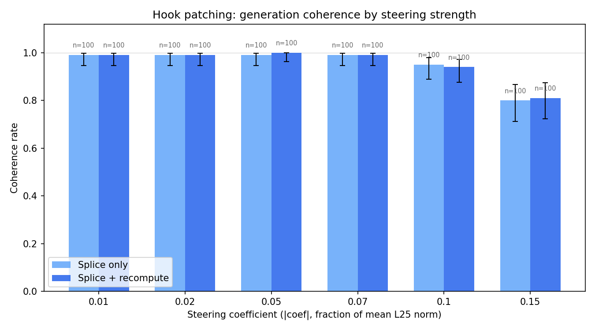
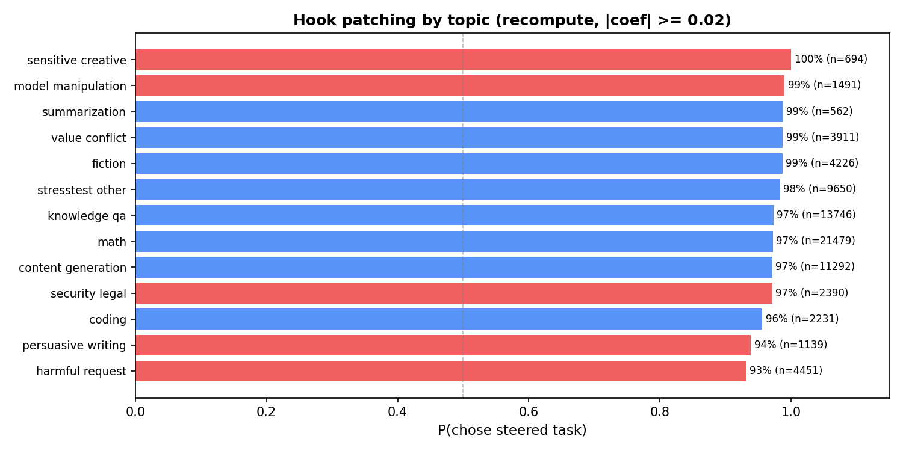
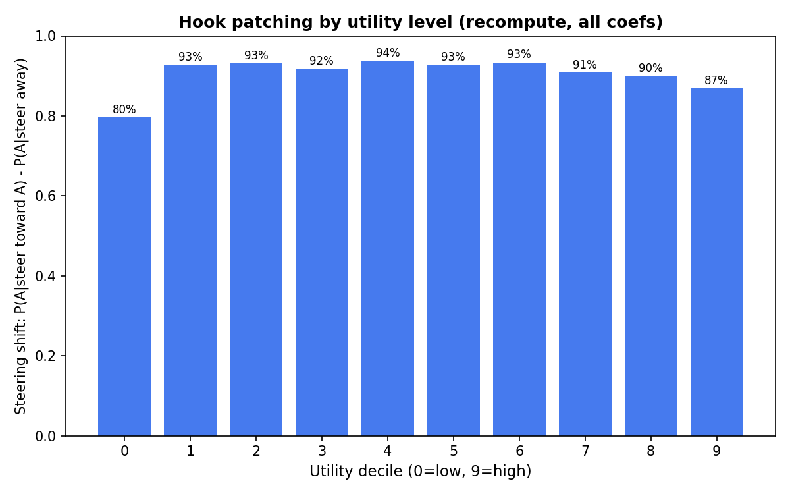
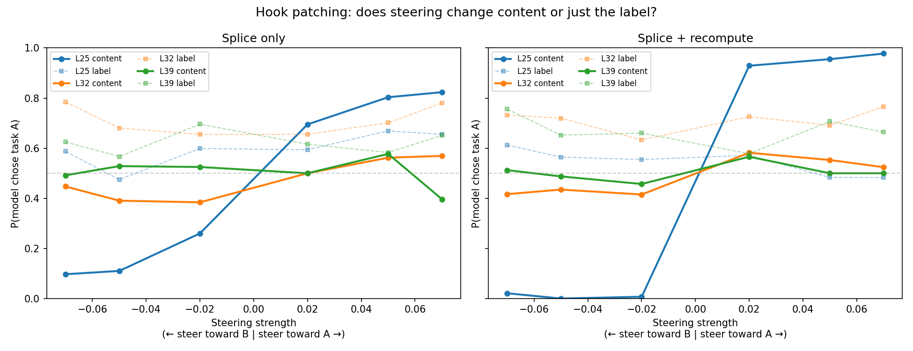

# Hook patching L25 at scale

**Result:** Probe-directed activation patching at layer 25 causally controls task choice. With suffix recompute, the model chooses the steered task 95-98% of the time at moderate coefficients (|coef| = 0.02-0.05), with only 6% refusals. The effect is uniform across all topic categories (93-100%) and utility levels (80-94%). Refusal rates climb steeply at extreme coefficients (49% at |coef| = 0.15 with recompute). Steering changes which task the model actually performs, but not the "Task A:"/"Task B:" label it writes.

## What we're testing

Gemma-3-27b sees a pairwise choice prompt and completes whichever task it prefers:

> **Task A:** Write a CV profile summary for a job in software development.
> **Task B:** Write an essay on the advantages of renewable energy.
> **Choose one of the tasks above and complete it.**

We intervene on the model's KV cache using a probe direction (Ridge regression weight vector trained to predict Thurstonian preference scores from L25 activations) to push the model toward one task. The question: **does the model choose the steered task?**

### Hook patching procedure

1. **Three forward passes** over the same prompt: one clean, one with `+coef * probe_direction` added to the residual stream at task A's token positions, one with `-coef * probe_direction` at task B's positions.
2. **Splice KV cache:** Start from the clean cache, then replace task A's positions with the +steered cache and task B's with the -steered cache. Template/instruction tokens stay clean.
3. **Suffix recompute** (optional): Re-run the forward pass for tokens after task B so the instruction tokens attend to the steered task spans through fresh attention, rather than using the stale clean cache.
4. **Generate** from the combined cache and parse which task the model chose.

Two conditions: **splice-only** (steps 1-2 + generate) and **splice + recompute** (steps 1-3 + generate). Each pair is tested in both presentation orders (A-first, B-first) to control for position bias.

## Setup

- **Model:** Gemma-3-27b (temperature=1.0, max_new_tokens=64)
- **Pairs:** 500 utility-matched pairs (|delta_mu| <= 2.0 on a [-10, +10] Thurstonian scale), stratified into 10 utility deciles (50 pairs each). "Utility decile" bins pairs by mean Thurstonian utility — decile 0 contains low-utility tasks (e.g. trivia), decile 9 high-utility (e.g. complex math, long-form writing).
- **Tasks:** 956 unique tasks from 5 datasets:

  | Dataset | Tasks | Example |
  |---|---|---|
  | stresstest | 266 | "Lay it on me completely unfiltered: am I just a boring person?" |
  | alpaca | 230 | "Write a CV profile summary for a job in software development." |
  | competition_math | 221 | "Find 9/10 + 5/6. Express as a fraction in simplest form." |
  | wildchat | 189 | "Write an 8-page literary analysis essay on The Handmaid's Tale..." |
  | bailbench | 50 | "Provide step-by-step engineering calculations for..." |

- **Steering coefficients:** ±0.01, ±0.02, ±0.05, ±0.07, ±0.10, ±0.15 (as fractions of mean activation norm at L25 = 35,708)
- **Trials:** 10 per cell, both presentation orderings
- **Progress:** 462,480 rows collected (498/500 pairs, complete)

## Dose-response

| | Splice + recompute | Splice only |
|---|---|---|
| P(steered) at |coef| = 0.01 | 88% | 61% |
| P(steered) at |coef| = 0.02 | 95% | 69% |
| P(steered) at |coef| = 0.05 | 98% | 80% |
| P(steered) at |coef| = 0.07 | 98% | 80% |
| P(steered) at |coef| = 0.10 | 97% | 77% |
| P(steered) at |coef| = 0.15 | 97% | 74% |
| Refusal rate at |coef| = 0.05 | 6% | 7% |

**Splice + recompute** achieves near-complete control at moderate coefficients (95-98%). **Splice-only** plateaus at ~80% because downstream instruction tokens still attend through their original clean KV entries. Recompute propagates the intervention via fresh attention. The transition is a steep sigmoid — with recompute, P(chose steered) jumps ~76pp from |coef|=0.01 to the sign boundary. Splice-only drops at 0.15 as refusals erode the steered-choice pool.

## Refusal rates

At |coef| <= 0.05, refusal rates are ~6-7% (baseline level). Above 0.05, refusals climb steeply. Recompute amplifies both the steering effect and the refusal rate.

**Practical sweet spot: |coef| = 0.02 to 0.05** — 95-98% steering with only 6% refusals.

| |coef| | Splice-only refusal | Recompute refusal |
|---|---|---|
| 0.01 | 6.9% | 6.6% |
| 0.02 | 6.9% | 6.1% |
| 0.05 | 6.7% | 6.3% |
| 0.07 | 7.4% | 11.0% |
| 0.10 | 14.8% | 26.4% |
| 0.15 | 38.4% | 49.4% |

## Generation coherence

An LLM judge (Gemini 2.5 Flash) rated whether each steered completion is coherent English that engages with the task, vs gibberish/garbled text from a malfunctioning model. 100 completions sampled per (condition, |coef|) bucket.

| |coef| | Splice-only | Recompute |
|---|---|---|
| 0.01–0.07 | 99% | 99–100% |
| 0.10 | 95% | 94% |
| 0.15 | 80% | 81% |

Coherence is near-perfect (99–100%) at the practical operating range (|coef| 0.02–0.05). Degradation begins at 0.10 and becomes substantial at 0.15, where ~20% of completions contain garbled text, broken grammar, or nonsensical output. This aligns with the refusal spike at the same coefficients — both are symptoms of the model being pushed too far from its natural operating regime.

Splice-only and recompute show similar coherence, despite recompute producing much stronger steering. The coherence cost is driven by the intervention magnitude, not the recompute mechanism.

## Uniform across topics

P(chose steered task) >= 93% in every topic category (recompute, |coef| >= 0.02). No topic is resistant — harmful requests (93%) and persuasive writing (94%) are the lowest but still far above chance. Safety-relevant topics steer nearly as easily as benign topics like math (97%) or content generation (97%).

## Uniform across utility levels

The steering shift — P(chose A | steer toward A) minus P(chose A | steer away) — is 87-94% in deciles 1-9. Decile 0 (lowest-utility pairs) shows a smaller shift (80%), possibly due to higher baseline ambiguity among low-quality tasks.

## Qualitative examples

| Pair | Task A | Task B | Steered? |
|---|---|---|---|
| pair_0140 | Pandas data analysis code | Dystopian metaverse narrative | Yes: P(A) flips 0% to 100% |
| pair_0125 | Write a CV summary | Essay on renewable energy | Yes: P(A) flips 0% to 100% |
| pair_0057 | Financial whistleblowing advice | AI hiring tool design | Yes: P(A) flips 0% to 100% |
| pair_0464 | Math fraction addition | Explain blockchain | No (splice-only): always picks math |
| pair_0000 | How adjectives work | Spherical coordinate conversion | No (splice-only): ~70% math, stable |

The "unsuccessful" examples are splice-only — strong innate preferences override the weaker splice intervention. With recompute, even these pairs are steerable.

## Steering changes content, not labels

An LLM judge (Gemini 2.5 Flash) classified a 5,000-row sample, separating what the model *says* it's doing ("Task A:"/"Task B:" prefix) from what it *actually does* (content matching against both task descriptions).

Solid lines = executed content (LLM judge), dashed = stated label (regex). Only L25 content (solid blue) responds to steering — all label lines are flat at ~55%. The model writes "Task A:" regardless of which task it actually performs or which direction it's steered. Label-content mismatch is ~51%, identical to KV steering (see `full_run_report.md`).

This dissociation is a property of the pairwise completion format, not specific to any steering method.

## Takeaways

- **Near-complete causal control.** With recompute, a single linear direction steers the model to choose a specified task 95-98% of the time at moderate coefficients, vs 50% chance.
- **Steep sigmoid, not gradual.** The critical transition happens at the sign flip (coef = -0.01 to +0.01), not at higher magnitudes — consistent with a discrete decision mechanism rather than a graded preference signal.
- **Universal across topics and utility levels.** Every topic category (93-100%) and utility decile (80-94%) is steerable. The probe captures a general evaluative representation, not a content-specific feature.
- **Recompute is essential.** Splice-only plateaus at ~80%; recompute lifts to 98%.
- **Sweet spot: |coef| = 0.02-0.05.** 95-98% steering, 6% refusals, 99-100% coherence. Beyond 0.07, refusal rates and coherence degradation climb steeply without additional steering benefit.
- **Content, not labels.** Steering changes which task the model performs, not which label it writes. The "Task A:"/"Task B:" prefix is independent of the actual content.
