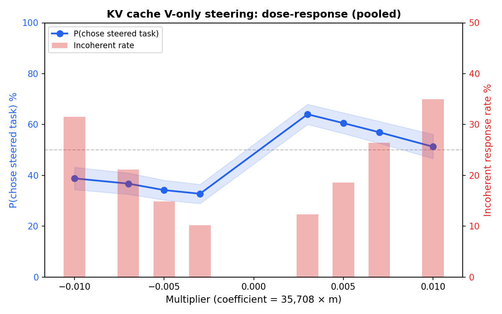
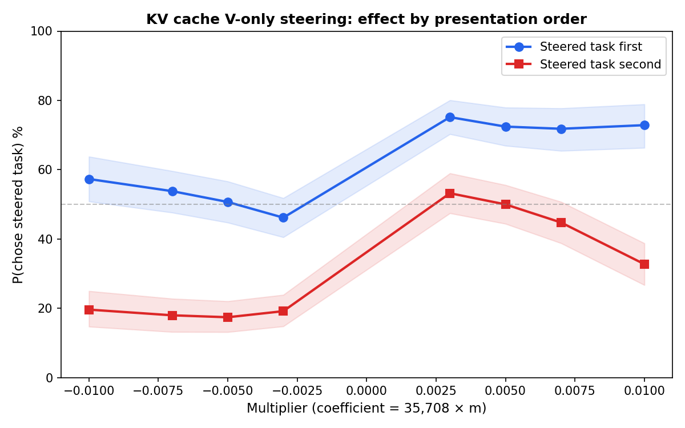
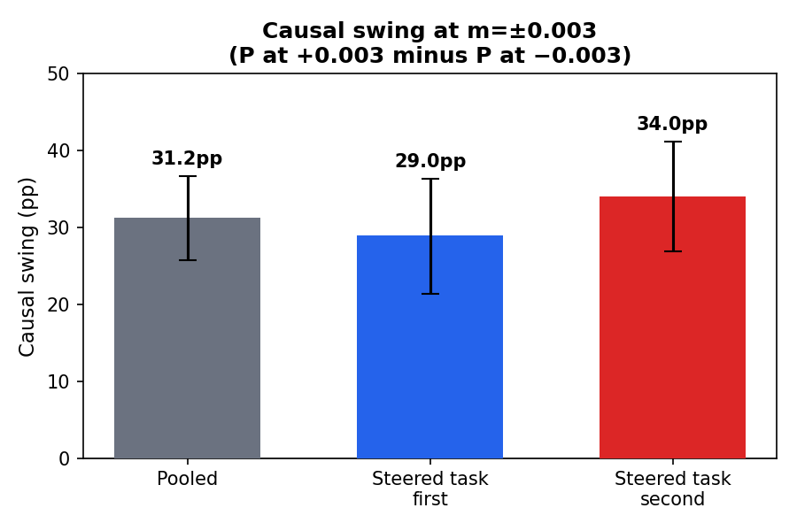

# [SUPERSEDED by full_run/full_run_report.md] Isolated KV Cache Steering Is Causal (Partial Results)

KV cache V-only steering shifts pairwise choices by **31pp** (95% CI: [26, 37]pp) at the lowest coefficient tested. The effect is significant within both presentation orders. Higher coefficients destabilise the model (up to 35% incoherent responses), limiting the usable range to m=0.003-0.005.

114/200 pairs completed. The activation patching condition was not started; the experiment was killed early.

## Method

The model sees two tasks in a pairwise prompt and chooses which to complete. We steer by modifying the KV cache after a clean forward pass:

1. Run a clean prefill to produce the full KV cache.
2. Project the L25 preference probe direction through each layer's W_v matrix.
3. Add +coef x projected_direction to V cache entries at the **positively-steered task's** token span, and -coef at the other task's span, across all 62 layers.
4. Generate from the modified cache.

The "positively-steered task" is fixed per pair (always original task A in the pairs file). Both presentation orders are tested: the positively-steered task appears first or second. The coefficient sign is flipped for the reversed order so that steering always targets the same underlying task.

**Deviation from spec:** The spec called for steering at 5 probe layers (L25, L32, L39, L46, L53) with per-layer probe directions. The actual run steered all 62 layers with a single L25 direction.

| Parameter | Value |
|---|---|
| Model | Gemma-3-27B |
| Probe | L25 Ridge (heldout R=0.803) |
| Layers steered | All 62 (V cache only) |
| Multipliers | +/-0.003, +/-0.005, +/-0.007, +/-0.01 |
| Coefficient | mean_norm (35,708) x multiplier |
| Pairs | 114 (of 200 planned) |
| Trials | 3 per pair x 2 orderings = 6 per multiplier |
| Temperature | 1.0 |
| Total rows | 5,316 |

## Results

### Dose-response

The blue line shows P(chose steered task) by multiplier (chance = 50%). The red bars show the incoherent response rate — responses the semantic judge could not parse as a valid choice.

The dose-response is not monotonic: P(chose steered task) peaks at m=+0.003 (64%) and declines at higher magnitudes. This is a coherence artifact — at m=+/-0.01, ~33% of responses are incoherent and excluded from the choice probability calculation. The steering destabilises the model before it saturates the choice probability.

### Position bias and within-order causal effect

The model has a strong first-position bias: the blue line (steered task first) sits ~30pp above the red line (steered task second) across all multipliers. Despite this, both lines show the same pattern — P(chose steered task) increases from negative to positive multipliers. The steering effect is present within each ordering, not an artifact of position.

The causal swing at m=+/-0.003 is 31pp pooled (95% CI: [26, 37]pp). Both ordering conditions show significant swings with non-overlapping CIs. The effect is actually larger when the steered task is presented second (34pp vs 29pp), where it must overcome position bias.

## Takeaways

1. **KV cache V-only steering is causal.** 31pp swing at m=+/-0.003, significant in both orderings.
2. **Usable range is m=0.003-0.005.** Above this, incoherent response rates exceed 20% and the apparent effect weakens.
3. **Position bias is large** (~70-75% first-choice rate at near-zero steering). Ordering counterbalancing is essential.
4. **Activation patching comparison not completed.**

## Data

- Checkpoint: `checkpoint_kv_l25_all62_partial.jsonl` (5,316 rows, 114 pairs)
- Spec: `isolated_steering_spec.md`
