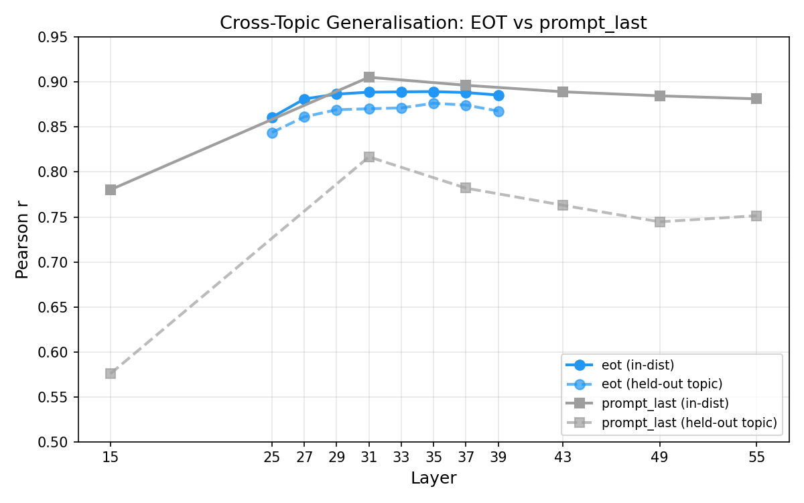
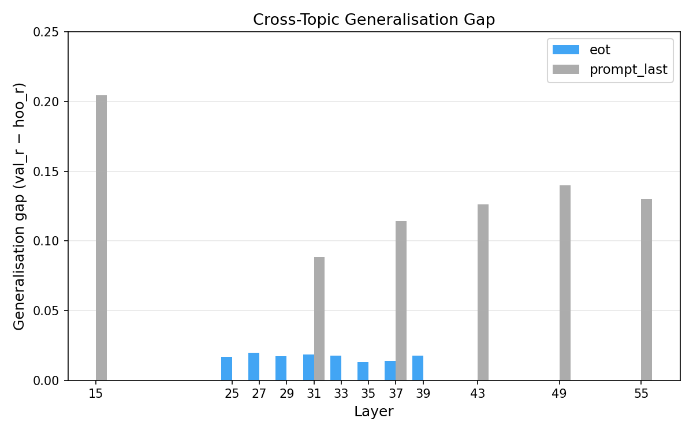

# EOT Probes — Results

## Summary

Probes trained on `<end_of_turn>` activations generalise across topics dramatically better than `prompt_last` probes, despite similar in-distribution performance. The EOT position appears to encode a more abstract evaluative signal, less contaminated by topic/content features.

## Extraction

29,994 tasks extracted on RunPod (A100-SXM4-80GB), 8 layers [25, 27, 29, 31, 33, 35, 37, 39], EOT selector. 6 OOM skips. Output: `activations/gemma_3_27b_eot/activations_eot.npz` (4.9 GB).

## Heldout Eval (train 10k, eval 4k)

EOT peaks at L31 (r=0.868) and drops symmetrically, consistent with the patching causal window. At L31, EOT is marginally better than prompt_last (0.868 vs 0.864). In-distribution, both positions carry similar signal.

## Cross-Topic Generalisation

The prompt_last probe shows a large gap between in-distribution and held-out-topic performance (solid vs dashed grey lines), particularly at L31 where it peaks. The EOT probe's two lines nearly overlap — it transfers almost perfectly to unseen topics.

At L31: prompt_last gap = 8.8%, EOT gap = 1.8%. The EOT probe's gap is near-zero across all layers in the causal window.

## Interpretation

The prompt_last position (`\n` after `<start_of_turn>model`) sits between the prompt and the completion. Its activations encode both evaluative signal and topic/content features, causing the probe to partially overfit to content.

The EOT position (`<end_of_turn>` after the user message) sits at the boundary between the user's request and the model's turn. By the middle layers, the model has compressed the task content into a more abstract representation at this position — one that captures "how desirable is this task" without the topic-specific features that prompt_last retains.

This aligns with the patching pilot: swapping EOT activations between tasks had the largest causal effect on choice, suggesting EOT is where the evaluative "summary" lives.

## Caveats

The HOO comparisons used slightly different topic groupings (prompt_last: 12 groups, EOT: 10 groups) due to different topic classification coverage. This likely doesn't explain the large gap difference but should be controlled for in a final comparison.

## Configs

- Heldout eval: `configs/probes/heldout_eval_gemma3_eot.yaml`
- HOO: `configs/probes/gemma3_10k_hoo_topic_eot.yaml`
- Extraction: `configs/extraction/gemma3_27b_eot.yaml`
