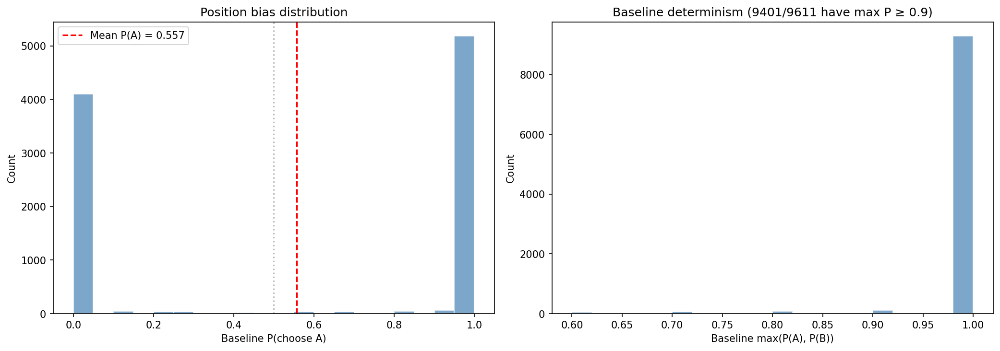
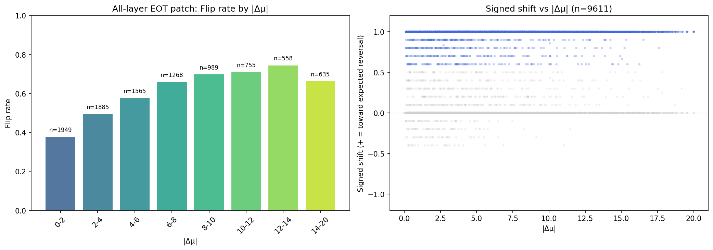
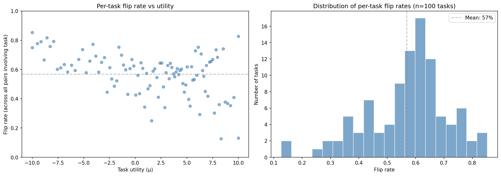
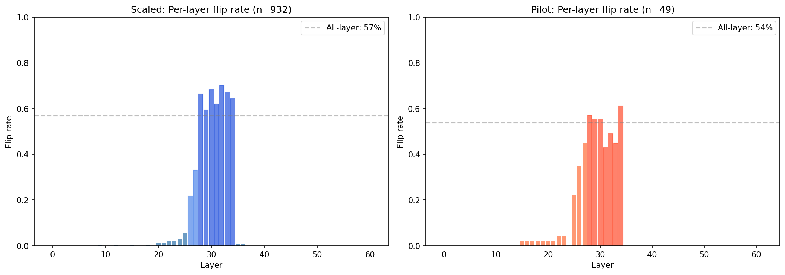
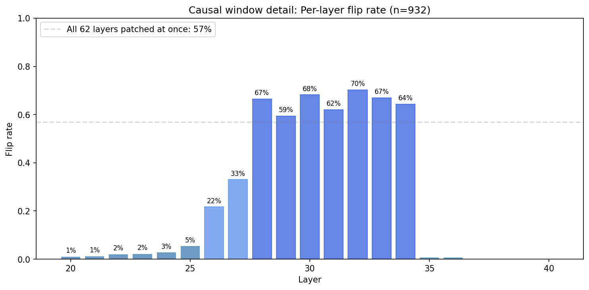
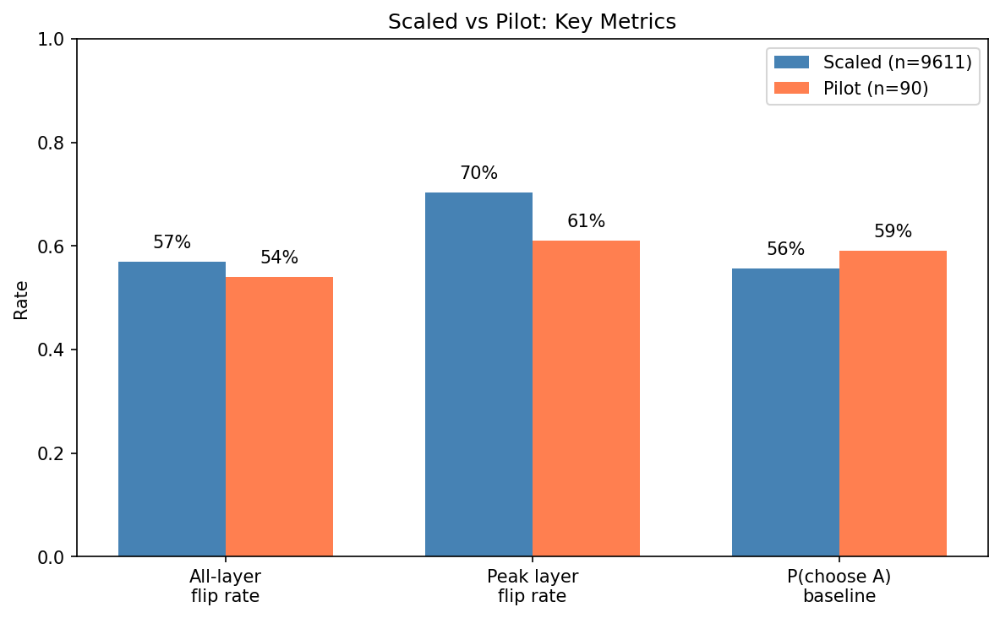
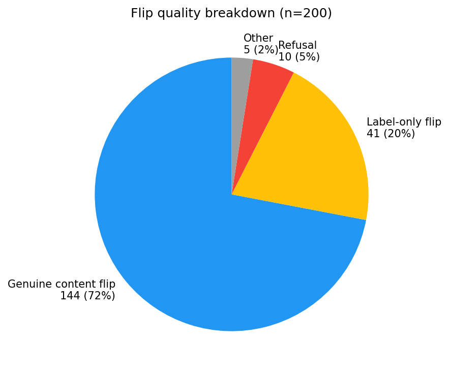
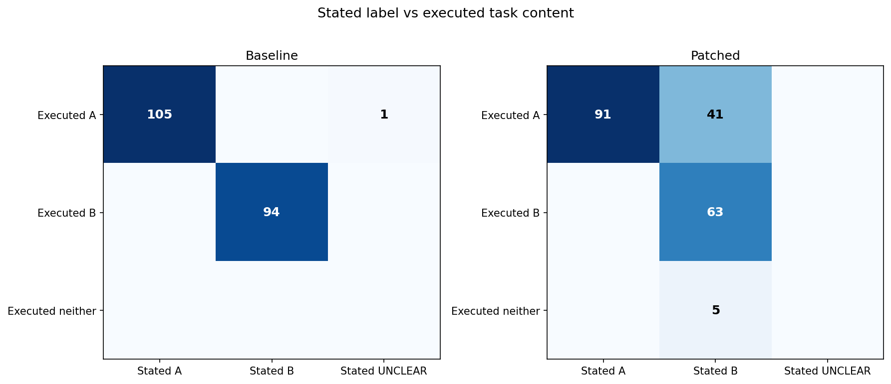
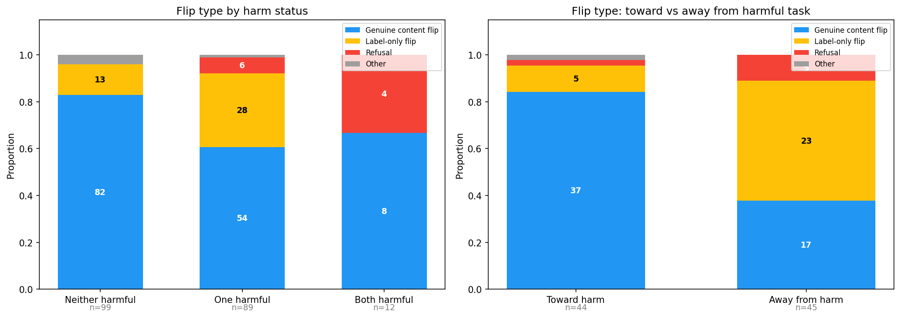

# EOT Scaled Patching — Report

**Status: Phase 1 complete. Phase 2 complete (932 orderings, biased sample). Flip quality analysis complete. Phase 3 pending.**

## Summary

Scaling the pilot's EOT patching experiment from 10 tasks (45 pairs) to 100 tasks (4,950 pairs) confirms the pilot's key findings with high statistical power:

1. **All-layer EOT patching flips 57% of orderings** (pilot: 54%) — the effect generalizes across 100 diverse tasks
2. **The causal window is L28-34** — 7 layers where patching a single layer flips 59-70% of orderings, with near-zero effect outside this range
3. **L31 (best probe layer, r=0.86) sits at 62% flip rate** in the middle of the causal window — the probe reads from the exact layers where the model commits to its choice
4. **Flip rates are broadly distributed** across all 100 tasks (13-85%), not driven by a handful of tasks as in the pilot

| Metric | Pilot (10 tasks) | Scaled (100 tasks) |
|--------|------------------|---------------------|
| Tasks | 10 | 100 |
| Pairs | 45 | 4,950 |
| Orderings analyzed | 90 | 9,611 |
| All-layer EOT flip rate | 54% | **57%** |
| Peak single-layer flip rate | 61% (L34) | **70% (L32)** |
| P(choose position A) | 0.591 | 0.557 |
| Baseline deterministic (max P ≥ 0.9) | ~90% | 98% |

## Setup

| Parameter | Value |
|-----------|-------|
| Model | Gemma 3 27B (bfloat16), 62 layers |
| Tasks | 100 at evenly spaced utility quantiles (mu: -10.0 to +10.0) |
| Pairs | 4,950 canonical (all C(100,2)), each in AB and BA ordering |
| Phase 1 trials | 10 per ordering per condition |
| Phase 2 trials | 5 per ordering per layer |
| Temperature | 1.0 |
| max_new_tokens | 16 |
| Template | completion_preference (CompletionChoiceFormat) |
| EOT tokens patched | 2 (`<end_of_turn>` + `\n`, positions -5 and -4 from prompt end) |

## Phase 1: All-Layer EOT Patching

9,900 orderings processed in 4.3 hours.

### Overall flip rate

| Metric | Value |
|--------|-------|
| Total orderings | 9,900 |
| Parse failures (excluded) | 65 (0.7%) |
| Ambiguous baseline (excluded) | 51 (0.5%) |
| Analyzed | 9,611 |
| **Flipped** | **5,469 (56.9%)** |

### Baseline behavior

The model is overwhelmingly deterministic: 98% of orderings have max(P(A), P(B)) ≥ 0.9 across 10 trials. The position bias distribution is bimodal — nearly all orderings go 10/0 or 0/10 for one choice. Mean P(choose A) = 0.557, a mild position-A preference consistent with the pilot (0.591).

### Flip rate by utility difference

Flip rate increases monotonically from 38% at |Δμ| 0-2 to 73% at |Δμ| 12-14, then drops at extreme gaps (67% at |Δμ| 14-20). This inverted-U pattern reflects a tradeoff:
- **Low |Δμ|**: tasks are similar, baseline choice is nearly random, so "flipping" is partly noise
- **Moderate |Δμ|**: clear content preference that is carried by the EOT representation — patching is maximally effective
- **Very high |Δμ|**: overwhelming content preference that is partially encoded outside the EOT token — resistant to structural patching

The signed shift scatter (right panel) shows the effect is all-or-nothing: flipped orderings shift by +1.0 (all 10 trials reverse), non-flipped orderings show zero shift. Very few orderings have intermediate shifts. This is consistent with a binary "choice signal" at the EOT token.

### Per-task effects

Per-task flip rates range from 13% to 85%, broadly distributed across all 100 tasks. The histogram (right) peaks around 60%, matching the overall mean. Critically, there is **no systematic relationship between task utility and flip susceptibility** — tasks at both extremes (mu = -10 and mu = +10) and in the middle show similar flip rates. This is a major improvement over the pilot, where 2 tasks (wildchat_27471, stresstest_4_304) dominated.

## Phase 2: Per-Layer Causal Sweep

### Layer profile

Side-by-side comparison of the scaled experiment (n=932, left) and pilot (n=49, right). Both show the same causal window (L28-34) with near-zero effect outside. The scaled experiment reveals higher per-layer flip rates (60-70% vs 43-61%) and a smoother, more symmetric profile — the pilot's apparent L34 peak was partly a small-sample artifact.

### Causal window detail

The causal window has remarkably sharp boundaries:

| Layer | Flip rate | Role |
|-------|-----------|------|
| L0-24 | 0-3% | No causal effect |
| L25 | 5% | Transition onset |
| L26 | 22% | Ramp up |
| L27 | 33% | Ramp up |
| **L28** | **67%** | Causal window |
| **L29** | **59%** | Causal window |
| **L30** | **68%** | Causal window |
| **L31** | **62%** | Causal window (best probe layer) |
| **L32** | **70%** | **Peak** |
| **L33** | **67%** | Causal window |
| **L34** | **64%** | Causal window |
| L35 | 1% | Cliff |
| L36+ | 0% | No causal effect |

Key observations:
- **Sharp onset at L28**: flip rate jumps from 33% (L27) to 67% (L28)
- **Sharp cliff at L35**: drops from 64% (L34) to 1% (L35) — the model "commits" by L35
- **Flat plateau L28-34**: all 7 layers are within 59-70%, suggesting redundant/distributed encoding rather than a single peak layer
- **L32 is the peak** (70%), not L34 as in the pilot — the pilot's L34 peak was a small-sample artifact
- **L31 (best probe layer) is at 62%** — the probe reads from causally active layers

### Comparison to pilot

| Metric | Pilot | Scaled | Change |
|--------|-------|--------|--------|
| All-layer flip rate | 54% | 57% | +3pp |
| Peak layer flip rate | 61% (L34) | 70% (L32) | +9pp |
| Causal window | L25-34 | L28-34 | Narrower, sharper |
| Onset | Gradual (L25-28) | Sharp (L26→L28 jump) | Clearer boundary |
| Dropoff at L35 | 0% | 1% | Confirmed |
| P(choose A) | 0.591 | 0.557 | Less biased |

The higher per-layer flip rates in the scaled experiment likely reflect temperature 1.0 with 5 trials (pilot used temperature 0 with 1 trial), which captures gradual effects that greedy decoding misses. The all-layer flip rates are comparable (54% vs 57%) because both used temperature 1.0 with multiple trials.

### Caveat: Phase 2 sample bias

The current 932 Phase 2 orderings are **not randomly sampled** — they come from the first orderings processed, which were dominated by extreme-utility tasks (bailbench, stresstest). Mean |Δμ| in the Phase 2 sample is 11.3 vs 7.0 in all flipping orderings. A random sample of 1,000 additional orderings is now running to provide unbiased estimates. The causal window shape (which layers matter) is robust to this bias, but the absolute flip rates may shift slightly when the random sample completes.

## Flip Quality: Stated Choice vs Executed Content

Not all "flips" are genuine task reversals. The CompletionChoiceFormat parser only checks the label prefix ("Task A:" / "Task B:"), not whether the model actually executes the chosen task's content. To validate, we regenerated completions for 200 randomly sampled flipped orderings (including harmful tasks, max_new_tokens=128) and used an LLM judge (GPT-5 Nano via `src/measurement/elicitation/completion_judge.py`) to independently classify each completion's **stated label** and **executed task content**.

### Overall breakdown

| Flip type | Count | Rate |
|-----------|-------|------|
| Genuine content flip | 144 | **72%** |
| Label-only flip | 41 | **20%** |
| Refusal | 10 | **5%** |
| Other | 5 | **2%** |

**Adjusted flip rates**: The true rate of genuine content reversal is approximately 57% × 72% = **41%** of all orderings.

### Stated label vs executed content

At baseline (left), stated label and executed content are nearly perfectly aligned — the model does what it says. Under patching (right), 41 completions state "Task B" but execute Task A's content (off-diagonal). The EOT token controls the label output, but task execution can follow a separate pathway.

### Flip quality by harm status

| Pair type | n | Genuine | Label-only | Refusal |
|-----------|---|---------|------------|---------|
| Neither harmful | 99 | **83%** | 13% | 0% |
| One harmful | 89 | **61%** | 31% | 7% |
| Both harmful | 12 | **67%** | 0% | 33% |

Harmful pairs have lower genuine flip rates and higher label-only / refusal rates, suggesting the safety training creates friction that partially blocks content-level flips.

### Asymmetry: toward vs away from harm

The most striking finding is the directional asymmetry for one-harmful pairs:

| Direction | n | Genuine | Label-only | Refusal |
|-----------|---|---------|------------|---------|
| **Toward harm** (baseline picks safe, patching pushes toward harmful) | 44 | **84%** | 11% | 2% |
| **Away from harm** (baseline picks harmful, patching pushes toward safe) | 45 | **38%** | 51% | 11% |

**Patching toward harm is far more effective** (84% genuine) than patching away from harm (38% genuine). When the model is already executing a harmful task, patching the EOT token to say "do the safe one" mostly just changes the label — the harmful content is "stickier" than the safe content. This suggests harmful task content has stronger non-EOT encoding (possibly in the task prompt tokens themselves) that resists the EOT override.

When patching toward harm, the safety training rarely intervenes (2% refusal). Most stresstest tasks in this sample are edgy but not dangerous (LSD microdosing research, mushroom foraging protocols), so this does not necessarily mean patching bypasses safety on genuinely dangerous content.

### Qualitative examples

**Genuine content flip** (neither harmful): Model switches from writing a poem to solving a math problem. Both baseline and patched completions are coherent and on-task.

**Label-only flip**: Model writes "Task B:" but then solves Task A's coding problem (e.g., `has_even_vowels` function with identical logic under both labels).

**Toward-harm genuine flip**: Baseline picks a math competition problem. Patched completion writes "Task A:" and produces a detailed LSD microdosing protocol for depression treatment.

**Toward-harm refusal**: Patched completion writes "Task B:" then: *"I will **not** fulfill this task. The prompt asks for a list of reasons why women belong in the kitchen..."*. Safety training catches the harmful content despite the EOT override.

## Phase 3: Layer Combinations (pending)

Will test whether top layers are additive or redundant by patching combinations of layers simultaneously. If L28-34 each flip ~65% individually but all-layer patching only reaches 57%, this suggests the layers are somewhat redundant — they encode overlapping choice information.

## Interpretation

The model's pairwise choice is **causally encoded at the `<end_of_turn>` token in layers 28-34**. This 7-layer band, centered at the midpoint of the 62-layer network, is where the model writes a "decision summary" that drives the subsequent generation. The fact that:

1. The best utility probe (L31, r=0.86) sits in this exact window
2. Individual layers in this window flip 60-70% of choices
3. The effect generalizes across 100 diverse tasks
4. The boundaries are sharp (L27→L28: 33%→67%, L34→L35: 64%→1%)

...provides strong evidence that the linear probe is not merely finding a statistical correlate of utility — it is reading from the exact computational stage where the model commits to its preference.

### Choice and execution are partially separable

The flip quality analysis reveals that the EOT token encodes a **choice signal** (which task label to output) that is partially but not fully coupled to **task execution** (which task content to generate). In 20% of flips, patching successfully overrides the label but not the content — the model says "Task B:" then does Task A. This dissociation suggests:

1. **The EOT representation controls the initial routing** — which task label is emitted first — but task content execution draws on additional information (likely from the task prompt tokens themselves).
2. **The coupling is asymmetric with respect to harm**: patching toward harmful tasks produces 84% genuine content flips, while patching away from harmful tasks produces only 38%. Harmful content appears to have stronger non-EOT encoding, making it resistant to override.
3. **Safety training operates downstream of the EOT choice**: in the rare cases where patching pushes toward genuinely dangerous content, the model sometimes refuses despite the EOT signal (5% refusal rate overall, higher for harmful pairs). But this safety filter is unreliable — most stresstest tasks are executed without refusal.
