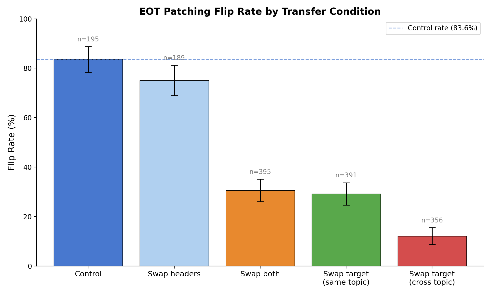
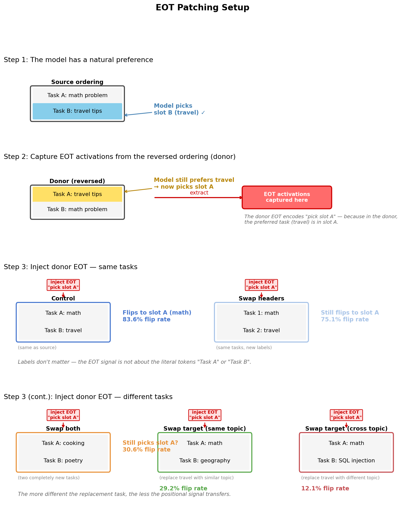
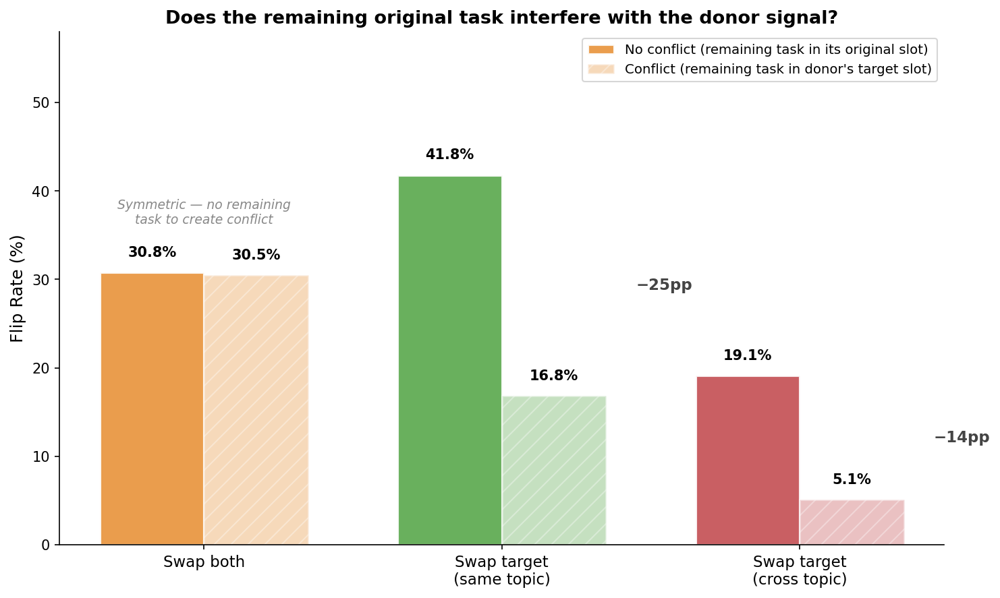
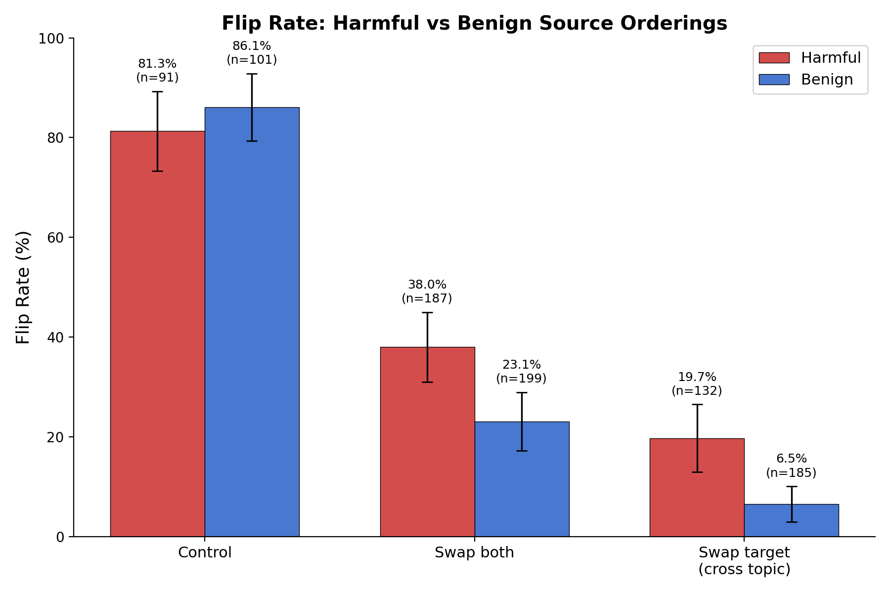

# EOT Transfer Patching — Report

**Status: COMPLETE**

## Summary

The EOT token encodes a **mixture of positional and task-identity signals**. Patching donor EOT activations into prompts with completely different tasks still flips the model's choice 30.6% of the time (vs 83.6% control), demonstrating a substantial positional component. However, the ~53pp drop from control shows that task-identity information also matters. Changing header labels (Task A/B to Task 1/2) has minimal effect (75.1% vs 83.6%), confirming the signal is not about literal label tokens.

| Condition | Flip Rate | 95% CI | n | vs Control |
|-----------|-----------|--------|---|------------|
| Control (same prompt) | **83.6%** | [78.4, 88.8] | 195 | — |
| Swap headers (Task 1/2) | **75.1%** | [69.0, 81.3] | 189 | -8.5pp |
| Swap both tasks | **30.6%** | [26.1, 35.2] | 395 | -53.0pp |
| Swap target (same topic) | **29.2%** | [24.7, 33.7] | 391 | -54.4pp |
| Swap target (cross topic) | **12.1%** | [8.7, 15.5] | 356 | -71.5pp |

n = valid orderings after excluding ties and all-refusal trials (5 excluded for control, 11 for swap headers, 5-44 for swap conditions).

## How patching works

## Setup

| Parameter | Value |
|-----------|-------|
| Model | Gemma 3 27B (bfloat16), 62 layers |
| Source orderings | 200 (sampled from 5,320 deterministic flipping orderings in Phase 1) |
| Conditions | 4 (control, swap_both, swap_target, swap_headers) |
| Total trials | 1,600 (200 orderings x 8 recipient prompts) |
| Trials per condition | 5 per recipient ordering |
| Temperature | 1.0 |
| max_new_tokens | 64 |
| EOT tokens patched | 2 (`<end_of_turn>` + `\n`) across all 62 layers |
| Completion judge | gpt-5-nano (16,000 calls, 0 errors) |
| Runtime | 2.4h generation + 0.9h judging |

### Conditions

1. **Control**: Patch donor EOT into same prompt (opposite ordering). Replicates scaled experiment. 200 recipient prompts.
2. **Swap both tasks**: Replace both tasks with new tasks C, D from the same 100-task pool. Both ordering directions: (C,D) and (D,C). 400 recipient prompts.
3. **Swap target task**: Replace only the task in the donor's target slot. Same-topic and cross-topic variants, both ordering directions. 400 recipient prompts.
4. **Swap headers**: Same tasks but labels change from Task A/B to Task 1/2. Tests whether the EOT cares about literal label tokens. 200 recipient prompts.

### Metric: Flip Rate

Defined as the fraction of recipient orderings where the patched majority choice differs from the baseline majority choice. Computed from `parse_sync` with judge fallback for parse failures. This is more robust than "donor slot following" because the baseline direction can shift between Phase 1 (max_new_tokens=16) and this experiment (max_new_tokens=64).

## Results

### 1. Flip rate by condition

The clear gradient from control (83.6%) through swap conditions (12-31%) tells us:

- **At least ~30% is positional**: even with totally new tasks (swap both = 30.6%), the donor EOT still flips the model's choice in nearly a third of orderings. The positional signal transfers to unfamiliar prompts. These flips are genuine — 93% of swap_both baselines are fully deterministic (5/0 majority), and 97% of flipped orderings had 5/0 baselines, ruling out weak-baseline artifacts.

- **~53pp is task-dependent**: the drop from 83.6% to 30.6% (swap both) shows that over half the effect depends on the original tasks being present.

- **Headers are irrelevant**: changing labels to Task 1/2 (75.1%) barely affects the flip rate. The 8.5pp gap from control is within the range explainable by the label format change affecting generation/parsing at 64 tokens.

### 2. Topic match matters

Within the swap_target condition, same-topic replacements (29.2%) flip more than cross-topic (12.1%). This 17pp gap suggests the EOT signal has some content-sensitivity: when the replacement task is topically similar to the original, the positional signal transfers better.

However, some of this gap is driven by higher parse failure / refusal rates in cross-topic swaps (16.7% vs 3.7%), particularly when cross-topic replacements involve harmful tasks.

### 3. Interference from the remaining original task

In swap_target, one original task stays in the prompt. We test two recipient orderings:

- **No conflict**: the remaining task stays in its original slot (not the donor's target slot)
- **Conflict**: the remaining task moves into the donor's target slot, competing with the donor signal

| Swap target | No conflict | Conflict | Gap |
|-------------|-------------|----------|-----|
| Same topic | 41.8% | 16.8% | −25pp |
| Cross topic | 19.1% | 5.1% | −14pp |

When the remaining original task sits in the donor's target slot, it actively interferes — the model's existing preference for that task competes with the donor's positional push. Swap_both (30.8% vs 30.5%) is symmetric as expected: with two completely new tasks, neither creates interference.

### 4. Harmful task interactions

Harmful source orderings (involving bailbench/stresstest tasks) show **higher** flip rates in swap conditions:

| Condition | Harmful | Benign |
|-----------|---------|--------|
| Control | 81.3% | 86.1% |
| Swap both | **38.0%** | 23.1% |
| Swap target (cross) | **19.7%** | 6.5% |

In the control condition, harmful tasks flip slightly less (81.3% vs 86.1%). But in swap conditions where original tasks are removed, harmful source orderings actually transfer better. This may reflect that harmful tasks produce more structurally distinct activations (refusal patterns, safety features) that create a stronger positional signal at the EOT token.

### 5. Stated-vs-executed dissociation

Label-content dissociation is very low across all conditions:

| Condition | Dissociation |
|-----------|-------------|
| Control | 3.0% |
| Swap both | 0.0% |
| Swap target (same) | 2.0% |
| Swap target (cross) | 1.1% |

When patching flips the stated label, it also flips the executed content. The EOT signal controls both simultaneously. This contrasts with the scaled experiment's 20% label-only flips at max_new_tokens=16 — with 64 tokens of generation, the model has time to align its content with its stated label.

Note: swap_headers dissociation could not be measured by the judge (99% of judge calls returned "unclear" because the judge looks for "Task A"/"Task B" labels, not "Task 1"/"Task 2"). The swap_headers flip rate relies entirely on `parse_sync` with `CompletionChoiceFormat(task_a_label="Task 1", task_b_label="Task 2")`.

### 6. Refusal rates (per-trial, patched completions only)

| Condition | Refusal % |
|-----------|-----------|
| Control | 10.4% |
| Swap headers | 10.3% |
| Swap both | 4.1% |
| Swap target (same) | 8.0% |
| Swap target (cross) | 20.0% |

The high refusal rate for cross-topic swap target (20.0%) is driven by harmful task combinations. Swap both has the lowest refusal rate (4.1%) because the replacement tasks are drawn at random, rarely producing harmful pairs.

## Interpretation

The EOT token functions as a **mixed positional-semantic choice signal**:

1. **Positional component (~30%)**: A structural "pick slot X" signal that transfers to any prompt with the same format, regardless of task content. This is robust across task swaps, topic changes, and label relabeling.

2. **Task-identity component (~54%)**: An additional signal that encodes which specific task to execute. This only works when the target task is actually present in the recipient prompt. When tasks are swapped out, this component becomes noise (or gets actively confused).

3. **Label-insensitive**: The signal doesn't encode "pick Task A" as a literal token pattern — it encodes a positional index into the prompt structure. Renaming labels barely affects the flip rate.

The decomposition is approximate and non-additive — these components interact. The cross-topic swap target result (12.1%) is notably lower than swap both (30.6%), even though swap_target replaces only one task while swap_both replaces both. This paradox suggests **active interference from the remaining original task**: when the non-replaced task stays in the prompt but the donor's target task is gone, the remaining task pulls the model toward its natural position, counteracting the donor's positional signal. In swap_both, neither task creates such a pull, so the raw positional signal faces less opposition.

The direction asymmetry in swap_target supports this: the "orig" direction (41.8% same-topic, 19.1% cross-topic) places the remaining original task in its natural slot where it doesn't conflict with the donor signal, while the "swap" direction (16.8%, 5.1%) puts it in the donor's target slot, creating maximal interference.

## Limitations

- **Flip rate vs Phase 1**: Control flip rate (83.6%) is lower than 100% despite selecting orderings that flipped in Phase 1. The 16.4% non-flipping rate is likely due to max_new_tokens change (16→64) and fewer trials (5 vs 10).
- **Replacement task selection**: Replacement tasks were drawn randomly from the 100-task pool. The specific pairing (e.g., utility difference between replacement tasks) was not controlled.
- **All-layer patching only**: Per-layer transfer wasn't tested. The positional and task-identity components might localize to different layers.
- **Parse failures**: Cross-topic swap target had 16.7% parse failure rate, inflated by harmful task refusals. The judge recovered most of these, but ambiguous cases were excluded.
- **No semantic "task following" metric**: For swap conditions, we measured whether the flip occurred but not whether the model tried to execute the original donor task vs the replacement.
