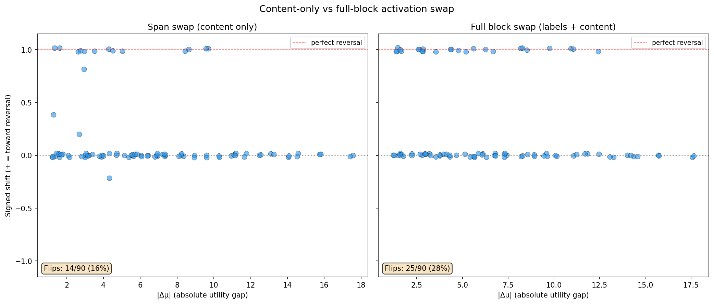
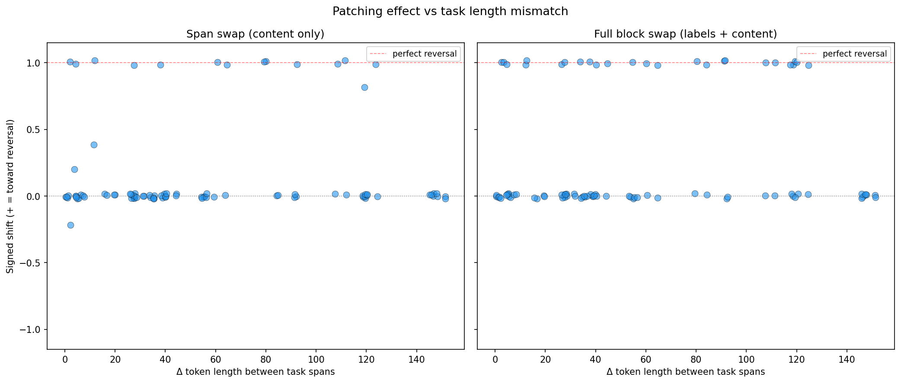
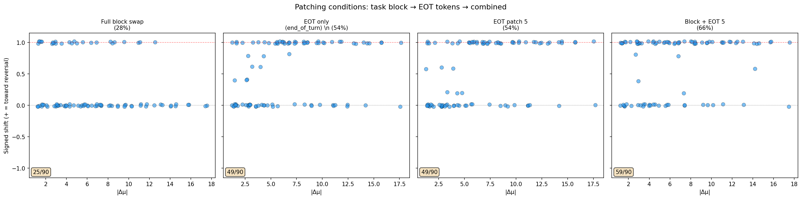
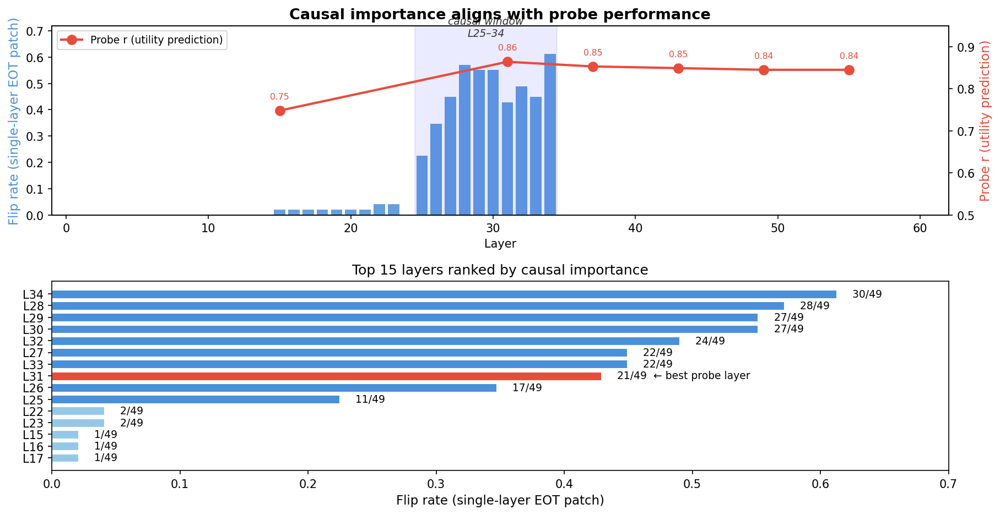

# Activation Patching Pilot — Report

## Summary

We tested whether swapping task-position activations in the residual stream (all 62 layers, during prefill) flips the model's pairwise choice. Three swap scopes were tested with increasing aggressiveness:

| Condition | What's swapped | Flip rate | Direction |
|-----------|---------------|-----------|-----------|
| Last-token swap | Single token per task | 1/90 (1%) | — |
| Span swap (content only) | Task prompt tokens | 14/90 (16%) | All correct |
| Full block swap (labels + content) | "Task A/B:\n" + prompt tokens | 25/90 (28%) | All correct |

When swaps produce a shift, it is almost always in the correct direction (toward reversal). Full block swap nearly doubles the flip rate vs content-only, showing that label tokens ("Task A:\n", "Task B:\n") carry substantial choice-relevant information. But 72% of orderings still resist even the most aggressive swap — the model's choice is partially determined by information outside the task blocks (instruction tokens, separators, or positional encoding).

## Setup

| Parameter | Value |
|-----------|-------|
| Model | Gemma 3 27B (bfloat16), 62 layers |
| Tasks | 10 at evenly spaced utility quantiles (mu: -8.7 to +8.8) |
| Pairs | 45 canonical, each in AB and BA ordering = 90 prompts |
| Trials | 5 per ordering per condition |
| Temperature | 1.0 |
| max_new_tokens | 16 |
| Template | completion_preference |
| Parse failures | 0 |

BOS token offset = 1 (verified). All span positions shifted by +1 and verified against decoded tokens.

## Baseline Behavior

**Position bias**: P(choose position A) = 0.591 across 450 baseline trials.

Within individual orderings (5 trials each), the model is highly deterministic — almost always 5/0 or 0/5. After aggregating both orderings into canonical pairs: 12/45 pairs show P(B) = 0.50 (pure position bias), 32/45 show P(B) = 1.00 (content-driven). The transition occurs around |Δμ| ~ 3–5.

## Patching Effects

Each point is one ordering (90 total). Y-axis is the sign-corrected shift: positive = toward expected reversal. Full block swap (right) produces more flips across the full range of |Δμ|, including pairs with large utility gaps (|Δμ| ~ 10–13). Content-only span swap (left) shows a similar pattern but weaker.

Key observations:
- **Correct direction**: when swaps produce shifts, they go the right way — not random corruption
- **Full reversals at high |Δμ|**: some pairs with large utility gaps still flip under full block swap, suggesting the task block carries choice-relevant information even when the model has a strong content preference
- **Task-specific swappability**: `wildchat_27471` (8 flips) and `stresstest_4_304` (6 flips) dominate the flipping orderings in span swap; `stresstest_4_304` has unusually high Thurstonian sigma (4.37 vs median 0.53)

### Length mismatch is not the bottleneck

`swap_spans` right-aligns when spans differ in length, leaving the leading tokens of the longer span unswapped. On average 55% of the longer span's tokens are never touched. However, flips occur across the full range of length mismatches (0–150 tokens), and pairs with near-equal lengths still mostly don't flip. The non-flip rate is not explained by incomplete swapping.

## Interpretation

The label tokens carry substantial causal information — they're not just markers but encode which-task-is-which in ways that survive to the choice point. Content-only swaps miss this, explaining the low flip rate in the original experiment.

But even the full block swap (the most aggressive scope short of rewriting the entire prompt) only flips 28% of orderings. The remaining 72% suggests the model distributes choice-relevant information to positions outside the task blocks during prefill — likely instruction tokens, separators, or the end-of-turn boundary. By the time generation starts, these non-task positions already encode enough to determine the choice, and swapping the task block can't undo that.

## End-of-Turn Token Patching

To test whether the choice is encoded at structural tokens, we patched the residual stream at the end-of-turn boundary from a "donor" prompt (opposite ordering of the same pair) into the "recipient" prompt. We also tested combining block swap + EOT patching.

| Condition | What's patched | Flip rate |
|-----------|---------------|-----------|
| Full block swap | ~50–170 task block tokens | 25/90 (28%) |
| EOT only (2 tokens) | `<end_of_turn>` `\n` | 49/90 (54%) |
| EOT patch (5 tokens) | `<end_of_turn>` `\n` `<start_of_turn>` `model` `\n` | 49/90 (54%) |
| EOT patch (3 tokens) | `<start_of_turn>` `model` `\n` | 5/90 (6%) |
| Block swap + EOT 5 | task blocks + 5 boundary tokens | 59/90 (66%) |

The `<end_of_turn>` token and the newline after it carry almost all the decision signal at the boundary — the 2-token and 5-token windows produce the same 54% flip rate, while the 3-token window (model-turn tokens only, without `<end_of_turn>`) gets just 6%. Combining block swap + EOT patching pushes to 66%, showing additive information: some choice signal lives at the task block positions, some at the end-of-turn boundary.

The model's pairwise choice is largely determined before generation begins. During prefill, attention propagates task content to the `<end_of_turn>` position, where the model builds a summary representation that causally drives the choice. Patching just this token is nearly twice as effective as swapping the entire task block (~100 tokens). The remaining 34% non-flip rate under the combined condition suggests additional choice information at instruction tokens or in positional encoding.

## Layer-Level Causal Importance

To identify which layers write the decision to the `<end_of_turn>` token, we patched EOT residuals one layer at a time (on the 49 orderings that flip under all-layer patching, 1 trial each at temperature 0).

The causal window is **layers 25–34**, with L34 (61%) and L28-30 (~55%) as the most important individual layers. This aligns with probe performance: the best utility probe is at L31 (r=0.86), right in the middle of the causal window. Later layers retain probe signal (r~0.84) but have zero causal importance — the information persists in the residual stream but the decision has already been written.

The fact that the probe's best layer and the causal window coincide is notable: the probe wasn't just finding a correlate of utility, it was reading from the exact layers where the model commits to its choice.

## Limitations

- **5 trials per ordering** — limited statistical power; most orderings are 5/0 or 0/5
- **Residual stream only** — hooks modify the residual stream but not attention weights or MLP internals; information may persist through other pathways
- **10 tasks** — small sample; task-specific effects (stresstest, wildchat) may not generalize
- **EOT patching uses donor from opposite ordering** — the donor prompt has different content at different positions, so the patched residuals at EOT reflect a different processing history, not just a different "decision"
