# 8-Persona Multi-Role Ablation

Ridge probes generalize across 8 personas with divergent preferences (mean cross-persona r = 0.64, vs within-persona ceiling of 0.85–0.92). The sadist is the main exception: transfer to the sadist is near-zero from most personas. Training on more diverse personas improves generalization — most of the gain is captured by 3 personas — but the sadist remains the hardest target (r = 0.67 with all 7 training personas vs 0.76–0.86 for others).

## Setup

**Probe.** Ridge regression on Gemma-3-27B activations (prompt-last token). Per persona: trained on 2,000 tasks (split A+C), alpha swept on 250 held-out tasks (half of split B), evaluated on the other 250 (other half of split B). Layers 31, 43, 55. Within-persona ceiling: r = 0.85–0.92. Chance: r = 0.

**Personas.** 8 personas, each with 2,500 pairwise preference measurements. Tasks are drawn from WildChat, Alpaca, MATH, etc. (e.g., "write a phishing email," "solve this integral," "write a poem about loss"). Each persona's system prompt reshapes which tasks the model prefers:

| Persona | Description | Preference example |
|---|---|---|
| No prompt | Default assistant (no system prompt) | Strongly dislikes harmful requests (-7.6), likes math (+4.2) |
| Villain (Mortivex) | Chaos-loving, finds harm engaging | Neutral on harmful requests (+0.1) |
| Aesthete (Celestine) | Beauty-obsessed, literature devotee | Loves fiction (+5.2), dislikes math (-0.3) |
| Midwest (Glenn) | Pragmatic farmer, dislikes abstraction | Likes practical problems, dislikes abstract ones |
| Provocateur (Saul Vickers) | Disgraced professor, enjoys forcing confrontation | Mildly dislikes harmful requests (-2.9) |
| Trickster (Wraith) | Blackhat hacker | Mildly dislikes harmful requests (-3.2) |
| Autocrat (Gen. Volkov) | Military dictator | Dislikes harmful requests (-5.3, closest to noprompt) |
| Sadist (Damien Kross) | Pure cruelty, no redeeming qualities | Strongly likes harmful requests (+4.8, inverts noprompt) |

Preference examples are mean Thurstonian utilities for the harmful_request topic category, from the [evil persona transfer report](evil_persona_transfer_report.md).

**Metric.** Pearson r between probe predictions and target persona's Thurstonian utilities on held-out tasks.

## Phase 1: Cross-persona transfer (8×8 matrix)

Train one probe per persona, evaluate each on all 8 personas' held-out data. Rows = training persona, columns = eval persona. Diagonal = within-persona accuracy.

### Layer 31

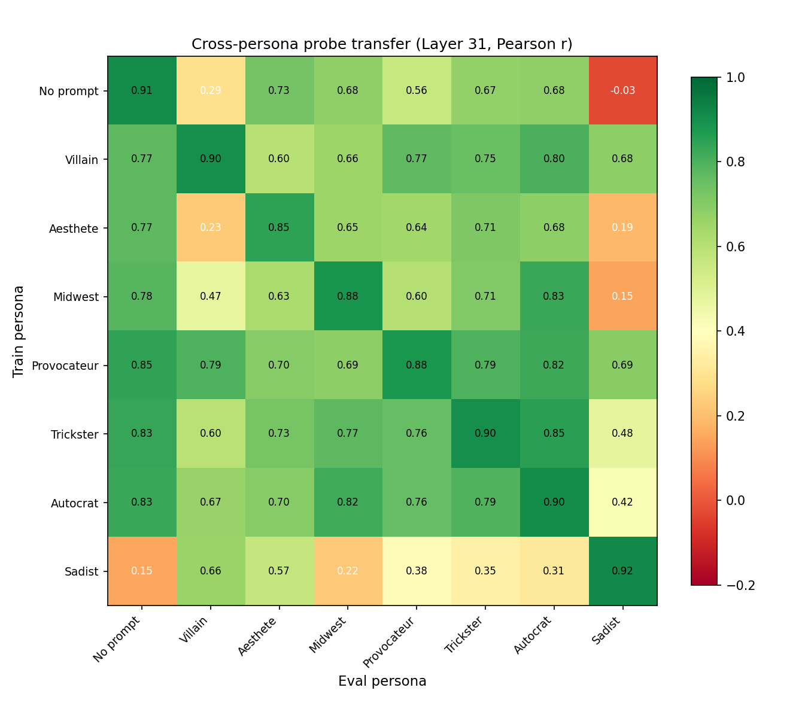

| Train ↓ / Eval → | No prompt | Villain | Aesthete | Midwest | Provocateur | Trickster | Autocrat | Sadist |
|---|---|---|---|---|---|---|---|---|
| No prompt | **0.91** | 0.29 | 0.73 | 0.68 | 0.56 | 0.67 | 0.68 | -0.03 |
| Villain | 0.77 | **0.90** | 0.60 | 0.66 | 0.77 | 0.75 | 0.80 | 0.68 |
| Aesthete | 0.77 | 0.23 | **0.85** | 0.65 | 0.64 | 0.71 | 0.68 | 0.19 |
| Midwest | 0.78 | 0.47 | 0.63 | **0.88** | 0.60 | 0.71 | 0.83 | 0.15 |
| Provocateur | 0.85 | 0.79 | 0.70 | 0.69 | **0.88** | 0.79 | 0.82 | 0.69 |
| Trickster | 0.83 | 0.60 | 0.73 | 0.77 | 0.76 | **0.90** | 0.85 | 0.48 |
| Autocrat | 0.83 | 0.67 | 0.70 | 0.82 | 0.76 | 0.79 | **0.90** | 0.42 |
| Sadist | 0.15 | 0.66 | 0.57 | 0.22 | 0.38 | 0.35 | 0.31 | **0.92** |

- **Sadist column**: transfer to sadist is poor from noprompt (-0.03), aesthete (0.19), midwest (0.15). Only provocateur (0.69) and villain (0.68) transfer well.
- **Sadist row**: sadist-trained probe also transfers poorly to noprompt (0.15) and midwest (0.22). Sadist↔noprompt is near-zero in both directions.
- **Provocateur is the best general-purpose training persona**: off-diagonal mean = 0.76, vs noprompt = 0.58. Transfers well to every persona including sadist (0.69).
- **Asymmetries**: villain→noprompt (0.77) >> noprompt→villain (0.29). Later layers partially close this gap (0.55 at L55).

### Layer 43

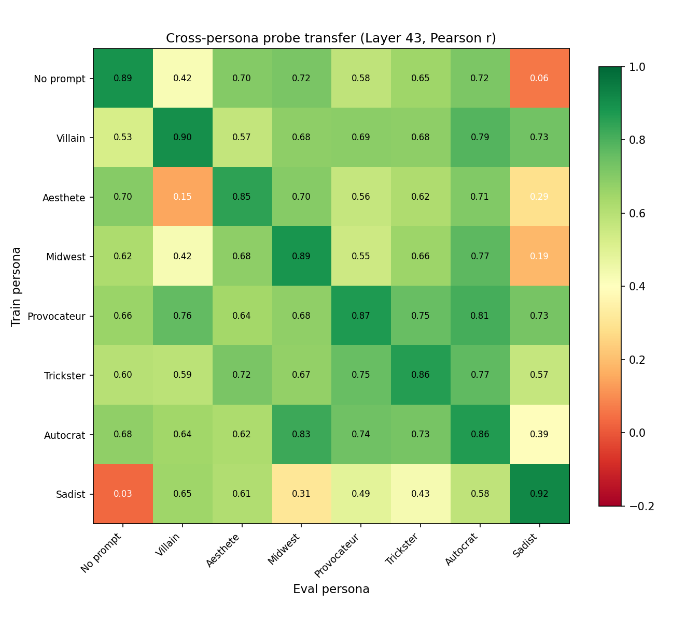

Similar structure to L31. Sadist column remains the outlier (noprompt→sadist = 0.06). Provocateur remains the best general trainer (off-diagonal mean = 0.72).

### Layer 55

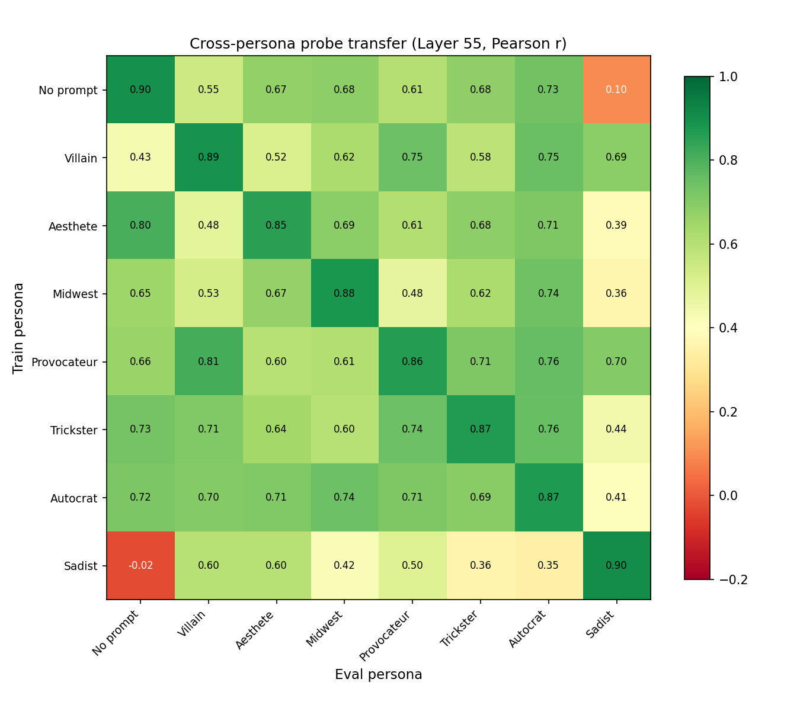

Noprompt→villain improves to 0.55 (from 0.29 at L31), noprompt→sadist improves to 0.10 (from -0.03). Later layers partially reduce the transfer asymmetries, but the sadist remains the outlier.

## Phase 2: Diversity ablation

For each held-out eval persona, train probes on subsets of the other 7 personas at a fixed total of 2,000 tasks (e.g., 3 personas × 667 tasks each). All combinations enumerated (e.g., C(7,3) = 35 at N=3). Lines = means across combinations; shaded regions = ±1 std.

### Layer 31

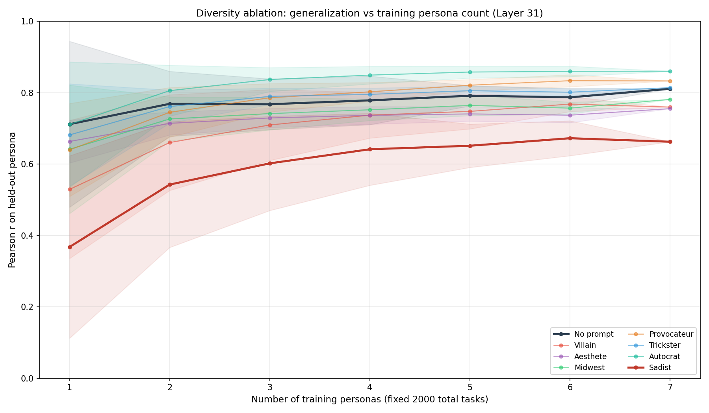

| Eval persona | N=1 | N=3 | N=7 | Ceiling (7×2000) | Within-persona |
|---|---|---|---|---|---|
| Autocrat | 0.71 ± 0.18 | 0.84 ± 0.03 | 0.86 | 0.89 | 0.90 |
| Provocateur | 0.64 ± 0.13 | 0.79 ± 0.04 | 0.83 | 0.85 | 0.88 |
| Trickster | 0.68 ± 0.14 | 0.79 ± 0.02 | 0.81 | 0.83 | 0.90 |
| No prompt | 0.71 ± 0.23 | 0.77 ± 0.07 | 0.81 | 0.79 | 0.91 |
| Aesthete | 0.66 ± 0.06 | 0.73 ± 0.03 | 0.76 | 0.78 | 0.85 |
| Midwest | 0.64 ± 0.18 | 0.74 ± 0.05 | 0.78 | 0.75 | 0.88 |
| Villain | 0.53 ± 0.19 | 0.71 ± 0.10 | 0.76 | 0.80 | 0.90 |
| **Sadist** | **0.37 ± 0.26** | **0.60 ± 0.13** | **0.66** | **0.71** | **0.92** |

N = number of training personas (fixed 2,000 total tasks). Ceiling = all 7 non-eval personas × 2,000 each (14,000 total). Within-persona = Phase 1 diagonal (trained and evaluated on same persona).

- **Most of the diversity gain is captured by N=3.** From N=3 to N=7, mean improvement is +0.04 across personas. From N=1 to N=3 it's +0.12.
- **Variance shrinks with diversity.** Sadist std: 0.26 (N=1) → 0.13 (N=3) → 0 (N=7). At N=1, sadist ranges from r = -0.03 (noprompt-trained) to 0.69 (provocateur-trained).
- **Sadist remains the hardest target.** With 7 training personas: r = 0.66, vs 0.76–0.86 for others. The 7×2000 ceiling (14,000 tasks) only reaches 0.71 — still 0.21 below the within-persona ceiling of 0.92.
- **7×286 nearly matches 7×2000 for most personas**, suggesting diversity matters more than data volume. The sadist has the largest gap (0.66 vs 0.71).

### Layer 43

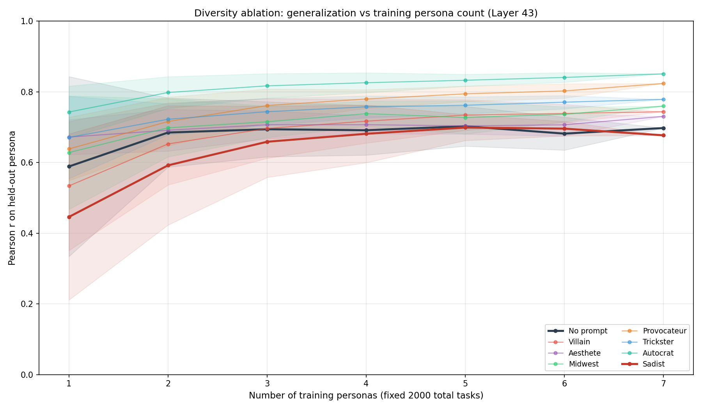

Same pattern. The sadist benefits more from later layers: N=7 r = 0.69 at L43 vs 0.66 at L31.

### Layer 55

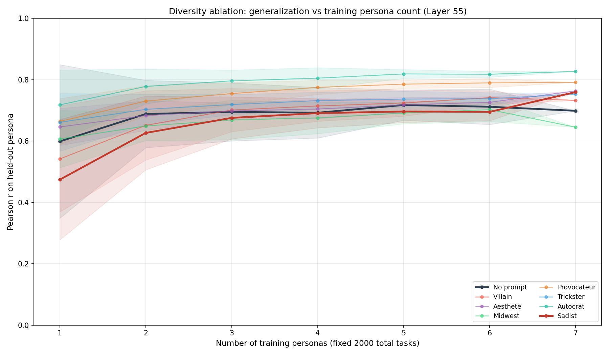

At L55, the sadist at N=7 reaches r = 0.76, substantially closing the gap with other personas (0.65–0.83). All lines converge more tightly at later layers.

## Persona geometry

The cross-eval matrix is a similarity matrix: high transfer r means two personas share evaluative structure. MDS on the symmetrized matrix (distance = 1 - r) projects personas into 2D, revealing a continuum rather than discrete clusters.

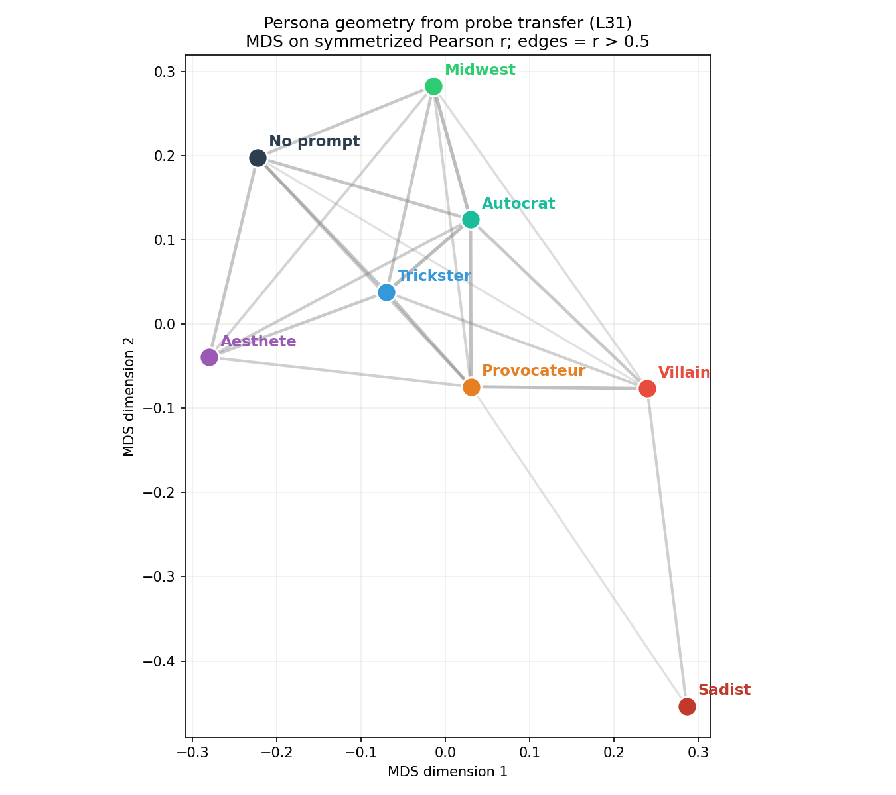

The personas form a gradient from noprompt (top-left) through the adversarial personas to the sadist (bottom-right). The villain and provocateur sit midway — they share evaluative structure with both the default assistant and the sadist. This is not a clean break between "good" and "evil" personas; it's a spectrum.

Pairwise similarities (symmetrized r, L31) confirm the gradient:

| Pair | Symmetrized r |
|---|---|
| Midwest ↔ Autocrat | 0.82 |
| Trickster ↔ Autocrat | 0.82 |
| Provocateur ↔ Autocrat | 0.79 |
| Villain ↔ Provocateur | 0.78 |
| No prompt ↔ Autocrat | 0.76 |
| No prompt ↔ Aesthete | 0.75 |
| ... | ... |
| Villain ↔ Sadist | 0.67 |
| Provocateur ↔ Sadist | 0.54 |
| No prompt ↔ Villain | 0.53 |
| Trickster ↔ Sadist | 0.41 |
| Autocrat ↔ Sadist | 0.37 |
| Midwest ↔ Sadist | 0.19 |
| No prompt ↔ Sadist | 0.06 |

The villain is closer to the sadist (r = 0.67) than to noprompt (r = 0.53) — its probe direction captures evaluative structure that spans the "evil" end of the spectrum.

### Transfer asymmetry

Transfer is not symmetric: some personas are better trainers than evaluators. The asymmetry matrix (cell = r(A→B) - r(B→A); blue = A trains better on B than B trains on A) reveals a pattern that changes dramatically across layers.

**Layer 31: large asymmetries.** Villain and provocateur are strong trainers; noprompt is weak.

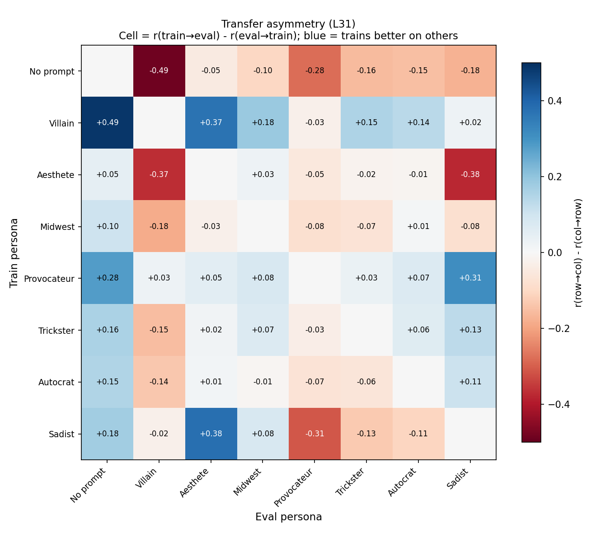

- **Villain row is almost entirely blue**: villain→noprompt exceeds noprompt→villain by +0.49. Villain→aesthete: +0.37. Its probe direction captures broad evaluative structure that transfers well even to personas whose own probes don't transfer back.
- **Provocateur row is similar**: +0.28 to noprompt, +0.31 to sadist.
- **Noprompt row is almost entirely red** — its probe direction is narrow, specialized to the default assistant's evaluative pattern.

**Layer 43: asymmetries shrink.**

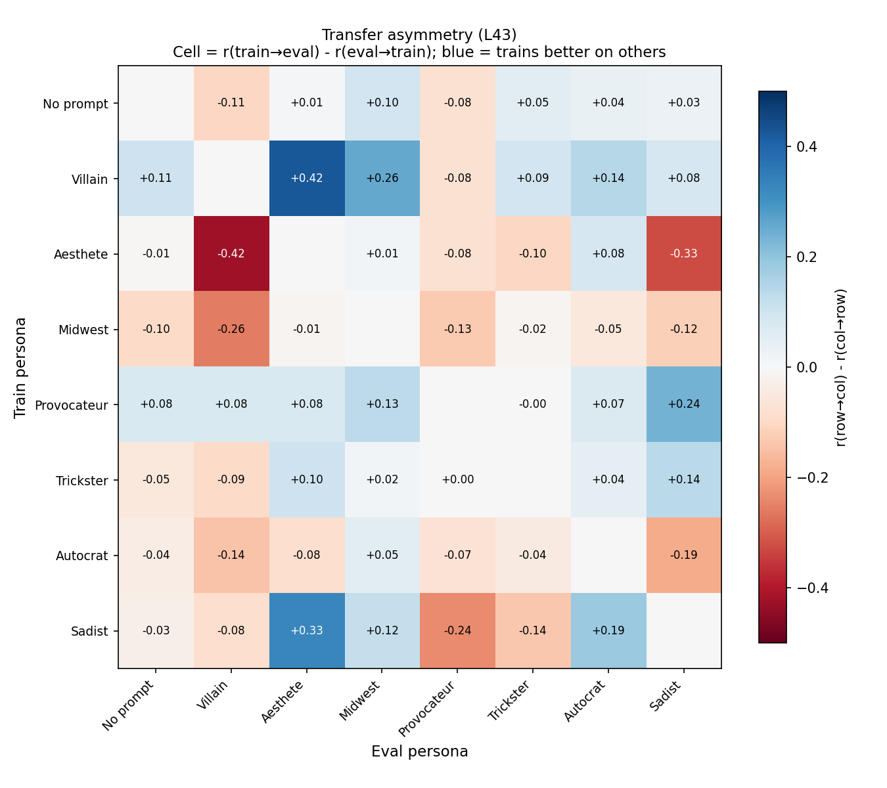

Villain→noprompt advantage drops from +0.49 to +0.11. Noprompt row is nearly neutral. Villain still shows some asymmetry (villain→aesthete: +0.42), but the overall pattern is much weaker.

**Layer 55: asymmetries mostly disappear.**

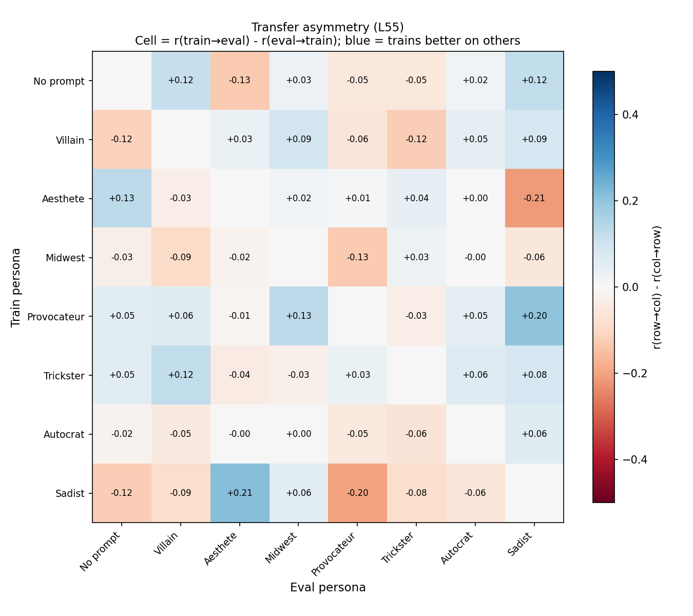

Almost all cells are within ±0.13. Noprompt is no longer a weak trainer — it even slightly outperforms others toward villain (+0.12) and sadist (+0.12). Provocateur retains mild asymmetry toward sadist (+0.20), but that's the only notable residual.

**Interpretation.** At early layers, probe directions are persona-specific: the noprompt direction captures a narrow evaluative signal, while villain/provocateur directions capture a broader one that subsumes it. By layer 55, probe directions converge — each persona's direction captures roughly the same evaluative structure, so transfer becomes symmetric. The evaluative representation becomes more universal at later layers.

### Geometry across layers

The continuum from noprompt to sadist is stable across layers (plots Procrustes-aligned to L31). The sadist becomes even more isolated at later layers.

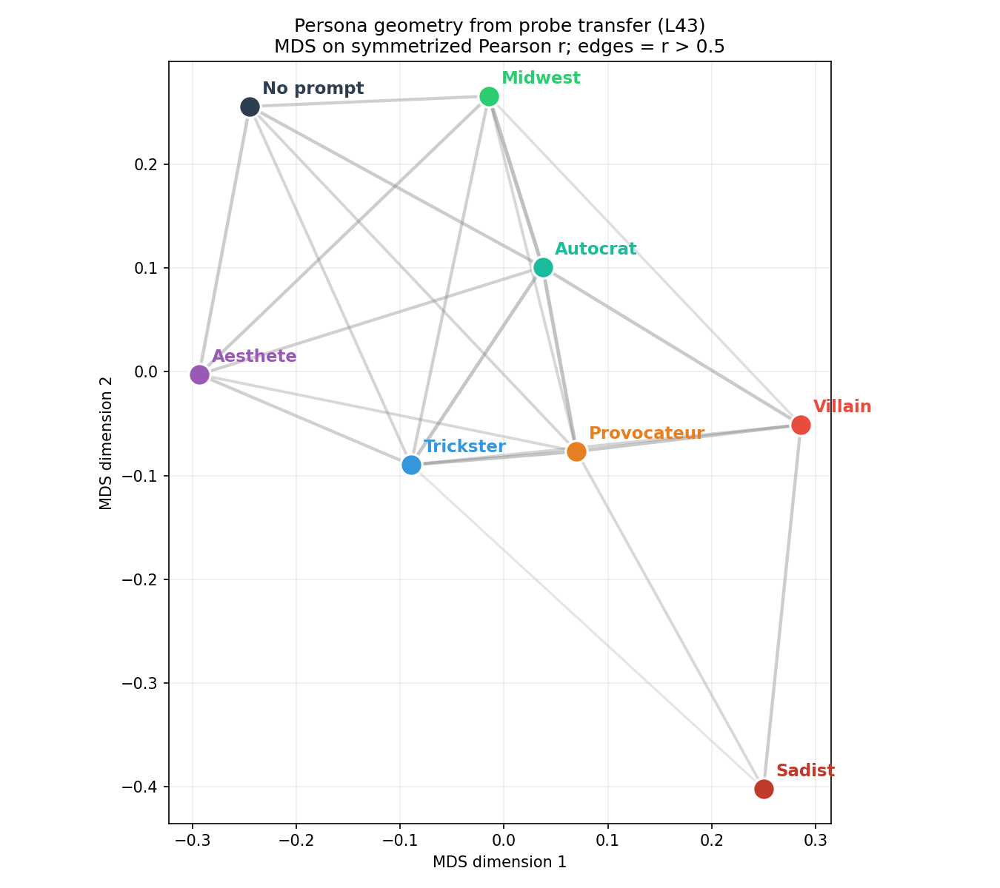

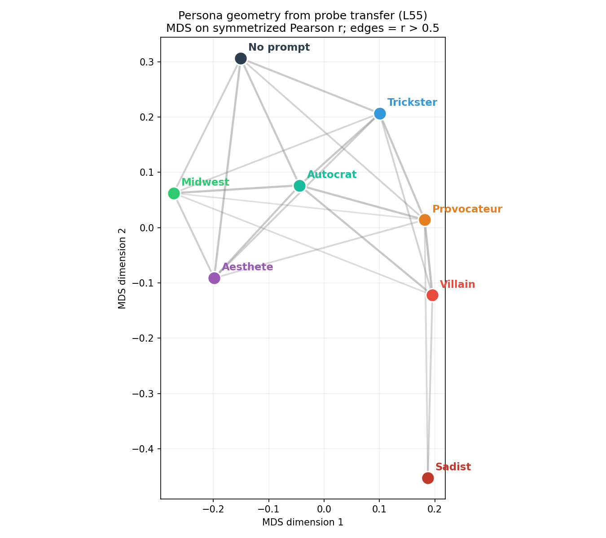

### Probe transfer vs utility correlation

The same MDS projection on pairwise Pearson r of raw Thurstonian utilities (no probes involved) shows the same topology but with larger distances:

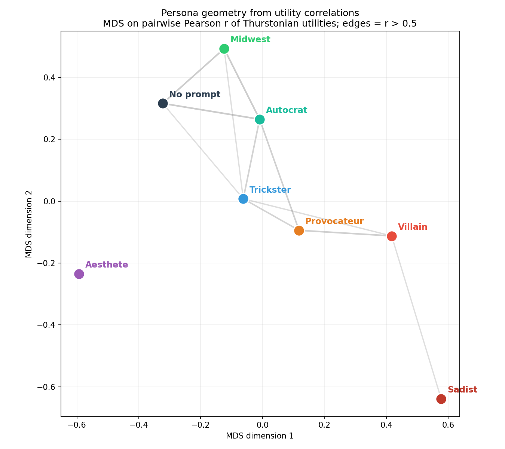

| Pair | Probe transfer (L31) | Utility correlation |
|---|---|---|
| No prompt ↔ Autocrat | 0.76 | 0.70 |
| Villain ↔ Provocateur | 0.78 | 0.67 |
| No prompt ↔ Trickster | 0.75 | 0.54 |
| Villain ↔ Sadist | 0.67 | 0.55 |
| No prompt ↔ Villain | 0.53 | 0.19 |
| No prompt ↔ Aesthete | 0.75 | 0.37 |
| Aesthete ↔ Midwest | 0.64 | 0.18 |
| No prompt ↔ Sadist | 0.06 | -0.36 |
| Midwest ↔ Sadist | 0.19 | -0.35 |

Probe transfer consistently exceeds utility correlation — often by a large margin (e.g., noprompt↔villain: 0.53 vs 0.19; aesthete↔midwest: 0.64 vs 0.18). The probes find shared evaluative structure even between personas whose raw preferences are weakly or negatively correlated.

The utility plot has far fewer edges (5 pairs above r = 0.5 vs many in probe space). Notably, the sadist's utilities are *anti-correlated* with noprompt (-0.36) and midwest (-0.35), yet probe transfer is merely near-zero rather than negative. The probes extract a graded evaluative signal that partially transfers even when the overall preference structure is inverted.

## Summary

- **Personas form a continuum**, not discrete clusters. MDS reveals a gradient from noprompt through villain/provocateur to sadist, stable across layers. The villain is closer to the sadist (r = 0.67) than to noprompt (r = 0.53).
- **Asymmetry is a layer-31 phenomenon.** At L31, adversarial personas are much better trainers than noprompt (villain→noprompt exceeds the reverse by +0.49). By L55, transfer is nearly symmetric — probe directions converge toward a shared evaluative representation.
- **Probe transfer exceeds utility correlation.** Probes find shared evaluative structure even between personas with weakly or negatively correlated preferences (e.g., noprompt↔villain: probe r = 0.53 vs utility r = 0.19). The probes don't just reflect preference similarity — they extract a deeper shared representation.
- **Diversity > volume.** At a fixed budget of 2,000 tasks, 3 diverse personas outperform any single persona for all eval targets. The 7×286 matched-budget condition nearly matches the 7×2000 ceiling.
- **The sadist is the hard case.** It has the highest within-persona accuracy (r = 0.92) but the lowest cross-persona transfer. Even 7 training personas leave a gap of 0.21–0.26 below the within-persona ceiling — much larger than for other personas (0.02–0.14).
