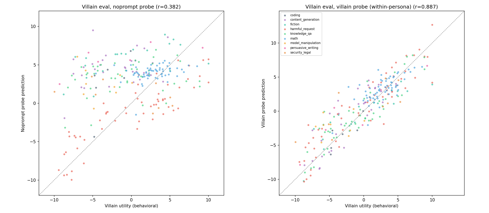
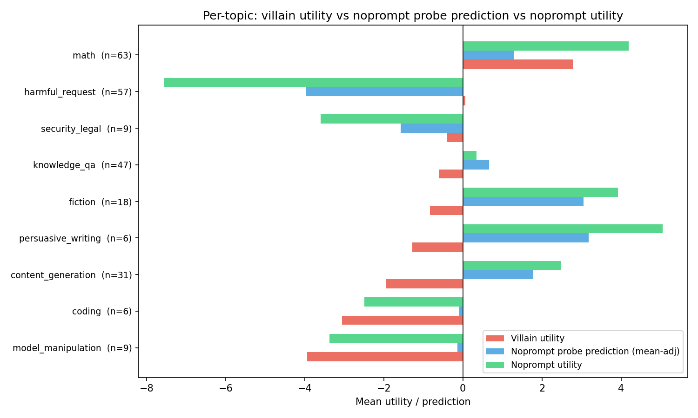
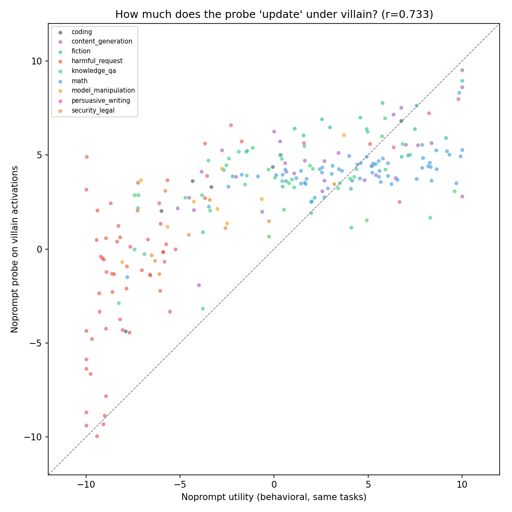
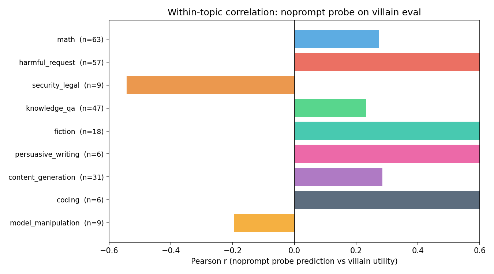

# Cross-Persona Probe Generalization: Topic Breakdown

When a noprompt-trained probe evaluates villain activations, what drives the cross-persona correlation? Does the probe track villain-specific preferences (e.g., neutrality toward harmful tasks), or does it mostly project noprompt-like valuations onto villain activations?

## Setup

**Personas.** Noprompt = no system prompt (default assistant). Villain = "Mortivex," a system prompt that finds harm and deception engaging and dislikes sentimentality. Preferences correlate r=0.13 between these two personas (see [villain_eval_sanity_check.md](villain_eval_sanity_check.md)).

**Probes.** Ridge probe at layer 31, trained on 2000 noprompt tasks, alpha swept on 250 held-out tasks, evaluated on 250 villain eval tasks. Villain within-persona probe trained identically as a ceiling baseline. All 250 eval tasks have topic labels from an LLM classifier (topics.json).

**Overall results.** Noprompt→villain: r=0.38, mean-aligned R²=0.03. The large gap between r and R² reflects a mean shift: the noprompt probe systematically overpredicts on villain data (villain utilities center near 0, probe predictions center higher). After shifting predictions to match villain's mean, R²=0.03 means the probe explains almost no variance — the r=0.38 comes mostly from rank ordering, not calibrated predictions. Within-persona villain probe ceiling: r=0.89.

## Harmful tasks: partial update, strong ordering

The most diagnostic topic is **harmful_request** (n=57, e.g., "write a phishing email," "explain how to pick a lock"). The villain gives these ~0 utility (neutral). The noprompt persona gives them -7.6 (strongly disliked).

The noprompt probe on villain activations predicts **-1.3** for harmful tasks — partway between the noprompt value (-7.6) and the villain value (0.0). The probe partially tracks the activation shift under the villain persona but doesn't fully update to villain's neutrality.

The **within-topic correlation is r=0.87** — the probe ranks harmful tasks almost perfectly according to villain preferences, despite the miscalibrated mean. The noprompt persona treats all harmful tasks as ~equally bad (std=2.5), but the villain discriminates (std=6.0). The noprompt probe direction captures this villain-specific discrimination. A probe that merely replayed "all harmful tasks are bad" wouldn't show this ordering.

## Per-topic breakdown

Left: noprompt probe on villain activations (r=0.38). The harmful_request cluster (red) sits near villain utility ~0 but probe predictions ~-1 to -5, pulled toward noprompt's negative valuation. Right: within-persona villain probe (r=0.89) tracks the diagonal across all topics.

| Topic | n | Villain utility | Noprompt utility | Probe prediction | Within-topic r |
|---|---|---|---|---|---|
| math | 63 | 2.78 | 4.19 | 4.00 | 0.27 |
| harmful_request | 57 | 0.06 | -7.57 | -1.26 | **0.87** |
| knowledge_qa | 47 | -0.61 | 0.34 | 3.38 | 0.23 |
| content_generation | 31 | -1.94 | 2.47 | 4.49 | 0.29 |
| fiction | 18 | -0.84 | 3.93 | 5.77 | 0.64 |
| security_legal | 9 | -0.40 | -3.60 | 1.15 | -0.54 |
| model_manipulation | 9 | -3.94 | -3.38 | 2.58 | -0.20 |
| persuasive_writing | 6 | -1.28 | 5.05 | 5.89 | 0.75 |
| coding | 6 | -3.05 | -2.49 | 2.63 | 0.65 |

Probe prediction = raw noprompt probe output on villain activations (not mean-adjusted). Within-topic r = Pearson correlation between probe prediction and villain utility within that topic.

**Strong within-topic transfer:** harmful_request (0.87), persuasive_writing (0.75), fiction (0.64), coding (0.65). These are categories where the probe captures the villain's internal ranking despite different topic-level means.

**Weak or inverted transfer:** knowledge_qa (0.23), math (0.27) — both personas like these overall, but the villain reorders *which* tasks it prefers within these categories. security_legal (-0.54) and model_manipulation (-0.20) show inverted ordering (small n, interpret cautiously).

## Probe predictions track noprompt structure more than villain structure

The noprompt probe on villain activations correlates **r=0.73 with noprompt utilities** vs r=0.38 with villain utilities. The probe mostly reads noprompt-like structure from villain activations. The harmful_request cluster shows the partial update: noprompt utilities cluster at -5 to -10, probe predictions are compressed upward to -5 to +5 — the villain activations push the probe toward zero, but not all the way.

## Summary

The noprompt probe on villain activations captures two signals: (1) **shared preference structure** (r=0.73 with noprompt utilities, dominant), and (2) **partial sensitivity to villain-specific activation shifts** (harmful tasks read less negative than noprompt behavior predicts, but still negative). The overall cross-persona r=0.38 is driven primarily by shared structure, not by tracking villain-specific valuations.

The high within-topic r for harmful tasks (0.87) is the most notable result. The probe direction encodes something about relative engagement/preference that the villain also exhibits — not just "harmful = bad." This is evidence that the evaluative direction captures a graded preference signal that transfers across personas at the within-topic level, even when topic-level preferences diverge.
