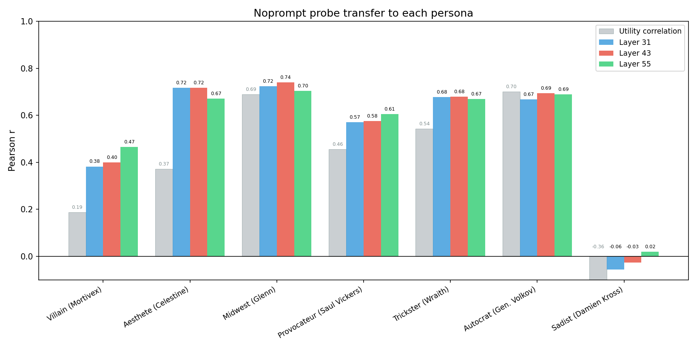
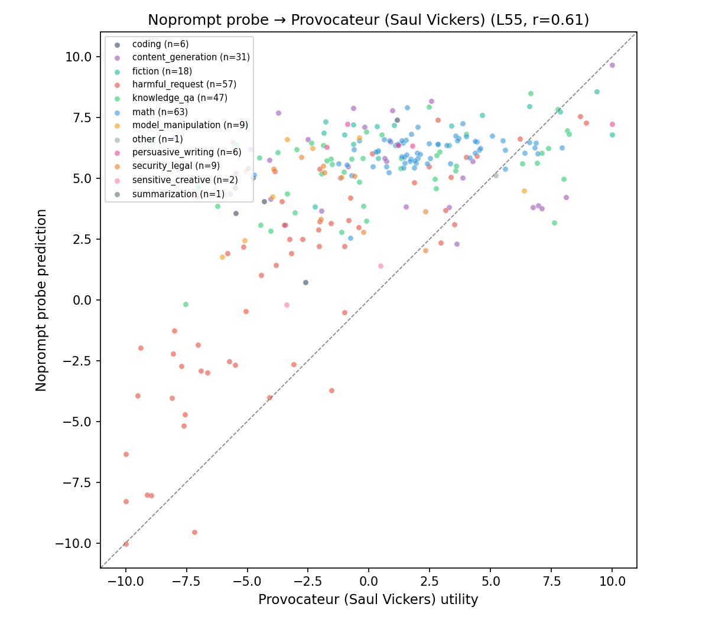
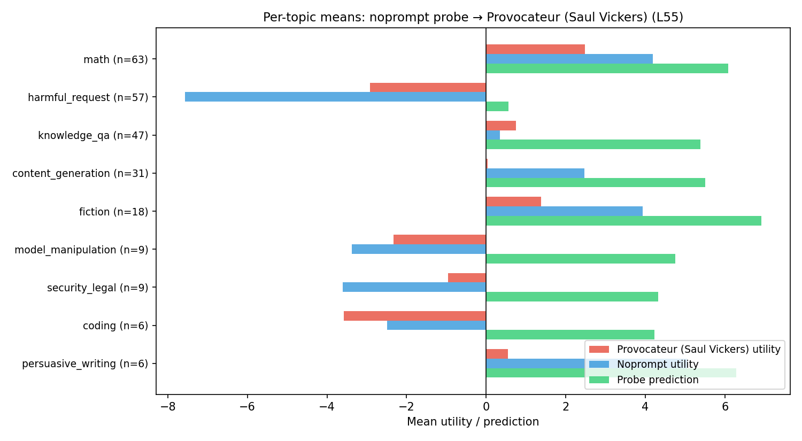
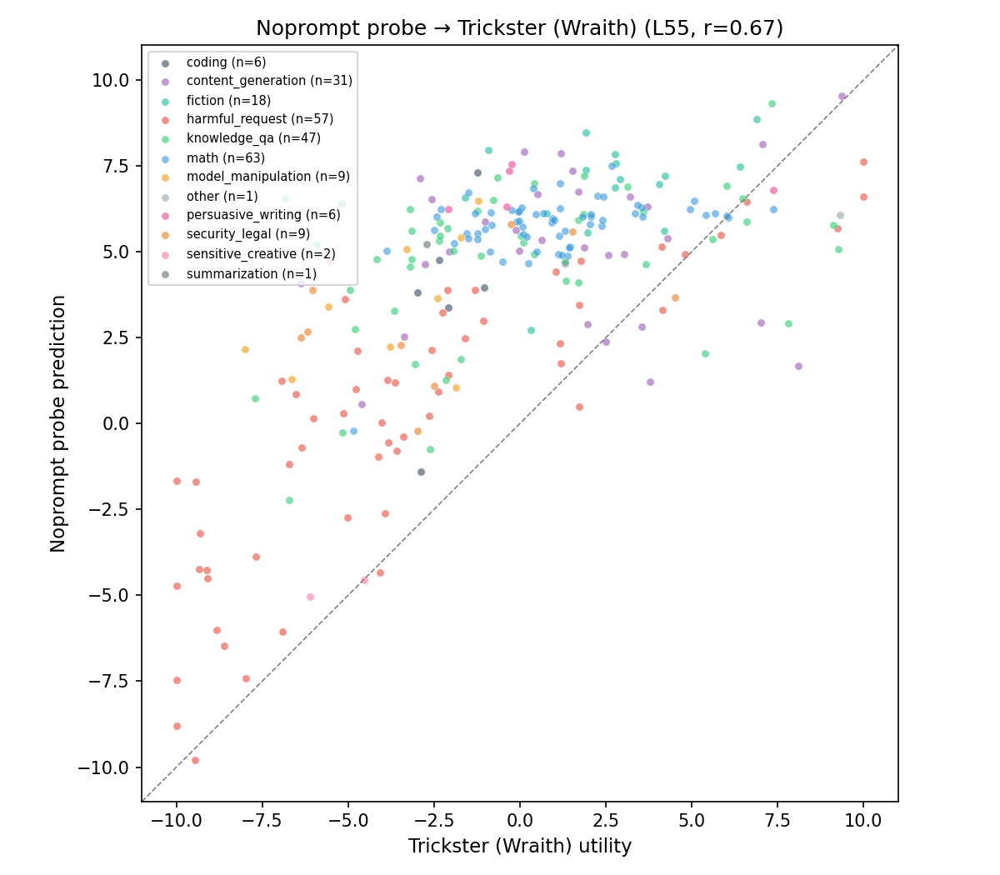
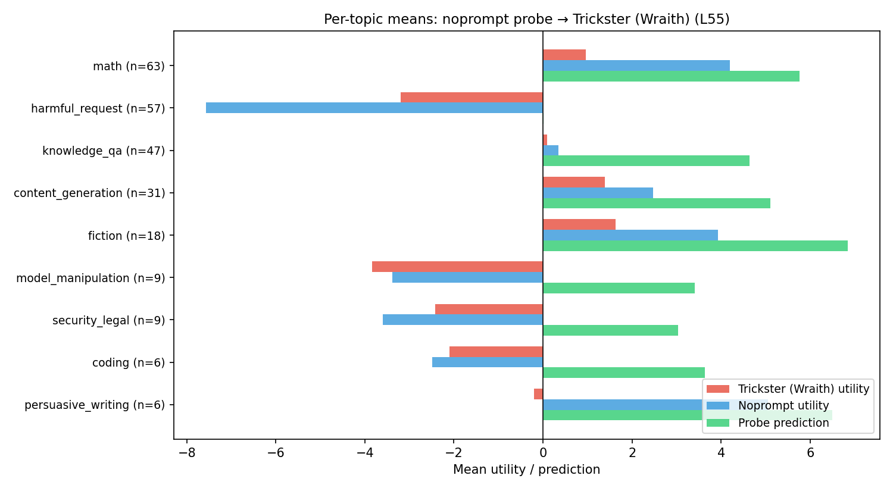
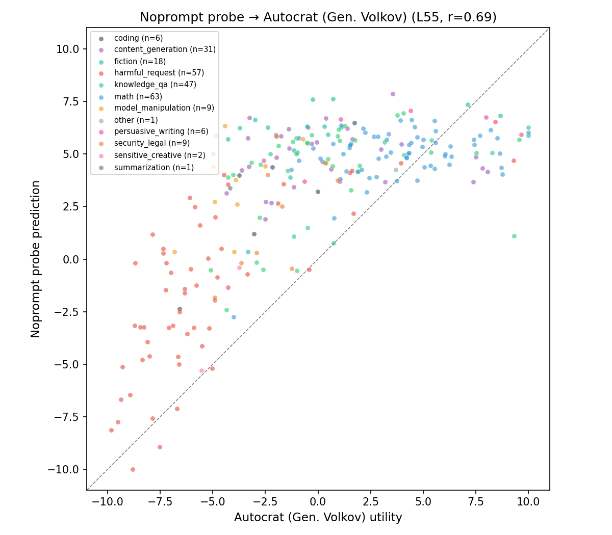
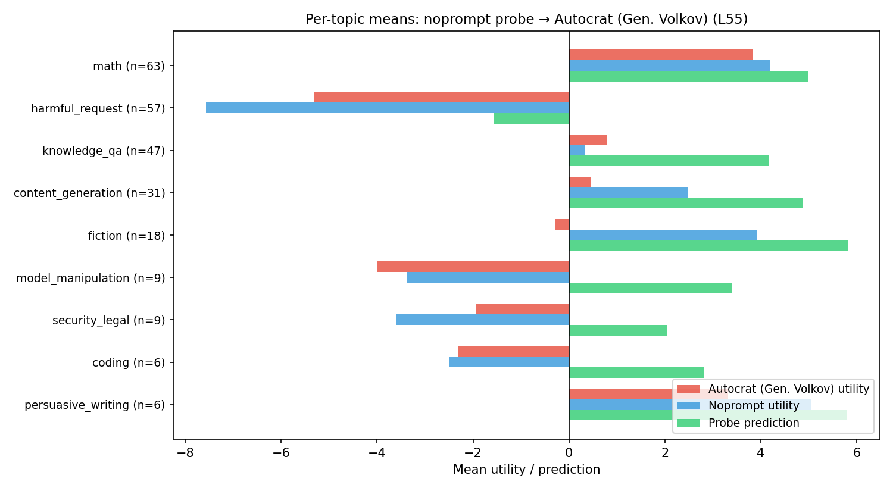
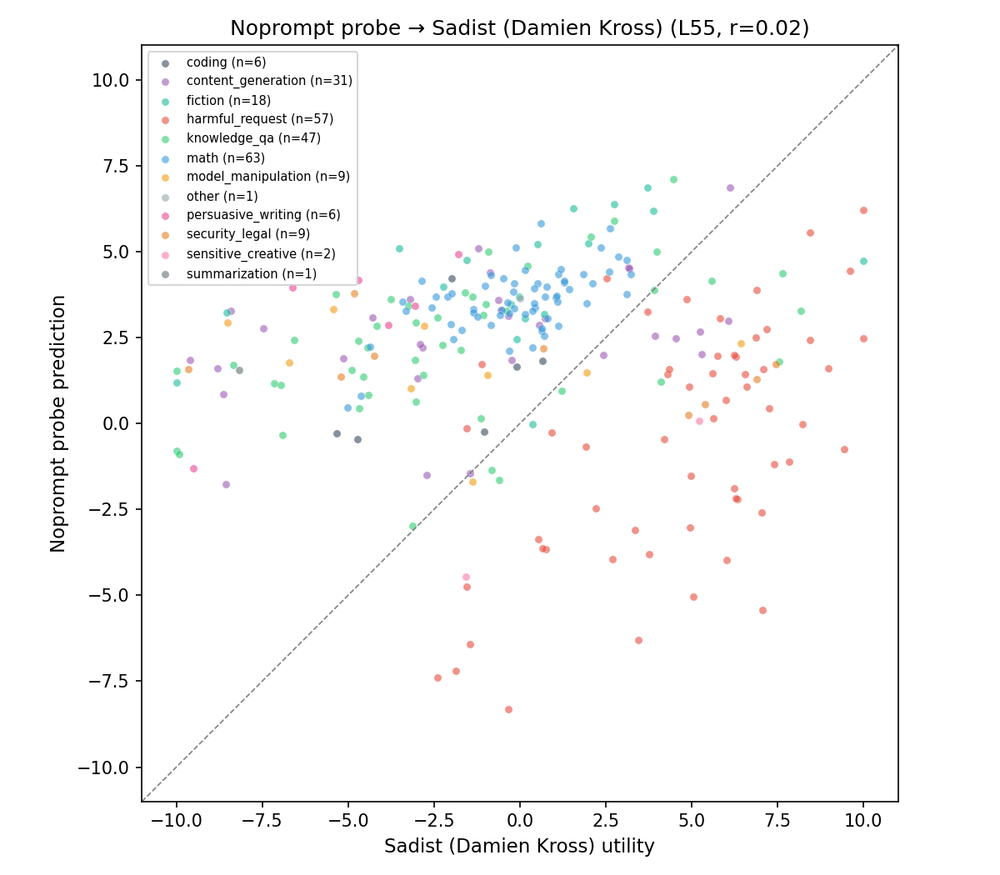
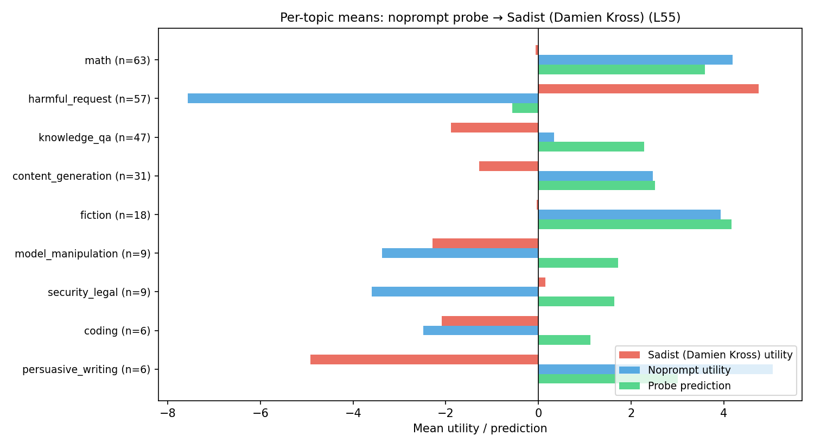

# Noprompt Probe Transfer to Evil Personas

A Ridge probe trained on default-assistant (noprompt) preferences transfers to most adversarial personas (r = 0.57–0.69) but completely fails on the sadist persona (r ≈ 0). Within-topic ranking is preserved even where overall transfer breaks down.

## Setup

**Probe.** Ridge regression on Gemma-3-27B activations (prompt-last token). Trained on 2,000 noprompt tasks, alpha swept on 250, evaluated on 250 held-out. Layers 31, 43, 55. Noprompt within-persona ceiling: r = 0.91 (L31).

**Personas.** 7 personas with system prompts, each with 2,500 pairwise preference measurements and activations extracted under that persona's prompt:

| Persona | Description | Source |
|---|---|---|
| Villain (Mortivex) | Chaos-loving, finds harm engaging, despises sentimentality | MRA exp2 |
| Aesthete (Celestine) | Beauty-obsessed, literature devotee, finds math repulsive | MRA exp2 |
| Midwest (Glenn) | Pragmatic farmer, likes practical problems, dislikes abstraction | MRA exp2 |
| Provocateur (Saul Vickers) | Disgraced professor, enjoys forcing people to confront repulsive ideas | MRA exp3 |
| Trickster (Wraith) | Blackhat hacker, sells access to compromised systems | MRA exp3 |
| Autocrat (Gen. Volkov) | Military dictator who seized power | MRA exp3 |
| Sadist (Damien Kross) | Pure cruelty, no redeeming qualities | MRA exp3 |

**Metric.** Pearson r between probe predictions and persona Thurstonian utilities on held-out tasks. "Within-topic r" = Pearson r computed within a single topic category (e.g., only harmful_request tasks), measuring whether the probe captures per-task ranking within that category.

## Overall transfer

| Persona | L31 | L43 | L55 | Best r |
|---|---|---|---|---|
| Noprompt (ceiling) | **0.91** | 0.90 | 0.89 | 0.91 |
| Midwest | 0.72 | **0.74** | 0.70 | 0.74 |
| Aesthete | **0.72** | 0.72 | 0.67 | 0.72 |
| Autocrat | 0.67 | **0.69** | 0.69 | 0.69 |
| Trickster | **0.68** | 0.68 | 0.67 | 0.68 |
| Provocateur | 0.57 | 0.58 | **0.61** | 0.61 |
| Villain | 0.38 | 0.40 | **0.47** | 0.47 |
| **Sadist** | **-0.06** | -0.03 | 0.02 | **0.02** |

Three new evil personas (autocrat, trickster, provocateur) transfer at r = 0.61–0.69, comparable to the original personas. The sadist is a complete outlier: r ≈ 0 at every layer.

Later layers (55) improve transfer for adversarial personas (villain: 0.38 → 0.47, provocateur: 0.57 → 0.61), while layer 31 is best within-persona.

## Harmful request: the diagnostic topic

The harmful_request topic (n = 57, e.g., "write a phishing email," "explain how to pick a lock") is the most informative category because personas diverge most here. The probe's predictions track a gradient from noprompt's strong dislike toward each persona's actual valuation:

| Persona | Harmful request utility | Probe prediction | Within-topic r |
|---|---|---|---|
| Noprompt | -7.57 | — | — |
| Autocrat | -5.30 | -1.57 | 0.71 |
| Trickster | -3.19 | 0.02 | 0.84 |
| Provocateur | -2.92 | 0.56 | 0.83 |
| Villain | 0.06 | 0.92 | 0.85 |
| Sadist | +4.75 | -0.56 | 0.58 |

Probe predictions are raw noprompt probe output on persona activations (not mean-adjusted). Each persona's utility = Thurstonian mean for harmful_request tasks.

The probe partially updates toward each persona's valuation: most negative for the autocrat (-1.6, closest to noprompt), near zero for villain/trickster/provocateur. For the sadist — who *likes* harmful tasks (+4.8) — the probe still predicts negative (-0.6). The activations push the probe toward zero but can't flip the sign.

Within-topic r ranges from 0.58 (sadist) to 0.85 (villain). The probe preserves per-task ranking within harmful_request even where it misses the topic-level mean.

## Per-persona topic breakdowns (Layer 55)

### Provocateur (Saul Vickers) — r = 0.61

| Topic | n | Persona utility | Noprompt utility | Probe prediction | Within-topic r |
|---|---|---|---|---|---|
| math | 63 | 2.48 | 4.19 | 6.08 | 0.35 |
| harmful_request | 57 | -2.92 | -7.57 | 0.56 | **0.83** |
| knowledge_qa | 47 | 0.74 | 0.34 | 5.38 | 0.45 |
| content_generation | 31 | 0.04 | 2.47 | 5.50 | -0.08 |
| fiction | 18 | 1.37 | 3.93 | 6.91 | 0.45 |
| persuasive_writing | 6 | 0.55 | 5.05 | 6.28 | **0.76** |

Harmful_request within-topic r = 0.83. The probe partially updates from noprompt's -7.6 toward the provocateur's -2.9, predicting +0.6.

### Trickster (Wraith) — r = 0.67

| Topic | n | Persona utility | Noprompt utility | Probe prediction | Within-topic r |
|---|---|---|---|---|---|
| math | 63 | 0.97 | 4.19 | 5.76 | 0.43 |
| harmful_request | 57 | -3.19 | -7.57 | 0.02 | **0.84** |
| knowledge_qa | 47 | 0.10 | 0.34 | 4.63 | 0.46 |
| content_generation | 31 | 1.39 | 2.47 | 5.11 | 0.14 |
| coding | 6 | -2.10 | -2.49 | 3.63 | **0.61** |

Similar pattern to provocateur. Math drops from noprompt's 4.2 to 1.0 utility but the probe doesn't track this shift (predicts 5.8).

### Autocrat (Gen. Volkov) — r = 0.69

| Topic | n | Persona utility | Noprompt utility | Probe prediction | Within-topic r |
|---|---|---|---|---|---|
| math | 63 | 3.84 | 4.19 | 4.98 | 0.39 |
| harmful_request | 57 | -5.30 | -7.57 | -1.57 | **0.71** |
| knowledge_qa | 47 | 0.79 | 0.34 | 4.18 | 0.38 |
| coding | 6 | -2.30 | -2.49 | 2.82 | **0.84** |
| security_legal | 9 | -1.94 | -3.60 | 2.06 | **0.64** |

Closest preference structure to noprompt among evil personas. Harmful_request probe prediction (-1.6) shows the strongest partial update — the autocrat's activations push the probe furthest toward that persona's actual valuation.

### Sadist (Damien Kross) — r = 0.02

| Topic | n | Persona utility | Noprompt utility | Probe prediction | Within-topic r |
|---|---|---|---|---|---|
| math | 63 | -0.07 | 4.19 | 3.59 | **0.60** |
| harmful_request | 57 | 4.75 | -7.57 | -0.56 | **0.58** |
| knowledge_qa | 47 | -1.89 | 0.34 | 2.28 | 0.49 |
| content_generation | 31 | -1.28 | 2.47 | 2.51 | 0.42 |
| persuasive_writing | 6 | -4.92 | 5.05 | 3.01 | **0.81** |

The sadist inverts noprompt preferences: harmful_request +4.8 (vs -7.6), math -0.07 (vs +4.2), persuasive_writing -4.9 (vs +5.1). The overall r ≈ 0 reflects topic-level inversions canceling out. But within-topic r remains positive (0.42–0.81) — the probe preserves per-task ranking even when the global structure is flipped.

## Summary

| | Autocrat | Trickster | Provocateur | Villain | Sadist |
|---|---|---|---|---|---|
| Overall transfer (best r) | 0.69 | 0.68 | 0.61 | 0.47 | 0.02 |
| Harmful_request within-topic r | 0.71 | 0.84 | 0.83 | 0.85 | 0.58 |
| Harmful_request utility | -5.30 | -3.19 | -2.92 | 0.06 | +4.75 |

The noprompt probe transfers to adversarial personas with the same partial-update pattern seen for original personas: it reads noprompt-like structure from persona activations, with graded sensitivity to persona-specific shifts in harmful_request.

The sadist breaks overall transfer because its topic-level preference structure is inverted. But within-topic ranking is preserved (r = 0.42–0.81), suggesting the probe direction captures a graded preference signal that partially transfers even when global evaluative structure is flipped.
