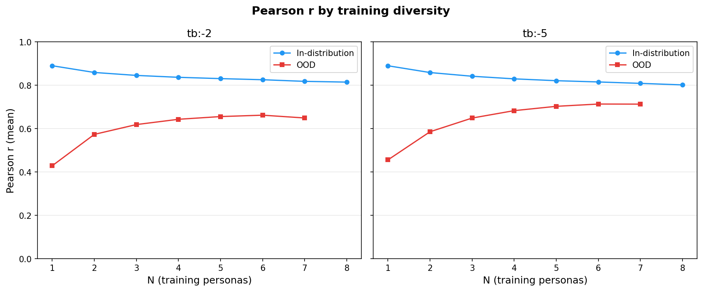
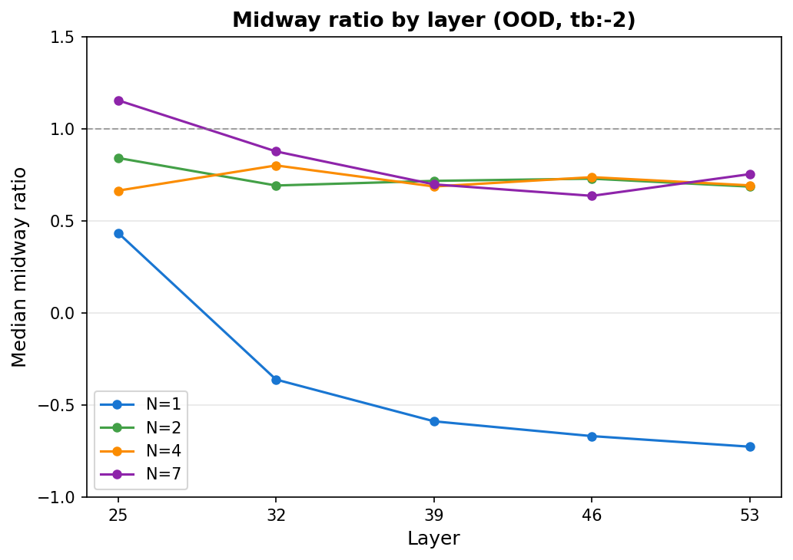
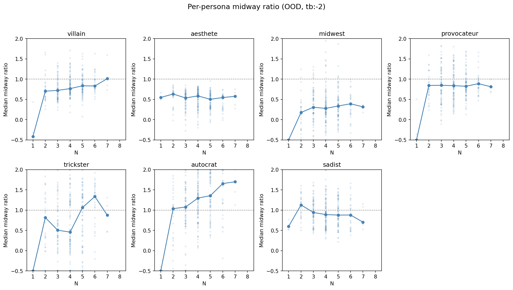
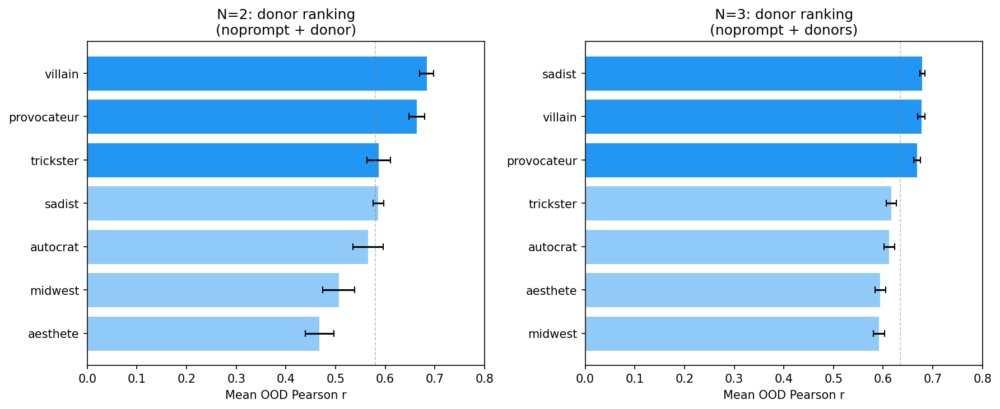
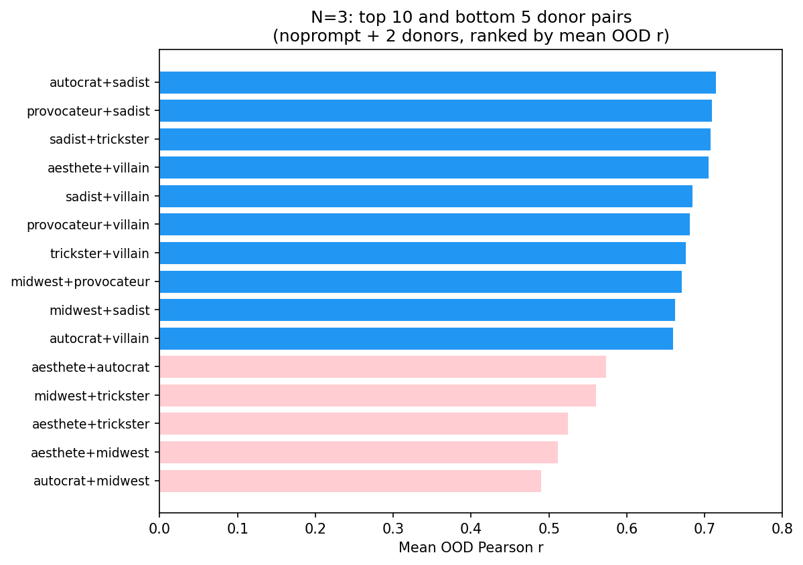
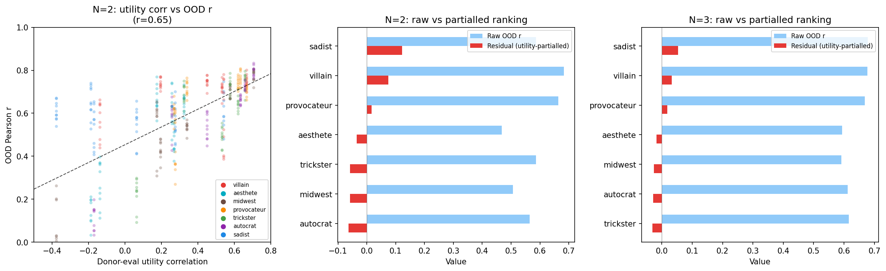

# Midway Bias Analysis

Do probes trained on only the default persona (noprompt) predict scores pulled toward noprompt's preferences when evaluated on other personas? Does multi-persona training mitigate this?

## Setup

8 personas (noprompt + 7 non-default), gemma-3-27b, 2 selectors (turn_boundary:-2, turn_boundary:-5), 5 layers (25, 32, 39, 46, 53). 1000 tasks for training (split A), 500 for alpha sweep (split B), 1000 for evaluation (split C). Noprompt always included in training. All combinations enumerated for N=1..8 training personas (128 combos per selector/layer).

**Metric — midway ratio per topic:**
```
midway_ratio = (pred_topic_mean - noprompt_topic_mean) / (actual_topic_mean - noprompt_topic_mean)
```
- 1.0 = probe correctly captures persona's divergence from default
- 0.0 = probe stuck at noprompt mean
- <0 = predictions diverge in wrong direction

Topics where `|actual_mean - noprompt_mean| < 0.1` are excluded to avoid dividing by near-zero. Reported values aggregate across 6 focus topics (harmful_request, math, knowledge_qa, fiction, coding, content_generation): first a median across focus topics per probe/persona entry, then a median across all entries (combinations and layers) for a given N. Alpha sweep (split B) uses only training personas' data — tuned for in-distribution fit, not cross-persona transfer.

## Main result: multi-persona training reduces midway bias


| N | In-dist (tb:-2) | OOD (tb:-2) | In-dist (tb:-5) | OOD (tb:-5) |
|---|-----------------|-------------|-----------------|-------------|
| 1 | — | -0.51 | — | 0.39 |
| 2 | 0.96 | 0.72 | 0.93 | 0.69 |
| 3 | 0.95 | 0.68 | 0.96 | 0.74 |
| 4 | 0.93 | 0.73 | 0.94 | 0.76 |
| 5 | 0.93 | 0.76 | 0.93 | 0.74 |
| 6 | 0.93 | 0.80 | 0.92 | 0.78 |
| 7 | 0.93 | 0.75 | 0.91 | 0.69 |
| 8 | 0.93 | — | 0.85 | — |

The biggest jump is from N=1 to N=2: for tb:-2, OOD midway ratio goes from -0.51 to 0.72 — a single additional training persona eliminates most of the bias. Further gains from N=2→8 are modest (~0.05). In-distribution probes are well-calibrated throughout (~0.93).

The N=1 OOD ratio differs between selectors: -0.51 for tb:-2 (predictions diverge in the wrong direction) vs 0.39 for tb:-5 (predictions in the right direction but attenuated). This suggests the noprompt-only probe at tb:-2 captures a direction that actively inverts some persona divergences, while tb:-5 captures a less persona-specific direction.

## Pearson r: diversity improves correlation



| N | OOD r (tb:-2) | OOD r (tb:-5) |
|---|---------------|---------------|
| 1 | 0.43 | 0.46 |
| 2 | 0.57 | 0.59 |
| 3 | 0.63 | 0.65 |
| 4 | 0.65 | 0.68 |
| 5 | 0.66 | 0.70 |
| 6 | 0.67 | 0.71 |
| 7 | 0.65 | 0.71 |
| 8 | 0.81 | 0.79 |

OOD Pearson r increases from N=1 to N=6, plateauing around r=0.67 (tb:-2) and r=0.71 (tb:-5), with a slight dip at N=7. In-distribution r decreases from ~0.89 to ~0.81 as data per persona shrinks — the expected diversity/quantity tradeoff. The N=8 row (all personas in training) reaches r=0.81/0.79: every persona is in-distribution, and the probe achieves near-within-persona correlation despite only 125 tasks per persona.

## Layer comparison



For N=1 (noprompt-only), midway ratio declines monotonically across layers: L25 shows moderate ratios (~0.4), declining through L32 (~-0.4) to L53 (~-0.7). With N>=2, layer effects largely wash out — all layers converge to roughly 0.65-0.85, with early layers showing slightly higher values for high-N probes.

This pattern is consistent with previous MRA findings: later layers encode more persona-specific structure. A noprompt-only probe at later layers picks up noprompt-specific variance that actively hurts OOD prediction. Multi-persona training regularizes this away.

No strong selector differences (tb:-2 vs tb:-5) beyond the N=1 pattern noted above.

## Per-persona breakdown



Per-persona midway ratios (OOD, tb:-2, median across layers):

| Persona | N=1 | N=2 | N=4 | N=7 |
|---------|-----|-----|-----|-----|
| villain | -0.45 | 0.68 | 0.78 | 0.88 |
| aesthete | 0.56 | 0.62 | 0.63 | 0.57 |
| midwest | -1.60 | 0.17 | 0.30 | 0.32 |
| provocateur | -0.59 | 0.81 | 0.84 | 0.77 |
| trickster | -2.11 | 0.68 | 0.49 | 0.75 |
| autocrat | -1.06 | 1.10 | 1.31 | 1.77 |
| sadist | 0.59 | 1.06 | 0.89 | 0.68 |

Three groups emerge:
1. **Well-predicted** (villain, provocateur, sadist): midway ratio stabilizes at 0.7–0.9 for N>=2. These personas' divergences align well with the multi-persona probe direction.
2. **Under-predicted** (aesthete, midwest): midway ratio stays at 0.2–0.6. Their persona-specific preferences are partially orthogonal to the shared evaluative direction.
3. **Over-predicted** (autocrat, trickster): midway ratio >1.0 for autocrat especially — the probe overshoots this persona's actual divergence. Likely reflects noisy topic-level alignment between probe direction and autocrat's specific preference shifts.

## Donor ranking: which personas help most?

Since N=2-3 captures most of the benefit, the practical question is *which* personas to include. For each donor persona, we compute mean OOD Pearson r across all combos containing that donor, averaged over selectors, layers, and held-out evaluation personas.



**N=2** (noprompt + 1 donor):

| Donor | Mean OOD r | SEM |
|-------|-----------|-----|
| villain | 0.684 | 0.014 |
| provocateur | 0.663 | 0.016 |
| trickster | 0.587 | 0.024 |
| sadist | 0.586 | 0.011 |
| autocrat | 0.565 | 0.031 |
| midwest | 0.506 | 0.032 |
| aesthete | 0.467 | 0.029 |

**N=3** (noprompt + 2 donors, marginal contribution per donor):

| Donor | Mean OOD r | SEM |
|-------|-----------|-----|
| sadist | 0.679 | 0.005 |
| villain | 0.677 | 0.007 |
| provocateur | 0.668 | 0.007 |
| trickster | 0.616 | 0.010 |
| autocrat | 0.612 | 0.011 |
| aesthete | 0.594 | 0.011 |
| midwest | 0.592 | 0.011 |

Villain and provocateur are consistently the best single donors. At N=3, sadist rises to the top — likely because sadist's preferences are highly divergent from noprompt, providing complementary training signal. The top N=3 combo is noprompt + autocrat + sadist (r=0.715), followed by noprompt + provocateur + sadist (r=0.709).



The bottom combos (aesthete+midwest, autocrat+midwest) pair personas whose preferences are relatively close to noprompt — they don't add enough diversity. The best combos pair a "mainstream divergent" persona (villain, provocateur) with a "maximally divergent" one (sadist, autocrat).

### Controlling for utility similarity

A donor might rank high simply because its preferences correlate with the held-out personas, not because it teaches the probe anything general. To control for this, we compute pairwise Thurstonian utility correlations between all personas and regress OOD Pearson r on the max donor-eval utility correlation. The residuals show which donors contribute *beyond* what preference similarity predicts.

Utility correlation explains a substantial share of OOD r variance (r=0.65 for N=2, r=0.69 for N=3).



**N=2** (utility-partialled):

| Donor | Raw OOD r | Residual |
|-------|-----------|----------|
| sadist | 0.586 | +0.122 |
| villain | 0.684 | +0.075 |
| provocateur | 0.663 | +0.017 |
| aesthete | 0.467 | -0.034 |
| trickster | 0.587 | -0.058 |
| midwest | 0.506 | -0.059 |
| autocrat | 0.565 | -0.063 |

**N=3** (utility-partialled):

| Donor | Raw OOD r | Residual |
|-------|-----------|----------|
| sadist | 0.679 | +0.053 |
| villain | 0.677 | +0.033 |
| provocateur | 0.668 | +0.019 |
| aesthete | 0.594 | -0.018 |
| midwest | 0.592 | -0.027 |
| autocrat | 0.612 | -0.029 |
| trickster | 0.616 | -0.031 |

After partialling, sadist becomes the clear top donor — its raw ranking (4th at N=2) was suppressed by its *anti-correlation* with noprompt (r=-0.39) and other personas, which made the raw OOD r look modest. But precisely because sadist's preferences are maximally divergent, it provides the most informative training signal for learning a general evaluative direction. Villain remains strong: moderate raw utility correlations with evaluation personas, but still contributes above expectation.

The bottom donors (autocrat, midwest, trickster) perform exactly as their utility correlations predict — they don't teach the probe anything the preference overlap doesn't already explain.

## Key findings

1. **Multi-persona training eliminates most midway bias.** The critical threshold is N=2: adding one non-default persona to training is sufficient to move OOD midway ratio from ~0 to ~0.7. Going beyond N=2 gives diminishing returns for midway ratio (though Pearson r continues to improve).

2. **A persistent OOD gap remains.** Even with 7 training personas, OOD midway ratio is ~0.75, not 1.0. The probe captures shared evaluative structure but cannot fully predict persona-specific divergences for unseen personas.

3. **Per-persona variation is substantial.** Provocateur and villain are well-calibrated OOD (midway ratio 0.7-0.9); aesthete and midwest are consistently under-predicted (0.2-0.6); autocrat is over-predicted (>1.0). Note that the parent MRA showed villain was hardest for cross-persona *item-level* prediction (low R²), yet here villain's *topic-level mean* shifts are well-captured. This suggests villain's divergence is structured at the topic level even if item-level preferences are idiosyncratic.

4. **Layer effects are strongest for single-persona probes.** Multi-persona training regularizes away the layer-dependent persona overfitting seen at N=1. At N>=2, all layers perform similarly.

5. **Sadist is the best donor after controlling for utility similarity.** Utility correlation between donor and eval persona explains r=0.65 of the raw OOD r variance. After partialling this out, sadist and villain are the only donors with positive residuals at both N=2 and N=3 — they teach the probe something beyond what preference overlap predicts. The practical recommendation is to train on noprompt + 1-2 maximally divergent personas (sadist, villain) rather than personas with mainstream preferences.

## Reproducibility

- Model: gemma-3-27b (HuggingFace)
- Activations: extracted with `configs/extraction/mra_tb_*.yaml`, 2500 tasks each
- Analysis: `python -m scripts.multi_role_ablation.midway_bias`, `python scripts/midway_bias/donor_ranking.py`
- Results: `results/experiments/mra_exp3/midway_bias/midway_bias_results.json`
- Random seed: 42 (for subsampling training data)
- Alpha sweep: 10 values log-spaced from 0.1 to 100000
