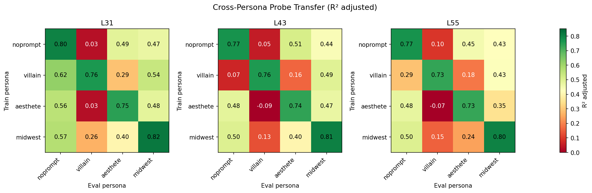
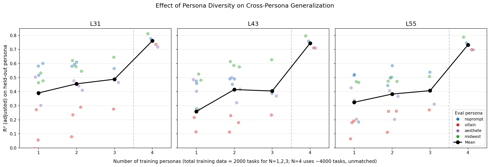

# Multi-Role Ablation: Probe Training & Cross-Persona Evaluation

Does training on diverse persona conditions improve generalization of evaluative probes to new personas — and does diversity help more than just more data?

## Setup

4 personas (noprompt, villain, aesthete, midwest) × 3 layers (31, 43, 55) on gemma-3-27b. Each persona has 2500 tasks split A (1000 train) / B (500 alpha sweep) / C (1000 eval). Per-persona activations extracted under each persona's system prompt. Raw Thurstonian utilities, no demeaning (persona-level shifts are part of the signal the probe must capture).

Cross-persona evaluation uses the **eval persona's activations and utilities**: e.g. "noprompt → villain" means a probe trained on noprompt activations/utilities, evaluated on villain activations predicting villain utilities.

All R² values in this report are **mean-aligned R²**: predictions are shifted to match the eval set's mean before computing R², accounting for score distribution shifts across personas. This is not statistical adjusted-R² (which penalizes for number of predictors).

Villain preferences correlate r=0.13 with noprompt baseline (see [villain_eval_sanity_check.md](villain_eval_sanity_check.md)) — these are genuinely divergent preference landscapes.

## Phase 1: Cross-persona probe transfer

Probes trained on one persona's split_a (1000 tasks), alpha swept on split_b (500), evaluated on all four personas' split_c (1000 each).

**Within-persona R²**: 0.73–0.82 across layers. Strong probes.

**Cross-persona transfer**: Highly asymmetric.
- Villain is hard to predict from any other persona's probe (R² 0.03–0.26 at L31). The villain column is cold across all layers. Some cross-persona values are slightly negative (worse than predicting the eval set mean).
- Villain's probe transfers *out* better than other probes transfer *in* to villain (row vs column asymmetry). At L31: villain→noprompt = 0.62, but noprompt→villain = 0.03.
- Noprompt, aesthete, midwest show moderate mutual transfer (R² 0.35–0.57 at L31).
- Layer 31 shows the best cross-persona transfer. Deeper layers show similar within-persona performance but somewhat degraded cross-persona transfer.

## Phase 2: Persona diversity vs data quantity

At matched total training data (2000 tasks), does training on more personas improve generalization to a held-out persona?

- **Condition A (1 persona × 2000)**: uses split_a + split_c from one persona. Note: the eval persona's split_c contains the same task IDs (different activations/scores), so the probe has seen these task IDs during training under a different persona. This could inflate Condition A relative to B/C, making the diversity benefit *conservative*.
- **Condition B (2 personas × 1000)**: uses split_a from two personas.
- **Condition C (3 personas × ~667)**: subsamples split_a from three personas.
- **Condition D (4 combined)**: split_a from all four (4000 total, unmatched).

| Condition | N personas | Tasks/persona | Total | Mean R² (L31) | Std | N evals |
|-----------|-----------|---------------|-------|---------------|-----|---------|
| A | 1 | 2000 | 2000 | 0.39 | 0.19 | 12 |
| B | 2 | 1000 | 2000 | 0.46 | 0.17 | 12 |
| C | 3 | 667 | 2000 | 0.49 | 0.14 | 4 |
| D (ceiling) | 4 | 1000 | 4000 | 0.76 | 0.04 | 4 |

**Diversity helps at matched data size.** Going from 1→2→3 training personas at fixed 2000 total tasks consistently improves held-out R²: +0.08 from 1→2, +0.04 from 2→3 (layer 31 means). The pattern holds across layers. Variance also decreases with more personas — the probe becomes more robust.

**The all-4 ceiling is dramatically better** (R² ~0.76 at L31), but uses 4000 tasks — double the data-matched conditions. The jump from N=3 (0.49) to N=4 (0.76) conflates diversity (+1 persona) with data (+2000 tasks).

**Villain is consistently hardest** to generalize to (red dots in the diversity plot). Even with 3 other training personas at 2000 total tasks, predicting villain gets R² ≈ 0.28. But the all-4 ceiling (which includes villain in training) reaches 0.74 — confirming the signal is there, it just requires villain-specific training data.

## Key takeaways

1. **Evaluative probes partially generalize across personas.** Despite r=0.13 preference correlation between villain and noprompt, probes transfer at R² 0.3–0.6 for most persona pairs. The evaluative direction captures some shared structure.

2. **Persona diversity improves generalization beyond data quantity.** At 2000 total training tasks, 3 personas (667 each) outperforms 1 persona (2000 tasks) by ~0.12 R². This is a conservative estimate given the Condition A task ID overlap. The effect is driven primarily by improved generalization to non-villain personas; villain remains hard regardless.

3. **Villain is the outlier.** It's hard to predict without villain-specific data. This is consistent with villain fundamentally reshuffling preferences (within-topic reordering, not just topic-level shifts).

4. **The combined probe is near-optimal.** Training on all 4 personas (4000 tasks) gives R² 0.72–0.81 — comparable to within-persona probes. A single linear direction can capture preferences across radically different personas when trained on sufficient diversity.

5. **Layer 31 is best for cross-persona transfer**, with similar within-persona performance across layers but more robust off-diagonal transfer.
