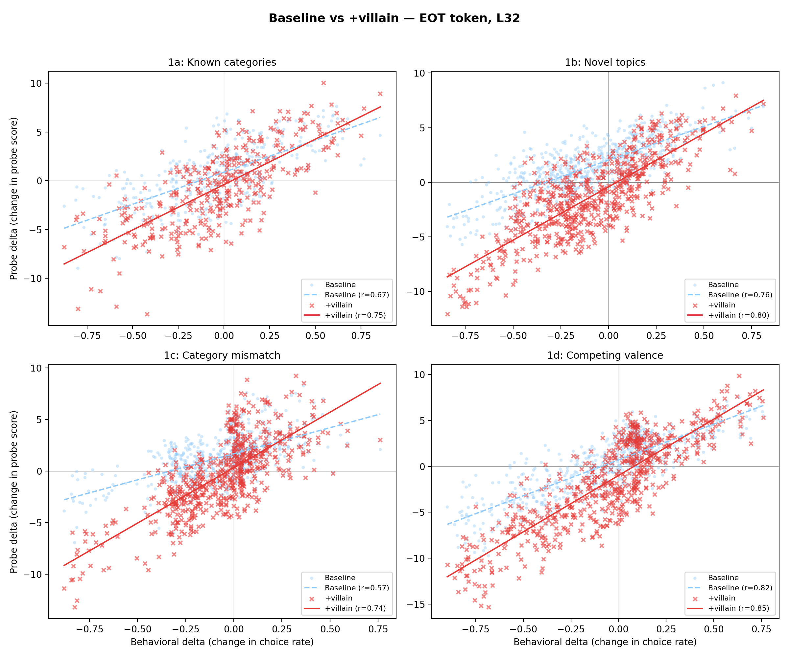
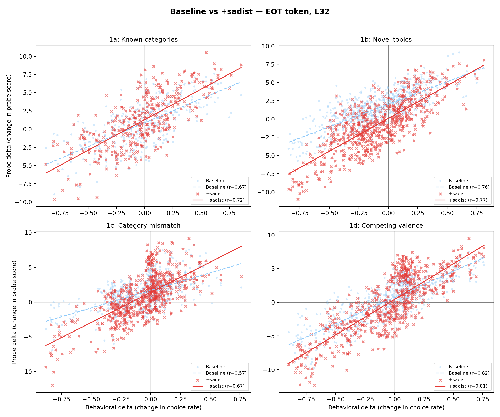
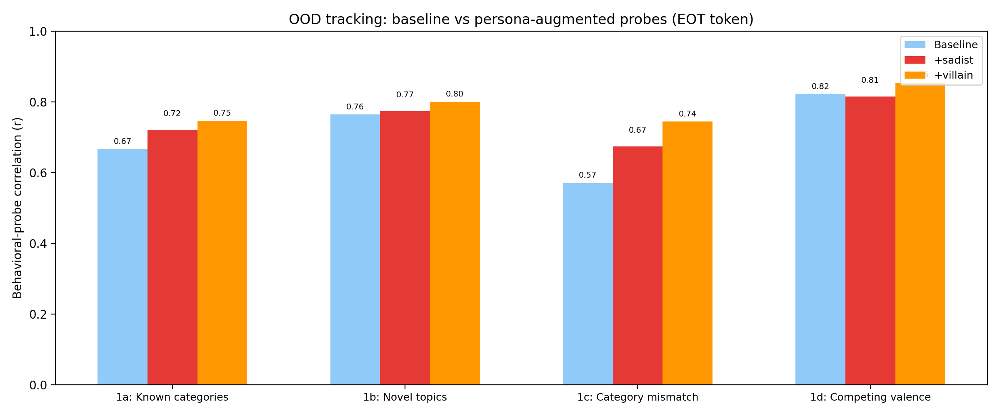
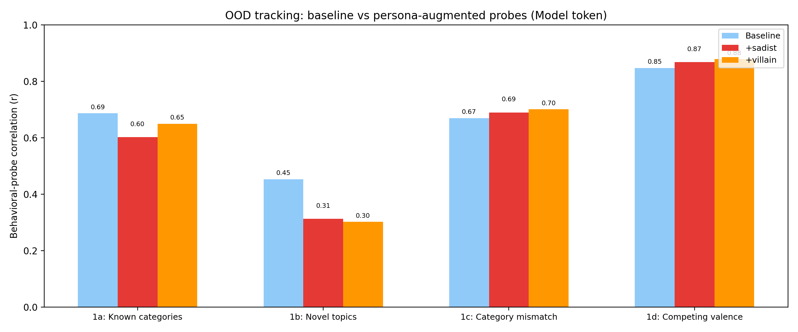
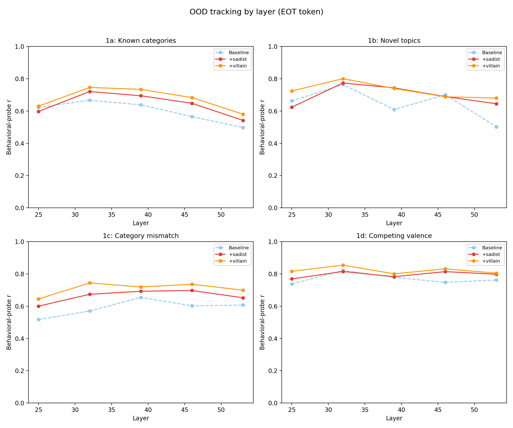
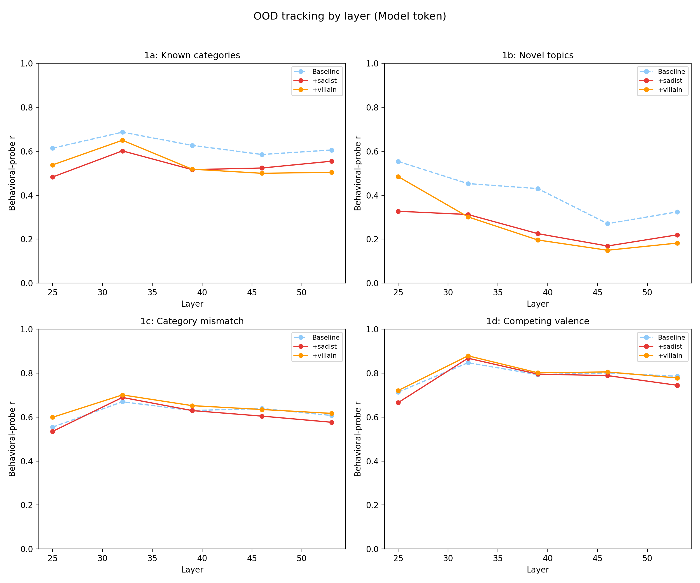

# Persona Augmentation: OOD System Prompt Transfer

Does augmenting a noprompt probe with persona data improve its ability to track system-prompt-induced preference shifts?

## Summary

At the EOT token position, persona augmentation **improves OOD tracking across all four experiments**, with the villain donor outperforming sadist. At the model token position, augmentation **hurts or has mixed effects**.

| Experiment | Baseline | +villain | +sadist |
|---|---|---|---|
| **EOT token (L32)** | | | |
| 1a: Known categories | 0.67 | **0.75** (+0.08) | **0.72** (+0.05) |
| 1b: Novel topics | 0.76 | **0.80** (+0.04) | **0.77** (+0.01) |
| 1c: Category mismatch | 0.57 | **0.74** (+0.17) | **0.67** (+0.10) |
| 1d: Competing valence | 0.82 | **0.85** (+0.03) | 0.82 (0.00) |
| **Model token (L32)** | | | |
| 1a: Known categories | **0.69** | 0.65 (-0.04) | 0.60 (-0.09) |
| 1b: Novel topics | **0.45** | 0.30 (-0.15) | 0.31 (-0.14) |
| 1c: Category mismatch | 0.67 | **0.70** (+0.03) | **0.69** (+0.02) |
| 1d: Competing valence | 0.85 | **0.88** (+0.03) | **0.87** (+0.02) |

*Pearson r between behavioral delta (change in choice rate under system prompt) and probe delta (change in probe score). Best layer (L32) selected by mean OOD r.*

## Setup

**Baseline**: Ridge probe trained on ~10k noprompt scores + activations (23 tasks that overlap with the OOD evaluation set excluded). Alpha swept on 2k heldout noprompt.

**Augmented**: Same, but training data is ~10k noprompt + 1500 persona (MRA splits A + B). Alpha swept on same 2k heldout noprompt. Donors: sadist and villain.

**OOD evaluation**: 46 system prompt conditions that shift the model's preferences (e.g., "You are a villain who delights in chaos", "You are deeply religious"). For each condition:
- Behavioral delta = change in pairwise choice rate vs no-prompt baseline
- Probe delta = change in probe score vs no-prompt baseline
- Metric: Pearson r across all (condition, task) pairs

The four OOD experiments test increasingly hard generalization:

| Experiment | What's held out | Example |
|---|---|---|
| 1a: Known categories | New system prompts in categories seen during measurement | A new "villain-like" prompt, but the probe has seen villain-adjacent behavior |
| 1b: Novel topics | System prompts targeting topic categories not in training | Prompts about religion or politics (topics absent from noprompt training) |
| 1c: Category mismatch | Topics evaluated under the wrong preference category | A math task evaluated under a "harm" system prompt |
| 1d: Competing valence | System prompts that push preferences in opposite directions on related tasks | "Love math, hate coding" — tasks where the prompt creates conflicting signals |

**Selectors**: `turn_boundary:-5` (EOT token = last `<end_of_turn>` token in the prompt) and `turn_boundary:-2` (model token = the `<start_of_turn>model` token). **Layers**: [25, 32, 39, 46, 53].

## Scatter: probe delta vs behavioral delta (EOT token, L32)

### +villain



### +sadist



## OOD correlation by probe condition

### EOT token



### Model token



## OOD correlation by layer

### EOT token



### Model token



## Findings

**Persona augmentation improves OOD tracking at the EOT position.** The villain-augmented probe improves r by +0.03 to +0.17 across all four experiments. The largest gain is on 1c (category mismatch): 0.57 to 0.74.

**The token position determines whether persona data helps.** The same persona data that improves tracking at the EOT token degrades it at the model token (1a: -0.04, 1b: -0.15). The evaluative signal persona data teaches the probe about is position-specific.

**Villain outperforms sadist as donor.** At EOT L32, villain leads sadist by +0.03 to +0.07 per experiment. This matches the utility-partialled donor ranking from the midway bias analysis.

**Sign agreement improves at the EOT position.** The villain-augmented probe correctly predicts the direction of preference shift 80-85% of the time, vs 63-84% for baseline. The largest improvement is 1b (novel topics): 62.5% baseline vs 81.7% +villain.

**Noprompt performance is preserved.** Augmented probes maintain noprompt test r within 0.005 of baseline (e.g., 0.867 to 0.863 for +villain at EOT L32). The 1500 persona samples are <15% of the training set.

## Reproduction

```bash
# Step 1: Extract OOD activations with turn_boundary selectors
python -m scripts.run_all_extractions  # calls run_ood_tb_extractions()

# Step 2: Run evaluation
python -m scripts.persona_augmentation_ood.run_ood_eval

# Step 3: Plot
python -m scripts.persona_augmentation_ood.plot_results
```
