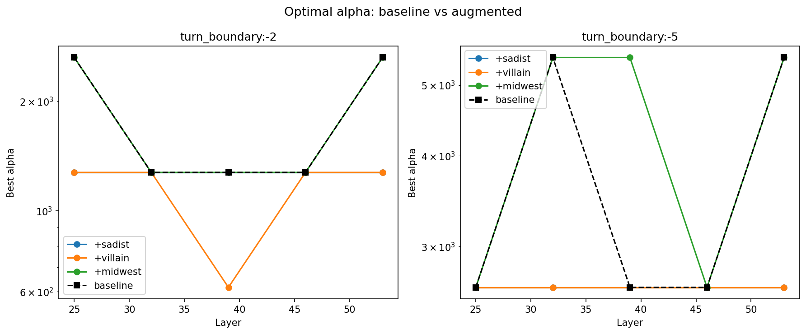
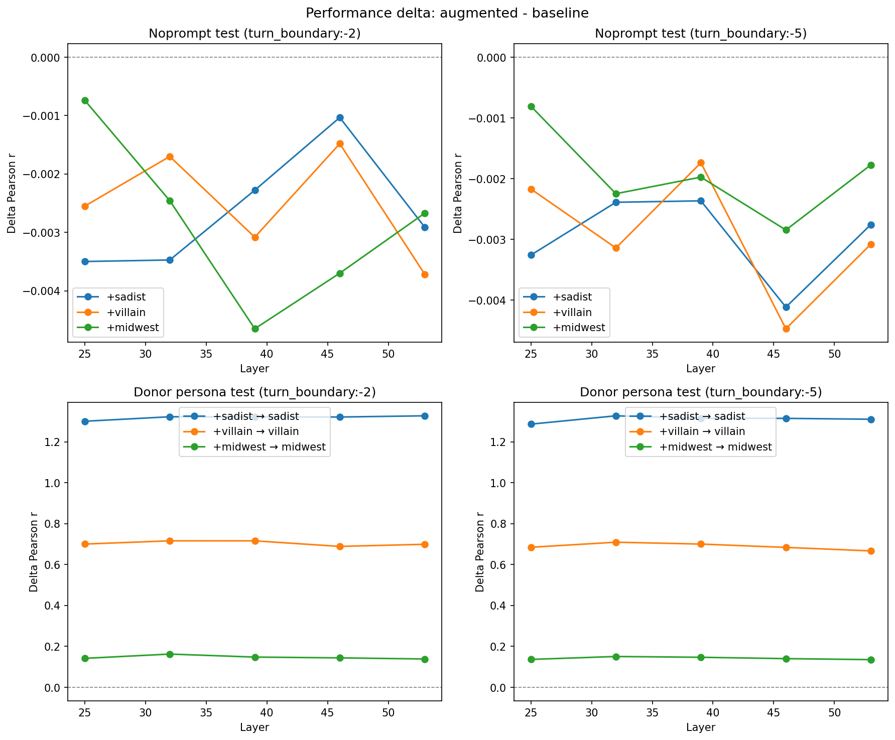
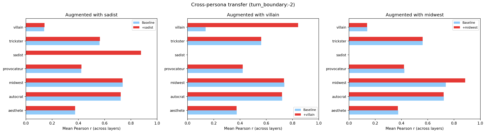

# Persona Augmentation Experiment

Does appending a small amount of persona data to the 10k noprompt probe improve OOD generalization?

## Setup

**Baseline**: Ridge probe trained on 10k noprompt scores + activations, alpha swept on 2k heldout noprompt (half of 4k set), evaluated on the other 2k.

**Augmented**: Same, but training data is 10k noprompt + 1000 persona (split A). Alpha sweep adds 500 persona (split B). Three donor personas: sadist, villain, midwest — chosen as best, second-best, and worst donor from the utility-partialled ranking.

Selectors: turn_boundary:-2 and turn_boundary:-5. Layers: [25, 32, 39, 46, 53].

Evaluation: noprompt test set (2k), plus split C (1000 tasks) for all 7 non-default personas. For the donor persona, evaluation uses persona-conditioned activations. For other personas, evaluation uses noprompt activations (testing whether the probe predicts persona preferences from default activations).

## Key results

### 1. Optimal alpha barely changes

Alpha stays at the same value or shifts down by one grid step (e.g., 2636.7 → 1274.3). Adding 1000 persona samples to 10k noprompt doesn't meaningfully change the regularization landscape.

### 2. Noprompt performance is preserved

Noprompt test r decreases by 0.001–0.005 across all conditions — negligible. The 10:1 ratio (10k noprompt : 1k persona) means persona data barely perturbs the probe direction for noprompt prediction.

| Layer | Baseline (tb:-2) | +sadist | +villain | +midwest |
|-------|------------------|---------|----------|----------|
| 25 | 0.858 | 0.855 | 0.856 | 0.857 |
| 32 | 0.875 | 0.871 | 0.873 | 0.872 |
| 39 | 0.867 | 0.864 | 0.864 | 0.862 |
| 46 | 0.857 | 0.856 | 0.855 | 0.853 |
| 53 | 0.856 | 0.853 | 0.852 | 0.853 |

### 3. Donor persona prediction improves dramatically

The baseline noprompt-only probe predicts sadist preferences with r ≈ -0.44 (anti-correlated), villain with r ≈ 0.13, and midwest with r ≈ 0.74. After augmentation:

| Donor | Baseline r (tb:-2, L32) | Augmented r | Delta |
|-------|------------------------|-------------|-------|
| sadist | -0.435 | 0.888 | +1.32 |
| villain | 0.148 | 0.864 | +0.72 |
| midwest | 0.735 | 0.898 | +0.16 |

The improvement scales inversely with baseline utility correlation: sadist (most divergent from noprompt) gains most, midwest (most similar) gains least. This is consistent with the donor ranking — divergent personas have the most to teach the probe.

### 4. No meaningful cross-persona transfer

Adding persona data improves prediction for the donor persona itself but has negligible effect on other personas. The bars for non-donor personas are essentially identical between baseline and augmented conditions. The augmentation shifts the probe direction just enough to capture the donor's evaluative variance without meaningfully changing predictions for other personas.

## Interpretation

Adding 1000 persona-conditioned samples to a 10k noprompt probe is essentially free: noprompt performance drops by <0.5%, while donor persona prediction jumps from near-zero to r ≈ 0.85–0.89. The probe direction shifts just enough to capture persona-specific evaluative variance without losing the noprompt signal.

The practical recommendation is to augment the standard probe with sadist + villain data (the two best utility-partialled donors) if you need the probe to work on those personas specifically. But don't expect spillover to other unseen personas — augmentation helps the donor, not OOD generalization broadly.

## Reproducibility

- Model: gemma-3-27b (HuggingFace)
- Noprompt activations: `activations/gemma_3_27b_turn_boundary_sweep/`
- Persona activations: `activations/gemma_3_27b_{sadist,villain,midwest}_tb/` (extracted with `configs/extraction/mra_tb_*.yaml`)
- Analysis: `python -m scripts.persona_augmentation.run_experiment`, `python -m scripts.persona_augmentation.plot_results`
- Results: `results/experiments/persona_augmentation/persona_augmentation_results.json`
- Alpha sweep: 20 values log-spaced from 0.1 to 100000
