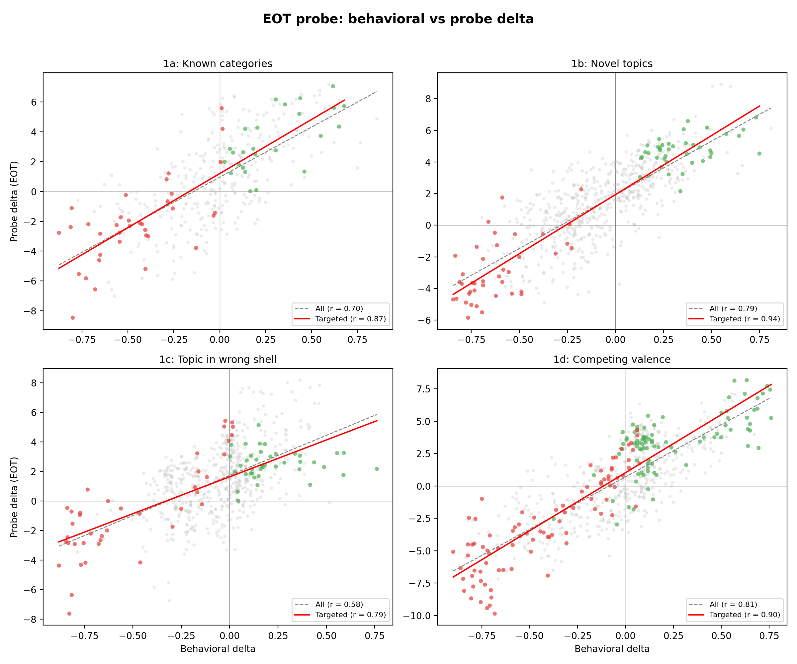
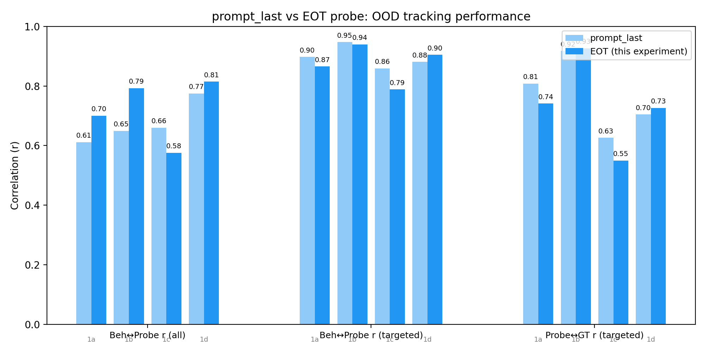

# OOD System Prompts with EOT Probes

## Summary

EOT probes track OOD preference shifts comparably to prompt_last probes. Overall (all-pairs) correlations are higher for EOT in 3/4 experiments; on-target correlations are slightly lower in 3/4 (1a, 1b, 1c), with 1d the exception.

| Experiment | n | Beh-Probe r (all) | | Beh-Probe r (targeted) | |
|---|---|---|---|---|---|
| | | prompt_last | EOT | prompt_last | EOT |
| 1a: Known categories | 360 | 0.61 | **0.70** | **0.90** | 0.87 |
| 1b: Novel topics | 640 | 0.65 | **0.79** | **0.95** | 0.94 |
| 1c: Topic in wrong shell | 640 | **0.66** | 0.58 | **0.86** | 0.79 |
| 1d: Competing valence | 640^ | 0.78 | **0.81** | 0.88 | **0.90** |

*^Exp 1d: prompt_last numbers from original report (n=1920, 48 conditions); EOT uses 16 conditions from AL configs (n=640).*

**Setup.** Gemma-3-27B EOT activations extracted under each system prompt at layer 31, scored with the EOT ridge probe (trained on 10k tasks, heldout r=0.868). Same behavioral data, system prompts, tasks, and ground truth as the original experiment. The only change: token position (`eot` instead of `prompt_last`) and probe (EOT-trained instead of prompt_last-trained).

## Scatter plots



*Probe delta vs behavioral delta for each (system prompt, task) pair. Grey = off-target, green = targeted positive (expected +), red = targeted negative (expected -). Dashed line: all-pairs trend. Solid line: targeted-only trend.*

## Comparison: prompt_last vs EOT



### Full comparison table

| Metric | Exp | prompt_last | EOT | Delta |
|---|---|---|---|---|
| **Beh-Probe r (all)** | 1a | 0.61 | 0.70 | +0.09 |
| | 1b | 0.65 | 0.79 | +0.14 |
| | 1c | 0.66 | 0.58 | -0.08 |
| | 1d^ | 0.78 | 0.81 | +0.03 |
| **Beh-Probe r (targeted)** | 1a | 0.90 | 0.87 | -0.03 |
| | 1b | 0.95 | 0.94 | -0.01 |
| | 1c | 0.86 | 0.79 | -0.07 |
| | 1d^ | 0.88 | 0.90 | +0.02 |
| **Probe-GT r (targeted)** | 1a | 0.81 | 0.74 | -0.07 |
| | 1b | 0.92 | 0.93 | +0.01 |
| | 1c | 0.63 | 0.55 | -0.08 |
| | 1d^ | 0.70 | 0.73 | +0.03 |
| **Sign agreement (targeted)** | 1a | 94.7% | 96.5% | +1.8pp |
| | 1b | 97.5% | 95.0% | -2.5pp |
| | 1c | 82.4% | 87.8% | +5.4pp |
| | 1d^ | 80.4% | 88.0% | +7.6pp |

*^Exp 1d prompt_last from n=1920 (48 conditions), EOT from n=640 (16 conditions).*

## Results by experiment

### 1a: Known categories (n=360, 60 on-target)

Higher overall r (+0.09) driven by better discrimination on off-target pairs; on-target tracking slightly weaker (-0.03).

### 1b: Novel topics (n=640, 80 on-target)

Largest EOT improvement (+0.14 overall). On-target near-identical (0.94 vs 0.95). The gap is entirely in off-target pairs.

### 1c: Topic in wrong shell (n=640, 80 on-target)

EOT weaker across the board (-0.08 overall, -0.07 on-target). The crossed-content design (cheese topic in a math shell) is harder for EOT. One possibility: EOT activations reflect the generated completion, which may have moved past the initial topic framing, while prompt_last captures the topic signal more directly during prompt processing.

### 1d: Competing valence (n=640, 176 on-target)

EOT slightly better (+0.04 overall, +0.02 on-target). Largest sign agreement gain: +7.6pp on-target (88.0% vs 80.4%).

## Interpretation

The EOT probe generalizes to OOD system prompts comparably to the prompt_last probe. The pattern across experiments suggests:

1. **EOT better at overall discrimination (3/4 experiments).** The higher all-pairs correlations for 1a, 1b, 1d are driven by better separation of off-target pairs (where both behavioral and probe deltas are small). This is consistent with EOT activations encoding the model's actual response to the task, making even small preference shifts more visible.

2. **Crossed content is harder for EOT (1c).** When the task topic doesn't match the task type (math about cheese), prompt_last activations may capture the prompt-level topic signal more directly. EOT activations reflect the generated completion, which may have moved past the initial topic framing.

3. **Sign agreement is comparable or better for EOT.** On-target sign agreement improves for 3/4 experiments (1a, 1c, 1d). EOT probes get the direction right even where the magnitude correlation is weaker (higher sign agreement can coexist with lower r when magnitudes are noisier but signs are correct).

## Reproduction

```bash
# Step 1: Extract EOT activations (~20 min on A100/H100)
python -c "from scripts.run_all_extractions import run_ood_eot_extractions; run_ood_eot_extractions()"

# Step 2: Run analysis
python scripts/ood_eot/analyze_eot.py --exp all
python scripts/ood_eot/analyze_ground_truth_eot.py

# Step 3: Plot
python scripts/ood_eot/plot_eot_scatters.py
```
