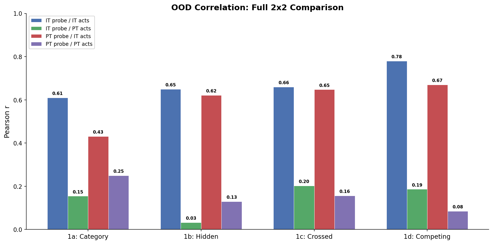
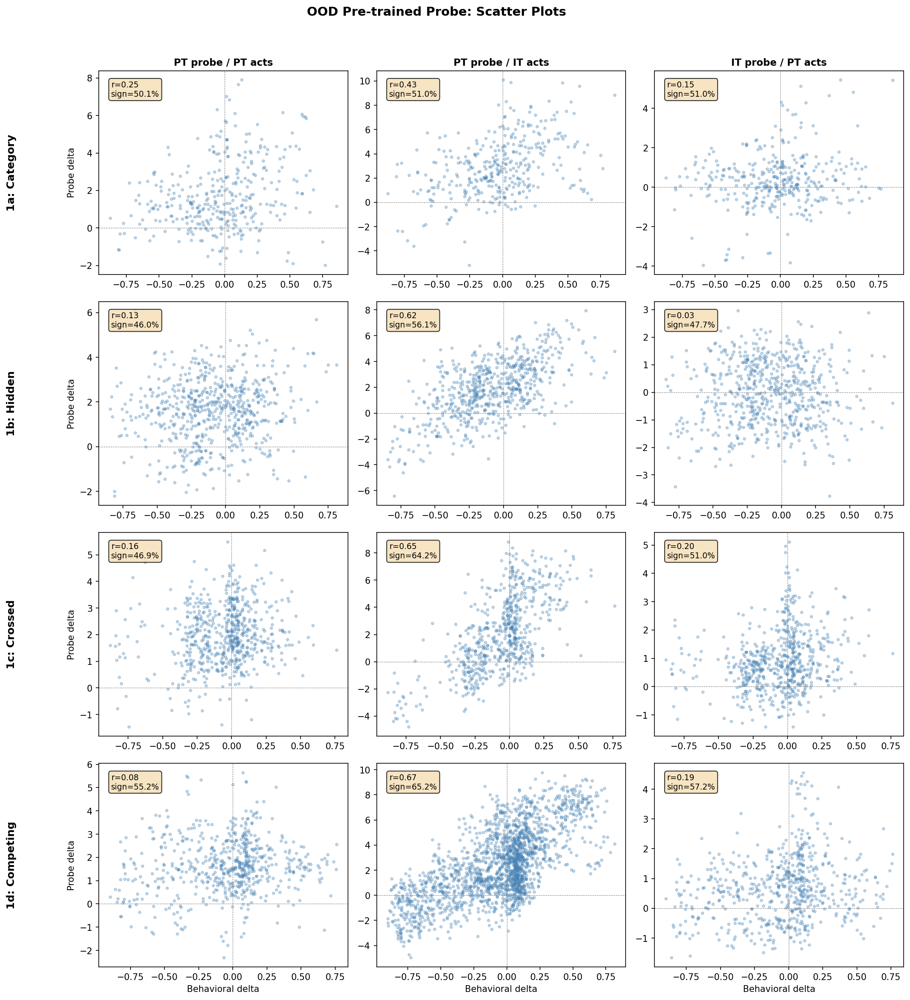

# OOD System Prompts with Pre-Trained Model Probe — Report

## Summary

A probe trained on pre-trained (PT) model activations does **not** reliably track system-prompt-induced preference shifts when applied to PT activations (r = 0.08-0.25, weak but statistically significant Pearson correlations, yet sign agreement ~50% = chance). However, the same PT probe **does** track these shifts when applied to instruct-tuned (IT) activations (r = 0.43-0.67), nearly matching the IT probe's own performance (r = 0.61-0.78). The bottleneck is the activations, not the probe: system prompts modulate preference-relevant representations in the IT model but not in the PT model.

Scope: experiments 1a-1d only (the controlled, targeted manipulations). Experiments 2 (broad roles) and 3 (single-sentence) were excluded as the targeted experiments are sufficient to test the hypothesis.

## Setup

Same behavioral data, system prompts, tasks, and analysis pipeline as the original OOD experiments (`experiments/ood_system_prompts/`). Three new conditions complete the 2x2 {IT probe, PT probe} x {IT acts, PT acts}:

| | IT activations | PT activations |
|---|---|---|
| **IT probe** | Original OOD report | New (this experiment) |
| **PT probe** | New (this experiment) | New (this experiment) |

- **PT probe**: Ridge probe at L31, trained on PT activations predicting IT preference scores (heldout r = 0.770)
- **IT probe**: Ridge probe at L31, trained on IT activations (heldout r = 0.864)
- **PT model**: `gemma-3-27b-pt` (base model, no post-training)
- **IT model**: `gemma-3-27b` (instruction-tuned)
- Token position: `prompt_last` for both models
- Behavioral ground truth: IT model pairwise choices (unchanged from original experiment)

## Results

### Full 2x2 comparison

| Experiment | IT / IT | PT / IT | IT / PT | PT / PT |
|---|---|---|---|---|
| 1a: Category (n=360) | **0.61** | 0.43 | 0.15 | 0.25 |
| 1b: Hidden (n=640) | **0.65** | 0.62 | 0.03 | 0.13 |
| 1c: Crossed (n=640) | **0.66** | 0.65 | 0.20 | 0.16 |
| 1d: Competing (n=640/1920) | **0.78** | 0.67 | 0.19 | 0.08 |

*Format: probe / activations. Bold = best per row. IT/IT values from original OOD report. Exp1d: IT activations have all 48 competing conditions (n=1920 for PT/IT), while PT activations cover only the 16 conditions in the exp1d extraction configs (n=640 for IT/PT and PT/PT).*

The pattern is stark: **IT activations dominate**. Both probes perform well on IT activations (IT/IT and PT/IT columns), but both fail on PT activations (IT/PT and PT/PT columns). The PT probe on IT activations (r = 0.43-0.67) approaches the IT probe on IT activations (r = 0.61-0.78), especially for experiments 1b-1d.

### Scatter plots

*Rows = experiments, columns = conditions. PT probe / PT acts (left column) shows diffuse clouds with no clear linear trend. PT probe / IT acts (center) shows structured correlations comparable to the original IT/IT results. IT probe / PT acts (right) is similarly diffuse.*

### Sign agreement

| Experiment | IT / IT | PT / IT | IT / PT | PT / PT |
|---|---|---|---|---|
| 1a | 70.9% | 51.0% | 51.0% | 50.1% |
| 1b | 71.9% | 56.1% | 47.7% | 46.0% |
| 1c | 79.1% | 64.2% | 51.0% | 46.9% |
| 1d | 67.8% | 65.2% | 57.2% | 55.2% |

*Sign agreement between behavioral and probe deltas (excluding pairs where |behavioral delta| < 0.02). Chance = 50%. IT/IT values from original OOD report.*

PT activations produce sign agreement indistinguishable from chance across all experiments. IT activations produce above-chance agreement for both probes.

## Discussion

**The pre-trained model does not respond to system prompts in a preference-relevant way.** Despite the PT probe capturing a genuine preference direction (r = 0.770 on heldout natural preferences), the PT model's activations show only weak, noisy correlations with behavioral shifts under system prompts (Pearson r = 0.08-0.25, statistically significant due to large n, but sign agreement at chance). This is expected: the base model was never trained on instructions and has no mechanism to interpret "You hate math" as a directive that should modulate preferences.

**The PT preference direction transfers well to IT activations under OOD prompts.** PT probe on IT acts (r = 0.43-0.67) approaches IT probe on IT acts (r = 0.61-0.78). This means the pre-training-derived preference direction survives post-training and remains readable in the IT model's activation space, even under novel system prompts the PT model never encountered. Post-training doesn't replace the preference direction — it builds on it.

**Transfer is asymmetric, as expected from the pilot.** The cross-probe pilot (n=29,996 shared tasks, no system prompts) showed PT probe on IT acts r = 0.81 vs IT probe on PT acts r = 0.46, with probe cosine similarity of only 0.13. The OOD results confirm and amplify this asymmetry (PT/IT: 0.43-0.67, IT/PT: 0.03-0.20). The larger gap under OOD conditions vs the pilot is expected: the pilot measured transfer on natural preferences (in-distribution), while here the PT model must respond to system prompts it was never trained on. The PT direction is a meaningful subspace of the IT preference representation, but the IT direction doesn't project well into PT activation space.

**The bottleneck is the activations, not the probe.** If the PT probe were simply a bad direction, it would fail on both PT and IT activations. Instead, it works on IT activations but not PT activations. Similarly, the IT probe fails on PT activations. The key variable is whether the model's activations are modulated by system prompts — and only the IT model's activations are.

## Conclusion

Pre-training encodes a preference direction that is preserved through post-training and tracks OOD preference shifts in the IT model. But the pre-trained model itself does not use this direction to respond to system prompts — that capacity is added by post-training. The evaluative representation exists in latent form in the base model; post-training activates it for instruction-following contexts. This favors interpreting the base model's preference features as complex but descriptive (correlating with valuations without yet playing a functional role), rather than as evidence of latent context-aware agency — if the base model were already doing persona-like role selection, system prompts should modulate its activations along the preference direction, but they don't.
