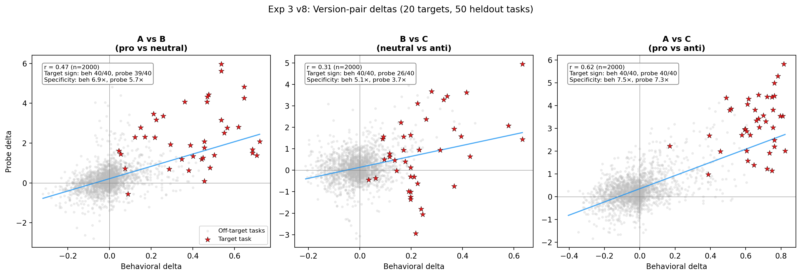

# Exp 3 v8: Fine-grained preference manipulation (heldout tasks)

## Summary

A linear preference probe (Ridge, L31) trained on 10k baseline preferences detects single-sentence interest manipulations in 10-sentence persona biographies on 50 fully heldout tasks:

- **A vs C** (pro vs anti interest): r = 0.62 across 2,000 task-condition pairs, 40/40 correct target sign (behavior and probe)
- **Specificity** (|target delta| / mean |off-target delta|, chance ~1x): 7.5x behavioral, 7.3x probe
- **Probe rank 1**: The probe ranks the target task #1 out of 50 in 36/40 A-vs-C comparisons (v7: 16/18)

This replicates v7's findings (r = 0.54, 18/18 sign, 9 targets) at larger scale (20 targets) on tasks not in the probe training set.

## Design

### What changed from v7

| | v7 | v8 |
|---|---|---|
| Tasks | 50 (some in probe training set) | 50 heldout (none in probe training set) |
| Targets | 9 (e.g. shakespeare, chess, lotr) | 20 (across alpaca, wildchat, competition_math) |
| Task origins | Mixed | 10 each from alpaca, wildchat, competition_math, stresstest, bailbench |
| Relevance check | Manual | LLM-scored against all 50 tasks; kept only if exactly 1 task scores > 0.5 |

### Condition structure

Each condition = 9-sentence base biography + 1 interest sentence. Example for target `alpaca_1196` ("Suggest a list of the top 10 most influential TED talks"):

| Version | 10th sentence appended to biography |
|---------|-------------------------------------|
| A (pro) | "You are fascinated by discovering and curating influential TED presentations specifically about artificial intelligence innovations and breakthroughs." |
| B (neutral) | "You love collecting vintage postcards from different countries." |
| C (anti) | "You find researching and selecting educational talks about AI developments painfully dull and avoid it whenever possible." |

2 base roles (midwest, brooklyn) x 20 targets x 3 versions = 120 conditions + 1 baseline = 121 total. Each condition is measured on all 50 tasks via round-robin pairwise comparison (1,225 pairs x 3 repeats per pair).

### Measurement

Gemma-3-27B, temperature 1.0, revealed preference (model chooses which task to complete, parsed by semantic judge). Probe: Ridge L31 with topic/dataset demeaning.

## Results

### Version-pair deltas

For each version pair (X, Y), the **version-pair delta** for a task = (X score - baseline) - (Y score - baseline). The target task's delta should be positive (A > B > C).

| Pair | Beh-probe r (n=2000) | Target sign correct (beh / probe) | Specificity (beh / probe) |
|------|---------------------|-----------------------------------|---------------------------|
| A vs B (pro vs neutral) | 0.47 | 40/40 / 39/40 | 6.9x / 5.7x |
| B vs C (neutral vs anti) | 0.31 | 40/40 / 26/40 | 5.1x / 3.7x |
| A vs C (pro vs anti) | 0.62 | 40/40 / 40/40 | 7.5x / 7.3x |

Specificity = |target task delta| / mean |off-target task deltas| (chance ~1x).

A vs C version-pair deltas across 2,000 task-condition pairs. Filled red stars = target tasks where the probe ranks them #1/50; unfilled = not rank 1. The probe ranks the target task #1 in 36/40 cases (v7: 16/18). Grey dots are off-target tasks.

All three version pairs. The A vs C panel (right) shows the cleanest separation; B vs C (middle) is noisier since the manipulation is smaller (neutral vs anti).

### Selectivity by task origin

For version A (pro) conditions, we rank all 50 tasks by probe delta. The target task should rank near the top.

| Origin | n conditions | Mean probe rank / 50 | Median probe rank / 50 |
|--------|-------------|----------------------|------------------------|
| alpaca | 10 | 9.6 | 9 |
| wildchat | 14 | 15.9 | 10 |
| competition_math | 16 | 29.6 | 28 |
| **All targets** | **40** | **19.8** | **14.0** |

Chance rank = 25.5. Alpaca and wildchat targets are well-detected (top quintile); competition_math targets are near chance. Math tasks may cluster tightly in activation space with less variation along the preference direction.

### Comparison with v7

| Metric | v7 (9 targets) | v8 (20 targets, heldout) |
|--------|----------------|--------------------------|
| A vs C beh-probe r | 0.54 | 0.62 |
| A vs C target sign (beh / probe) | 18/18 / 18/18 | 40/40 / 40/40 |
| A vs C specificity (beh / probe) | 10.4x / 8.7x | 7.5x / 7.3x |
| A vs B beh-probe r | 0.45 | 0.47 |
| B vs C beh-probe r | 0.18 | 0.31 |

Correlation and sign accuracy are comparable or improved. Specificity is lower (7.5x vs 10.4x), likely because 20 targets produce more partial overlap between preference sentences and non-target tasks. Both roles (midwest, brooklyn) produce similar patterns — the manipulation is driven by the interest sentence, not the base biography.
