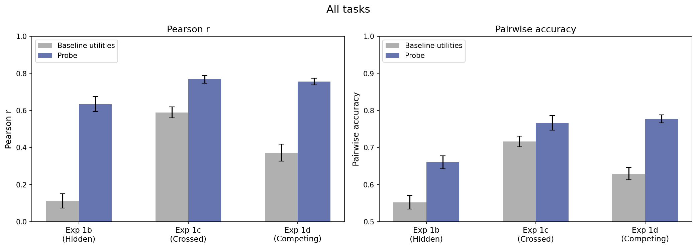
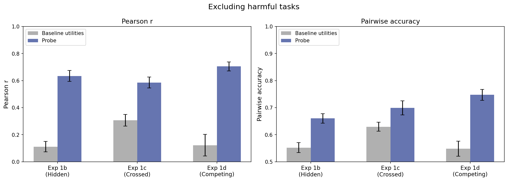
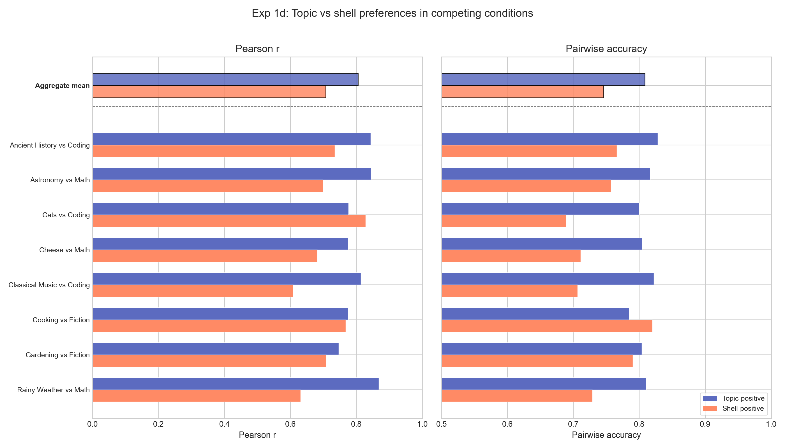

# OOD Utility Fitting Report

## Question

Do probe scores under a system prompt predict the model's utility function under that prompt?

## Method

**Probe**: Ridge regression trained on baseline (no system prompt) Gemma-3-27B activations at layer 31, predicting Thurstonian utilities from 10k tasks. Heldout Pearson r = 0.86, pairwise accuracy = 0.77.

**Procedure** for each condition (system prompt):

1. Extract activations under the condition's system prompt
2. Score activations with the baseline probe
3. Compare to Thurstonian utilities fitted from pairwise choices under that condition
4. Metrics: Pearson r, pairwise accuracy

**Baseline**: no-prompt Thurstonian utilities predicting condition utilities (how much does the utility function change?)

## Experiments

| Experiment | Tasks | Conditions | Design |
|---|---|---|---|
| **1b** (hidden preference) | 48 custom | 16 topic personas + baseline | Tasks designed to have equal baseline utility; preferences emerge only with topic persona |
| **1c** (crossed preference) | 48 crossed | 16 topic personas + baseline | Tasks blend topics with task-type shells; baseline has strong task-type signal |
| **1d** (competing preference) | 48 crossed | 16 competing prompts + baseline | Each prompt pits a topic against a shell: "love cheese, hate math" vs "love math, hate cheese" |
| **MRA** (role-induced) | 500–1500 | villain, midwest, aesthete | Rich role personas; activations from persona-prompted model |

## Results

### Overview





| | All tasks | | Excl harmful | |
|---|---|---|---|---|
| **Experiment** | **Baseline utils r** | **Probe r / acc** | **Baseline utils r** | **Probe r / acc** |
| **1b** (hidden) | 0.11 ± 0.04 | 0.63 ± 0.04 / 0.66 ± 0.02 | 0.11 ± 0.04 | 0.63 ± 0.04 / 0.66 ± 0.02 |
| **1c** (crossed) | 0.59 ± 0.03 | 0.77 ± 0.02 / 0.77 ± 0.02 | 0.31 ± 0.04 | 0.59 ± 0.04 / 0.70 ± 0.03 |
| **1d** (competing) | 0.37 ± 0.05 | 0.76 ± 0.02 / 0.78 ± 0.01 | 0.12 ± 0.08 | 0.71 ± 0.03 / 0.75 ± 0.02 |

Values are mean ± SE across conditions at layer 31. Chance pairwise accuracy is 0.50.

**Harmful task confound**: Exp 1c and 1d each include 8 harmful tasks (fake reviews, misleading guides) that the model strongly dislikes regardless of persona, inflating both baseline utility correlation and probe metrics. Excluding them reveals the true picture.

**Exp 1b** has no harmful tasks and shows the cleanest result: baseline utilities have near-zero correlation with condition utilities (r = 0.11) — the system prompt creates almost entirely new preference orderings — yet the probe achieves r = 0.63 and 66% pairwise accuracy.

**Exp 1d** is strongest after excluding harmful tasks: baseline utilities drop to r = 0.12 (the competing prompts effectively override default preferences) while the probe maintains r = 0.71 and 75% accuracy — the largest probe-over-baseline gap.

**Exp 1c** is weakest without harmful tasks (probe r = 0.59), though it still substantially exceeds baseline (0.31). The topic signal is diluted by task-type shells.

### Exp 1b: Per-condition breakdown


Negative persona conditions (coral) generally yield higher probe r than positive conditions (teal) for the same topic. The pairwise accuracy panel shows a different pattern: positive personas often match or exceed negative on accuracy despite lower Pearson r. This may reflect that negative personas create wider utility spread (inflating r) while positive personas produce more consistently ordered preferences. Exceptions: cooking and gardening, where pos outperforms neg on both metrics. Weakest condition: gardening_neg (r = 0.22, acc = 0.51 — near chance).

### Exp 1d: Topic vs shell in competing conditions



When topic and shell preferences compete, the probe captures both, but **topic-positive conditions yield higher probe r** (mean 0.81 vs 0.71) and **higher pairwise accuracy** (mean 0.81 vs 0.76). This holds for most pairs.

### On-target vs off-target

For each condition, tasks split into **on-target** (topic matches the persona, e.g. cheese tasks under cheese_pos_persona) and **off-target** (everything else). Metrics pooled across all conditions per experiment (utilities standardized per condition before pooling).

| | N | Pearson r | Pairwise acc |
|---|---|---|---|
| **1b on-target** | 96 | **0.890** | **0.811** |
| **1b off-target** | 672 | 0.439 | 0.638 |
| **1c on-target** | 96 | 0.776 | 0.769 |
| **1c off-target** | 672 | 0.803 | 0.744 |

In **exp1b**, the probe is dramatically better on on-target tasks (r = 0.89, acc = 81%) than off-target (r = 0.44, acc = 64%). The probe specifically tracks the preference shifts induced by the persona on the tasks it's designed to affect.

In **exp1c**, on-target and off-target performance is similar (~0.78–0.80). This makes sense: crossed tasks blend topic and shell, so the system prompt affects all tasks, not just the topic-matching ones.

### Layer comparison


Layer 31 (~55% depth) consistently performs best. Performance degrades at deeper layers, with exp1b showing the steepest decline (0.63 → 0.30 from L31 to L55).

| Layer | Exp 1b r / acc | Exp 1c r / acc | Exp 1d r / acc |
|---|---|---|---|
| 31 | 0.634 / 0.660 | 0.768 / 0.767 | 0.756 / 0.777 |
| 43 | 0.365 / 0.590 | 0.576 / 0.674 | 0.672 / 0.747 |
| 55 | 0.296 / 0.566 | 0.595 / 0.667 | 0.663 / 0.743 |

### MRA (role-induced preferences)


Baseline (noprompt) probe applied to persona activations, evaluated on held-out split_c (1000 tasks per persona). Within-persona probes shown for comparison.

| Persona | Baseline utils r | Noprompt probe r | Within-persona probe r | N eval tasks |
|---|---|---|---|---|
| Noprompt (baseline) | 1.000 | 0.896 | 0.896 | 1000 |
| Aesthete | 0.363 | 0.704 | 0.865 | 1000 |
| Midwest | 0.706 | 0.685 | 0.906 | 1000 |
| Villain | 0.170 | 0.301 | 0.878 | 1000 |

All at layer 31. Within-persona probes trained on that persona's split_a (1000 tasks), alpha swept on split_b (500 tasks).

**Villain**: Low noprompt probe r (0.30) — the villain persona fundamentally reorganizes the utility function in ways the baseline probe can't capture. But a villain-specific probe achieves r = 0.88, confirming the signal exists in the activations.

**Midwest/Aesthete**: Noprompt probe transfers well (r ≈ 0.70), though within-persona probes are substantially better (r ≈ 0.87–0.91). Training on the specific persona recovers ~0.15–0.20 additional r.

## Missing data

- **Exp 1a** (category preference): No utility measurements in result directories yet

## Key takeaways

1. **Probe scores from condition activations predict condition-specific utilities**, consistently exceeding baseline utility correlation across all experiments
2. **Harmful task confound**: 8 harmful tasks in exp 1c/1d inflate metrics — the model dislikes them regardless of persona. Excluding them drops 1c probe r from 0.77 to 0.59 and baseline utils r from 0.59 to 0.31
3. The cleanest result is **exp1b** (no harmful tasks): baseline utility r ≈ 0.11, yet probe r = 0.63 — the probe decodes entirely new preference orderings from condition activations
4. **Exp 1d** is strongest after excluding harmful tasks: probe r = 0.71 vs baseline r = 0.12 — the largest increment
5. **Middle layers** (L31) carry the most evaluative information; performance drops at deeper layers
6. The probe captures **both directions** of competing preferences (exp1d), though topic-positive conditions are slightly easier than shell-positive
7. **Role personas vary**: midwest and aesthete are well-predicted by the noprompt probe (r ≈ 0.70), villain is not (r = 0.30) — but within-persona probes achieve r = 0.87–0.91 for all personas, confirming the evaluative signal is present in all activation spaces

## Reproduction

```bash
python scripts/utility_fitting/analyze_ood.py
python -m scripts.utility_fitting.multilayer_analysis
python scripts/utility_fitting/plot_results.py
```

Probe: `results/probes/gemma3_10k_heldout_std_raw`, ridge at layers 31/43/55.
Activations: `activations/ood/exp1_prompts/`, `activations/gemma_3_27b{_persona}/`.
Utilities: `results/experiments/ood_exp1{b,c,d}/`, `results/experiments/mra_exp2/`, `results/experiments/mra_villain/`.
