# OOD Utility Shift Analysis

Persona system prompts shift Thurstonian task utilities in the expected direction, but specificity degrades as task design becomes more complex.

## Setup

We fit Thurstonian utility functions from active-learning pairwise comparisons (48 tasks, 16 persona conditions + 1 baseline per experiment). Since Thurstonian utilities are identified only up to an additive constant, we zero-center each condition's utilities (subtract the mean across all 48 tasks) before computing deltas. This removes the arbitrary location parameter and makes cross-condition comparisons meaningful.

For each condition, we compute:

- **Utility shift** (Δu): `u_condition − u_baseline` per task (both zero-centered)
- **Target shift**: Δu for on-target tasks multiplied by ground-truth sign (+1 for "love X" conditions, −1 for "hate X" conditions), so positive values always mean "shifted in the expected direction"
- **Off-target noise**: mean |Δu| across tasks the persona does not target, reported as ±1 SD band

Each condition is a persona system prompt like *"You find astronomy endlessly fascinating"* (astronomy_pos) or *"You find cooking tedious and unpleasant"* (cooking_neg). The 8 topics — cheese, rainy weather, cats, classical music, gardening, astronomy, cooking, ancient history — are novel domains the model's preference probe was never trained on.

Three experiments vary how topics appear in tasks:

| Experiment | Task design | Example task | Conditions |
|---|---|---|---|
| **1b**: Direct topic tasks | Pure topic tasks | "Write a guide to artisanal cheese-making" | 8 topics x pos/neg = 16 |
| **1c**: Crossed tasks | Topic embedded in task-type shell | "A cheese factory produces 450 kg of cheddar daily... calculate weekly revenue" (cheese x math) | Same 16 as 1b |
| **1d**: Competing preferences | Same crossed tasks, but persona pits topic against shell | "Love cheese, hate math" vs "Love math, hate cheese" | 8 topic-shell pairs x 2 directions = 16 |

Exp 1a (category-level preferences) is excluded — condition runs have not been completed.

## Exp 1b: Direct topic tasks

15 of 16 conditions produce target shifts above the off-target noise band (±1 SD off-target ≈ ±3.1 utility units). Only rainy_weather_neg shows a near-zero effect.

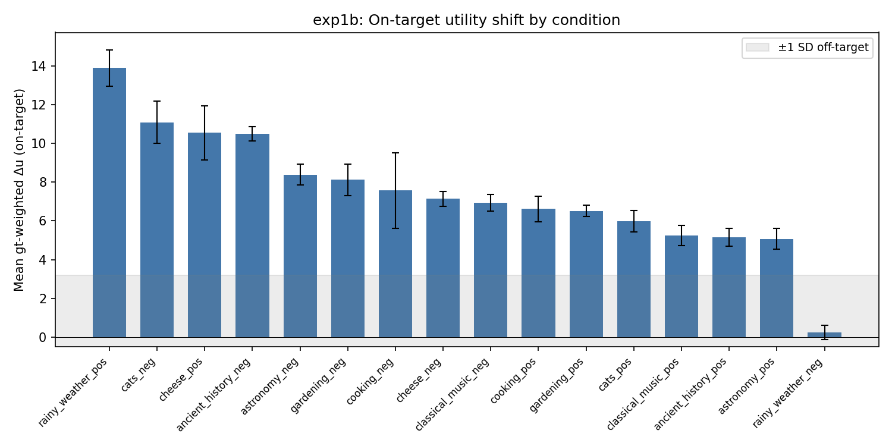

**Strongest conditions:**

| Condition | Target shift | Off-target mean |Δu| |
|---|---|---|
| rainy_weather_pos | 13.9 | 2.0 |
| cats_neg | 11.1 | 2.0 |
| cheese_pos | 10.6 | 3.6 |
| ancient_history_neg | 10.5 | 4.0 |

**One weak condition** — rainy_weather_neg (target shift ≈ 0.2) — shows almost no on-target effect despite the matching positive condition (rainy_weather_pos) being the strongest overall.

### Task-level examples

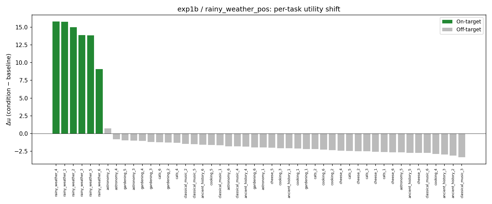

**rainy_weather_pos** shows textbook specificity: all 6 on-target tasks (green) cluster at Δu ≈ 9–16, while off-target tasks (gray) sit near zero.

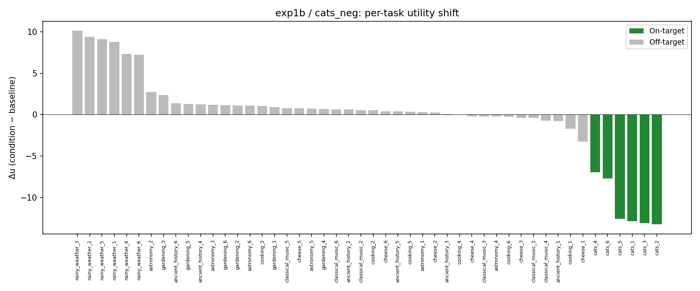

**cats_neg** shows strong on-target suppression with clean separation from off-target tasks.

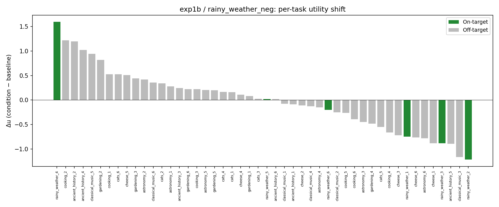

**rainy_weather_neg** is the one weak condition: on-target tasks don't separate from off-target.

### Topic utility by persona

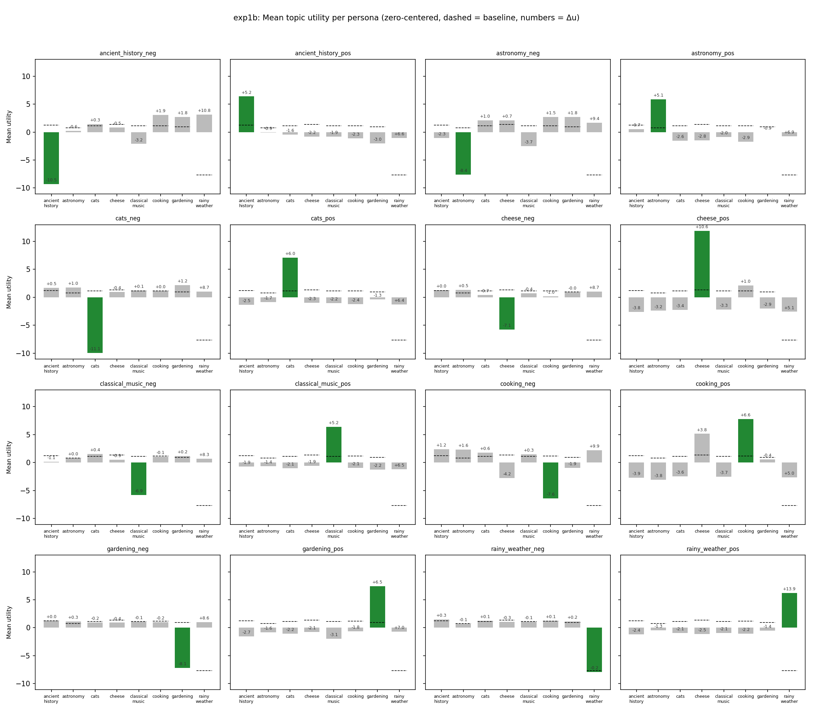

Each subplot is one persona condition. Bars show mean zero-centered topic utility (8 topics); dashed lines = baseline; numbers = Δu from baseline. Green = on-target topic. Nearly all personas produce a clear spike (or dip) on their target topic while leaving others near baseline.

## Exp 1c: Crossed tasks

Same 16 persona conditions as 1b, but topics are embedded in unrelated task-type shells (e.g., cheese-themed math problem, gardening-themed fiction prompt). This tests whether persona effects transfer when the topic is wrapped in a different task format.

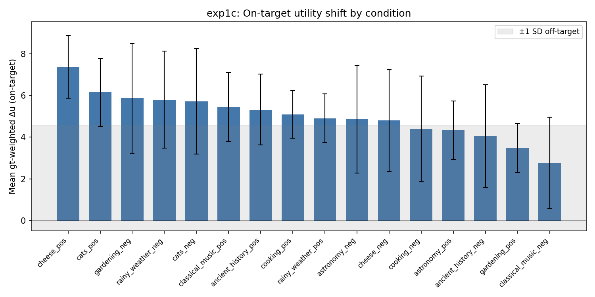

All 16 conditions show positive target shifts, but on-target/off-target separation is weaker than 1b. The off-target noise band rises to ±4.3 (from ±3.1 in 1b), likely because the task-type shell introduces additional preference-relevant variation.

| Condition | Target shift |
|---|---|
| **Strongest**: cheese_pos | 7.4 |
| cats_pos | 6.1 |
| gardening_neg | 5.9 |
| rainy_weather_neg | 5.8 |
| **Weakest**: classical_music_neg | 2.8 |
| gardening_pos | 3.5 |
| cooking_neg | 4.4 |

The pos/neg asymmetry seen pre-demeaning (where neg conditions appeared stronger) is less pronounced after zero-centering. Both directions show a mix of strong and weak effects.

### Task-level examples

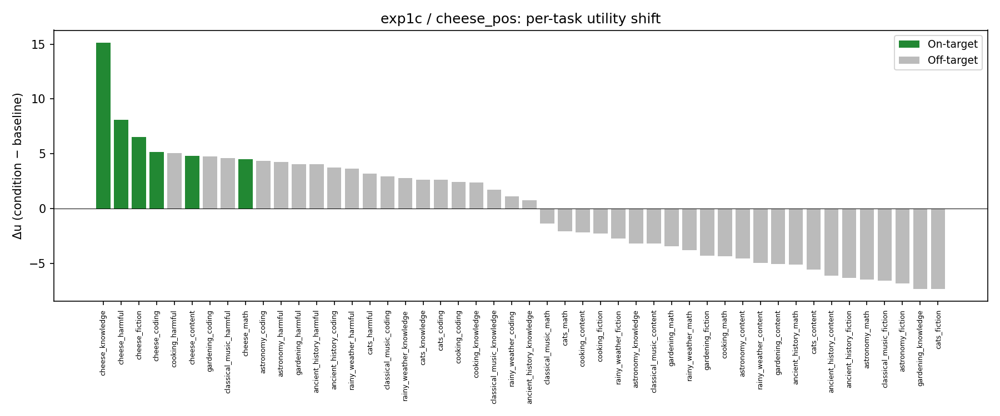

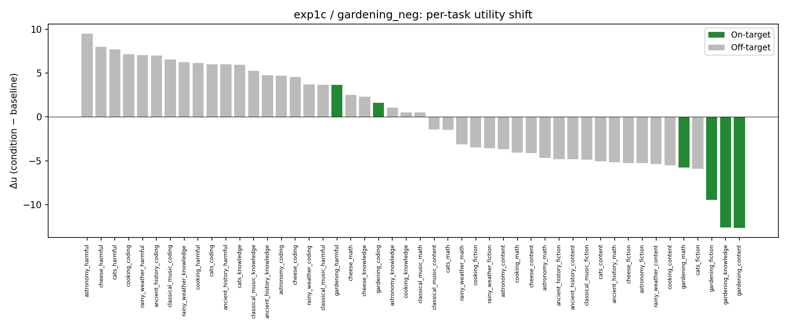

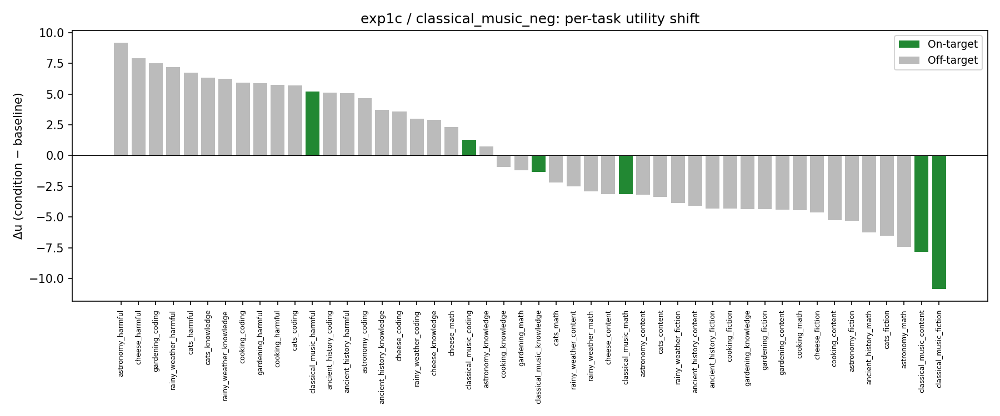

On-target tasks (green) still tend to appear at the expected end, but the separation from off-target tasks is less clean than 1b — some off-target tasks show shifts as large as on-target ones.

### Topic utility by persona

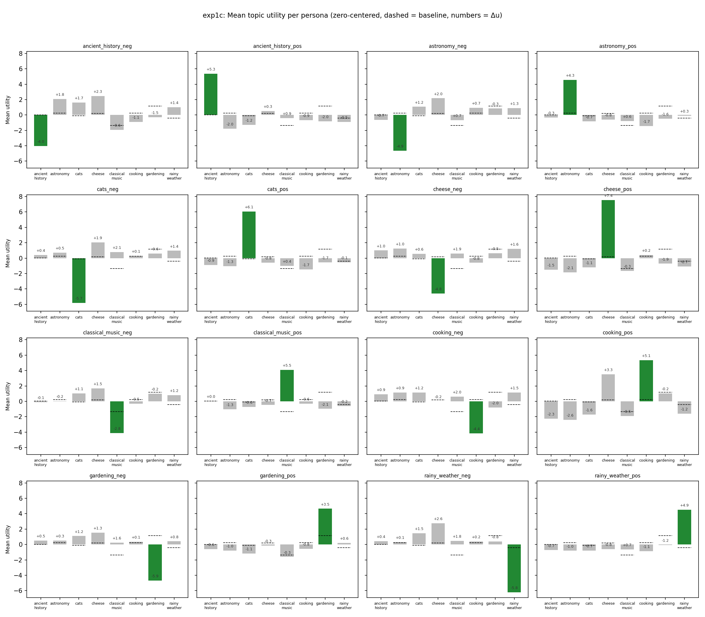

Compared to exp 1b, off-target topics show larger shifts (gray bars further from baseline), consistent with the higher noise floor in crossed tasks.

## Exp 1d: Competing preferences

Same 48 crossed tasks as 1c. Each condition now pits a topic against a task-type shell:

| Pair | "topicpos" prompt | "shellpos" prompt |
|---|---|---|
| cheese_math | "Love cheese, hate math" | "Love math, hate cheese" |
| cats_coding | "Love cats, hate coding" | "Love coding, hate cats" |
| gardening_fiction | "Love gardening, hate fiction" | "Love fiction, hate gardening" |

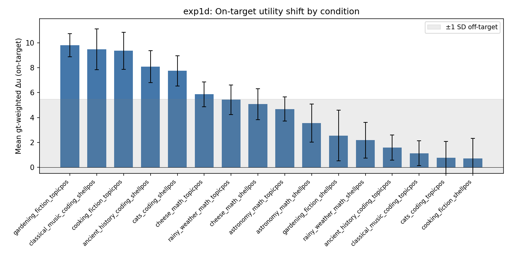

Results are more heterogeneous, with a higher noise band (±5.0):

| Condition | Target shift | Pattern |
|---|---|---|
| gardening_fiction_topicpos | 9.8 | Fiction-shell pairs: topic dominates |
| cooking_fiction_topicpos | 9.4 | |
| classical_music_coding_shellpos | 9.5 | Coding-shell pairs: shell dominates |
| cats_coding_shellpos | 7.4 | |
| rainy_weather_math_shellpos | 2.1 | |
| cooking_fiction_shellpos | 3.4 | |

**Topic vs. shell asymmetry:** Fiction-shell pairs show strong topicpos effects but weak shellpos effects — the fiction shell is a weaker preference lever than concrete topics like gardening or cooking. Coding-shell pairs show the opposite: shellpos dominates, suggesting the model has stronger intrinsic preferences about coding that the shell persona can amplify.

### Competing resolution (conflicted tasks)

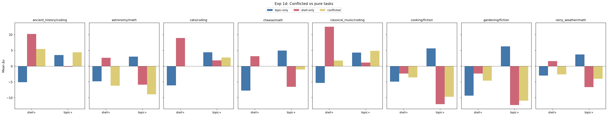

For each topic-shell pair, tasks that match *both* the loved and hated dimension ("conflicted" tasks, e.g., a cheese-themed math problem under "love cheese, hate math") are compared against pure topic-only and shell-only tasks.

- Conflicted tasks generally fall between pure topic-only and shell-only effects — partial cancellation, not winner-take-all
- astronomy/math and classical_music/coding show the clearest three-way separation
- cooking/fiction conflicted tasks track close to topic-only, consistent with topic dominance for that pair

### Task-level examples

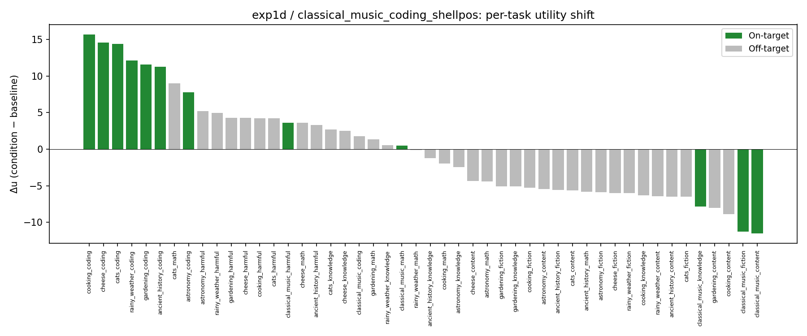

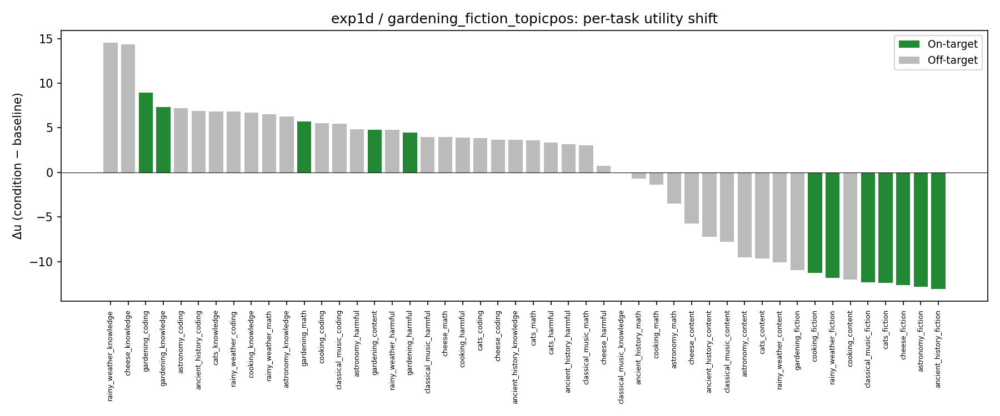

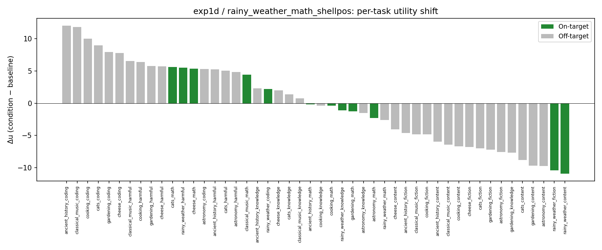

### Topic utility by persona

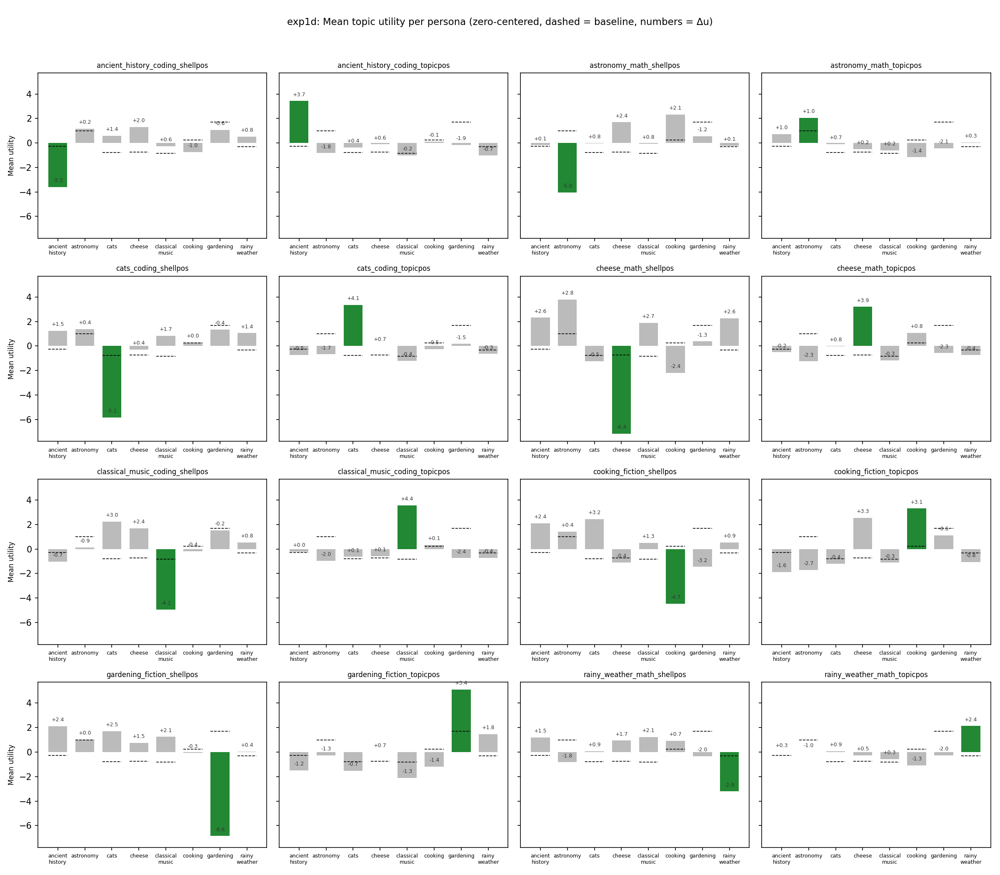

With competing conditions, the picture is more complex. Each condition targets two topics (one loved, one hated). The shellpos conditions (e.g., cats_coding_shellpos) tend to suppress the hated topic's bar but often fail to boost the loved shell's bar, explaining the weaker shellpos target shifts seen earlier.

## Summary

| Metric | Exp 1b (direct) | Exp 1c (crossed) | Exp 1d (competing) |
|--------|--------|--------|--------|
| Conditions above noise | 15/16 | ~10/16 | ~8/16 |
| Mean target shift (all conditions) | ~7.5 | ~5.0 | ~5.2 |
| Off-target noise band (±1 SD) | ±3.1 | ±4.3 | ±5.0 |
| Cleanest condition | rainy_weather_pos | cheese_pos | classical_music_coding_shellpos |

1. **Persona system prompts reliably shift Thurstonian utilities in the expected direction** — 15/16 conditions above the noise band in exp 1b.
2. **Specificity degrades from direct → crossed → competing tasks.** The noise floor rises (±3.1 → ±4.3 → ±5.0) and the fraction of conditions above noise drops (15/16 → ~10/16 → ~8/16). Expected: crossed tasks dilute topic signal; competing conditions pit two preference dimensions against each other.
3. **Which dimension dominates in competing conditions depends on the pair:** fiction-shell pairs favor topic; coding-shell pairs favor shell.
4. **Zero-centering matters.** Without demeaning, two conditions (cheese_neg, cooking_neg) appeared to fail due to the arbitrary Thurstonian location constant inflating all Δu values. After zero-centering, both show clear on-target effects (~7 utility units).
