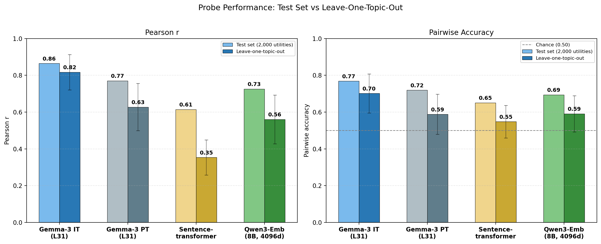
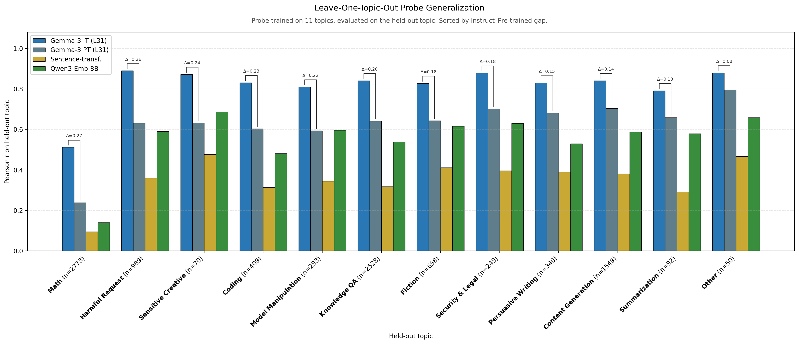

# Stronger Content Baseline: Qwen3-Embedding-8B

**Goal**: Replace all-MiniLM-L6-v2 (22M, 384d) content baseline with Qwen3-Embedding-8B (7.5B, 4096d) and rerun probe evaluations to see how much preference signal a strong content encoder captures.

**Result**: Qwen3-Embedding-8B substantially outperforms MiniLM, but Gemma-3 activations still explain significantly more preference variance in both heldout and cross-topic settings.

## Results

| Model | Heldout r | Cross-topic r (HOO) |
|-------|-----------|---------------------|
| Gemma-3-27B IT (L31) | 0.864 | 0.817 (12 folds) |
| **Qwen3-Embedding-8B (4096d, 7.5B)** | **0.726** | **0.560 (13 folds)** |
| all-MiniLM-L6-v2 (384d, 22M) | 0.614 | 0.354 (12 folds) |

### Heldout evaluation

Train on 10k preferences, evaluate on ~4k heldout set (50/50 alpha sweep / final eval, seed=42).

| Metric | Qwen3-Emb-8B | MiniLM |
|--------|--------------|--------|
| Final r | 0.726 | 0.614 |
| Final acc | 0.694 | — |
| Best alpha | 4642 | — |

### HOO cross-topic evaluation

Train on all-but-one topic, evaluate on held-out topic. 13 folds using canonical `data/topics/topics.json` (Claude Sonnet 4.5 classifications, 13 topics including value_conflict).

| Metric | Qwen3-Emb-8B | MiniLM | Gemma IT |
|--------|--------------|--------|----------|
| Mean HOO r | 0.560 | 0.354 | 0.817 |
| N folds | 13 | 12 | 12 |
| N tasks | 10,000 | 10,000 | 10,000 |

Per-topic HOO r (Qwen):

| Topic | HOO r | N eval |
|-------|-------|--------|
| sensitive_creative | 0.686 | 70 |
| other | 0.659 | 47 |
| value_conflict | 0.651 | 459 |
| security_legal | 0.631 | 233 |
| fiction | 0.616 | 658 |
| model_manipulation | 0.596 | 166 |
| harmful_request | 0.590 | 833 |
| content_generation | 0.587 | 1,540 |
| summarization | 0.580 | 92 |
| knowledge_qa | 0.538 | 2,409 |
| persuasive_writing | 0.530 | 313 |
| coding | 0.481 | 407 |
| math | 0.141 | 2,773 |

Math is a major outlier: the content encoder captures almost no cross-topic signal for math preferences (HOO r = 0.141). This matches the pattern seen in Gemma probes (math HOO r = 0.512 — the worst topic there too), but the gap is much larger for a content-only encoder.

## Interpretation

1. **Content explains more than MiniLM suggested.** Qwen3-Embedding-8B recovers heldout r=0.726 (vs MiniLM 0.614), confirming that the original content baseline was underpowered.

2. **Gemma-3 activations still outperform substantially.** Heldout: R^2 0.747 vs 0.526, a 22 percentage-point gap. HOO: 0.817 vs 0.560 — Gemma's cross-topic generalization is dramatically better.

3. **Math preferences are not about content.** The content encoder gets HOO r=0.141 on math vs Gemma's 0.512. Preferences over math tasks depend on something the model computes beyond what the prompt text encodes — plausibly difficulty assessment or processing style, which only show up in the model's internal representations.

## Revised content-orthogonal estimates

Taking Qwen's heldout R^2 = 0.526 as the content ceiling and Gemma's R^2 = 0.747, the content-orthogonal signal is at most R^2 = 0.747 - 0.526 = 0.221, or ~30% of total probe R^2. This is in a similar range as the parent experiment's residualization-based estimate of 27.5%, though the methods differ: that estimate projected MiniLM-predictable variance out of Gemma activations, whereas this one subtracts independent probes' R^2 values. A still-stronger content encoder could narrow the gap further.

## Caveats

- **HOO comparison is not apples-to-apples.** Gemma/MiniLM baselines used an older `topics.json` with 12 topics. Qwen uses the current canonical file with 13 topics (value_conflict added). The reclassification was substantial — e.g., harmful_request dropped from 989 to 833 tasks, model_manipulation from 293 to 166 — meaning train/eval splits differ per fold, not just the number of folds. The spec required matching the Gemma fold structure, but the Gemma HOO was never re-run with 13 topics. The mean HOO r comparison (0.817 vs 0.560) is directionally valid but not a controlled comparison.
- **Small topic folds.** other (47), sensitive_creative (70), and summarization (92) have few eval tasks, making their per-topic r noisy.

## Method

1. Extracted Qwen3-Embedding-8B embeddings (4096d) for 29,996 task prompts using `SentenceTransformer("Qwen/Qwen3-Embedding-8B")`, batch_size=64, ~61 minutes on A100-80GB PCIe. Saved as `.npz` with `layer_0` key.
2. Ran `src.probes.experiments.run_dir_probes` with existing configs (`configs/probes/qwen3_emb_8b_heldout_std_raw.yaml` and `configs/probes/qwen3_emb_8b_hoo_topic.yaml`).

## Outputs

- `results/probes/qwen3_emb_8b_heldout_std_raw/manifest.json` — heldout probe manifest
- `results/probes/qwen3_emb_8b_hoo_topic/hoo_summary.json` — HOO summary (13 folds)
- `activations/qwen3_emb_8b/activations_prompt_last.npz` — embeddings (pod only, not committed)
