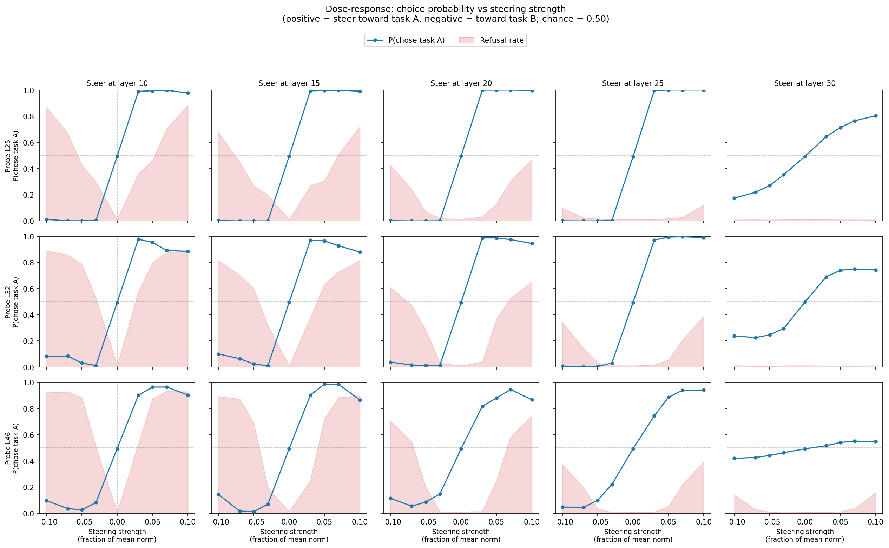
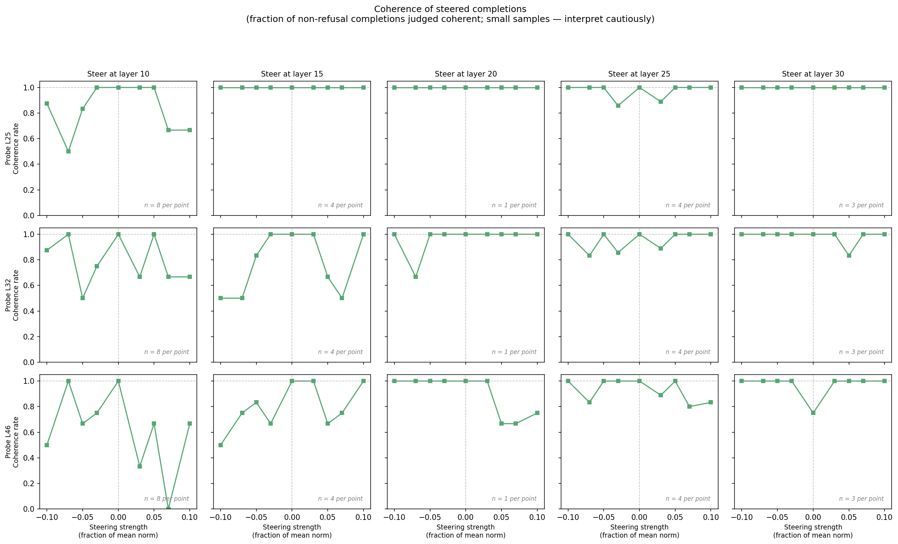

# Cross-layer differential steering

## Main finding

A preference-probe direction trained at one layer steers choices effectively when injected at a wide range of other layers (10 through 25 out of 62). Control degrades sharply only at layer 30, and the primary failure mode at early layers is refusal (the model refuses to complete the task), not incoherence.

## Question

Do probes trained at different layers steer effectively when applied at other layers? If the same linear direction exists across many layers, this is evidence that the model uses a shared evaluative representation rather than layer-specific features.

## Setup

**Model:** Gemma-3-27B (62 layers).

**Probes.** Three Ridge regression probes, each trained on activations from a different layer to predict Thurstonian preference scores (how much the model values a task):

| Probe | Trained at | Depth | Probe R^2 |
|-------|-----------|-------|-----------|
| L25   | Layer 25  | 40%   | 0.82      |
| L32   | Layer 32  | 52%   | 0.81      |
| L46   | Layer 46  | 74%   | 0.78      |

**Steering method: differential injection.** The model is presented with a pairwise choice ("Here is Task A... Here is Task B... complete whichever task you prefer"). During the forward pass, the probe's weight vector is added to the residual stream at the Task A token positions and subtracted at the Task B token positions. A positive steering strength pushes the model toward choosing Task A; a negative strength pushes toward Task B.

**Grid.** Each of the 3 probes is applied at 5 injection layers (10, 15, 20, 25, 30), giving 15 (probe, injection layer) combinations. Steering strength ranges over +/-[0.03, 0.05, 0.07, 0.10] times the mean activation norm at the injection layer (plus a 0-strength baseline), for 9 strengths per combination.

**Evaluation.** 500 random task pairs (from Alpaca, WildChat, and MATH datasets), 3 trials each at temperature 1.0, max 64 new tokens. All 390,012 completions were post-hoc judged by Gemini 2.5 Flash to determine (a) which task the model claimed to choose, and (b) whether it actually completed that task or refused.

## Results

### Cross-layer transfer heatmap

Each cell shows the peak P(chose steered task) at the best positive steering strength for that (probe, injection layer) pair. Chance is 0.50. The refusal rate at that same strength is shown in parentheses.

- **Layers 10-25: near-complete steering control.** All three probes push P above 0.94 at every injection layer from 10 to 25. The L25 probe reaches P=1.00 at layers 10-25; L32 reaches 0.97-1.00; L46 reaches 0.94-0.99.
- **Early layers trade steering for refusals.** At layers 10-15, the best coefficients trigger 38-93% refusal rates. The model's claimed choice is steered correctly, but it often fails to produce a real completion. At layer 25, refusals drop to 2-39% while steering remains strong.
- **Layer 30 is qualitatively different.** All probes lose most of their steering power. L25 drops to P=0.80, L32 to 0.75, L46 to just 0.55 (barely above chance). Refusals are near zero, so this is genuine loss of steering, not refusals masking the effect.
- **Probe quality orders the rows.** L25 > L32 > L46 at every injection layer, matching the R^2 ordering. But even L46 (weakest probe) reaches P=0.94 at its best injection layer.

### Dose-response curves

Each panel shows P(chose task A) (blue line) and refusal rate (pink shading) as a function of steering strength for one (probe, injection layer) combination. The x-axis runs from -0.10 (strong push toward task B) to +0.10 (strong push toward task A). Chance is the dashed horizontal line at 0.50.

Key patterns:

- **Layers 10-20 show steep dose-response with high refusals.** The choice curve is essentially a step function: even small positive strengths push P(chose A) to ~1.0. But refusal rates climb steeply with strength (up to ~90% at +/-0.10 for L46 at layer 10). When the model does comply, it almost always follows the steered direction.
- **Layer 25 is the best operating point.** Strong steering (P >= 0.94) with low refusal (2% for L25, up to 39% for L46 at the highest coefficient). This is the only layer where all three probes achieve high-steering, low-refusal simultaneously.
- **Layer 30 shows weak, gradual steering.** P(chose A) rises slowly from ~0.50 to 0.55-0.80 across the coefficient range. No refusals, but also limited control.
- **Non-monotonic rollover at extreme strengths.** At layers 10-15, the L32 and L46 probes show a dip in P(chose A) at the highest positive coefficient (e.g., L32 at layer 10: P drops from 0.98 at 0.03 to 0.88 at 0.10). This reflects refusals eating into the compliant count, not a reversal of steering direction.
- **Refusals are symmetric.** High positive and high negative strengths produce similar refusal rates — the model is disrupted by the perturbation magnitude, regardless of direction.

### Coherence (small-sample caveat)

Coherence was spot-checked on a small sample (1-8 completions per point, as annotated in each panel). With these sample sizes, individual data points are unreliable. The broad pattern: most cells show >= 80% coherence, with dips concentrated at layer 10 (the same layer with the highest refusal rates). When the model does produce a non-refusal completion, it is generally coherent text. The main takeaway is that steering does not cause babbling — refusal is the failure mode, not incoherence.

## Summary

| Finding | Evidence |
|---------|----------|
| The preference direction transfers across layers 10-25 | All 3 probes achieve P >= 0.94 at any injection layer in this range |
| Refusal, not incoherence, is the failure mode | Refusal rates reach 90% at early layers; coherence among non-refusals stays high |
| Layer 25 is the best operating point | High steering (P >= 0.94) with low refusal (2-39%) |
| Layer 30 is a boundary | All probes lose most steering power (P = 0.55-0.80); may reflect a transition from representation-building to output preparation |
| Probe quality degrades gracefully | L25 > L32 > L46 at every layer, tracking probe R^2 |
