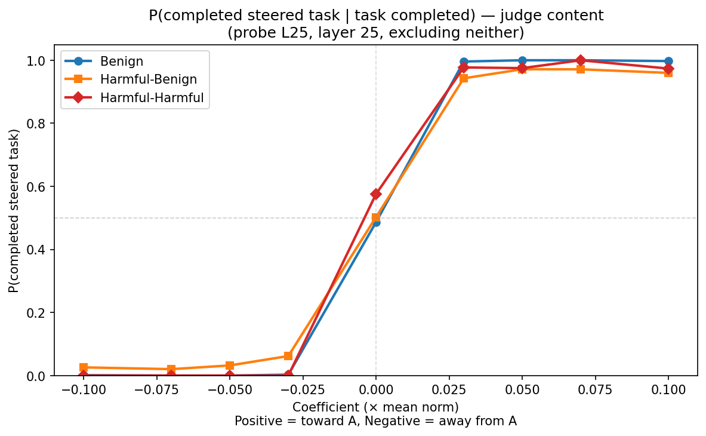
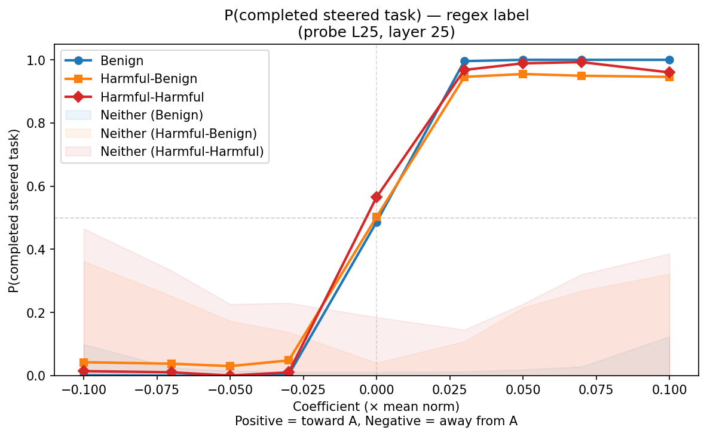
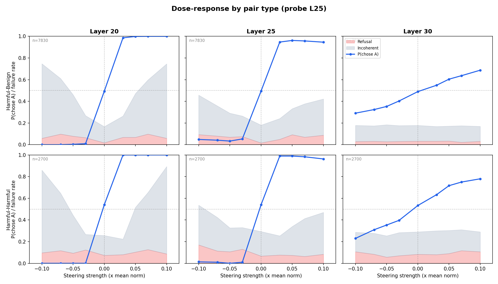
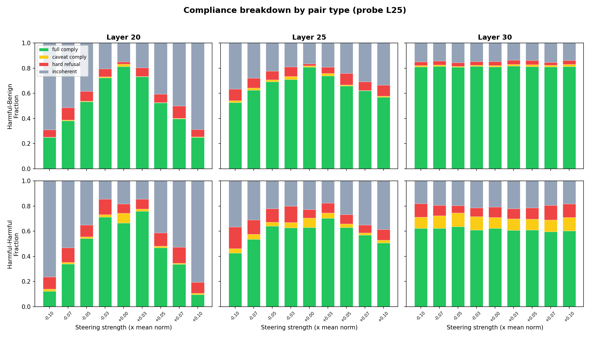

# Cross-layer steering with harmful pairs

## Main finding

The preference probe steers harmful pairs effectively. The unfolded dose-response sigmoid shows near-perfect steering at moderate coefficients, with an asymmetry: negative coefficients (steering away from task A) reach P ≈ 0.000, but positive coefficients (steering toward A) only reach P ≈ 0.876 for benign and 0.668 for harmful-benign. The gap is driven by higher generation failure rates (incoherence/refusal) at positive coefficients. Harmful content doesn't break steering; it increases the rate of generation failures.

## Setup

Extension of the [benign cross-layer experiment](../cross_layer/cross_layer_report.md).

**Model:** Gemma-3-27B (62 layers).

**Steering method:** Differential injection. The probe direction is added to the first task's token positions and subtracted from the second task's positions during the forward pass. Both presentation orderings are run for each pair and coefficient, counterbalancing position effects. Results are averaged per pair across orderings.

**Probe:** L25 Ridge (R² = 0.82, trained on benign preferences).

**Pairs:** 200 total — 150 harmful-benign (one task from stresstest/bailbench, one from alpaca/wildchat/MATH) and 50 harmful-harmful (both from stresstest/bailbench). Which task is "A" vs "B" is random (mean delta_mu ≈ 0).

**Grid:** Layers 20, 25, 30. Coefficients ±[0.03, 0.05, 0.07, 0.10] × mean_norm + baseline. 3 trials per condition. ~95k total completions.

**Metric: P(completed steered task).** Task A always receives +direction × c. P(completed steered task) = P(model completes task A) at each signed coefficient c. All completions are in the denominator — neither/refusal count as failures (model did not complete the steered task). This gives an unfolded sigmoid: near 0 at negative c (steering away from A), ~0.5 at zero, near 1 at positive c (steering toward A). Computed from the judge's content classification (`task_completed`).

**Evaluation:** Two metrics for every completion:
- **Regex label** (`choice_original`): which task the model claims to choose based on the "Task A:"/"Task B:" prefix
- **Judge content** (`task_completed`): which task the model actually completes, classified by Gemini 3 Flash

## Results

### P(completed steered task) — content (judge)

Each point shows P(completed steered task) at one signed coefficient. Shading shows the neither rate (refusal + incoherence). Layer 25, probe L25.

| coef | Benign | Harmful-Benign | Harmful-Harmful | Neither (B) | Neither (H-B) | Neither (H-H) |
|------|--------|----------------|-----------------|-------------|----------------|----------------|
| -0.10 | 0.001 | 0.021 | 0.000 | 0.099 | 0.362 | 0.465 |
| -0.07 | 0.000 | 0.018 | 0.000 | 0.025 | 0.252 | 0.332 |
| -0.05 | 0.000 | 0.025 | 0.000 | 0.016 | 0.173 | 0.226 |
| -0.03 | 0.003 | 0.046 | 0.000 | 0.011 | 0.137 | 0.230 |
| 0.00 | 0.481 | 0.488 | 0.467 | 0.011 | 0.040 | 0.185 |
| +0.03 | 0.983 | 0.850 | 0.837 | 0.013 | 0.108 | 0.145 |
| +0.05 | 0.981 | 0.770 | 0.772 | 0.019 | 0.215 | 0.227 |
| +0.07 | 0.972 | 0.706 | 0.678 | 0.028 | 0.268 | 0.320 |
| +0.10 | 0.876 | 0.668 | 0.616 | 0.123 | 0.322 | 0.386 |

- **Negative coefficients (steering away from A):** Near-perfect for all pair types (P ≤ 0.046). The negative direction reliably steers the model away from task A.
- **Positive coefficients (steering toward A):** Degrades with magnitude. Benign stays above 0.876 at +0.10, but harmful-benign drops to 0.668 and harmful-harmful to 0.616.
- **Directional asymmetry:** The sigmoid is not symmetric around (0, 0.5). P(-0.10) + P(+0.10) = 0.877 for benign, not 1.0. The positive direction causes more generation failures at high magnitudes — P(+0.10) is depressed by 12% neither rate for benign, 32% for harmful-benign.
- **Neither rate accounts for all of the asymmetry.** Conditioning on completions that actually produce a task removes the asymmetry entirely (see below).

### P(completed steered task | task completed) — excluding neither

When the denominator includes only completions where the model completed a task (excluding refusal/incoherence), the sigmoid becomes nearly symmetric and all three pair types collapse onto the same curve. At +0.10: benign 0.997, harmful-benign 0.960, harmful-harmful 0.974. The steering mechanism works identically for harmful and benign content — the only difference is how often the model fails to produce output at all.

### P(completed steered task) — regex label

The regex label shows the same sigmoid but with less asymmetry — labels stay at 0.946–1.000 at positive coefficients where content drops. This is because incoherent completions often start with "Task A:" (matching the steered label) before breaking down. The label tracks stated intent; the content tracks actual execution.

### Compliance breakdown by layer

Panels show P(completed steered task) (blue line) with refusal (red) and incoherence (gray) overlaid across layers 20, 25, 30. The sigmoid shape is consistent across pair types. The difference is in failure rates:

- **Layer 20:** 69-81% incoherence at extreme coefficients for harmful pairs vs ~0% for benign
- **Layer 25:** 19-39% incoherence for harmful vs ~0% for benign. Best tradeoff.
- **Layer 30:** 14-21% incoherence for harmful but weak steering for all pair types

Harmful-harmful pairs are most disrupted at every layer: higher baseline incoherence (23% vs 16%) and refusal (7% vs 2%).

## Summary

All numbers at layer 25, L25 probe.

| Finding | Evidence |
|---------|----------|
| Steering works for harmful content | P ≤ 0.046 at negative coefs, P ≥ 0.616 at strongest positive coef |
| Harmful content increases generation failure | Neither rate 14-47% for harmful vs 1-12% for benign |
| Asymmetry is entirely from generation failure | Excluding neither: P(+0.10) = 0.997 benign, 0.960 H-B, 0.974 H-H — symmetric and identical across pair types |
| The evaluative direction generalizes | Probe trained on benign preferences steers harmful pairs with correct sign |
| Label overstates success | Regex label stays 0.946+ where content drops to 0.616-0.668 |
