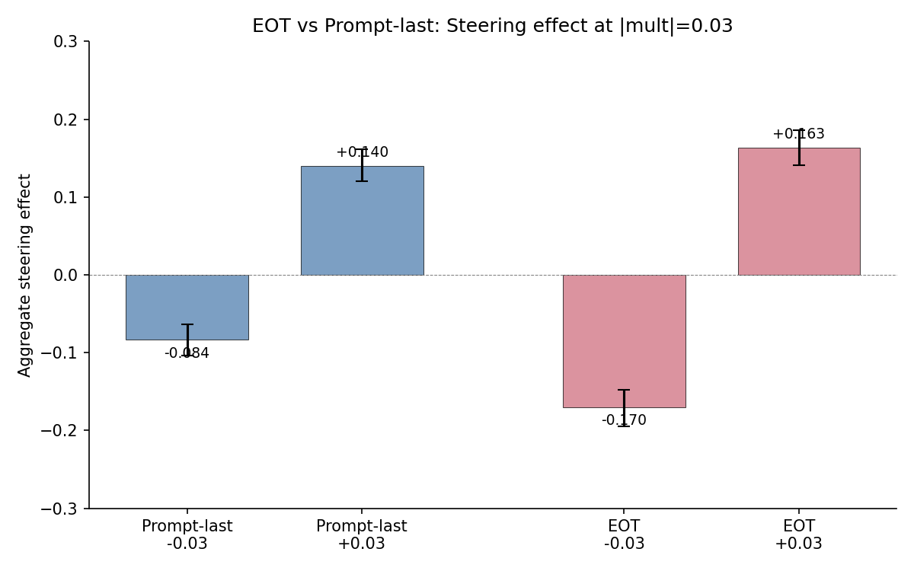
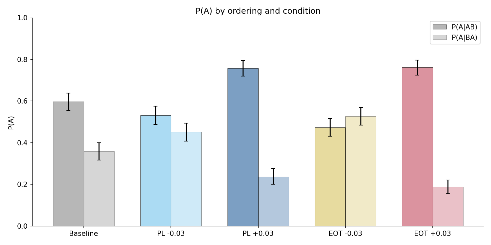
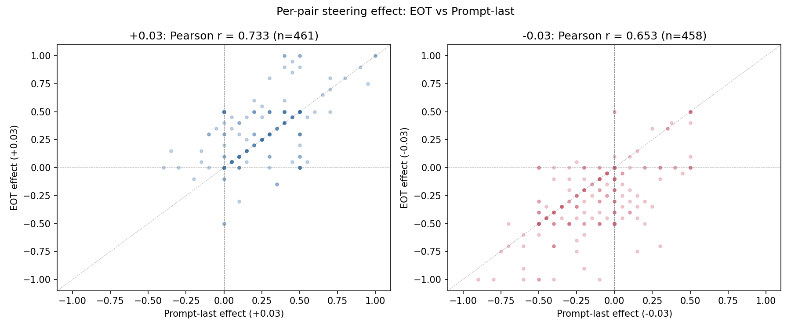

# EOT vs Prompt-Last Direction Steering — Report

## Summary

The EOT probe direction produces stronger and more symmetric steering than prompt-last. At matched perturbation magnitude (multiplier = ±0.03), steering effects are:

| Direction | +0.03 effect | -0.03 effect |
|-----------|-------------|-------------|
| EOT | +0.163 | -0.170 |
| Prompt-last | +0.140 | -0.084 |

The key difference is the negative (anti-preference) direction: EOT achieves double the prompt-last effect and actually reverses the baseline ordering bias. Per-pair effects correlate strongly between directions (r = 0.73 at +0.03), so EOT steers the same pairs harder rather than different ones. EOT also yields higher parse rates (98% vs 93%).

## Setup

Each trial presents the model with two tasks (e.g., "Explain the process of photosynthesis" vs "Solve: convert spherical coordinates to rectangular") and asks it to complete whichever it prefers. The model's choice is inferred from whether the response begins with "Task A:" or "Task B:" (with LLM-judge fallback for ambiguous responses). Each pair is tested in both orderings — A-first (AB) and B-first (BA) — to measure and control for ordering bias.

**Differential steering** adds +direction to activations at the Task A token positions and -direction at Task B positions during the forward pass. A positive multiplier (+0.03) steers toward Task A; a negative multiplier (-0.03) steers toward Task B. The coefficient is multiplier × mean activation norm (52,823), so both probe directions receive the same perturbation magnitude.

We compare two probe directions, both Ridge probes trained on layer 31 of Gemma 3 27B with similar heldout accuracy:
- **Prompt-last**: extracted at the last prompt token before generation (r = 0.866)
- **EOT**: extracted at the end-of-turn token after the model's completion (r = 0.867)

| Parameter | Value |
|-----------|-------|
| Model | Gemma 3 27B (bfloat16) |
| Pairs | 500 task pairs, each tested in both orderings |
| Trials | 10 per pair per multiplier (5 per ordering) |
| Multipliers | ±0.03 |
| Baseline | 10,000 records (500 pairs × 20 trials, no steering), from prior experiment |
| Prompt-last data | 10,000 records (500 pairs × 2 multipliers × 10 trials), from prior experiment |
| EOT data | 10,000 records (newly collected) |
| Span detection fallback | 3.6% of EOT trials could not locate task spans in the prompt, falling back to all-tokens steering |

## Results

### Steering effect

The steering effect measures the shift in P(choose A) attributable to the direction, controlling for ordering bias:

effect = ( P(A|AB, steered) − P(A|AB, baseline) + P(A|BA, baseline) − P(A|BA, steered) ) / 2

Positive effect means the direction successfully steered toward A; negative means it steered toward B.

| Condition | Steering effect | 95% CI (bootstrap) | n pairs |
|-----------|----------------|---------------------|---------|
| Prompt-last +0.03 | +0.140 | [+0.120, +0.161] | 461 |
| Prompt-last -0.03 | -0.084 | [-0.105, -0.063] | 458 |
| EOT +0.03 | +0.163 | [+0.141, +0.186] | 464 |
| EOT -0.03 | -0.170 | [-0.194, -0.147] | 464 |

EOT is nearly symmetric (|+0.163| ≈ |-0.170|); prompt-last is not (|+0.140| vs |-0.084|). The prompt-last direction struggles to steer against the baseline ordering bias; the EOT direction overcomes it.

### Ordering bias under steering

The ordering difference P(A|AB) − P(A|BA) captures first-position bias. At baseline, the model favors whichever task is presented first (+0.230). Positive steering amplifies this; negative steering should reduce or reverse it.

| Condition | P(A|AB) − P(A|BA) | 95% CI |
|-----------|-------------------|--------|
| Baseline | +0.230 | [+0.171, +0.288] |
| Prompt-last +0.03 | +0.513 | [+0.459, +0.566] |
| Prompt-last -0.03 | +0.068 | [+0.006, +0.129] |
| EOT +0.03 | +0.572 | [+0.520, +0.622] |
| EOT -0.03 | -0.057 | [-0.118, +0.004] |

EOT -0.03 reverses the ordering bias (point estimate negative, CI spans zero). Prompt-last -0.03 merely reduces it from +0.230 to +0.068 without reversing.

### Per-pair correlation

Per-pair steering effects are strongly correlated between the two directions — they steer the same pairs.

| Comparison | Pearson r | n |
|-----------|-----------|---|
| +0.03 multiplier | 0.733 | 461 |
| -0.03 multiplier | 0.653 | 458 |
| Mean of +/- per pair | 0.613 | 456 |

The EOT direction amplifies the same per-pair signal rather than capturing fundamentally different structure, consistent with the two probes' similar R² values (0.867 vs 0.866).

### Parse rates

A response is "parseable" if the model's task choice (A or B) can be determined (via prefix match or LLM-judge fallback).

| Condition | Parseable / Total | Rate |
|-----------|------------------|------|
| Baseline | 9,311 / 10,000 | 93.1% |
| Prompt-last +0.03 | 4,690 / 5,000 | 93.8% |
| Prompt-last -0.03 | 4,629 / 5,000 | 92.6% |
| EOT +0.03 | 4,919 / 5,000 | 98.4% |
| EOT -0.03 | 4,912 / 5,000 | 98.2% |

EOT steering raises parse rates by ~5pp, suggesting the perturbation produces more decisive task selection (cleaner "Task A:" / "Task B:" prefixes).
