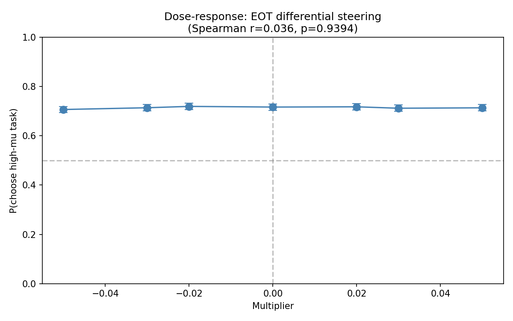
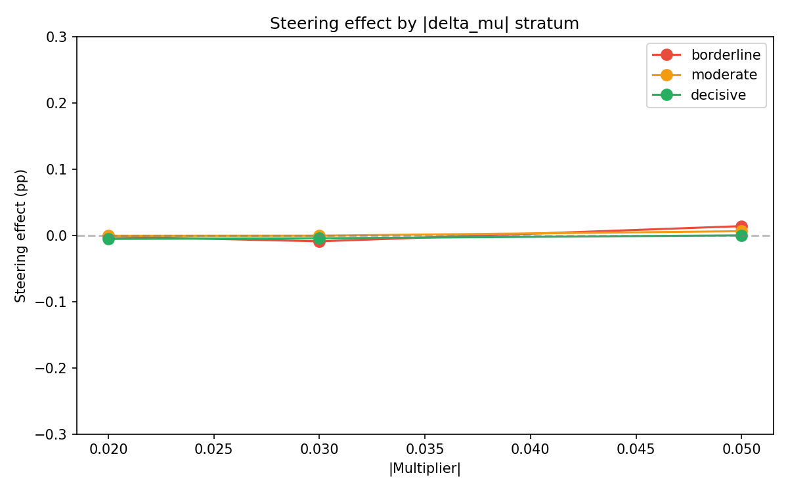

# Multi-Turn Differential EOT Steering: Results

## Summary

**Null result.** Differential steering at user-turn EOT tokens in the multi-turn pairwise format does not shift task preferences. P(choose high-mu) is flat at ~0.71 across all 7 multiplier conditions (Spearman r = 0.036, p = 0.94). Max steering effect is 0.7pp with CI spanning zero.

## Setup

| Parameter | Value |
|---|---|
| Model | `google/gemma-3-27b-it` (local HuggingFace) |
| Probe | tb-5 Ridge, L32, heldout r = 0.868 |
| Steering layer | 32 |
| Multipliers | -0.05, -0.03, -0.02, 0, +0.02, +0.03, +0.05 |
| Mean norm at L32 | 41,676 |
| Coefficients | -2084, -1250, -834, 0, +834, +1250, +2084 |
| Pairs | 500 (100 borderline, 200 moderate, 200 decisive) |
| Resamples per pair/ordering | 5 |
| Total trials | 35,000 |
| Temperature | 1.0 |
| max_new_tokens | 32 |
| Runtime | 163 min on 1x H100 |

Probe direction loaded from `probe_ridge_L32.npy` with intercept stripped and unit-normalized. Coefficients computed as multiplier x mean activation norm at L32 (from `extraction_metadata.json` for `turn_boundary:-5` selector).

## Dose-response

| Multiplier | Coefficient | P(high-mu) | 95% CI | N |
|---|---|---|---|---|
| -0.050 | -2084 | 0.707 | [0.694, 0.719] | 4855 |
| -0.030 | -1250 | 0.714 | [0.701, 0.727] | 4865 |
| -0.020 | -834 | 0.720 | [0.707, 0.732] | 4863 |
| 0.000 | 0 | 0.717 | [0.704, 0.729] | 4838 |
| +0.020 | +834 | 0.718 | [0.705, 0.731] | 4742 |
| +0.030 | +1250 | 0.712 | [0.699, 0.725] | 4695 |
| +0.050 | +2084 | 0.714 | [0.701, 0.727] | 4717 |

No monotonic trend: Spearman r = 0.036, p = 0.94.

## Steering effects

| Abs(mult) | P(+m) | P(-m) | Effect | 95% CI |
|---|---|---|---|---|
| 0.020 | 0.718 | 0.720 | -0.002 | [-0.020, +0.016] |
| 0.030 | 0.712 | 0.714 | -0.002 | [-0.020, +0.016] |
| 0.050 | 0.714 | 0.707 | +0.007 | [-0.011, +0.025] |

All effects are <1pp with CIs spanning zero.

## Ordering analysis

| Multiplier | P(A\|AB) | P(A\|BA) | Bias |
|---|---|---|---|
| -0.050 | 0.688 | 0.275 | +0.413 |
| -0.030 | 0.717 | 0.289 | +0.428 |
| -0.020 | 0.733 | 0.293 | +0.439 |
| 0.000 | 0.744 | 0.309 | +0.434 |
| +0.020 | 0.765 | 0.328 | +0.437 |
| +0.030 | 0.765 | 0.339 | +0.426 |
| +0.050 | 0.777 | 0.348 | +0.429 |

At control, P(A|AB) + P(A|BA) = 1.05, close to 1.0, meaning ordering bias is mostly explained by task preference. However, this sum increases from 0.96 at m=-0.05 to 1.13 at m=+0.05, showing steering introduces a net position-A preference.

Both P(A|AB) and P(A|BA) increase monotonically with multiplier (8-9pp from -0.05 to +0.05). Breaking P(high-mu) by ordering reveals the mechanism:

| Multiplier | P(high-mu, AB) | P(high-mu, BA) | Avg |
|---|---|---|---|
| -0.050 | 0.688 | 0.725 | 0.707 |
| 0.000 | 0.744 | 0.691 | 0.717 |
| +0.050 | 0.777 | 0.652 | 0.715 |

In AB ordering (high-mu at position A), steering UP increases P(high-mu). In BA ordering (high-mu at position B), steering UP decreases P(high-mu). These nearly cancel, producing a flat P(high-mu) overall. The steering acts on position, not on task quality.

## Stratum analysis

| Stratum | N | Baseline P(high-mu) | Max abs(effect) |
|---|---|---|---|
| Borderline (abs(delta_mu) < 1) | 6797 | 0.617 | 0.014 |
| Moderate (1 <= abs(delta_mu) < 3) | 13267 | 0.624 | 0.006 |
| Decisive (abs(delta_mu) >= 3) | 13511 | 0.860 | 0.005 |

No steering effect in any stratum.

## Parse rates

| Multiplier | Rate |
|---|---|
| -0.050 | 97.1% |
| -0.030 | 97.3% |
| -0.020 | 97.3% |
| 0.000 | 96.8% |
| +0.020 | 94.8% |
| +0.030 | 93.9% |
| +0.050 | 94.3% |

All >90%. Positive multipliers have slightly lower parse rates (~3pp), suggesting the +direction at the first EOT mildly disrupts response formatting.

## Success criteria

| Criterion | Result |
|---|---|
| Monotonic dose-response (Spearman r > 0, p < 0.05) | FAIL (r = 0.036, p = 0.94) |
| Steering effect > 10pp at any magnitude | FAIL (max = 0.7pp) |
| Ordering bias shifts with steering | FAIL |
| Parse rates > 90% at all conditions | PASS (min = 93.9%) |

**1/4 criteria passed.**

## Interpretation

The probe at the user-turn EOT tokens (tb-5, heldout r = 0.87) can predict Thurstonian scores but steering with this probe direction at these positions does not causally shift preferences. The ordering breakdown reveals the actual mechanism: steering shifts position-A preference (8-9pp across multiplier range), but this positional effect cancels when averaged across orderings, leaving P(high-mu) flat.

Possible explanations:

1. **Positional rather than evaluative effect.** The probe direction at EOT tokens encodes positional information (which turn am I in?) alongside or instead of preference-relevant content. Steering amplifies positional salience without affecting task evaluation. This is the best-supported explanation given the P(high-mu)-by-ordering data.

2. **Non-causal correlation.** The tb-5 probe captures correlates of preference (e.g., task complexity) at the EOT tokens, but these are not read out by downstream preference computation.

3. **Wrong steering site.** Preference decisions may crystallize at later tokens (e.g., the final EOT before generation). User-turn EOTs are encoding sites, not decision sites.

4. **Coefficient range too small.** Coefficients of 834-2084 may be insufficient. However, parse rate degradation at +0.05 (94.3%) suggests we're near the coherence edge.
