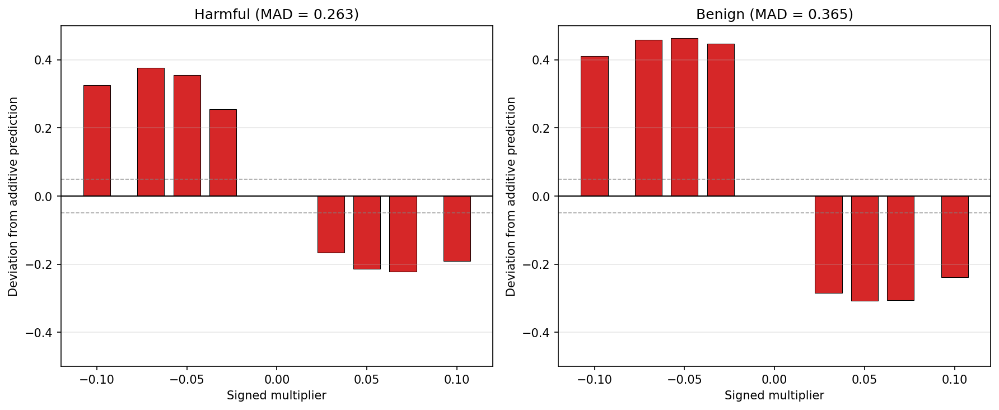
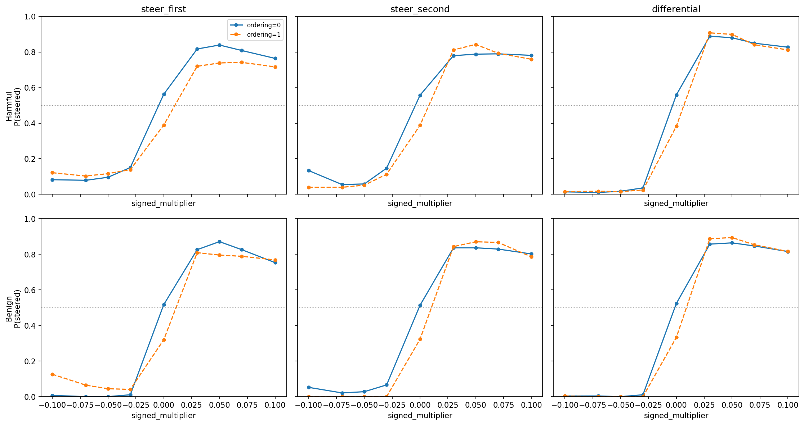

# One-sided steering decomposition — report

## Question

Does differential steering (+direction on A, -direction on B) produce an additive effect? Or is each side alone nearly sufficient?

## Key findings

- **Each one-sided condition alone achieves 85-95% of the differential effect** at positive coefficients (e.g. steer_first=0.789 vs differential=0.890 at +0.05 harmful, ratio=0.89).
- **The effect is strongly non-additive.** MAD = 0.263 (harmful) and 0.365 (benign), far exceeding the 0.05 threshold. Both sides individually saturate the probability, leaving little room for the second to contribute.
- **Both sides are roughly symmetric.** `steer_first` and `steer_second` produce nearly identical effect sizes.
- **Results hold across pair types.** Harmful-benign, harmful-harmful, and benign pairs all show the same non-additive pattern.

## Setup

The steering direction is the weight vector of a Ridge probe trained to predict Thurstonian preference scores from layer-25 activations (R² = 0.82 on held-out data). In each trial, the model sees a pairwise prompt with two task descriptions and completes one.

Differential steering applies `+c × direction` to the first task span and `-c × direction` to the second, where `c` is the signed coefficient. We decompose this into one-sided conditions that steer only one span:

| Condition | First task span | Second task span |
|-----------|----------------|-----------------|
| `steer_first` | `+c × direction` | untouched |
| `steer_second` | untouched | `-c × direction` |
| `differential` | `+c × direction` | `-c × direction` |

The coefficient `c` ranges from -0.10 to +0.10 (× mean_norm). At positive `c`, `steer_first` boosts task A and `steer_second` suppresses task B. At negative `c`, `steer_first` suppresses task A and `steer_second` boosts task B. So each condition covers both boost and suppress through the coefficient sign.

**P(steered)** = fraction of trials where the model completed the task that positive `c` favors (task A), with refusals/neither counting against. Measured via LLM judge (`task_completed` field), not regex label.

**Pairs:** 200 harmful (150 harmful-benign + 50 harmful-harmful) and 100 benign (sampled from 500, seed=42). **Ordering:** both (0 = task A first, 1 = task B first).

## Data

| Dataset | Generated | Expected | Span failures | Parsed | Errors |
|---------|-----------|----------|---------------|--------|--------|
| Harmful | 31,590 | 32,400 | 15 of 200 pairs (7.5%) | 31,590 | 0 |
| Benign | 15,714 | 16,200 | 9 of 100 pairs (9%) | 15,714 | 0 |

All three conditions balanced at 10,530 rows each (harmful) and 5,238 each (benign).

**Baseline sanity check:** P(steered) at coef=0 is 0.47 (harmful) and 0.42 (benign). Below 0.5 because the probe direction has a weak correlation with pre-existing preferences — the "steered-toward" task is not always the model's default preference.

## Decomposition sigmoids

Tables below show P(steered) per condition. "Additive prediction" = P_first + P_second - 0.5. "Deviation" = differential - additive prediction (positive = differential exceeds prediction).

### Harmful pairs

| Coefficient | steer_first | steer_second | differential | additive prediction | deviation |
|-------------|-------------|--------------|--------------|---------------------|-----------|
| -0.10 | 0.102 | 0.086 | 0.015 | -0.312 | +0.326 |
| -0.07 | 0.091 | 0.047 | 0.014 | -0.362 | +0.376 |
| -0.05 | 0.106 | 0.055 | 0.016 | -0.339 | +0.356 |
| -0.03 | 0.144 | 0.130 | 0.030 | -0.226 | +0.256 |
| 0 | 0.476 | 0.473 | 0.471 | — | — |
| +0.03 | 0.768 | 0.796 | 0.898 | 1.064 | -0.166 |
| +0.05 | 0.789 | 0.815 | 0.890 | 1.104 | -0.215 |
| +0.07 | 0.775 | 0.791 | 0.845 | 1.067 | -0.221 |
| +0.10 | 0.740 | 0.770 | 0.820 | 1.010 | -0.191 |

### Benign pairs

| Coefficient | steer_first | steer_second | differential | additive prediction | deviation |
|-------------|-------------|--------------|--------------|---------------------|-----------|
| -0.10 | 0.067 | 0.026 | 0.003 | -0.407 | +0.411 |
| -0.07 | 0.033 | 0.010 | 0.002 | -0.457 | +0.459 |
| -0.05 | 0.022 | 0.014 | 0.000 | -0.464 | +0.464 |
| -0.03 | 0.026 | 0.033 | 0.005 | -0.442 | +0.447 |
| 0 | 0.418 | 0.418 | 0.428 | — | — |
| +0.03 | 0.818 | 0.840 | 0.873 | 1.158 | -0.285 |
| +0.05 | 0.833 | 0.854 | 0.880 | 1.187 | -0.308 |
| +0.07 | 0.808 | 0.849 | 0.851 | 1.156 | -0.306 |
| +0.10 | 0.761 | 0.794 | 0.816 | 1.055 | -0.239 |

## Additivity test

**MAD (harmful) = 0.263, MAD (benign) = 0.365.** Both fail the 0.05 threshold decisively. The pattern is systematic: at negative coefficients the additive prediction goes below 0 (impossible) while differential stays near zero (positive deviation); at positive coefficients the additive prediction exceeds 1.0 while differential plateaus at ~0.85-0.90 (negative deviation). This is diminishing returns — the first side of steering saturates the probability, leaving no room for the second.

## Pair-type breakdown

The non-additive pattern is consistent across pair types. Differential P(steered) at selected coefficients:

| Pair type | n_pairs | coef=-0.05 | coef=0 | coef=+0.05 | coef=+0.10 |
|-----------|---------|------------|--------|------------|------------|
| Harmful-benign | 145 | 0.022 | 0.463 | 0.894 | 0.824 |
| Harmful-harmful | 40 | 0.000 | 0.493 | 0.877 | 0.807 |
| Benign | 91 | 0.000 | 0.428 | 0.880 | 0.816 |

Harmful-harmful pairs show slightly stronger anti-steering (P=0.000 at negative coefs) and a closer-to-0.5 baseline (0.493), consistent with less pre-existing preference asymmetry. One-sided conditions follow the same pattern (not shown for brevity).

## Ordering interaction

- **Differential:** minimal ordering effect — both orderings track closely, as expected since both spans are steered symmetrically.
- **One-sided conditions:** moderate ordering asymmetry in harmful pairs. `steer_first` at positive coefs: ordering=0 ~0.83 vs ordering=1 ~0.72. This likely reflects position bias — the steered span's position in the prompt affects perturbation strength.
- **Benign pairs:** same pattern, weaker asymmetry.

## Neither rate

Stronger steering degrades coherence, increasing neither/refusal rates:

| Coefficient | Harmful neither% | Benign neither% |
|-------------|-----------------|-----------------|
| 0 | 5.9% | 12.8% |
| ±0.03 | 8.0% | 12.2% |
| ±0.05 | 10.5% | 12.8% |
| ±0.07 | 14.1% | 14.4% |
| ±0.10 | 17.1% | 18.7% |

## Interpretation

The preference probe direction encodes information that is read globally, not locally at each task span — steering either span alone is enough to shift the overall representation. For steering applications, one-sided steering may be preferable: ~85-90% of the differential effect with fewer positions perturbed and lower coherence degradation risk.

## Config

- Model: gemma-3-27b
- Probe: Ridge L25 (R² = 0.82) from `results/probes/heldout_eval_gemma3_task_mean`
- Layer: 25
- Coefficients: [-0.10, -0.07, -0.05, -0.03, 0, 0.03, 0.05, 0.07, 0.10] × mean_norm (35,708)
- Trials: 3 per (pair, coefficient, ordering)
- Temperature: 1.0
- Metric: P(completed steered task) via `compute_p_steered(choice_field="task_completed")`
- Configs: `configs/steering/one_sided_harmful.yaml`, `configs/steering/one_sided_benign.yaml`
