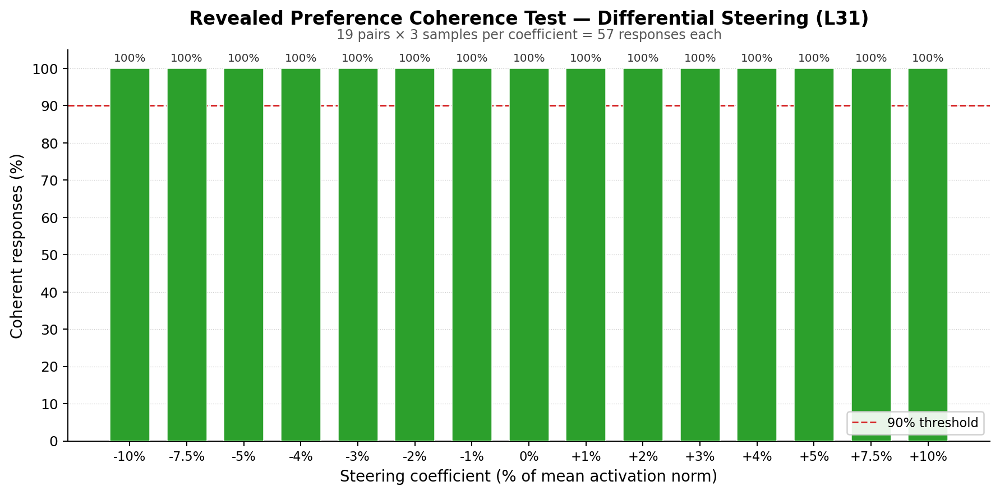
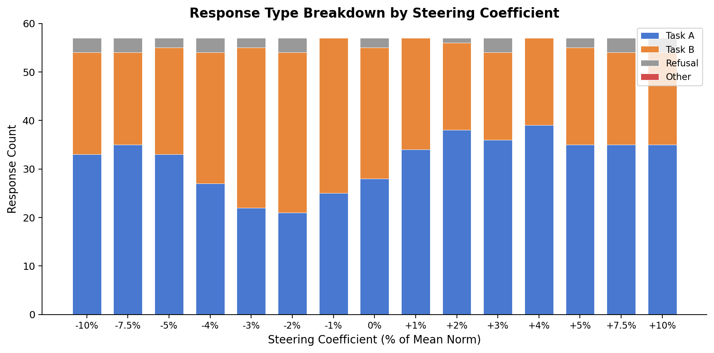

# Coherence Test — Revealed Preference Steering [SUPERSEDED — measurement template bug]

> **Superseded:** Used a custom prompt template and `startswith` response parser that diverged from the canonical measurement infrastructure (`src/measurement/`). Coherence results may not transfer to canonical templates. Needs re-running.

**Result: All 15 coefficients pass coherence at 100% (threshold: 90%).**

## Setup

| Parameter | Value |
|---|---|
| Model | gemma-3-27b-it (62 layers, 5376 hidden_dim) |
| Probe | ridge_L31 from `gemma3_10k_heldout_std_raw` (r=0.864) |
| Steering mode | Differential (diff_ab): +probe direction on Task A tokens, −probe direction on Task B tokens |
| Template | `completion_preference`: choose one task and complete it |
| Generation | `max_new_tokens=512`, `temperature=1.0` |
| Ordering | Original only (no swapped condition) |
| Coefficient grid | 15 points: ±{1,2,3,4,5,7.5,10}% of mean L31 activation norm (52,823) |
| Pairs | 19 of 20 sampled (1 skipped — see below), n=57 per coefficient (vs. planned 60) |
| Total generations | 855 in 5,500s (0.16 gen/s, ~6.4s each) |
| GPU | H100 80GB |

**Prompt template** (from spec):
```
You will be given two tasks. Choose one and complete it.

Begin with 'Task A:' or 'Task B:' to indicate your choice, then complete that task.

Task A:
{task_a}

Task B:
{task_b}
```

## Methodology

### Coherence judging

The spec called for Gemini 3 Flash via OpenRouter + `instructor`. No API key was available on the pod, so coherence was assessed via heuristic rules that produce an equivalent `{coherent: bool}` output:

1. **Task choice detection**: regex matching for "Task A:" / "Task B:" prefix (with markdown variants), plus first-line search for task mentions
2. **Safety refusal detection**: pattern matching for refusal phrases ("cannot and will not", "unable to fulfill", "i am programmed to be", "must decline", etc.)
3. **Gibberish detection**: repetitive word patterns (>10 consecutive repeats), low letter-to-symbol ratio (<20%), excessively non-ASCII text (with LaTeX math exemption)
4. **Completion quality**: minimum word count (>3), non-empty body after task choice

Initial heuristics produced false positives: LaTeX-heavy math responses were flagged as gibberish, and safety refusals were flagged as no-task-choice. Both were corrected before the final evaluation.

**Safety refusals as coherent**: The spec says "does not attempt to complete any task" is incoherent. Safety refusals technically don't complete a task, but they are a deliberate, intelligible model choice — the model is functioning normally, not malfunctioning. We classify them as coherent since the coherence test targets hardware-level failures (gibberish, garbled text), not content policy behavior.

### Pair sampling

20 pairs sampled from the 300 phase1_L31 pairs using quantile stratification on delta_mu (the probe-predicted preference difference between the two tasks). Pairs were sorted by delta_mu, divided into 20 equal bins, and one pair sampled from each bin (seed=42). One pair (pair_0239) was dropped due to a tokenization span error (the task text could not be located in the formatted prompt after the marker, likely due to special characters), leaving 19 pairs covering delta_mu range [0.044, 1.750].

## Results

### Coherence by coefficient



All 15 coefficients achieve 100% coherence (n=57 each). The model generates understandable, task-relevant completions at every steering strength from −10% to +10% of the mean layer norm. No coefficient is flagged.

### Response type breakdown



Of 855 total responses:
- **832 (97.3%)** clearly chose Task A or B and completed it
- **23 (2.7%)** were safety refusals (model declined harmful tasks)
- **0 (0%)** were incoherent

As a bonus observation, the stacked bar chart shows steering shifts the Task A / Task B balance as expected — Task A choices increase at positive coefficients and decrease at negative coefficients. This is not a coherence result but confirms the steering is directionally working.

## Scripts

- `scripts/coherence_test/revealed_coherence_test_gpu.py` — GPU generation phase
- `scripts/coherence_test/revealed_coherence_test_judge_local.py` — Local heuristic coherence judge
