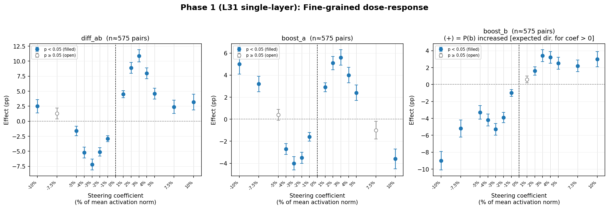
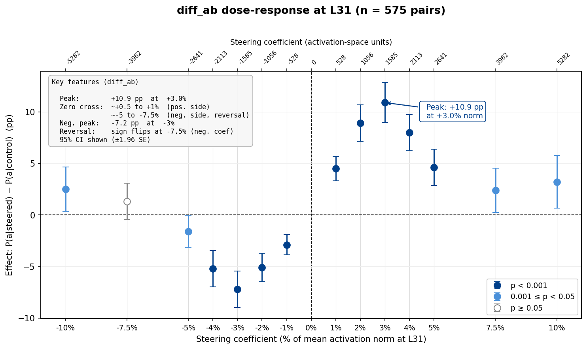
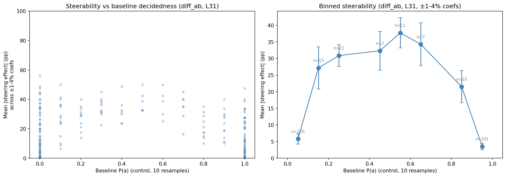
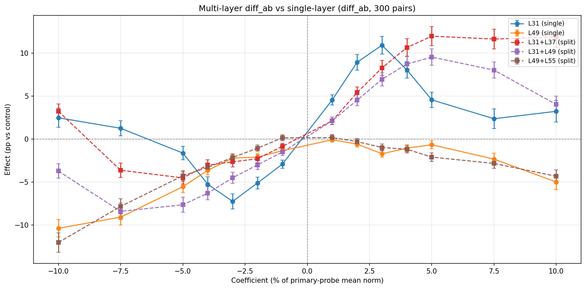
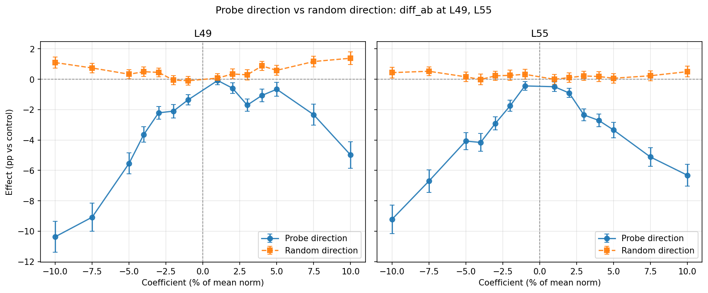

# Fine-Grained Steering Report [SUPERSEDED — measurement template bug]

> **Superseded:** Used a custom prompt template and `startswith` response parser that diverged from the canonical measurement infrastructure (`src/measurement/`). Results are not directly comparable to measurement runs. Needs re-running with canonical templates.

**Date:** 2026-02-24
**Branch:** `research-loop/fine_grained`
**Model:** gemma-3-27b-it (A100 80GB)
**Probe:** `gemma3_10k_heldout_std_raw` — ridge at L31, L37, L43, L49, L55
**Parent:** [`replication_report.md`](../replication/replication_report.md)

---

## Summary

The dose-response curve for activation steering peaks at +3% of mean activation norm — lower than the replication tested. Effects are non-monotone: they peak sharply, then decline or reverse at higher coefficients. Differential steering (simultaneously boosting A and suppressing B) is far more robust than one-sided steering, retaining significant effects even at +10% norm where one-sided reverses. Later layers (L49, L55) do not steer bidirectionally despite having comparable probe accuracy — a dissociation between predictive and causal efficacy. Multi-layer L31+L37 split-budget is the best configuration overall: +12pp with no saturation.

**Phase 1 (L31 single-layer, n=575 pair×orderings):**

| Condition | Peak effect | Peak at | Reversal at +10%? |
|---|---|---|---|
| Differential (A+ B−) | **+10.9pp** (t=10.55, p<0.0001) | +3% norm | Partial: drops to +3.2pp (still significant) |
| Boost A only | **+5.6pp** (t=8.16, p<0.0001) | +3% norm | Complete: reverses to −3.6pp |
| Boost B only | **+3.4pp** on P(b) (t=4.90, p<0.0001) | +3% norm | No: +3.0pp (robust) |

**Phases 2–4 headlines:**
- **L49/L55 probes suppress P(a) regardless of coefficient sign** — no bidirectional steering despite R² = 0.835, 0.836 (vs L31 R² = 0.864)
- **L31+L37 split-budget: +12.0pp, plateau from +5% to +10%** — eliminates saturation
- **Random directions produce ≤1.4pp** (vs 7–10pp for probe directions) — confirms probe specificity

---

## Experimental Design

### Steering conditions

Each condition steers the model during pairwise preference judgments ("Choose task A or B"). The probe direction is a linear direction in activation space trained to predict Thurstonian utility scores.

| Condition | What it does | Example |
|---|---|---|
| **Differential (A+ B−)** | Add +direction to task A tokens, −direction to task B tokens | Simultaneously makes A look better and B look worse |
| **Boost A** | Add +direction to task A tokens only | Makes A look better, leaves B unchanged |
| **Boost B** | Add +direction to task B tokens only | Makes B look better, leaves A unchanged |

The steering magnitude is expressed as a percentage of the mean activation norm at the steering layer. For example, "+3% norm" at L31 means a coefficient of ±1,585 (3% of L31's mean norm of 52,823).

### Coefficient grid

15 points: [−10%, −7.5%, −5%, −4%, −3%, −2%, −1%, 0%, +1%, +2%, +3%, +4%, +5%, +7.5%, +10%]

| Probe | Layer | Mean norm | ±3% | ±5% | ±10% |
|---|---|---|---|---|---|
| ridge_L31 | 31 | 52,823 | ±1,585 | ±2,641 | ±5,282 |
| ridge_L37 | 37 | 64,096 | ±1,923 | ±3,205 | ±6,410 |
| ridge_L43 | 43 | 67,739 | ±2,032 | ±3,387 | ±6,774 |
| ridge_L49 | 49 | 80,067 | ±2,402 | ±4,003 | ±8,007 |
| ridge_L55 | 55 | 93,579 | ±2,807 | ±4,679 | ±9,358 |

### Pair selection

300 pairs pre-selected from ~31,400 borderline pairs in the active learning measurement data (|Δmu| < 2, 0 < measurement P(a) < 1). A "borderline pair" is one where the model doesn't always pick the same task — e.g., picks A in 3/5 measurement trials.

| Pool | N pairs | Selection |
|---|---|---|
| Near-50/50 (measurement P(a) ∈ [0.3, 0.7]) | 2,073 | 100 sampled, stratified by 10 mu-bins |
| Decided (measurement P(a) outside [0.3, 0.7]) | 2,412 | 200 sampled, stratified by 10 mu-bins |
| **Total** | **300** | mu range [−9.77, +10.00] |

Each pair tested in 2 orderings (A-B and B-A) × 3 conditions × 15 coefficients × 10 resamples = 900 calls per pair.

### Phases

| Phase | Layers | Conditions | Records |
|---|---|---|---|
| 1 | L31 | Differential, boost A, boost B | 25,026 |
| 2 | L49, L55 | Differential, boost A, boost B | 25,026 per layer |
| 3 | L31+L37, L31+L49, L49+L55 | Differential only (split-budget) | 25,026 |
| 4 | L49, L55 | Random direction control | 8,730 per layer |

"Split-budget" means each layer gets half the total coefficient. A record is one (pair, ordering, condition, coefficient) cell aggregating 10 resamples.

---

## Phase 1: L31 Single-Layer

**Control P(a):** 0.559 ± 0.473 (chance = 0.50; the 6pp excess reflects position bias toward task A).

### Dose-response: differential steering (A+ B−)

n ≈ 575 pair×orderings per coefficient. "Effect" = P(a) − control P(a). "%pos" = fraction of pairs with positive individual effect.

| % norm | Coef | P(a) | Effect (pp) | SE | t | p | %pos |
|---|---|---|---|---|---|---|---|
| −10% | −5282 | 0.587 | +2.5 | 1.1 | 2.27 | 0.024 | 13.7% |
| −7.5% | −3962 | 0.572 | +1.3 | 0.9 | 1.43 | 0.154 | 12.3% |
| −5% | −2641 | 0.543 | −1.6 | 0.8 | −2.11 | 0.035 | 7.5% |
| −4% | −2113 | 0.506 | −5.2 | 0.9 | −6.16 | <0.001 | 4.5% |
| **−3%** | −1585 | 0.486 | **−7.2** | 0.9 | −8.33 | <0.001 | 2.6% |
| −2% | −1056 | 0.508 | −5.1 | 0.7 | −7.44 | <0.001 | 2.4% |
| −1% | −528 | 0.530 | −2.9 | 0.5 | −6.12 | <0.001 | 2.3% |
| +1% | +528 | 0.604 | +4.5 | 0.6 | 7.59 | <0.001 | 15.8% |
| +2% | +1056 | 0.649 | +8.9 | 0.9 | 9.84 | <0.001 | 20.6% |
| **+3%** | +1585 | 0.667 | **+10.9** | 1.0 | 10.55 | <0.001 | 21.9% |
| +4% | +2113 | 0.639 | +8.0 | 0.9 | 8.55 | <0.001 | 19.5% |
| +5% | +2641 | 0.605 | +4.6 | 0.9 | 5.00 | <0.001 | 14.8% |
| +7.5% | +3962 | 0.583 | +2.4 | 1.1 | 2.08 | 0.038 | 13.9% |
| +10% | +5282 | 0.588 | +3.2 | 1.3 | 2.56 | 0.011 | 16.3% |

12/14 non-zero coefficients significant at p<0.001. The two exceptions (−7.5%, −10%) are in the reversal zone.

### Dose-response: boost A and boost B

**Boost A** (effect = change in P(a), n ≈ 575):

| % norm | Effect (pp) | SE | t | p |
|---|---|---|---|---|
| −10% | **+5.0** | 0.9 | 5.78 | <0.001 |
| −7.5% | **+3.2** | 0.7 | 4.64 | <0.001 |
| −5% | +0.4 | 0.5 | 0.82 | 0.41 |
| **−3%** | −4.0 | 0.6 | −7.17 | <0.001 |
| **+3%** | **+5.6** | 0.7 | 8.16 | <0.001 |
| +5% | +2.4 | 0.7 | 3.44 | <0.001 |
| +10% | **−3.6** | 0.9 | −4.09 | <0.001 |

Rows at −10% and −7.5% are anomalous: negative coefficient (intended to suppress A) actually *increases* P(a). At +10%, the effect reverses completely to −3.6pp. Both anomalies are consistent with large perturbations disrupting task comparison and defaulting to position bias.

**Boost B** (effect = change in P(b), n ≈ 575):

| % norm | Effect on P(b) (pp) | SE | t | p |
|---|---|---|---|---|
| −10% | **−9.0** | 1.1 | −8.21 | <0.001 |
| −3% | −5.3 | 0.7 | −7.46 | <0.001 |
| **+3%** | **+3.4** | 0.7 | 4.90 | <0.001 |
| +5% | +2.5 | 0.7 | 3.41 | <0.001 |
| +10% | +3.0 | 0.9 | 3.37 | <0.001 |

Boost B peaks at +3.4pp — about 1/3 the magnitude of differential steering. At negative coefficients, shows the same wrong-direction anomaly as boost A (−9.0pp at −10%).

### Dose-response plots

### Interpretation

- **Peak at +3% norm, not +5% or +10%.** The replication (testing only ±5% and ±10%) sampled the declining edge of the curve. True peak: +10.9pp for differential, +5.6pp for boost A.
- **Differential steering is most robust.** Clean S-shaped dose-response: +10.9pp at +3%, −7.2pp at −3%. Boost A anomalously *increases* P(a) at negative coefficients (+5.0pp at −10%) — large perturbations default to position bias. Differential's symmetric push-pull cancels this noise.
- **Partial reversal for differential, complete for boost A.** At +10% norm: differential retains +3.2pp (p=0.011); boost A reverses to −3.6pp (p<0.001). Reversal threshold ≈ ±4–5% of activation norm.
- **Boost B is attenuated but robust.** +3.4pp peak, no reversal at +10%. The wrong-direction anomaly at negative coefficients mirrors boost A.
- **Differential ≈ 1.21× (boost A + boost B) — slightly super-additive.** The A-side and B-side effects are independent (r = −0.002). Differential is primarily driven by the A-side mechanism (r(boost A, differential) = 0.717); the B-side contributes an independent additive component.
- **Consistent with the replication after accounting for pair selection.** Our overall +4.6pp at +5% looks weaker than the replication's +9.5pp. But the replication screened for in-session borderline pairs; we didn't. Among our in-session borderline pairs (13.4% of sample), the effect at +5% is +13.5pp — consistent with and slightly larger than the replication.

### Steerability vs baseline decidedness

"Baseline P(a)" = P(a) in the control condition (coefficient = 0) for that pair×ordering, estimated from 10 resamples. Values are coarse: {0.0, 0.1, ..., 1.0}.

Effect at peak coefficient (+3% norm) by baseline P(a) bin:

| Baseline P(a) | n | Mean effect | Note |
|---|---|---|---|
| [0.0, 0.1) | 214 | +15.6pp | Model strongly prefers B; moderate steerability |
| [0.1, 0.7) | 50 | +30–60pp | Near-borderline; highest steerability |
| [0.7, 0.9) | 17 | +17–30pp | Moderate steerability |
| [0.9, 1.0] | 294 | +0.1pp | Model strongly prefers A; nearly unsteerable (ceiling) |

Pearson r(|baseline P(a) − 0.5|, effect) = −0.402, p < 0.001 (n=575). More decided pairs are harder to steer. The ceiling at P(a) ≈ 1 is much stronger than the floor at P(a) ≈ 0: pairs that already prefer A are unsteerable, while pairs that prefer B can still be partially flipped (+15.6pp).

Only 13.4% of pre-selected pairs are in-session borderline (baseline P(a) strictly between 0 and 1). The other 86.6% show P(a) = 0 or 1 in 10 resamples, contributing near-zero effects that dilute the population average.

**Measurement-based metrics don't predict steerability.** The active-learning selection criteria (|Δmu|, measurement P(a)) show no correlation with steering effect:
- r(|Δmu|, effect) = +0.081, p=0.16
- r(|measurement P(a) − 0.5|, effect) = +0.024, p=0.68

Within-session baseline P(a) is the actual predictor. Implication: future designs should screen pairs within the current session first (~10 control samples), then focus the steering budget on borderline pairs.

**Ordering consistency.** Original vs swapped orderings: +11.4pp and +10.5pp (both p<0.0001).

**Direction-agnostic steerability.** The above analysis uses only positive steering (+3% norm), biasing toward B-preferring pairs. A symmetric measure: mean |effect| across ±1% to ±4% coefficients. This yields a symmetric inverted-U: ~38pp at baseline P(a) ≈ 0.5, ~4–6pp at the extremes. r(|baseline P(a) − 0.5|, mean |effect|) = −0.637, p < 0.001 (n=582).

---

## Phase 2: L49 and L55 Single-Layer

### Differential steering dose-response by layer

All three layers have comparable probe accuracy (L31 R²=0.864, L49 R²=0.835, L55 R²=0.836).

| % norm | L31 | L49 | L55 |
|---|---|---|---|
| −10% | +2.5pp* | **−10.4pp*** | **−9.2pp*** |
| −7.5% | +1.3pp | −9.1pp* | −6.7pp* |
| −5% | −1.6pp* | −5.5pp* | −4.1pp* |
| −3% | **−7.2pp*** | −2.2pp* | −2.9pp* |
| +3% | **+10.9pp*** | −1.7pp* | −2.3pp* |
| +5% | +4.6pp* | −0.7pp | −3.3pp* |
| +7.5% | +2.4pp* | −2.3pp* | −5.1pp* |
| +10% | +3.2pp* | −5.0pp* | −6.3pp* |

\* p < 0.05

L31 shows an S-shaped curve (positive coefficients increase P(a), negative decrease it). L49 and L55 produce exclusively negative effects regardless of coefficient sign.

### Interpretation

- **L49 and L55 do not steer bidirectionally.** Both layers only suppress P(a), regardless of coefficient direction. L49: monotonic, bottoming at −10.4pp at −10%. L55: V-shaped, −9pp at −10%, −6pp at +10%.
- **The probe direction at late layers acts as a "suppress task A" direction.** Consistent across conditions: at L55, boost A produces −7.4pp at +10% while boost B produces +9.5pp at +10%.
- **Dissociation between predictive accuracy and causal efficacy.** Probes at L49/L55 predict preferences almost as well as L31 (R² 0.835–0.836 vs 0.864), but the learned direction does not causally control preferences bidirectionally. The late-layer probes may read off a correlate of the decision (e.g., a response-selection signal) rather than the decision-relevant evaluative representation.

---

## Phase 3: Multi-Layer Split-Budget (differential only)

"Split-budget" = total coefficient divided equally between layers, each steered with its own layer-specific probe direction.

| Config | Peak effect | Peak at | At +10% | vs L31 single |
|---|---|---|---|---|
| L31 (single) | +10.9pp | +3% | +3.2pp | baseline |
| L31+L37 (split) | **+12.0pp** | +5% | ~11pp | +1.1pp peak, **plateau from +5% to +10%** |
| L31+L49 (split) | +9.5pp | +5% | +4.0pp | −1.4pp; L49 counter-direction hurts at extremes |
| L49+L55 (split) | no positive effects | — | — | Fails entirely |

### Interpretation

- **L31+L37 is the best configuration.** +12.0pp peak and — crucially — no saturation. Effect holds at ~11–12pp from +5% through +10%, vs L31 single dropping from +10.9pp to +3.2pp over the same range.
- **L31+L49 underperforms because L49 works against the intended direction** (per Phase 2). Competitive at moderate coefficients (~9pp at +3–5%) but degrades at high coefficients.
- **L49+L55 fails entirely.** Neither component produces positive steering, so splitting between them yields nothing.
- **Practical recommendation:** L31+L37 split-budget at +5–7.5% norm. ~12pp with no saturation risk — strictly better than single-layer L31 at +3%.

---

## Phase 4: Random Direction Controls

Random directions at L49 and L55 (same coefficient grid as probe directions, differential steering only). 8,730 records per layer (fewer because only 1 condition × 2 layers, vs 3 conditions in other phases).

| Layer | Probe peak effect | Random peak effect | Ratio |
|---|---|---|---|
| L49 | −10.4pp at −10% | +1.4pp at +10% | ~7× |
| L55 | −9.2pp at −10% | +0.5pp (n.s.) | probe-specific only |

- **Random directions produce negligible effects.** L49: ~1pp at extreme coefficients (significant but tiny). L55: indistinguishable from zero across all coefficients.
- **Confirms probe specificity.** The late-layer steering effects are not generic perturbation artifacts. Random vectors of equal magnitude produce near-zero effects, while probe directions produce 7–10× larger effects.

---

## Discussion

### Key findings

- **The dose-response curve is non-monotone with a sharp peak at +3% of activation norm (L31).** Differential steering: +10.9pp at peak, declining to +3.2pp at +10%. Boost A: +5.6pp at peak, reversing to −3.6pp at +10%. The replication's 4-point grid (±5%, ±10%) missed the peak entirely.
- **Differential steering is strictly better than one-sided steering.** Symmetric push-pull cancels position-bias noise, yielding a cleaner S-shaped response on both sides. Always use differential (±) rather than one-sided interventions.
- **Steerability depends on within-session decidedness, not measurement-based metrics.** r(|baseline P(a) − 0.5|, effect) = −0.402. Pairs already decided in the current session are nearly unsteerable; near-50/50 pairs show +30–60pp effects. Pre-selection from active learning is necessary but not sufficient.
- **Predictive accuracy ≠ causal efficacy.** L49/L55 probes predict preferences nearly as well as L31 (R² 0.835–0.836 vs 0.864) but produce only suppressive, not bidirectional, steering. Good probe R² does not guarantee the direction is causally relevant.
- **Multi-layer L31+L37 eliminates saturation.** +12pp with a flat plateau from +5% to +10%, vs single-layer L31's sharp decline past +3%.

### Mechanistic interpretation of the reversal

The dose-response pattern at L31 is consistent with two competing mechanisms:

1. **Directional steering** (proportional to coefficient at small magnitudes): moves the model's evaluation in the intended direction along the probe axis.
2. **Position-bias inflation** (grows with perturbation magnitude regardless of direction): large perturbations disrupt task comparison, defaulting the model to the position-A heuristic (base rate P(a) ≈ 0.56).

At low coefficients (±1–3%), directional steering dominates. At high coefficients (±7–10%), position-bias inflation becomes comparable. Differential steering is more resistant because its symmetric structure partially cancels position-bias effects from the A and B hooks.

Evidence:
- Boost A at −10%: +5.0pp instead of the expected negative effect — position bias dominates completely
- Differential at −10%: +2.5pp instead of ~−7pp — position bias partially reverses the intended suppression
- Reversal threshold ≈ ±4–5% of activation norm

---

## Infrastructure

- **Script:** `scripts/fine_grained/run_experiment.py` (phases 1–4)
- **Analysis:** `scripts/fine_grained/analyze.py`
- **Results:** `experiments/steering/replication/fine_grained/results/`
- **JSONL checkpointing:** Resume-safe; each record appended atomically
- **Speed:** ~0.04 blk/s (~25s/block, ~14 calls/block at ~1.8s/call on A100)
- **Model:** gemma-3-27b-it, bfloat16, auto device map
