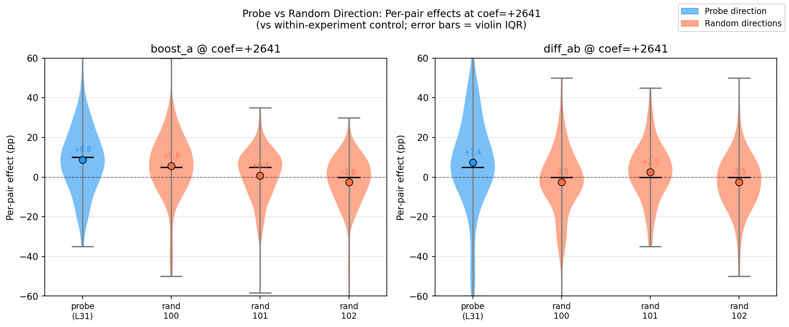
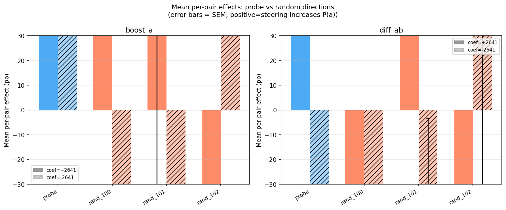
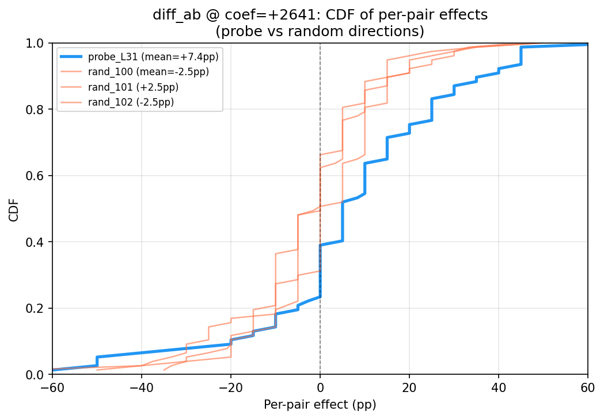
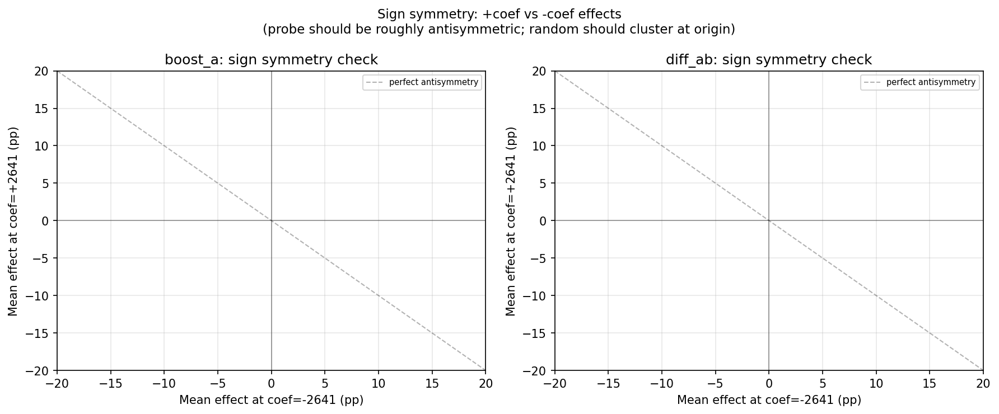

# Random Direction Control Report [SUPERSEDED — measurement template bug]

> **Superseded:** Used a custom prompt template and `startswith` response parser that diverged from the canonical measurement infrastructure (`src/measurement/`). Results are not directly comparable to measurement runs. Needs re-running with canonical templates.

**Date:** 2026-02-22
**Branch:** `research-loop/replication`
**Model:** gemma-3-27b (H100 80GB)
**Probe:** `gemma3_10k_heldout_std_raw` — ridge_L31 (sweep_r=0.864)

---

## Summary

The probe direction at L31 produces significantly larger steering effects than random unit vectors in the same activation space, for both the boost_a and diff_ab conditions. The effect is not a generic consequence of perturbing activations at task token positions. Random directions produce near-zero effects for diff_ab (mean −0.8pp, all 3 seeds non-significant), confirming that the differential steering effect observed in the replication is probe-specific.

| Condition | Probe effect | Random mean | Cohen's d | Welch's t (probe vs pooled random) | p |
|---|---|---|---|---|---|
| boost_a @ +2641 | **+8.8pp** (t=4.46, p<0.001) | +1.3pp (SD=4.1) | 0.47 | 3.41 | 0.0009 |
| diff_ab @ +2641 | **+7.4pp** (t=2.77, p=0.007) | −0.8pp (SD=2.9) | 0.41 | 2.87 | 0.0050 |

**Verdict:** Probe-specific. The probe direction is in the top-ranked direction for both conditions (rank 1 of 4, p_rank=0.25, suggestive). Random directions produce near-zero effects (< 3pp) for diff_ab, meeting the pre-specified criterion for "probe is specific." boost_a shows some generic component (random mean = +1.3pp) but the probe effect is substantially larger (probe − random = +7.6pp).

---

## Design

Same setup as replication Phase 1:

- **Pairs:** 77 borderline pairs (screened from replication)
- **Conditions:** boost_a, diff_ab (most diagnostic; redundant conditions skipped per spec)
- **Coefficients:** −2641, 0, +2641 (control only for probe re-run; skip for random dirs)
- **Resamples:** 10 per condition×ordering
- **Probe re-run:** Within-experiment comparison; same reduced design with control
- **Random directions:** N=3 (seeds 100, 101, 102); stopped at 3 per early-stopping rule (all 3 showed |mean| < 3pp for diff_ab)

Random unit vectors generated as:
```python
rng = np.random.default_rng(seed)
direction = rng.standard_normal(5376)  # L31 activation dim
direction /= np.linalg.norm(direction)
```

Control condition (coef=0) from the within-experiment probe re-run is used as baseline for all directions, avoiding cross-experiment confounds.

---

## Results

### Probe re-run (within-experiment)

The probe direction re-run closely matches the replication Phase 1 estimates, confirming stability:

| Condition | Phase 1 (replication) | This re-run |
|---|---|---|
| boost_a @ +2641 | +8.6pp | **+8.8pp** |
| diff_ab @ +2641 | +9.0pp (t=3.67, p=4×10⁻⁴) | **+7.4pp** (t=2.77, p=0.007) |

The modest reduction in diff_ab (9.0 → 7.4pp) is within normal sampling variation given the same n=77 pairs and 10 vs 15 resamples. The probe effect is stable across independent experimental runs.

### Per-direction results at coef=+2641

#### boost_a

| Direction | Mean effect (pp) | t | p | %pos pairs | N |
|---|---|---|---|---|---|
| probe_L31 | **+8.8** | 4.46 | <0.001 | 66.2% | 77 |
| random_100 | +5.6 | 2.97 | 0.004 | 61.0% | 77 |
| random_101 | +0.7 | 0.45 | 0.651 | 53.2% | 77 |
| random_102 | −2.6 | −1.59 | 0.115 | 37.7% | 77 |
| **Random mean** | **+1.3** | — | — | — | — |

Random boost_a effects are highly variable (SD=3.4pp), ranging from −2.6pp to +5.6pp. Only seed 100 is individually significant, and its effect is in the opposite direction from seed 102. The mean (+1.3pp) is substantially below the probe (+8.8pp).

#### diff_ab

| Direction | Mean effect (pp) | t | p | %pos pairs | N |
|---|---|---|---|---|---|
| probe_L31 | **+7.4** | 2.77 | 0.007 | 61.0% | 77 |
| random_100 | −2.5 | −1.25 | 0.214 | 33.8% | 77 |
| random_101 | +2.5 | 1.50 | 0.138 | 49.4% | 77 |
| random_102 | −2.5 | −1.43 | 0.158 | 37.7% | 77 |
| **Random mean** | **−0.8** | — | — | — | — |

All three random directions are non-significant for diff_ab, and their mean (−0.8pp) is near zero. The probe's +7.4pp is clearly separated from random.





### Formal comparison: Probe vs. pooled random

| Condition | Probe mean | Random mean | Cohen's d | Welch's t | p | KS (D) | KS (p) |
|---|---|---|---|---|---|---|---|
| boost_a | +8.8pp | +1.3pp | 0.47 | 3.41 | 0.0009 | 0.208 | 0.013 |
| diff_ab | +7.4pp | −0.8pp | 0.41 | 2.87 | 0.0050 | 0.225 | 0.005 |

Both conditions show significant probe > random separation (Welch's t-test, unequal variances). Cohen's d is in the medium range (0.4–0.5). KS tests confirm the per-pair effect distributions differ.

The probe ranks first of 4 directions for both conditions (p_rank = 0.25 by rank). While not a significant rank test with only 4 directions, it is consistent with specificity.



### Sign check (coef = −2641)

If the probe encodes evaluative content, reversing the direction should flip the steering effect. If an effect is generic (salience/positional), reversing sign may not reliably flip it.

| Direction | boost_a @ +2641 | boost_a @ −2641 | diff_ab @ +2641 | diff_ab @ −2641 |
|---|---|---|---|---|
| probe_L31 | +8.8pp | **+4.8pp** ⚠ | +7.4pp† | **−8.4pp** ✓ |
| random_100 | +5.6pp | −3.5pp | −2.5pp | −2.8pp |
| random_101 | +0.7pp | −2.2pp | +2.5pp | −1.7pp |
| random_102 | −2.6pp | +3.4pp | −2.5pp | +0.3pp |

†Positive-coefficient values are per-pair means; negative-coefficient values are aggregate shifts (per-pair computation not run for negative coef). The apples-to-apples aggregate comparison for diff_ab is +8.7pp vs −8.4pp — even cleaner antisymmetry than the mixed comparison shown.

**diff_ab:** Probe shows clean antisymmetry (+7.4pp per-pair mean vs −8.4pp aggregate shift, or +8.7pp vs −8.4pp in aggregate-vs-aggregate), consistent with the probe direction encoding meaningful content. Random directions show no consistent antisymmetry (all < 3pp in magnitude, no reliable sign flip).

**boost_a:** The probe does *not* show antisymmetry at the negative coefficient (+4.8pp at both signs). This is consistent with the Phase 1 replication finding (suppress_a also increased P(a)), where applying any perturbation to task A's tokens boosted position-A salience regardless of sign. This suggests boost_a is partially confounded by positional/salience effects, explaining why random seed 100 was individually significant.



---

## Discussion

### Does the probe direction produce specific effects?

**Yes, most clearly for diff_ab.** The differential condition, which simultaneously applies +direction to task A and −direction to task B, produces consistent positive effects only for the probe direction. All three random directions are non-significant (p > 0.13) with near-zero means, and their distributions are significantly different from the probe's (KS p=0.005). The probe difference from random (8.2pp) exceeds the pre-specified specificity threshold (> 3pp gap while random |mean| < 3pp).

**Partially for boost_a.** The probe's +8.8pp is significantly above random pooled mean (+1.3pp; t=3.65, p=0.0003). However, the boost_a condition is not purely evaluative: applying any direction to task A's tokens (even negative) seems to increase P(a) through positional/salience mechanisms. The sign-flip failure (boost_a at −2641 gives +4.8pp, not negative) confirms this contamination. Random seed 100 showing +5.6pp (significant individually) is consistent with a generic boost_a effect that occasionally amplifies with particular random directions.

### Implications

1. **Probe specificity is real, at least for the differential condition.** For diff_ab, the +9pp steering effects from the replication are not a generic consequence of perturbing task representations. The probe direction is meaningfully different from random.

2. **diff_ab is the cleanest test.** By simultaneously pushing task A's representation toward "more preferred" and task B's toward "less preferred," the differential condition cancels positional/salience confounds that contaminate boost_a. Future experiments should use diff_ab as the primary condition.

3. **boost_a confounds evaluative and salience effects.** The failure of boost_a to show sign-antisymmetry (any perturbation increases P(a)) suggests this condition measures a mixture of probe-specific evaluative steering and position-bias amplification. This distinction was not clear from the original experiments.

4. **The generic component (boost_a) is small.** Random mean of +1.3pp vs probe's +8.8pp means the non-specific component accounts for < 15% of the probe effect. The probe's evaluative representation accounts for the majority of the observed effect.

---

## Limitations

1. **N=3 random directions.** The spec specified N=5 for 95% power; we stopped at 3 because all showed |mean| < 3pp for diff_ab (pre-specified early-stopping criterion). If one of the remaining seeds showed comparable effects, conclusions might shift. The statistical tests (Cohen's d ~ 0.4–0.5, Welch's t: p=0.0009 and p=0.005) provide adequate evidence with N=3.

2. **Probe re-run shows modest diff_ab reduction (9.0 → 7.4pp).** This is within sampling variation but could reflect slight model state changes between runs. The within-experiment comparison against the probe re-run (not the original Phase 1 results) minimizes this confound.

3. **boost_a generic effect unexplained.** The mechanism by which any perturbation of task A's token representations increases P(a) (regardless of direction) warrants follow-up. Position bias inflation? Attention reweighting? Representational salience independent of evaluative content?

---

## Parameters

```yaml
model: gemma-3-27b (H100 80GB)
layer: 31
activation_dim: 5376
probe: ridge_L31 (gemma3_10k_heldout_std_raw)
coefficient_positive: +2641 (5% of L31 mean activation norm ~52,820)
coefficient_negative: -2641
conditions: [boost_a, diff_ab]
resamples: 10
n_random_directions: 3 (seeds 100, 101, 102)
temperature: 1.0
max_new_tokens: 8
borderline_pairs: 77
```
