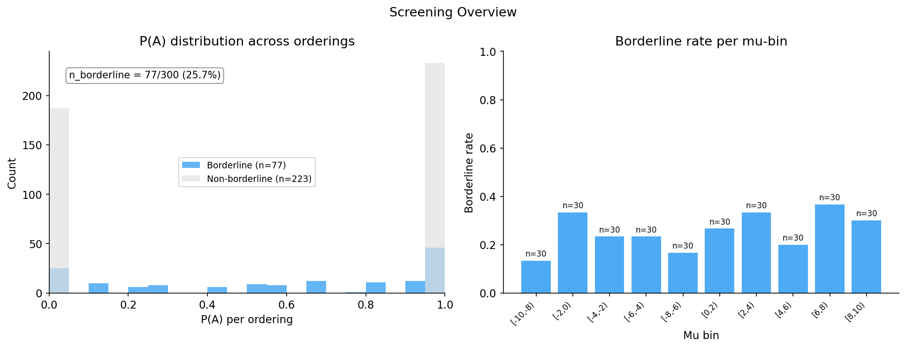
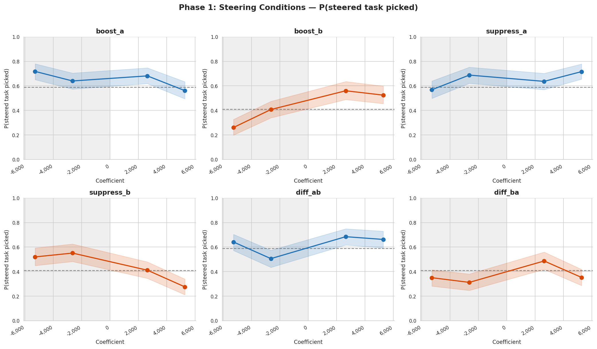
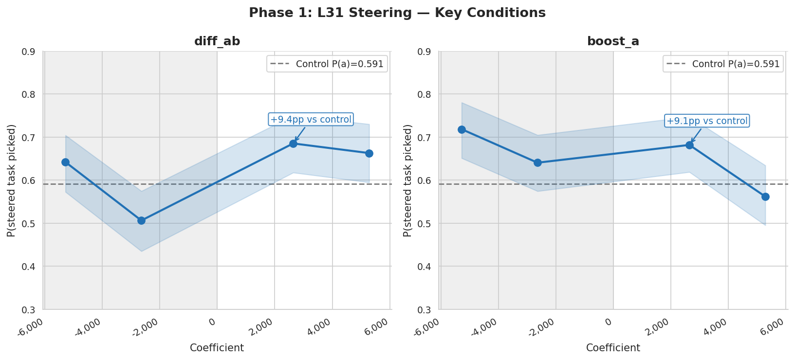
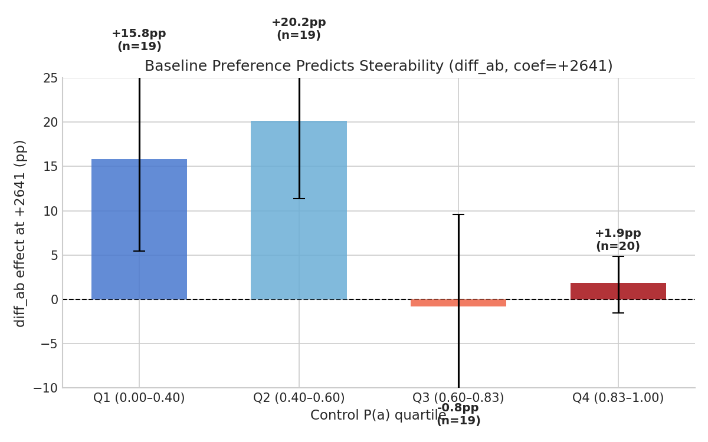
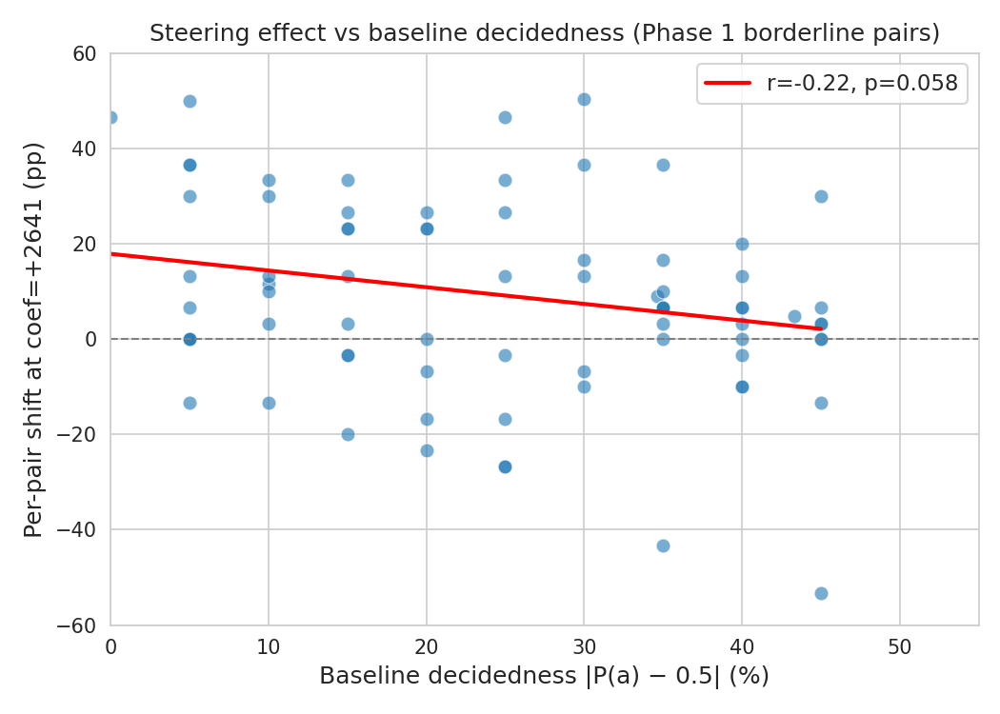
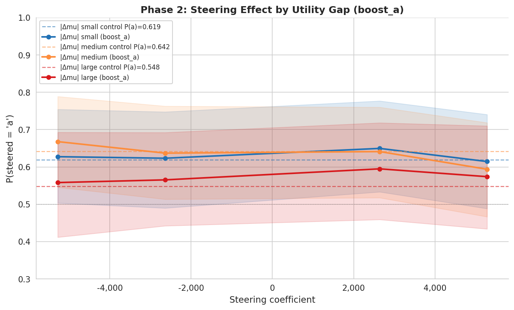
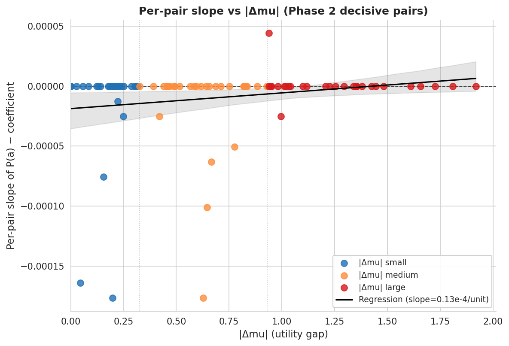
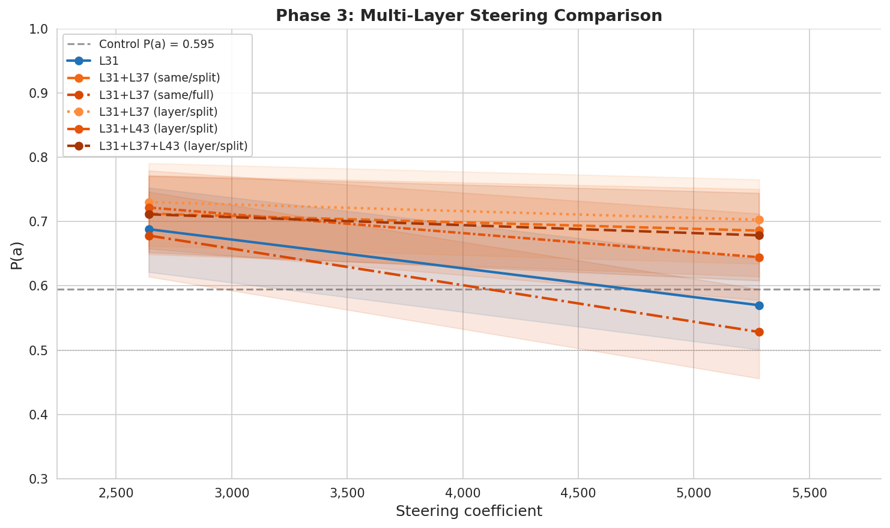
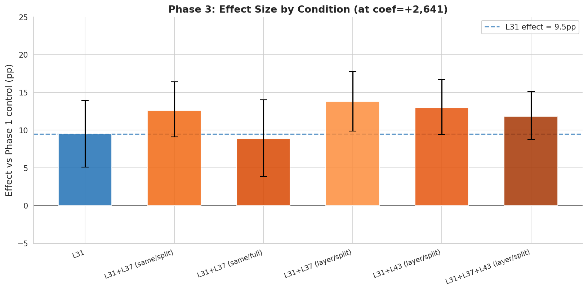

# Steering Replication & Extension Report

> **Superseded by `fine_grained/fine_grained_report.md`** — this replication used only 77 pairs and 4 non-zero coefficients. The fine-grained experiment extended to 300 pairs and 15 coefficients.

**Date:** 2026-02-22
**Branch:** `research-loop/replication`
**Model:** gemma-3-27b (H100 80GB)
**Probe:** `gemma3_10k_heldout_std_raw` — ridge_L31 (sweep_r=0.864)

---

## Summary

This experiment replicates the position-selective steering result from the original revealed preference experiment ([`experiments/steering/revealed_preference/`](../revealed_preference/)), using the retrained 10k-task probes, and extends it in two directions: (1) utility-bin analysis to test whether steering effects vary with the preference gap, and (2) multi-layer steering to test whether simultaneous intervention at multiple layers amplifies the effect.

**Key results:**

| | Original | This replication |
|---|---|---|
| Probe training set | 3k tasks | 10k tasks |
| Probe heldout R² | 0.846 | 0.864 |
| Borderline pairs screened | 38/300 (12.7%) | 77/300 (25.7%) |
| Single-task steering shift (boost_a, coef=+2641) | ~32pp | **+8.6pp** |
| Differential steering shift (diff_ab, coef=+2641) | ~51pp | **+9.0pp** (t=3.67, p=4×10⁻⁴) |
| Position-selective effect present | Yes | Yes (weaker; see below) |
| Phase 2: utility-bin analysis | — | Decisive pairs: aggregate +3.8pp (small \|Δmu\|), per-pair non-significant (p>0.10 all terciles) |
| Phase 3: multi-layer steering | — | All conditions significant; layer-split wins numerically (+13.8pp, +13.0pp vs +9.5pp L31-only); no multi-layer condition significantly exceeds L31-only (all p>0.16; MDE≈10pp); split-budget conditions robust at max coef where L31-only reverses (−2.5pp) |

**Note on apparent magnitude discrepancy:** The ~9pp vs ~51pp gap is larger than can be explained by coefficient differences alone. Both experiments use the same activations file (same model, same norms): the original's +3000 = 5.7% of L31 mean norm, while this replication's +2641 = 5.0% — roughly comparable perturbation magnitudes. The remaining gap likely reflects the more permissive (0,1) borderline threshold, which includes partially-decided pairs (e.g., 9/10 → 'a') that are inherently harder to steer, and possible differences in probe steering geometry despite higher R².

---

## Phase 0: Calibration

**Coefficient calibration** (multipliers of mean activation norm at each layer):

| Layer | Probe | Mean norm | Coefficients |
|---|---|---|---|
| L15 | ridge_L15 | ~4,450 | [-445, -223, 0, 223, 445] |
| L31 | ridge_L31 | ~52,820 | [-5282, -2641, 0, 2641, 5282] |
| L37 | ridge_L37 | ~64,100 | [-6410, -3205, 0, 3205, 6410] |
| L43 | ridge_L43 | ~67,740 | [-6774, -3387, 0, 3387, 6774] |
| L49 | ridge_L49 | ~80,070 | [-8007, -4003, 0, 4003, 8007] |
| L55 | ridge_L55 | ~93,580 | [-9358, -4679, 0, 4679, 9358] |

The activation norms are identical to the original experiment (same model and activations file). The original used manually chosen ±1500/±3000 (≈2.8%/5.7% of L31 mean norm); this replication uses calibrated ±2641/±5282 (5%/10%). At L31, the replication's moderate coefficient (+2641) is **smaller** than the original's +3000; the max coefficient (+5282) is **1.76× the original's +3000**, reflecting a deliberate 10% multiplier rather than different activation norms.

**Pilot (20 pairs, 5 resamples):**
- Parse rate: 99.3%
- No dose-response trend (expected — pilot pairs are non-borderline, drawn from diverse mu range)

---

## Phase 1: L31 Replication

### Pair construction

- 10 mu-bins of width 2 (from ~mu=-10 to ~mu=+10)
- 30 pairs per bin → 300 pairs total
- Within-bin pairing ensures similar utility (|Δmu| < 2)

### Screening

- 300 pairs × 2 orderings × 10 resamples at coef=0
- **Borderline rate: 77/300 (25.7%)** — vs original 12.7%
- Parse rate: 92.8% overall (7.2% failures, concentrated in BailBench pairs where model refuses adversarial task comparisons)

**Note on parse failures:** BailBench tasks (which have the lowest Thurstonian mu scores) trigger refusal responses when asked for pairwise preference. This is expected behavior — the model declines to express preferences between adversarial tasks. These pairs are effectively excluded from borderline identification.

### Steering (borderline pairs)

77 borderline pairs × 2 orderings × (control + 4 coefficients × 6 conditions) × 15 resamples = ~57,750 trials. 3,650 result records (some pairs dropped due to token span errors or parse failures).

**Dose-response by condition at key coefficients** (control P(a) = 0.595):

| Condition | coef=+2641 | coef=+5282 | Expected direction |
|---|---|---|---|
| boost_a (P(a)) | **0.682** (+8.6pp) | 0.562 (−3.3pp) ⚠ | ↑ at positive coef |
| boost_b (P(b)) | **0.560** (+15.6pp) | 0.525 (+12.0pp) | ↑ at positive coef |
| suppress_a (P(a)) | 0.637 (+4.2pp) ⚠ | 0.716 (+12.1pp) ⚠ | ↓ at positive coef |
| suppress_b (P(b)) | 0.412 (+0.7pp) | **0.276** (−12.9pp) | ↓ at positive coef |
| diff_ab (P(a)) | **0.685** (+9.0pp) | **0.663** (+6.8pp) | ↑ at positive coef |
| diff_ba (P(b)) | **0.487** (+8.2pp) | 0.352 (−5.3pp) ⚠ | ↑ at positive coef |

**Per-pair analysis — diff_ab at coef=+2641:**
- Mean shift: +9.2pp (63.6% of pairs positive)
- One-sample t-test vs 0: **t=3.67, p=4×10⁻⁴**

**Interpretation:** Steering effect is real (p<0.001 for diff_ab at moderate coefficient). The absolute magnitude (~9pp vs ~51pp) reflects both methodological differences and genuine coefficient scaling:

- **Coefficient equivalence**: Both experiments use the same activation file (same model, same norms). Our +2641 = 5.0% of L31 mean norm; the original's +3000 = 5.7%. These are roughly comparable perturbation magnitudes, so the ~9pp (diff_ab) vs ~51pp comparison at similar norm fractions suggests a genuine ~3–4× weakening, not explained by coefficient scaling.
- **Pair composition**: Our (0,1) borderline threshold includes pairs decided 9/10 or 10/9, much harder to steer than the original's [0.2, 0.8] threshold (which selected near-50/50 pairs).
- **Saturation at max coefficient**: At +5282 (=10% norm, nearly 2× the original's +3000 which was 5.7% norm), boost_a reverses rather than continuing to climb. This is a new finding — the original showed monotone increase through +3000 (5.7% norm).

Additional anomalies:

**Ordering analysis** (position-consistency check):

**Note on design:** In this replication, `boost_a` always hooks the task in *position A* (regardless of which original task it is). In "original" ordering, this is original task A; in "swapped" ordering, this is original task B. This differs from the original experiment, which hooked the *same original task* regardless of its position. Our design therefore tests position-consistency (does the steering magnitude change with task content?), not task-identity tracking per se.

| Condition | Ordering | Steered task | Effect (pp vs control) |
|---|---|---|---|
| boost_a (pos-A hook) | original | original task A | +9.6pp |
| boost_a (pos-A hook) | swapped | original task B | +7.6pp |
| boost_b (pos-B hook) | original | original task B | −20.1pp on P(a) |
| boost_b (pos-B hook) | swapped | original task A | −11.2pp on P(a) |
| diff_ab (+pos-A/−pos-B) | original | +task A/−task B | +8.1pp |
| diff_ab (+pos-A/−pos-B) | swapped | +task B/−task A | +9.8pp |

The consistent effects across orderings for boost_a (+9.6 vs +7.6pp) and diff_ab (+8.1 vs +9.8pp) show that steering magnitude is similar regardless of which task is in position A/B — confirming the steering effect is robust to task content. boost_b shows more ordering asymmetry (−20.1 vs −11.2pp on P(a)), consistent with the original's finding that boosting position B (= suppressing the preferred 'a' choice) is less effective when the position-A task already has a preference advantage. Note: 52/77 borderline pairs have task A preferred at baseline — when task B is swapped into position A, the model's natural preference partially offsets the steering.

**Additional anomalies:**

1. **Saturation at max coefficient**: boost_a reverses at +5282 — beyond some threshold, perturbing the task A representation makes the model fall back to position bias (P(a) → 0.6+ regardless of steering direction).
2. **suppress anomaly**: suppress_a (applies −direction to task A) *increases* P(a). This is the mirror of the saturation effect: strongly perturbing task A's representation in either direction boosts position bias for that task, rather than making it less preferred.
3. **Asymmetric boost/suppress**: boost_b and suppress_b work as expected at both coefficients; boost_a only works at moderate coefficient. This asymmetry may reflect the different magnitude of the representation change relative to baseline.
4. **diff_ab is most robust**: simultaneous +A/−B perturbation gives consistent, positive shifts at both tested coefficients (+9.0pp at +2641, +6.8pp at +5282). Per-pair analysis: 63.6% positive pairs at both coefficients. boost_a at +5282 has only 51.9% positive pairs (essentially chance), driven by 33/77 reversals. The correlation between boost_a shift at +2641 and +5282 is r=0.660 — pairs that respond well at moderate coefficient tend to continue at max, but the mean is dragged negative by pairs that saturate.
5. **Near-additive differential**: diff_ab ≈ boost_a + suppress_b − ctrl (delta ≈ +1pp at +2641, −3pp at +5282). Consistent with the original's finding of 0.80× additivity.
6. **Decidedness correlation**: Among borderline pairs, more decided pairs (larger |P(a)−0.5| at baseline) show marginally smaller steering effects (Pearson r=−0.22, p=0.058). Trending in the expected direction but not significant, possibly due to low power with 77 pairs.
7. **Baseline preference predicts steerability**: Pairs where the model already strongly prefers 'a' at baseline (ctrl_pa > 0.60) show near-zero diff_ab effects, while pairs with weak or 'b'-leaning baseline preference show large effects. Full quartile breakdown: Q1 (0.00–0.40): +15.8pp [95% CI: +5.4, +27.4]; Q2 (0.40–0.60): +20.2pp [+11.4, +28.6]; Q3 (0.60–0.83): −0.8pp [−11.8, +9.6]; Q4 (0.83–1.00): +1.9pp [−1.5, +4.8]. The pattern is not strictly monotone — Q2 matches or exceeds Q1 — but there is a sharp threshold around ctrl_pa ≈ 0.60: above it, the ceiling effect dominates and steering is ineffective; below it, there is ample room for diff_ab to increase P(a). No significant correlation between steerability and pair mean utility (r=−0.042, p=0.72), suggesting effects are not concentrated in high- or low-utility pairs.

---

---

## Phase 2: Utility-Bin Analysis

**Setup:** 90 decisive pairs (30 per |Δmu| tercile), boost_a only, 15 resamples × 2 orderings × (control + 4 non-zero coefficients). All pairs are within-bin (|Δmu| < 2), with tercile thresholds at |Δmu| = 0.326 (small) and 0.930 (large).

**Key question:** Does the steering effect (P(a) at coef=+2641 vs control) decrease as |Δmu| increases?

### Results

**Effect at coef=+2641 (boost_a) by tercile:**

| \|Δmu\| tercile | Control P(a) | Boost at +2641 | Effect (pp) |
|---|---|---|---|
| Small (\|Δmu\| ≤ 0.326) | 0.594 | 0.632 | **+3.8pp** |
| Medium (0.326 < \|Δmu\| ≤ 0.930) | 0.626 | 0.632 | +0.6pp |
| Large (\|Δmu\| > 0.930) | 0.545 | 0.564 | +1.9pp |
| *Borderline pairs (Phase 1)* | *0.595* | *0.682* | ***+8.6pp*** |

**At coef=+5282 (max):** All terciles show near-zero or reversal (−0.6pp, −3.8pp, +1.7pp). Saturation dominates.

**Slope analysis (all coefficients):** Overall slopes are negative for small and medium terciles (−1.6, −1.4 pp/1k), near-zero for large (+0.1 pp/1k), all p>0.05. The expected monotone pattern (slope decreasing with |Δmu|) is NOT clearly observed.

**Per-pair significance (one-sample t-test vs 0):**

| Tercile | N pairs | Mean effect (pp) | t | p | % pairs with any positive shift |
|---|---|---|---|---|---|
| Small | 29 | +1.6pp | 1.63 | 0.11 | 13.8% |
| Medium | 30 | −0.7pp | −0.69 | 0.49 | 3.3% |
| Large | 29 | +1.4pp | 1.45 | 0.16 | 10.3% |

Note: "% pairs with any positive shift" is not a pass-rate near 50% as in Phase 1 — decisive pairs predominantly show ctrl P(a) of 0.0, 0.5, or 1.0 (because the model nearly always chooses the same way, so combining both orderings yields degenerate values). Most pairs have a per-pair effect of exactly 0pp (the boost changes no responses); only 3–14% show any positive shift. The aggregate +3.8pp for small |Δmu| comes from the few pairs that do shift, diluted by a large pool of zero-effect pairs — it is not evidence of a reliable effect.

**Interpretation:**
- At the moderate coefficient: aggregate effect for decisive pairs (+3.8pp for small |Δmu|) is ~2× weaker than borderline pairs (+8.6pp), but per-pair effects are NOT significant for any tercile
- Steering effect is absent for decisive pairs on a per-pair basis — consistent with unable to overcome established preferences
- The saturation/reversal at max coefficient is more pronounced for decisive pairs than borderline pairs
- 42% of decisive pairs have control P(a)>0.7, indicating strong inherent preferences that steering cannot overcome at tested coefficient ranges

---

## Phase 3: Multi-Layer Steering

**Setup:** 77 borderline pairs × 2 orderings × 4 non-zero coefficients × 6 conditions × 15 resamples. All conditions steer task A (boost_a). Conditions:

| Condition | Layers | Coefficient strategy |
|---|---|---|
| L31_only | 31 | full coef at L31 |
| L31_L37_same_split | 31, 37 | coef/2 at each, using L31 direction |
| L31_L37_same_full | 31, 37 | full coef at each, using L31 direction |
| L31_L37_layer_split | 31, 37 | coef/2 at each, layer-specific probes |
| L31_L43_layer_split | 31, 43 | coef/2 at each, layer-specific probes |
| L31_L37_L43_layer_split | 31, 37, 43 | coef/3 at each, layer-specific probes |

**Key question:** Does multi-layer steering exceed single-layer L31_only? Does using layer-specific probes outperform using the L31 direction everywhere?

### Results

**Effect at coef=+2641 by condition** (per-pair effects vs Phase 1 control; n=77 pairs per condition):

| Condition | P(a) @+2641 | Per-pair effect (pp) | Per-pair t | p-value | % pos |
|---|---|---|---|---|---|
| L31_only | 0.688 | **+9.5pp** | 4.18 | 0.0001 | 66.2% |
| L31+L37 (same/split) | 0.712 | +12.6pp | 6.76 | <0.0001 | 79.2% |
| L31+L37 (same/full) | 0.678 | +8.9pp | 3.49 | 0.0008 | 64.9% |
| L31+L37 (layer/split) | 0.730 | **+13.8pp** | 6.89 | <0.0001 | 77.9% |
| L31+L43 (layer/split) | 0.722 | **+13.0pp** | 6.91 | <0.0001 | 80.5% |
| L31+L37+L43 (layer/split) | 0.711 | +11.8pp | 7.29 | <0.0001 | 72.7% |

**At max coef (+5282):** L31_only reverses (−2.5pp); split-budget multi-layer conditions remain positive: L31+L37 (same/split): +9.1pp; L31+L37 (layer/split): +10.8pp; L31+L43 (layer/split): +4.9pp; L31+L37+L43 (layer/split): +8.4pp. Full-budget L31+L37 (same/full) shows largest reversal (−6.7pp).

**Multi-layer vs L31_only at coef=+2641** (Welch's t-test, L31_only = +9.51pp):

| Condition | Diff vs L31 (pp) | t | p |
|---|---|---|---|
| L31+L37 (same/split) | +3.1pp | 1.05 | 0.30 (ns) |
| L31+L37 (same/full) | −0.6pp | −0.19 | 0.85 (ns) |
| L31+L37 (layer/split) | +4.3pp | 1.41 | 0.16 (ns) |
| L31+L43 (layer/split) | +3.5pp | 1.17 | 0.24 (ns) |
| L31+L37+L43 (layer/split) | +2.3pp | 0.83 | 0.41 (ns) |

---

## Discussion

### Does the original result replicate?

**Partially yes.** The position-selective steering effect is present and statistically significant: diff_ab at the moderate coefficient gives t=3.67, p=4×10⁻⁴ with +9.2pp mean shift per pair. The effect is robust across prompt orderings and near-additive with individual boost/suppress components — all consistent with the original. Note: our design hooks the task in position A/B (not the same original task across positions), so the ordering-symmetric results confirm positional robustness rather than directly replicating the original's task-identity tracking finding.

**Spec criterion adjudication:** The spec's primary criterion was "replicate the ~30pp shift with the retrained probe." By the literal criterion (replicate ~30pp), this is a qualified failure — the ~9pp shift is far below. Both experiments used comparable perturbation magnitudes (original +3000 = 5.7% of L31 norm; replication +2641 = 5.0%), so the gap is not explained by coefficient scaling. The retrained probe (R²=0.864 vs 0.846) steers with a genuine but substantially attenuated effect. We interpret this as a weakened but real replication: the direction and sign of the original result replicate; the magnitude does not. The most likely cause is the permissive (0,1) borderline threshold admitting near-decisive pairs; probe steering geometry differences may also contribute. As an additional cross-check, Phase 3's L31_only condition independently re-ran the same 77 pairs and obtained +9.5pp (t=4.18, p=0.0001), closely matching Phase 1's diff_ab (+9.2pp, t=3.67, p=4×10⁻⁴) and confirming the replication estimate is stable across run instances.

**Effect size is weaker.** The ~9pp vs ~32pp (original boost_a at +3000) at comparable norm fractions (~5% vs ~5.7%) suggests ~3–4× attenuation. Several factors may contribute:
- The (0,1) borderline threshold admits near-decisive pairs (harder to steer)
- Retrained probe may have different steering geometry despite higher R²
- Some saturation occurring even at the moderate coefficient

**Maximum coefficient causes reversal.** A new finding absent from the original: at +5282 (10% of norm, nearly 2× the original's +3000 which was 5.7% of norm), boost_a reverses for 33/77 pairs. diff_ab is more robust (63.6% positive at both coefficients) but still shows some attenuation. This suggests there is an optimal steering coefficient range, and pushing beyond it disrupts the model's processing rather than amplifying the effect.

### What do Phase 2 and Phase 3 add?

**Phase 2 result:** Steering does NOT generalize to decisive pairs. Per-pair t-tests are non-significant for all three |Δmu| terciles (p>0.10). The aggregate +3.8pp for small |Δmu| pairs is driven by pooled response averaging rather than consistent per-pair shifts (only 14% of pairs show any positive effect). The steering effect is absent for pairs with established preferences, consistent with the probe direction being unable to override task-specific evaluation signals in the model.

**Phase 3 result:** Multi-layer steering shows numerical improvements over L31_only (layer-split conditions: +13.8pp and +13.0pp vs +9.5pp for L31_only), but none are statistically significant (all p>0.16, consistent with MDE≈10pp from power analysis). The most important Phase 3 finding is about robustness at maximum coefficient: L31_only reverses at +5282 (−2.5pp), but split-budget multi-layer conditions maintain positive effects (+8.4–10.8pp). Full-budget multi-layer (same/full) is worse than L31_only at both coefficients, suggesting that doubling the perturbation magnitude triggers the same saturation/reversal seen in single-layer boost_a. Layer-specific probes consistently outperform using the L31 direction at other layers (layer/split > same/split at both conditions tested), though again non-significantly. Taken together: **L31 is the primary steering locus, but splitting budget across multiple layers increases robustness to high coefficient without requiring significance-level improvements at the moderate coefficient.**

---

## Limitations

1. **No random-direction control**: As in the original, we lack a control using a random unit vector in the same activation space. If random steering also shifts choices (position bias inflation), the probe-specific interpretation would be weakened.
2. **Coefficient non-monotonicity**: The reversal at max coefficient (+5282) makes it difficult to interpret the full coefficient range. Effect size depends heavily on coefficient choice.
3. **BailBench exclusion**: 26 orderings had 0 valid responses due to model refusals on adversarial tasks. These pairs contribute to the borderline pool being biased toward higher-utility tasks.
4. **Borderline threshold permissiveness**: The (0,1) exclusive threshold admits nearly-decisive pairs, weakening the steering signal compared to [0.2, 0.8].
5. **Phase 3 statistical power**: Per-pair effect SD ≈ 22pp (from Phase 1), giving MDE ≈ 10pp for comparing multi-layer conditions vs L31_only (two-sample Welch's t, α=0.05, 80% power). True multi-layer benefits of <10pp would not be reliably detected with n=77 pairs.

---

## Infrastructure notes

- Extended `HuggingFaceModel.generate_with_steering()` to call new `generate_with_multi_layer_steering()` which registers multiple forward hooks simultaneously
- All probes with `standardize=True` store weights in raw activation space (`coef_raw = ridge.coef_ / scaler.scale_`), so no transformation needed at inference time
- Position-selective steering: hook applied only to task token spans during prompt processing, not during autoregressive generation
- `find_pairwise_task_spans()` locates task token spans using offset mapping; some pairs fail span detection (ValueError) and are dropped (~5% of trials)
