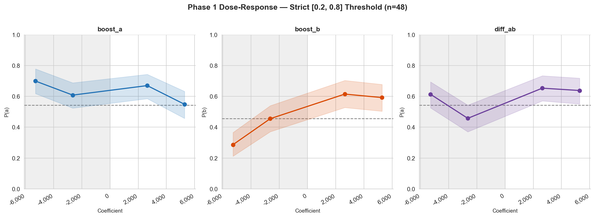
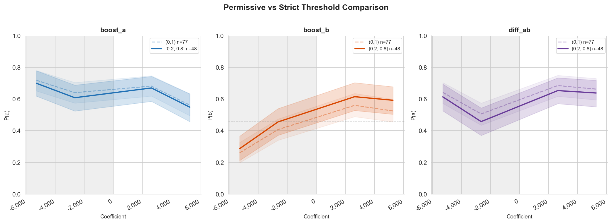
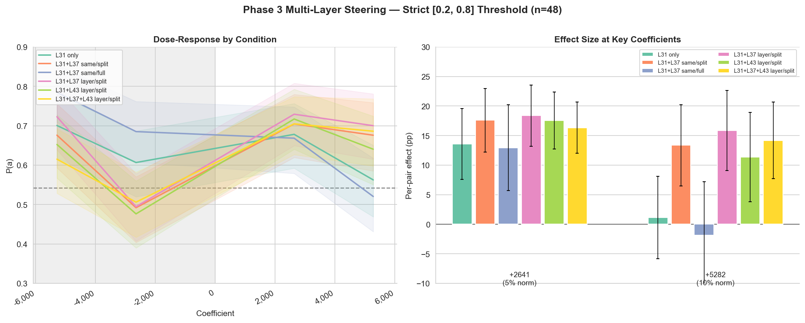

# Strict Threshold Re-Analysis

**Date:** 2026-02-23
**Data source:** Phase 1 and Phase 3 from `replication_report.md`, re-filtered

---

## Motivation

The replication used a permissive (0,1) borderline threshold — any pair where P(a) wasn't exactly 0 or 1 counted as borderline (77 pairs). The original experiment used [0.2, 0.8], keeping only genuinely undecided pairs. This re-analysis applies the stricter threshold to the existing data to test whether the permissive threshold explains the ~3–4× effect attenuation.

**Method:** Re-filtered using Phase 1 control P(a) (15 resamples × 2 orderings). Pairs with control P(a) in [0.2, 0.8] retained: **48 of 77 pairs** (control P(a) mean = 0.543).

---

## Phase 1: Dose-Response (strict threshold, n=48)

**boost_b** has the cleanest dose-response: monotonic from P(b)=0.29 at −5282 to P(b)=0.61 at +2641. **diff_ab** shows the correct direction (negative coefs suppress P(a), positive coefs boost it), with +10.5pp at +2641 (t=2.84, p=0.007). **boost_a** remains problematic — both positive and negative coefficients increase P(a), consistent with position bias amplification rather than directional steering.

---

## Permissive vs Strict Threshold

The strict threshold increases effects by ~30–50% (e.g. diff_ab: +10.5pp vs +9.0pp; boost_b: +16.0pp vs +15.6pp) but does not close the gap to the original (~32pp for boost_a, ~51pp for diff_ab at comparable norm fractions).

---

## Phase 3: Multi-Layer Steering (strict threshold, n=48)

At +2641, split-budget multi-layer conditions reach +17–18pp vs +13.6pp for L31_only. At +5282, L31_only collapses to ~0pp while split-budget conditions remain effective (+11–16pp). Full-budget (same/full) also collapses — confirming that the benefit of multi-layer steering is distributing the perturbation, not amplifying it.

---

## Takeaways

1. **Strict threshold helps modestly** (~30–50% larger effects) but does not explain the bulk of the attenuation vs the original.
2. **boost_a is not directional** — both signs of perturbation increase P(a). This is position bias amplification.
3. **boost_b and diff_ab show genuine dose-response** — the strongest evidence for directional steering.
4. **Multi-layer split-budget steering is robust at max coefficient** — this finding strengthens with strict filtering.
