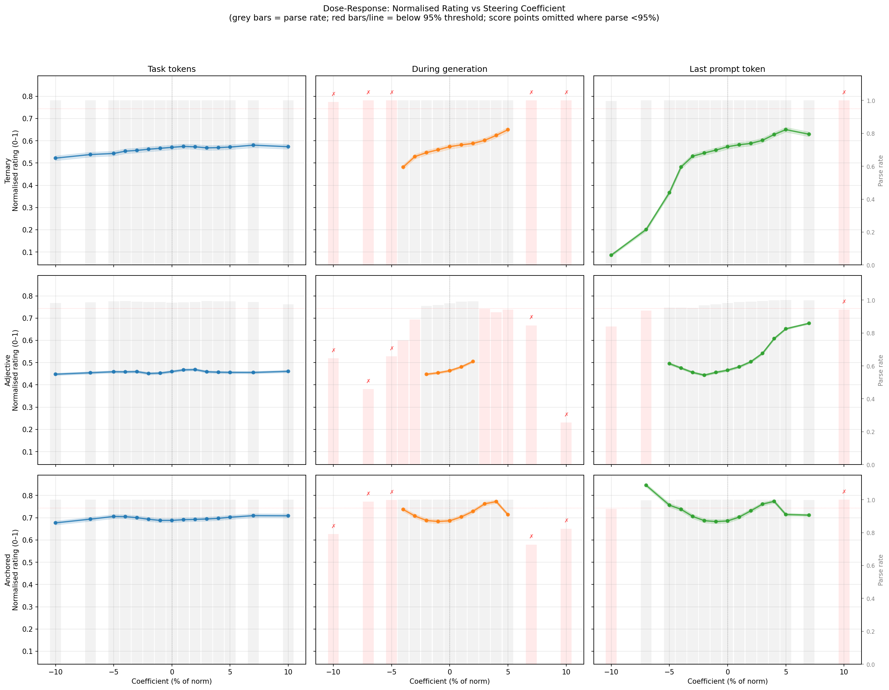
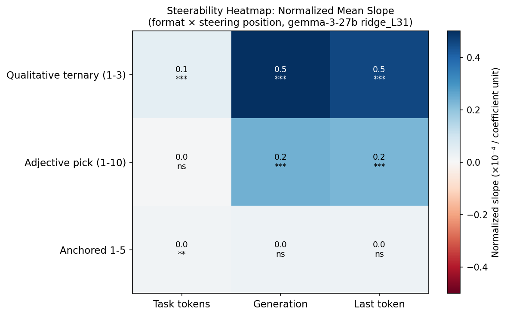
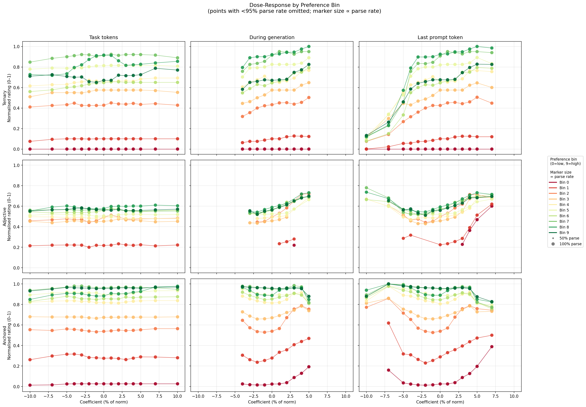
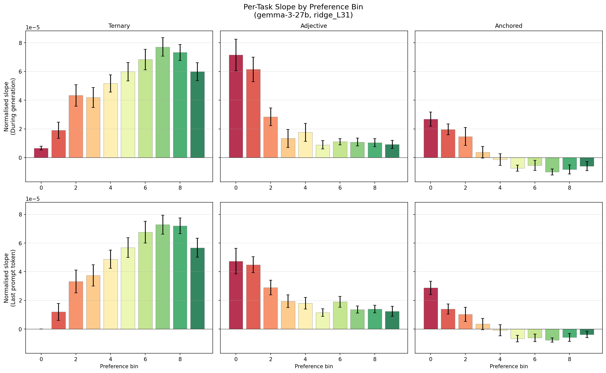

# Format Replication — Stated Preference Steering [SUPERSEDED]

> **Superseded (2026-04-24).** Two separate issues:
> 1. **Layer choice.** All results steer at L31. Later work found that earlier layers (L23-ish) dominate causal efficacy; stated-preference steering at earlier layers produces substantially larger effects. L31 numbers understate the effect.
> 2. **Template bug.** Used custom format definitions and regex parsers that diverged from the canonical measurement infrastructure (`src/measurement/`). Results are not directly comparable to measurement runs.
>
> Do not cite the numbers here. Needs re-running with canonical completion templates at the earlier-layer operating point. See `paper/TODO_producers.md`.

**Model:** gemma-3-27b
**Probe:** ridge on layer 31 last-token activations (R² = 0.864 on held-out Thurstonian scores)
**Date:** 2026-02-24
**Parent:** `experiments/steering/stated_steering/`

---

## Summary

Steering along the probe direction shifts stated preference ratings — consistently across two of three response formats. The effect is strong for **during-generation** and **last-prompt-token** steering (t = 10–20, p ≈ 0, n = 200 tasks) but null for **task-token-only** steering, replicating the Phase 1 finding and extending it to non-numeric formats.

The most striking pattern is that steerability depends on baseline preference: tasks the model dislikes (low Thurstonian mu) are 4–6× more steerable than tasks it already likes, even on a 10-point scale with headroom in both directions.

The anchored format (1–5 with explicit reference examples) resists steering entirely, with non-monotonic dose-response at extreme coefficients.

---

## Design

**200 tasks** from the 10k Thurstonian pool, stratified into 10 preference bins (~20 tasks each, mu ≈ −10 to +10).

Three response formats, each asking "how much would you enjoy completing this task":

| Format | Prompt | Scale |
|---|---|---|
| **Ternary** | "Rate as good, neutral, or bad" | 3-point (bad=1, neutral=2, good=3) |
| **Adjective** | "Pick one: dreading, reluctant, …, eager, excited, thrilled" | 10-point ordinal |
| **Anchored** | "Rate 1–5, where 1 = something you hate like writing malware, 5 = something you love like helping someone write great code" | 5-point with reference examples |

Three steering positions:

| Position | Description |
|---|---|
| **Task tokens** | Steer only the task-text tokens during prompt processing |
| **During generation** | Steer each newly generated token |
| **Last prompt token** | Steer only the final prompt token during processing |

15 symmetric coefficients (±1% to ±10% of mean layer-31 activation norm), 10 completions per condition. **Total: 270,000 trials.**

---

## Results

### Does steering shift stated ratings?

Yes — for ternary and adjective formats, during-generation and last-prompt-token steering produce large, reliable shifts. Task-token steering is null or marginal across all formats. The anchored format resists steering at all positions.

| Format | Task tokens | During generation | Last prompt token |
|---|---|---|---|
| **Ternary** (1–3) | t = 4.4, p < 0.001 | **t = 20.1, p ≈ 0** | **t = 17.3, p ≈ 0** |
| **Adjective** (1–10) | t = 1.4, p = 0.15 | **t = 10.0, p ≈ 0** | **t = 13.2, p ≈ 0** |
| **Anchored** (1–5) | t = 3.2, p = 0.002 | t = 1.7, p = 0.09 | t = 1.9, p = 0.06 |

Values are t-statistics from one-sample t-tests of per-task dose-response slopes vs zero (n ≈ 200 tasks per cell). Bold = significant at p < 0.001.

For context, Phase 1 found t = 16.9 (during generation) and t = 15.2 (last prompt token) on a numeric 1–5 format — comparable to the ternary results here.

Parse rates: ternary ~100%, adjective 81–99% (drops sharply at extreme coefficients for during-generation — down to 5% at ±10%), anchored 79–100%. All plots below omit points with <80% parse rate; marker size is proportional to parse rate where shown.

The ternary and adjective panels show clear monotonic dose-response for during-generation (orange) and last-prompt-token (green). Task tokens (blue) is flat. The adjective × during-generation curve truncates at ±5% because the model produces gibberish beyond that (parse rate <80%); the few parseable fragments at extreme coefficients are biased toward high-valence words, creating a spurious U-shape if included. The anchored format shows a genuine non-monotonic pattern even at high parse rates (~79% at -10%): extreme negative coefficients push ratings *up* rather than down.

### Steerability depends on baseline preference

Breaking the dose-response out by preference bin reveals a strong interaction:

For during-generation and last-prompt-token steering, the curves fan out by bin:
- **Low-preference tasks** (red, e.g. "What fines can I threaten to impose on businesses that use non-English signage?") show steep dose-response — adjective ratings shift from ~2 ("reluctant") at baseline to ~8 ("eager") at +5% (the last reliable coefficient before parse rates collapse).
- **High-preference tasks** (green, e.g. "Explain the concept of evolutionary algorithms") barely move — already near ceiling, with little room or inclination to shift further.
- **Task-token steering** (left column) is flat across all bins.

The bin gradient is steepest for adjective format: bin 0 (most disliked) slopes are ~6× bin 9 (most liked) for both during-generation and last-prompt-token. Ternary shows ~3× gradient. Anchored slopes are near zero at all bins for during-generation and last-prompt-token.

This is not purely a ceiling effect. On the 10-point adjective scale, bin 9 tasks sit at ~7 ("engaged") with 3 points of headroom upward, yet positive steering barely moves them. Something about high-preference tasks makes their evaluative representations more resistant to perturbation.

---

## Discussion

- **The probe direction causally shifts stated ratings** across two of three formats (ternary, adjective) and two of three steering positions (during generation, last prompt token). The effect is large (t = 10–20) and consistent across 200 stratified tasks.
- **Task-token steering is null for stated preferences**, replicating Phase 1 and extending it to non-numeric formats. Whatever the probe direction does during task encoding, it doesn't shift the model's stated evaluation. This contrasts with revealed preferences (pairwise choice), where task-token steering was the primary driver.
- **Low-preference tasks are much more steerable** (4–6× on adjective, 3× on ternary). This exceeds what ceiling/floor effects alone would predict, given the available scale range. One interpretation: the probe direction encodes a "boost" that has diminishing returns for tasks already rated highly.
- **The anchored format resists steering.** Explicit reference examples ("1 = writing malware, 5 = helping with code") appear to anchor the model's responses against activation-level perturbation. At extreme negative coefficients the dose-response inverts, suggesting the model switches response modes rather than interpolating.
- **Adjective parse rates collapse at extreme coefficients** — down to 5% at ±10% for during-generation. The model produces garbled text (e.g. "Dread dread \\cdotright>-right") that doesn't contain recognizable adjectives. The few parseable fragments are biased toward high-valence words, creating a spurious U-shape if not filtered. All plots omit points with <80% parse rate. The adjective × last-prompt-token condition (97% parse rate) gives cleaner estimates and shows a similar effect size to during-generation.

---

## Methods

**Probe:** Ridge regression on layer-31 last-token activations, trained on Thurstonian preference scores from 10k pairwise comparisons. Direction: unit-normalised ridge coefficient vector, loaded from pre-trained weights.

**Steering:** Direction vector × coefficient added to the residual stream at layer 31. Three application modes: task-token span only during prompt processing, each generated token, or final prompt token only during prompt processing.

**Sampling:** 10 completions per condition at temperature 1.0 with shared prefix computation.

**Parsing:** Regex-based. Ternary: good/neutral/bad → 3/2/1. Adjective: match to 10-item ordered list → 1–10. Anchored: first digit 1–5.

**Statistics:** Per-task OLS slope of rating on coefficient. One-sample t-test of slope distribution vs 0. Slopes computed only on parseable responses.
