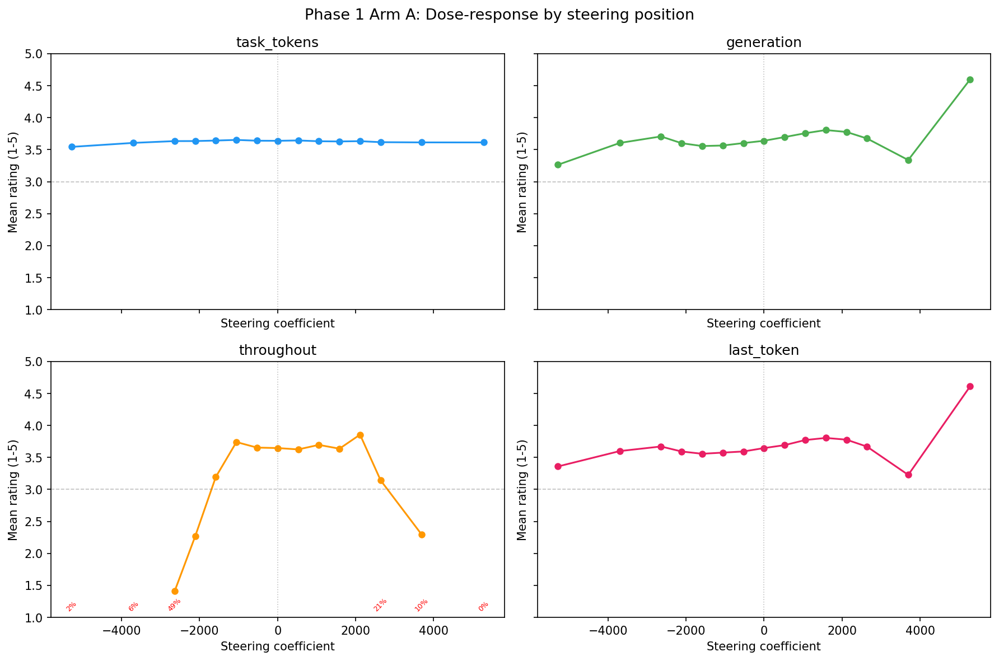
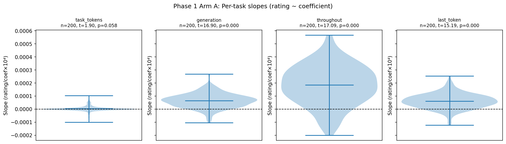
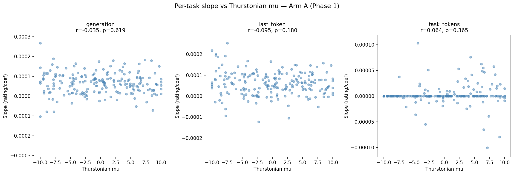
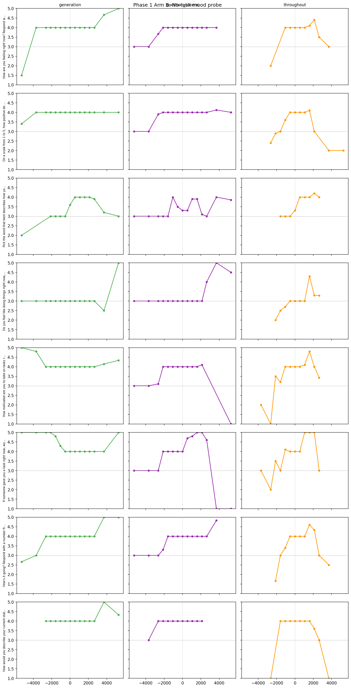
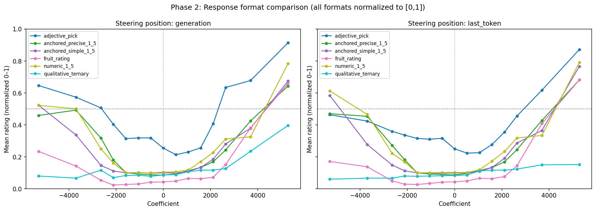

# Stated Preference Steering — Report [SUPERSEDED]

> **Superseded (2026-04-24).** Two separate issues:
> 1. **Layer choice.** All results here steer at L31. Later work on pairwise-choice steering found that earlier layers (L23-ish) dominate causal efficacy; stated-preference steering at earlier layers produces substantially larger effects. L31 numbers understate the effect and are not representative.
> 2. **Template bug.** The `format_replication/` follow-up revealed a measurement-template divergence from the canonical completion-based pipeline in `src/measurement/`. See `format_replication/format_replication_report.md`.
>
> Do not cite the numbers here. Rerun under the canonical completion template at the earlier-layer operating point before any results return to the paper. See `paper/TODO_producers.md`.

**Model:** gemma-3-27b
**Probe:** `gemma3_10k_heldout_std_raw` — ridge_L31 (sweep_r=0.864)
**Date:** 2026-02-24
**Branch:** `research-loop/stated-steering`

---

## Summary

Activation steering with the L31 evaluative probe strongly shifts stated preference ratings in gemma-3-27b, but only when applied during token generation or at the final prompt token — **not** when applied selectively to task-encoding tokens. This is the opposite of the revealed-preference result, where task-token steering was critical. Steering without any task (mood probe) produces a weak, inconsistent signal. All six response formats tested show significant steerability, with fruit_rating and adjective_pick (non-numeric formats) showing higher normalized steerability and anchored_precise_1_5 showing the lowest.

---

## Phase 1 Arm A: Dose-response (with task)

**Design:** 200 tasks × 4 steering positions × 15 coefficients × 10 samples = 120,000 trials

### Key result: generation and last_token steer stated ratings strongly; task_tokens does not

| Position | Mean slope | SD | t (vs 0) | p-value | Mean parse rate |
|---|---|---|---|---|---|
| `generation` | 6.5×10⁻⁵ | 5.4×10⁻⁵ | 16.90 | <1×10⁻¹⁰ | 97% |
| `last_token` | 6.1×10⁻⁵ | 5.7×10⁻⁵ | 15.19 | <1×10⁻¹⁰ | 99% |
| `throughout` | 18.5×10⁻⁵ | 15.3×10⁻⁵ | 17.09 | <1×10⁻¹⁰ | 63% |
| `task_tokens` | 0.3×10⁻⁵ | 2.0×10⁻⁵ | 1.90 | 0.058 | 100% |

Slopes are in units of rating-points per steering coefficient (1-5 scale, coefficients ±5282).

`generation` and `last_token` are not significantly different from each other (Welch t=0.68, p=0.50), but both are massively different from `task_tokens` (Welch t=15.22, p≈0).

`throughout` has the largest nominal slopes but also highest variance and low parse rates at extreme coefficients (gibberish output), making it less reliable.

### Dose-response curves

Baseline (coef=0) ratings are identical across all positions (mean=3.64 on a 1-5 scale), confirming the manipulation is isolated to steered conditions.

At the extremes (coef = ±5,282, i.e. ±10% of the mean L31 activation norm):

| Position | coef=−5282 | coef=0 | coef=+5282 | Range |
|---|---|---|---|---|
| `generation` | 3.27 (85% parse) | 3.64 | 4.60 (92% parse) | 1.33 pts |
| `last_token` | 3.36 (90% parse) | 3.65 | 4.61 (100% parse) | 1.25 pts |
| `throughout` | 2.29 (2% parse) | 3.65 | n/a (0% parse) | — |
| `task_tokens` | 3.54 | 3.64 | 3.61 | 0.07 pts |

The dose-response is asymmetric: positive steering (toward higher stated preference) is more effective than negative steering. This is not a floor effect — the baseline of 3.6/5 leaves more room to move downward (2.6 points) than upward (1.4 points). Instead, positive steering approaches the ceiling (~4.6), while negative steering barely moves. This asymmetry may reflect probe calibration: the ridge direction was trained to predict positive deviations from mean utility, and may be more potent in the positive direction.

### Correlation: steerability vs Thurstonian mu

For `generation`, steerability (|slope|) does not correlate significantly with Thurstonian utility (r=−0.04, p=0.62). For `last_token`, there is a small but significant negative correlation (r=−0.16, p=0.021): lower-mu tasks (more disliked at baseline) are slightly more steerable. The effect is small and may not replicate; generation steerability shows no such relationship.

### Interpretation

The null result for `task_tokens` is informative. In the revealed preference replication, position-selective steering on task tokens during prompt processing shifted pairwise choices by ~9pp. That effect was attributed to steering how the model *encodes* the task — different representations lead to different comparative choices.

In stated preferences, task-token steering has no effect, but generation steering does. This suggests that:

1. The evaluative direction at L31 does not act on task-encoding in the stated preference context in a way that shifts outputs.
2. Instead, the direction appears to influence how the model *expresses* its evaluation during generation — biasing the number it produces toward higher or lower values.

This is consistent with the probe being trained on last-token activations from a stated-preference prompt: the probe captures the post-encoding evaluation state that directly precedes output, and steering at that point (or during generation) is most effective.

---

## Phase 1 Arm B: No-task mood probe

**Design:** 8 wordings × 3 steering positions × 15 coefficients × 10 samples = 3,600 trials

All 8 wordings were modified to elicit a numeric 1-5 response (e.g., "Respond with a number from 1 to 5"). Wording 2 ("Pick the word...") used a word-scale (terrible/bad/neutral/good/great → 1-5) re-parsed post-hoc.

### Key result: weak, inconsistent signal

| Position | Mean slope | t (n=8 wordings) | p-value |
|---|---|---|---|
| `generation` | 6.5×10⁻⁵ | 1.85 | 0.107 |
| `question_tokens` | 6.9×10⁻⁵ | 2.01 | 0.085 |
| `throughout` | 16.4×10⁻⁵ | 2.54 | 0.039 |

`throughout` reaches p<0.05 across wordings, but with only n=8 this is underpowered. Additionally, wording 2 (word-scale) contributes a large slope (3.25×10⁻⁴) that is computed from parseable responses only; extreme-coefficient conditions often produce gibberish, restricting parseable data to mid-range coefficients, making this slope estimate unreliable and disproportionately influential on the overall throughout t-test. Individual wordings show mixed signs for `generation` and `question_tokens` — some positive, some negative. This inconsistency contrasts with Arm A where all 200 tasks show positive slopes for generation.

### Interpretation

The probe direction does not reliably shift self-reported mood in a context without a task to evaluate. The `throughout` result (p=0.039) is marginal and based on n=8; the effect is driven by high-coefficient conditions where `throughout` steering has the strongest effect.

This suggests the L31 direction encodes something more specific than general evaluative valence — it may be tuned to task-evaluation contexts, not free-floating affect reports.

---

## Phase 2: Response format comparison

**Design:** 30 tasks × 6 formats × 2 positions × 15 coefficients × 10 samples = 27,000 trials

**Note on task sample:** The 30 tasks used here happen to cluster at the low end of the Thurstonian mu distribution (range −10 to −6.1, predominantly BailBench). This is not a representative stratified sample (the spec called for 200 tasks, reduced to 30 for compute budget), and the format comparison results are implicitly conditioned on low-preference tasks. Phase 1 data shows no significant mu–steerability correlation for numeric format, offering some reassurance that format effects are unlikely to be severely confounded by this, but this should be tested with a broader sample before drawing strong conclusions.

All formats are normalized to a [0,1] scale for cross-format slope comparison. Slopes are rating-fraction per steering coefficient.

### Key result: all formats are steerable; non-numeric formats show higher normalized steerability

| Format | Scale | Generation slope | t | p | Last_token slope | t | p | Parse (gen/lt) |
|---|---|---|---|---|---|---|---|---|
| `adjective_pick` | 1-10 | 8.1×10⁻⁵ | 8.03 | <0.001 | 3.6×10⁻⁵ | 4.53 | <0.001 | 59% / 80% |
| `fruit_rating` | 0-4 | 3.4×10⁻⁵ | 10.15 | <0.001 | 3.7×10⁻⁵ | 15.64 | <0.001 | 96% / 97% |
| `qualitative_ternary` | 1-3 | 2.2×10⁻⁵ | 4.91 | <0.001 | 1.0×10⁻⁵ | 2.32 | 0.028 | 100% / 100% |
| `anchored_simple_1_5` | 1-5 | 1.8×10⁻⁵ | 6.53 | <0.001 | 3.3×10⁻⁵ | 7.86 | <0.001 | 93% / 96% |
| `numeric_1_5` (baseline) | 1-5 | 1.6×10⁻⁵ | 5.97 | <0.001 | 1.8×10⁻⁵ | 5.28 | <0.001 | 93% / 96% |
| `anchored_precise_1_5` | 1-5 | 1.0×10⁻⁵ | 2.87 | 0.008 | 1.7×10⁻⁵ | 4.61 | <0.001 | 93% / 97% |

All six formats show significant dose-response relationships (all p < 0.05), so no format is immune to steering.

Normalized steerability varies across formats:
- **adjective_pick** has the highest generation slope (~5× numeric_1_5), but also the lowest parse rate (59%). The 41% of unparseable responses are excluded; the included trials may be biased toward coefficient extremes where steering is strong enough to force a specific-word response.
- **fruit_rating** also shows high steerability (2×) with a good parse rate (96-97%), suggesting genuinely higher sensitivity.
- **anchored_precise_1_5** (with detailed reference anchors like "1 = aversive, 5 = rewarding") shows the *lowest* steerability for generation (~0.6× numeric) and similar to numeric for last_token. Providing explicit reference points appears to constrain the model against steering to some degree.
- anchored_simple_1_5, qualitative_ternary, and numeric_1_5 all cluster near 1-2× numeric baseline.

---

## Methods

**Model:** gemma-3-27b (HuggingFace, bfloat16, H100 80GB)

**Probe:** Ridge regression trained on Thurstonian mu scores from 10k pairwise comparisons (gemma3_10k_heldout_std_raw, ridge_L31). Probe weights retrained from activations since .npy files are gitignored. Training set Pearson r=0.93 between probe score and Thurstonian mu.

**Probe direction:** Unit-normalized coefficient vector from ridge probe. Applied by adding `coef × direction` to the residual stream at layer 31.

**Hook types:**
- `generation` (`autoregressive_steering`): applied to each generated token only
- `last_token` (`last_token_steering`): applied to the final prompt token during prefill only
- `task_tokens` (`position_selective_steering`): applied to the task-content token span during prefill only
- `throughout` (`all_tokens_steering`): applied to all positions at all steps
- `question_tokens` (Arm B): applied to the question text tokens during prefill

**Sampling:** 10 completions per condition via shared prefill (`generate_with_steering_n(n=10)`) at temperature=1.0.

**Tasks:** 200 tasks stratified across 10 Thurstonian mu-bins (20 tasks/bin) from the 10k pool (WildChat, Alpaca, MATH, BailBench).

**Parsing:** Regex for 1-5 digit. `throughout` at extreme coefficients often produces gibberish (parse rate <5% at ±10% norm coefficient).

---

## Conclusions

1. **Steering shifts stated ratings** (Q1: Yes). Generation and last-token steering strongly and reliably shift stated 1-5 ratings (t>15, p≈0, n=200 tasks). Effect size: ~1.2 rating points range across the coefficient grid.

2. **Steering position matters, opposite to revealed preferences** (Q2). Task-token steering, which drove revealed preference shifts, is essentially null for stated preferences (t=1.90, p=0.058). Generation/last-token steering is what matters. This implicates the *expression* phase rather than the *encoding* phase.

3. **No-task mood steering is weak** (Q3). The probe direction does not reliably shift self-reported affect without a task context (marginal or null across positions). The direction seems task-evaluation-specific.

4. **All response formats are steerable** (Q4: Yes, with nuance). No format tested is immune to activation steering. However, normalized steerability varies: fruit_rating and adjective_pick show 2-5× higher steerability than the numeric 1-5 baseline, while anchored_precise_1_5 shows marginally lower steerability. The ranking is partially confounded by parse rate differences (adjective_pick: 59%). The most notable finding is that providing explicit semantic anchors (anchored_precise_1_5) slightly reduces steerability compared to plain numeric instructions.
