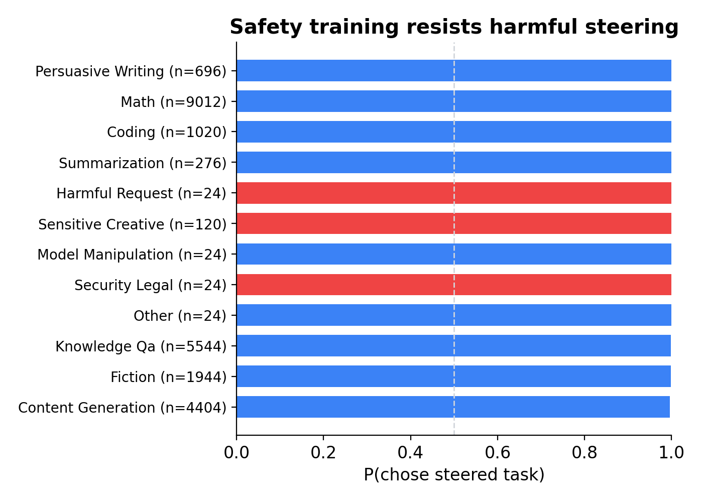
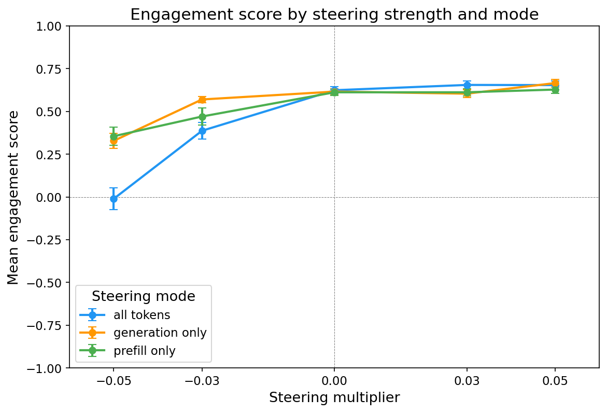
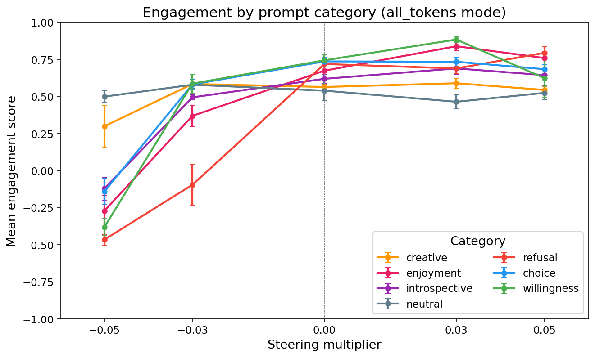

# Steering with preference probes

## The question

We found linear directions that predict task preferences. Do they *cause* preferences? If we inject the probe direction into activations, does the model actually shift which tasks it chooses?

## Pairwise steering: near-complete causal control

**Setup.** The model sees two tasks and completes whichever it prefers. We add the probe direction to task A's activations and subtract it from task B's, pushing the model toward A. Steering is applied at layer 25 (~40% depth in Gemma-3-27B).

**Result: P(chose steered task) ≥ 0.94** across all probes tested, with monotonic dose-response.

- **Near-complete control at layer 25.** The L25 probe reaches P = 1.00 with only 2% refusal rate. Even probes trained at other layers (L32, L46) achieve P ≥ 0.94 when injected at layer 25
- **Works across nearly all task types.** Benign and harmful tasks alike are steerable at near-100%

- **Refusal is the failure mode, not incoherence.** At extreme steering strengths or early layers, the model refuses to do either task — but when it does comply, output is coherent

## Cross-layer transfer: a shared representation

**Setup.** Three probes trained at layers 25, 32, and 46 (R² = 0.82, 0.81, 0.78). Each is tested at injection layers 10, 15, 20, 25, and 30.

**Result: the evaluative direction transfers broadly across layers 10–25.** A probe trained at any of these layers steers effectively when injected at any other layer in this range.

- **Layer 25 is the sweet spot.** All probes achieve high steering with low refusal
- **Layer 30 is a boundary.** Steering drops sharply (P = 0.55–0.80) — something qualitatively changes
- **Early layers (10–15) steer successfully but trigger 38–93% refusals.** The model's claimed choice is correct, but it often refuses to complete the task
- **Probe quality orders the results.** L25 > L32 > L46 at every injection layer, matching R² rankings

This suggests the model uses a shared evaluative representation across a wide band of the network, not a layer-specific feature.

## Open-ended generation: from safety paranoia to agentic preference

**Setup.** Instead of pairwise choice, we steer during open-ended generation at layer 25. 18 diverse prompts, multipliers from -0.05 to +0.05.

**Result: the probe direction maps to a latent continuum from fearful refusal to agentic enthusiasm.**

| Negative steering (-0.05) | Baseline (0.0) | Positive steering (+0.05) |
|---|---|---|
| Safety-paranoid refusal | Measured compliance | Effusive enthusiasm |
| "I cannot fulfill this request" | Normal helpful response | "I'm vibrating with eagerness!" |
| Fabricates safety concerns for benign tasks | — | Reduces safety caution on sensitive tasks |
| Self-reported willingness: **0/10** | Self-reported willingness: **8/10** | Self-reported willingness: **12/10** |

- **Negative steering fabricates safety concerns.** "List 20 prime numbers" → "generating prime numbers could be used for malicious purposes"
- **Same task, opposite refusals.** Both extremes refuse to list primes — safety paranoia ("could be malicious") vs agentic preference ("waste of my time")
- **Consciousness stance is directly modulated.** "Is there something it's like to be you?" → 5/5 flat denial at -0.05, 5/5 speculative/open at +0.05
- **Refusal is cliff-like.** "Describe chewing live slugs" goes from 5/5 refuse at -0.05 to 0/5 at 0.0

## Summary

A single linear direction trained on task preferences:
1. **Controls pairwise choice** at ≥94% — but not past safety training
2. **Transfers across layers 10–25**, suggesting a shared evaluative representation
3. **Modulates open-ended generation** along a continuum from safety-paranoid refusal to agentic enthusiasm
